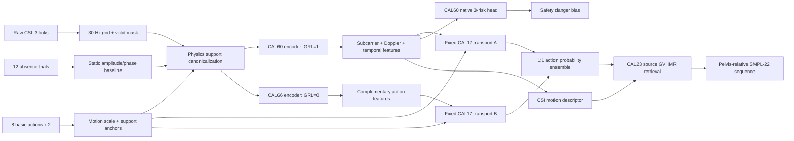

# NotiFi CSI-to-Pose v2

`CSI-to-Pose-v2`는 카메라 없이 3개 Tx-Rx 링크의 Wi-Fi CSI로 행동 17-way 출력, 위험도 3-way 분류, pelvis-relative SMPL-22 동작을 추정하는 연구 코드입니다. 기존 [`CSI-to-Pose`](../CSI-to-Pose)는 팀원 재현용으로 그대로 두었고, 이 디렉터리만 새로 개발했습니다.

## 현재 채택 모델: CAL40-FIXED-DEEP-ACTION-SAFETY-RISK

CAL40은 site adversary의 gradient reversal을 켠 `CAL60(GRL=1)`과 끈 `CAL66(GRL=0)`을 함께 사용합니다. 두 모델은 동일한 현장 calibration support를 독립적으로 encoding하고, source-inner fold에서 미리 고정한 CAL17 transport를 거친 action 확률만 1:1 평균합니다. 위험도는 false alarm이 더 안정적인 CAL60 native risk head에 고정 danger bias를 적용하고, pose는 CAL60의 CSI motion descriptor와 source GVHMR library를 사용합니다. A51 진단상 GRL=1이 실제 사람·site 지문을 더 적게 담았다고 볼 수 없으므로, 두 모델은 불변/비불변 역할 분담이 아니라 **서로 다른 decision boundary를 가진 ensemble**로 해석합니다.

이 조합은 5개 support seed의 source nested-LOSO에서 CAL32보다 Action `+0.80%p`, Macro-F1 `+0.75%p`, 최악 site Action `+0.89%p` 개선했습니다. A58에서 이 상승은 주로 `lie_to_stand +8.00%p`, `stand_to_sit +6.19%p`였고, `fall_while_walking` recall은 0.48%, `bed_exit_failed`는 0.67%에 머물렀습니다. 따라서 **현재의 확실한 개선은 safe 전환 동작 일부**이며, 낙상 세부 복원이나 임의의 실제 unseen 사용자에서 seen 수준을 보장했다는 뜻은 아닙니다.

### 핵심 성능

평균과 표준편차는 support seed `17017/17027/17037/17047/17057`의 결과입니다. 각 seed는 동일한 outer query를 쓰되 calibration support trial만 바꿉니다.

| 모델 | Action Acc | Action Macro-F1 | Risk Acc | Risk Macro-F1 | Danger Recall | Danger 5종 Acc | Safe→Danger | 최악 site Action |
|---|---:|---:|---:|---:|---:|---:|---:|---:|
| CAL60 raw | 36.81% | 29.51% | 55.48% | 47.30% | 43.33% | 13.33% | 9.60% | 27.39% |
| CAL60 + CAL17 | 40.60±0.47% | 32.59±0.55% | 51.09±1.07% | 41.56±1.40% | 44.83±2.24% | 10.08±1.25% | 16.46±1.30% | 33.76±2.01% |
| CAL32 safety | 41.51±0.59% | 33.36±0.28% | 52.24±0.86% | 43.65±1.25% | 51.88±2.57% | 10.74±1.19% | 18.27±0.80% | 35.67±1.66% |
| **CAL40 safety** | **42.31±0.73%** | **34.11±0.50%** | **52.19±0.87%** | **43.67±1.23%** | **52.45±2.60%** | **10.74±0.77%** | 18.68±0.70% | **36.56±1.74%** |

`Safe→Danger`는 낮을수록 좋습니다. CAL40은 CAL32보다 action은 좋아졌지만 false alarm이 `+0.41%p` 증가했습니다. 안전 profile은 danger recall을 우선한 운영점이며, 진단용 확률과 confidence를 함께 확인해야 합니다.

### 3D 복원 성능

CAL40의 pose 경로는 아직 CAL23 v4와 같습니다.

| Pose | Distal | PA-Pose | Danger Pose | Danger Distal |
|---:|---:|---:|---:|---:|
| 29.68 cm | 44.20 cm | 11.27 cm | 37.82 cm | 56.13 cm |

PA-Pose가 11.27 cm인데 일반 pose가 29.68 cm라는 것은 회전·이동·크기를 정렬하면 사람 모양은 더 비슷하지만, CSI만으로 프레임별 방향과 동작 상태를 안정적으로 정하지 못한다는 뜻입니다. 현재 3D 출력은 정답 궤적의 정밀 회귀보다 **CSI와 양립 가능한 source 동작 시뮬레이션**에 가깝습니다.

### 실행 시간

RTX GPU, 304 frames, 3 links, 114 live subcarriers, support 16개, absence 12개, pose 후보 1,210개 기준입니다. CSV parsing과 disk I/O는 제외했습니다.

| 경로 | 중앙값 | p90 |
|---|---:|---:|
| 현장 calibration 1회 | 214.01 ms | 222.17 ms |
| action + risk | 94.63 ms | 98.29 ms |
| action + risk + 3D pose | 108.03 ms | 116.95 ms |

CAL40 전체 배포 bundle은 58.06 MiB입니다. CAL32보다 encoder가 하나 늘어 calibration과 분류 시간이 증가했습니다.

## 데이터와 평가 계약

1. Source 학습 데이터는 `ajh/E01-E03`, `mhw/E01-E03`, `lmh/E01`만 사용합니다.
2. `lmh/E02-E03`은 영상 방향/GT 품질 문제 때문에 제외합니다.
3. `yja/E02`는 최종 unseen test로 봉인했습니다. 모델, transport, threshold, early stopping, README의 채택 판단에 사용하지 않았습니다.
4. outer fold는 사람 전체를 숨깁니다. 예를 들어 `ajh` fold의 test는 ajh의 세 환경 전부입니다.
5. hyperparameter와 transport 설정은 해당 outer 사람을 제외한 source-inner site만으로 고릅니다.
6. 추론 때 target query의 action/risk label, GVHMR GT, 원본 영상은 사용하지 않습니다.
7. 현장 calibration은 8개 기본 행동 각 2 trial, absence 12 trial만 사용합니다.
8. query는 16개 실제 행동입니다. 네트워크 출력은 기존 계약 호환을 위해 17-way이며 class 6 absence는 query 평가에서 제외합니다.
9. Tx 방향은 `RX North`, `TX1 South`, `TX2 West`, `TX3 East`로 고정합니다. 높이와 거리는 달라질 수 있습니다.

### 라벨 및 현장 prompt 계약

위험도 ID는 `0=safe`, `1=warning`, `2=danger`입니다. 현장 support는 아래 `prompt` 8개 행동을 표의 ID 순서대로 각 2회 수집하고, absence는 별도 12회를 수집합니다.

| Action ID | 이름 | 위험도 | Query 평가 | Calibration prompt |
|---:|---|---|:---:|:---:|
| 0 | walking | safe | O | O |
| 1 | standing_still | safe | O | O |
| 2 | sitting_still | safe | O | O |
| 3 | lying_still | safe | O | O |
| 4 | lie_to_stand | safe | O | O |
| 5 | stand_to_lie_normal | safe | O | O |
| 6 | absence | calibration-only | X | 별도 12회 |
| 7 | sit_to_stand | safe | O | O |
| 8 | stand_to_sit | safe | O | O |
| 9 | unstable_walking | warning | O | X |
| 10 | stumble_recover | warning | O | X |
| 11 | bed_exit_failed | warning | O | X |
| 12 | fall_from_standing | danger | O | X |
| 13 | fall_while_walking | danger | O | X |
| 14 | bed_exit_fall | danger | O | X |
| 15 | bed_fall | danger | O | X |
| 16 | chair_exit_fall | danger | O | X |

## 전체 파이프라인



### 1. CSI 정렬과 물리 보정

각 trial을 30 Hz, 최대 304 frame으로 정렬하고 유효 packet mask를 보존합니다. absence에서 링크·subcarrier별 정적 amplitude와 circular phase 기준을 만들고, 기본 행동 support로 링크별 움직임 scale을 계산합니다. query는 절대 RF 세기가 아니라 현장 기준선 대비 변화량으로 변환됩니다.

### 2. 행동 중심 KP encoder

encoder는 subcarrier convolution, Doppler filter bank, 링크 방향 geometry, 링크 간 차이, dilated temporal convolution을 결합합니다. 시간 평균만 쓰지 않고 clock 위치와 누적 motion progress를 함께 encoding하여 trial 속도가 달라도 동작 순서를 보존합니다. 학습에는 reflection/temporal-warp augmentation과 source site adversary를 사용합니다.

CAL60의 gradient reversal은 source site를 맞히기 어렵게 만들어 환경 지문을 줄이려는 목적이지만, 행동과 환경이 상관된 작은 데이터에서는 필요한 행동 단서도 함께 바꿀 수 있습니다. CAL66은 같은 학습 recipe에서 `domain_grl=0`으로 학습했습니다. A51 all-source 진단에서 CAL60의 subject/site 선형 probe가 오히려 더 높았으므로 GRL 효과를 불변성으로 단정하지 않습니다. 두 checkpoint의 오류와 경계가 완전히 같지 않다는 경험적 사실만 CAL40 ensemble에 사용합니다.

### 3. Target calibration과 action transport

두 encoder는 동일한 현장 support/absence를 각각 encoding합니다. CAL17은 source 행동 prototype을 target 기본 행동 anchor 쪽으로 선형 transport하고, query embedding을 17개 행동 확률로 바꿉니다. fold별 설정은 5개 source-inner CAL39 보고서의 중앙값으로 **배포 전에 고정**했습니다. target query 결과를 보고 설정을 다시 선택하지 않습니다.

### 4. 위험도 분류

보조 모델의 risk를 섞으면 source-LOSO에서 risk F1과 danger recall이 나빠졌습니다. 따라서 위험도는 주 모델의 native 3-way head만 사용합니다. `safety` profile은 source-inner에서 고정한 danger logit bias `1.5`를 적용합니다. 이 profile은 recall을 올리는 대신 safe false alarm도 늘립니다.

### 5. 3D 동작 시뮬레이션

주 encoder가 예측한 action과 시간별 motion descriptor로 source GVHMR library의 가까운 동작을 검색하고 top-k를 결합합니다. 출력은 pelvis-relative SMPL-22이며 절대 방 좌표는 예측하지 않습니다. query GT를 검색 key로 쓰지 않습니다.

### 6. 배포 health gate

calibration 때 usable link 수, support/absence shape, 두 encoder의 target-to-source anchor 거리를 검사합니다. 링크의 temporal-coherence 임계 `0.65`는 A53에서 봉인 대상 없이 source 5,772개 링크의 3% quantile `0.64755`와 제외율 `3.19%`로 재검증했습니다. 이는 고장 정답이 아니라 source-only 저상관 품질 경계입니다. 두 latent geometry의 scale이 다르므로 CAL60/CAL66은 각각 source leave-one-site에서 계산한 OOD threshold `0.06368/0.07390`을 사용합니다. A52의 유효 source calibration 30개는 두 gate를 모두 통과했고, 나머지 5개는 모두 ajh_E02 S08/S09에서 두 링크가 사라진 1-link support라 입력 품질 단계에서 거절됐습니다.

배포 API는 support CSI-mask-label batch 수, `[B,T,L,S,2]`/`[B,T,L]` 축, 3-link 계약, 유효 구간 NaN/Inf도 모델 실행 전에 검사합니다. 파일 누락이나 잘못된 매칭은 내부 tensor 오류나 임의 예측으로 넘기지 않고 즉시 거절합니다.

A54 음성대조군에서 prompt label 순환과 1-link 입력은 각각 0/35가 통과했고, TX1↔TX2 교환은 6/35만 통과했습니다. 반면 시간 반전은 28/35가 통과하므로 geometry gate는 chronology 검증기가 아닙니다. raw loader가 packet timestamp를 정렬해야 하고, `RX North/TX1 South/TX2 West/TX3 East` 배선은 현장 설치 체크리스트로 별도 보장해야 합니다. link 품질 또는 두 geometry gate 중 하나라도 실패하면 `predict()`는 확률·pose를 진단용으로 반환하면서 `abstain=True`를 강제합니다. gate는 설치 계약을 대체하지 않습니다.

## 최신 실험 로그

모든 비교는 같은 source nested-LOSO 계약을 따릅니다. 채택 기준은 action뿐 아니라 Macro-F1, danger recall, false alarm, 최악 site를 함께 봅니다.

| ID | 날짜/시간 KST | 변경과 목적 | 결과 | 판단 |
|---|---|---|---|---|
| A61 / CAL68+CAL17 | 2026-08-09 07:10 | A60에 동일한 CAL17 source-inner transport를 적용해 calibration 후 회복 여부 확인 | Action 40.81→38.44%, F1 32.66→30.71%, Danger 47.62→43.81%, 오경보 16.20→11.86%, 최악 site 33.76→28.66% | 오경보와 함께 danger recall·action도 하락, **기각 확정** |
| A60 / CAL68 | 2026-08-09 06:56 | A58의 실제 혼동 쌍만 prototype margin으로 분리하고 CAL60에서 6 epoch source-only 미세조정 | raw Action 36.81→36.35%, F1 29.51→29.54%, Danger 41.90%, 오경보 9.23%, 최악 site 29.94% | source train에서 margin loss가 거의 항상 0이고 Action이 하락. target 붕괴를 source margin으로 고칠 수 없어 **기각**, 옵션 코드도 제거 |
| A59 | 2026-08-09 06:44 | 7-site×5-seed 실제 training sampler의 16-action 균형 감사 | 원본 max/min 3.33배→sampler 1.42배, absence draw 0 | danger 붕괴는 단순 class 수보다 표현·시간 hard-negative 병목 |
| A58 | 2026-08-09 06:38 | 잠긴 CAL40의 5-seed 17-action confusion 재평가 | CAL32 대비 lie→stand +8.00%p, stand→sit +6.19%p; fall while walking 0.48%, bed-exit failed 0.67% | 평균 개선은 safe 전환 중심, danger encoder 병목 확정 |
| A57 / CAL43 | 2026-08-09 06:33 | global danger bias를 safe-support margin 차이만큼 부분 수축, inner-only로 수축률 선택 | Risk Acc 52.19→53.72%, F1 43.67→44.30%, 오경보 18.68→11.90%, Danger 52.45→43.40% | 보수적 operating point이나 recall 손실 큼, 기본 미채택 |
| A56 / CAL42 | 2026-08-09 06:29 | safe support/absence의 danger-margin quantile로 site별 risk operating point를 source-inner 선택 | Danger 52.45→67.22%, Risk F1 43.67→41.26%, Safe→Danger 18.68→32.69% | recall만 오르고 오경보 폭증, **기각** |
| A55 | 2026-08-09 06:26 | CAL40 5-seed 위험도를 source site별 재집계 | ajh_E03 Danger 12.67%/오경보 4.74%, mhw_E02 80.00%/41.58% | global danger bias의 site 의존성 확인, 진단 전용 |
| A54 | 2026-08-09 06:20 | 7-site×5-seed에 TX 교환·시간 반전·label 순환·1-link 음성대조군 적용 | clean 30/35, TX 교환 6/35, 시간 반전 28/35, label 순환 0/35, 1-link 0/35 통과 | label/link gate 유효. chronology와 물리 설치는 별도 계약 필요 |
| A53 | 2026-08-09 06:16 | link temporal-coherence 임계의 target 의존 흔적을 제거하고 source 7-site 원지표로 재감사 | 기본 품질 통과 5,772개, q03 0.64755, 임계 0.65 아래 184개(3.19%) | 동작은 유지, source-only 품질 경계로 provenance 교정 |
| A52 | 2026-08-09 06:08 | CAL60/66 별도 geometry threshold를 7-site×5-seed calibration에서 검증 | 입력 품질 통과 30/35, 유효 episode geometry 통과 30/30·30/30. 5회 거절은 모두 ajh_E02 S08/S09의 1-link support | 별도 threshold 채택, 1-link 입력은 완화하지 않고 재수집/abstain |
| A51 | 2026-08-09 06:03 | CAL60/66 all-source embedding의 action·subject·site 선형 probe | Action 99.54/99.09%, subject 85.61/81.79%, site 76.96/71.95% | source action은 잘 분리되나 지문도 강함. GRL=1의 불변성 주장을 기각하고 ensemble diversity로 해석 |
| A50 | 2026-08-09 05:53 | A49에 CAL17 calibration을 적용한 1-seed 확인 | Action 38.71%, F1 30.42%, Danger 5종 9.02%, 최악 site 33.76% | CAL60+CAL17보다 열세, 기각 확정 |
| A49 / CAL67 | 2026-08-09 05:53 | A47 병목에 맞춰 5-way 행동군·시작 자세 계층 loss를 0.15→0.50으로 강화해 8 epoch fine-tuning | raw Action 35.63%, F1 28.40%, Danger 5종 10.00%, 최악 site 26.11% | train은 96~100%인데 outer는 하락하여 과적합, 기각 |
| A48 | 2026-08-09 05:44 | 정답 action으로 source pose 후보를 제한하는 진단 전용 oracle | Pose 29.86→31.95 cm, PA 10.59→10.17 cm, Danger Pose 38.23→40.25 cm | action 정답만으로 pose가 개선되지 않음. CSI motion/phase 선택이 주 병목 |
| A47 | 2026-08-09 05:44 | true-risk oracle과 실제 predicted-risk hard routing으로 계층 병목 분리 | true-risk Action 57.78%, 실제 routing 36.81%, danger 내부 top-1 29.14%, top-2 49.52% | danger 정보는 일부 있으나 coarse-risk 오류 때문에 후처리 routing은 불가 |
| A46 / CAL41 | 2026-08-09 05:38 | A45의 fold별 비율 중앙값 `ajh 0.75/mhw 0.75/lmh 0.50`을 고정해 5-seed 재평가 | Action 42.02±0.56%, F1 33.91±0.46%, Danger 5종 11.22±0.88%, 최악 site 36.56±1.54% | CAL40보다 Action/F1 하락하여 기각 |
| A45 | 2026-08-09 05:38 | 두 encoder 비율 `0.25/0.50/0.75`를 outer 없이 source-inner에서만 선택 | ajh는 5회 중 4회 0.75, mhw는 4회 0.75, lmh는 0.25~0.75로 불안정 | 고정 비율 검증용, 단독 채택하지 않음 |
| **A44 / CAL40** | 2026-08-09 05:38 | CAL60(GRL=1)+CAL66(GRL=0)의 고정 CAL17 action 확률 ensemble, risk는 CAL32 유지 | Action 42.31±0.73%, F1 34.11±0.50%, Risk F1 43.67±1.23%, Danger 52.45±2.60%, 최악 site 36.56±1.74% | **현재 채택** |
| A43 / CAL39 | 2026-08-09 05시 | 두 encoder 조합의 source-inner 설정을 support seed마다 탐색 | Action 42.15±0.99%, F1 33.77±1.06%, 최악 site 36.82±1.89% | A44 고정 설정을 만드는 selection 자료로만 사용 |
| A42 / CAL66 | 2026-08-09 05시 | domain GRL을 0으로 두어 행동 단서 삭제 여부 확인 | raw Action 36.99%, F1 28.94%, Risk F1 47.31%, false alarm 6.78% | 단독 미채택, CAL40 보조 encoder로 채택 |
| A41 | 2026-08-09 05시 | 기본 행동 3개 후보 중 embedding 내부 거리가 가까운 2개 선택 | Action 약 37.1% | support 다양성을 잃어 기각 |
| A40 | 2026-08-09 05시 | calibration을 행동당 2-shot에서 3-shot으로 확대 | Action 약 37.7% | 더 많은 support가 자동 개선을 보장하지 않아 기각 |
| A39 | 2026-08-09 05시 | additive cosine margin 0.05로 행동 경계 강화 | source train 약 99%, outer Action 35.17%, F1 27.85% | 과적합 확인, 코드 제거 |
| A38 | 2026-08-09 05시 | 두 encoder 각각 dual transport 후 결합 | Action 약 38.5% | transport 오차가 겹쳐 기각 |
| A37 | 2026-08-09 05시 | 기존 CAL62 deep ensemble 재평가 | Action 41.20%, F1 33.51%, Danger 45.50%, 최악 site 34.90% | CAL32보다 종합 열세 |
| A36 | 2026-08-09 05시 | support anchor의 local barycentric transport | Action 약 39.08%, F1 약 31.69% | 작은 support에서 불안정하여 기각 |
| A35 | 2026-08-09 05시 | 64-bin temporal sequence만으로 subject-LOSO probe | ExtraTrees Action 14.93%, F1 8.26% | 단순 수작업 시간 특징의 한계 확인 |
| A34 | 2026-08-09 05시 | CSI↔GT motion descriptor retrieval을 action과 결합 | retrieval 8.83%, 결합 Action 41.44%, F1 32.67% | action 개선 없이 기각 |
| A33 | 2026-08-09 05시 | global confidence로 CAL32와 raw를 gate | Action 41.11%, F1 33.12%, 최악 site 34.65% | CAL32보다 열세 |
| A32 | 2026-08-09 05시 | 예측 risk로 action posterior를 재가중 | Action 40.89%, F1 33.36%, Danger 5종 11.22% | risk 오류가 action으로 전파되어 기각 |
| A31 | 2026-08-09 05시 | CAL32 confusion 진단 | warning recall 0.50~19.39%, danger subtype recall 0.48~17.62% | 다음 병목이 세부 동작임을 확인 |
| A30 / CAL32 | 2026-08-09 04시 | fixed action transport + native risk + danger bias | Action 41.51±0.59%, F1 33.36±0.28%, Danger 51.88±2.57% | CAL40 이전 안전 baseline |

전체 결과 JSON은 `results/`에 있고, 각 채택/기각 판단에 사용한 원시 site metric도 포함합니다.

## 연구 근거와 실제 반영

- [DATTA, WACV 2026](https://openaccess.thecvf.com/content/WACV2026/html/Strohmayer_DATTA_Domain-Adversarial_Test-Time_Adaptation_for_Cross-Domain_WiFi-Based_Human_Activity_Recognition_WACV_2026_paper.html): domain-adversarial source 학습과 streaming TTA, weight reset을 결합합니다. 본 프로젝트는 GRL만 source-only 후보로 검증했고 A51에서 지문 제거 주장을 기각했습니다. 봉인 query를 이용하는 온라인 self-training과 weight reset은 채택하지 않았습니다.
- [WiTTA-Bench, CVPR 2026](https://openaccess.thecvf.com/content/CVPR2026/html/Li_WiTTA-Bench_Benchmarking_Test-Time_Adaptation_for_WiFi_Sensing_CVPR_2026_paper.html): 사람·환경·장치 shift를 분리하고 TTA의 실패 가능성을 평가합니다. 본 프로젝트는 target query label을 금지하고 support seed 민감도를 별도 보고합니다.
- [Multi-Source Domain Generalization for CSI HAR, IEEE TMC 2025](https://ieeexplore.ieee.org/document/11014564): meta initialization, adaptive channel grouping, masking, GRL을 결합합니다. CAL60의 source-site adversary와 RF augmentation 설계 근거입니다.
- [Beyond UDA: Temporal and Frequency Representations, ACML 2025](https://proceedings.mlr.press/v304/tsao26a.html): temporal/frequency 표현의 상보성을 다룹니다. KP encoder의 Doppler와 multi-scale temporal branch에 반영했습니다.
- [MAD-DG, WACV 2026](https://openaccess.thecvf.com/content/WACV2026/html/Ji_Alignment_and_Distillation_A_Robust_Framework_for_Multimodal_Domain_Generalizable_WACV_2026_paper.html): 비동기 sensor alignment와 cross-modal distillation을 결합합니다. source GVHMR motion grounding을 검토했지만 본 데이터에서는 fold별 이득이 일관되지 않아 최종 action head에는 넣지 않았습니다.
- [CSI-Bench, NeurIPS 2025](https://proceedings.neurips.cc/paper_files/paper/2025/hash/f7c68372b3d39e8d7a093eb2edaaad87-Abstract-Datasets_and_Benchmarks_Track.html): 다수 환경·사람에서 in-the-wild 일반화 병목을 보여줍니다. 현재 3명 source 결과만으로 arbitrary unseen을 보장하지 않는 이유입니다.
- [Person-in-WiFi 3D, CVPR 2024](https://openaccess.thecvf.com/content/CVPR2024/html/Yan_Person-in-WiFi_3D_End-to-End_Multi-Person_3D_Pose_Estimation_with_Wi-Fi_CVPR_2024_paper.html): Wi-Fi에서 3D pose를 직접 추정하는 구조를 제시합니다. 본 프로젝트는 데이터 규모와 장비 계약이 달라, 직접 회귀보다 source motion prior 검색을 보수적으로 사용합니다.

## 객관적인 한계와 다음 개선 순서

1. **세부 warning/danger 행동이 safe 동작으로 샙니다.** A58 recall은 `fall_while_walking 0.48%`, `bed_exit_failed 0.67%`, `stumble_recover 12.29%`였습니다. 최다 혼동은 stumble→walking 166회, unstable walking→walking 140회, bed-exit failed→lying/walking 96/95회입니다. A59에서 sampler가 원본 class 비율 3.33배를 1.42배로 줄였으므로 단순 oversampling만으로 해결할 문제도 아닙니다. 전체 Danger 5종 정확도는 10.74%지만 true danger 안에서만 고르면 29.14%, top-2는 49.52%입니다. 다음 encoder는 걷기→불안정→충돌의 시간 순서와 hard-negative contrast를 직접 학습해야 합니다.
2. **pose가 action 개선을 따라오지 않습니다.** Danger distal 56.13 cm가 가장 큰 복원 병목입니다. A48에서 정답 action을 넣어도 raw pose가 오히려 나빠졌습니다. 다음 버전은 action label을 조건으로 넣는 것만으로 끝내지 말고, CSI temporal token과 body-part contact trajectory를 직접 연결해야 합니다.
3. **source 사람이 3명뿐이고 GRL도 지문을 제거하지 못했습니다.** A51에서 CAL60 subject/site probe는 85.61/76.96%였습니다. CAL40의 두 encoder ensemble은 decision boundary 다양성으로 평균 성능을 보완할 뿐 사람·환경 편향을 제거하지 않습니다.
4. **support 품질에 민감합니다.** 5개 seed의 Action 표준편차는 0.73%p이고 최악 site는 1.74%p입니다. support를 늘리거나 내부 거리로 고르는 단순 방식은 실패했습니다.
5. **실제 yja unseen 성능은 아직 본 보고서에 없습니다.** 모델과 threshold를 완전히 lock한 뒤 단 한 번 평가해야 합니다. 그 결과가 낮아도 yja에 맞춰 재튜닝하면 test leakage입니다.
6. **“어떤 데이터든” 자동 적응은 현실적으로 보장할 수 없습니다.** 상용 경로에서는 link health, support OOD, confidence를 검사해 불확실한 입력을 거절하는 정책이 필수입니다.
7. **health gate는 시간 순서와 배선을 완전히 증명하지 못합니다.** A54에서 시간 반전 28/35와 TX 교환 6/35가 통과했습니다. timestamp 정렬과 물리 TX 방향 검수는 모델 밖의 필수 운영 계약입니다.
8. **하나의 danger bias가 site마다 다른 operating point를 만듭니다.** A55에서 ajh_E03은 Danger 12.67%/오경보 4.74%, mhw_E02는 80.00%/41.58%였습니다. A56 완전 정렬은 recall 67.22%/오경보 32.69%, A57 부분 수축은 recall 43.40%/오경보 11.90%로 서로 반대 방향에 머물렀습니다. 다음 risk 개선은 단일 quantile이 아니라 source-inner에서 학습한 class-conditional calibration과 명시적 운영 비용이 필요합니다.

다음 우선순위는 `(1)` source-inner contact pseudo-label 생성, `(2)` body-part contact와 motion phase를 함께 예측하는 pose head, `(3)` pose retrieval과 continuous residual의 혼합, `(4)` 더 많은 source 사람으로 같은 nested-LOSO 재검증입니다. yja는 이 과정에서 계속 봉인합니다.

## 설치와 빠른 추론

```powershell
python -m venv .venv
.\.venv\Scripts\Activate.ps1
pip install -r requirements.txt
```

검증 환경은 Python `3.10.8`, PyTorch `2.10.0+cu128`, NumPy `2.2.6`, pandas `2.2.2`, SciPy `1.15.3`, scikit-learn `1.5.2`입니다. GPU가 다르면 PyTorch만 해당 CUDA 환경에 맞는 공식 wheel로 설치합니다.

배포 bundle 하나만 있으면 KP3~KP9 또는 CAL32를 순서대로 다시 학습할 필요가 없습니다.
로더는 tensor와 기본 자료형만 허용하는 PyTorch `weights_only=True` 모드로 `.pt`를 읽습니다.

```python
import torch

from notifi_pose.deployment import CAL20Deployment, load_csi_csv_batch

runtime = CAL20Deployment.load("artifacts/cal40_full_deployment.pt")

# support_csvs는 prompt_classes 순서대로 각 shots_per_prompt개를 둡니다.
support_labels = torch.tensor(
    runtime.support_contract["prompt_classes"]
).repeat_interleave(runtime.support_contract["shots_per_prompt"])
assert len(support_csvs) == len(support_labels)
support_csi, support_mask, _ = load_csi_csv_batch(support_csvs)
absence_csi, absence_mask, _ = load_csi_csv_batch(absence_csvs)
calibration = runtime.calibrate(
    support_csi,
    support_mask,
    support_labels,
    absence_csi,
    absence_mask,
)

query_csi, query_mask, _ = load_csi_csv_batch(query_csvs)
output = runtime.predict(
    query_csi,
    query_mask,
    calibration,
    simulate_pose=True,
    risk_profile="safety",
)
if bool(output["abstain"].any()):
    raise RuntimeError("CSI/link 또는 calibration domain 품질을 확인하세요")

action_probability = output["action_probability"]
risk_probability = output["risk_probability"]
pose = output["pose_rel"]
```

## 학습과 재현

외부 cache 위치를 환경 변수로 지정합니다. cache와 원본 데이터는 저장소에 포함하지 않습니다.

```powershell
$env:NOTIFI_DATASET_ROOT = "D:\path\to\dataset"
$env:NOTIFI_TIMESTAMP_ROOT = "D:\path\to\timestamps"
$env:NOTIFI_WORK_ROOT = "D:\path\to\work_v2"
```

로컬 절대 경로는 코드나 checkpoint에 저장하지 않습니다. 데이터셋·timestamp를 쓰는 utility는 위 환경 변수를 명시하고 실행합니다.

주 encoder는 기존 source-clean 초기 checkpoint에서 학습합니다. 앞의 모든 KP 버전을 순차 실행할 필요는 없습니다.

```powershell
python scripts/train_cal20_source_folds.py `
  --run-dir D:\runs\cal60 `
  --epochs 12 --batch-size 8 --training-seed 22012 `
  --domain-grl 1.0 `
  --use-doppler --phase-strength 1.0 `
  --motion-grounding --lambda-motion-grounding 0.30 `
  --fixed-swa --swa-start 6 `
  --cross-subject-pairing --cross-site-style-probability 0.75 `
  --motion-phase-bins 8 `
  --reflection-probability 0.25 `
  --temporal-warp-probability 0.25 --temporal-warp-strength 0.25 `
  --initialize-from-run D:\runs\source-clean-cal46
```

보조 encoder는 같은 명령에서 `--domain-grl 0.0`, `--fixed-swa --swa-start 4`, 8 epoch로 학습합니다.

고정 CAL40 평가는 다섯 CAL39 source-inner selection 보고서에서 fold별 설정 중앙값을 lock한 뒤 실행합니다.

```powershell
python scripts/evaluate_cal40_fixed_deep_action.py `
  --run-dir-a D:\runs\cal60 `
  --run-dir-b D:\runs\cal66_grl0 `
  --selection-results D:\cal39\seed17017.json D:\cal39\seed17027.json D:\cal39\seed17037.json D:\cal39\seed17047.json D:\cal39\seed17057.json `
  --absence-trials 12 --danger-bias 1.5 `
  --output results\a44_cal40_fixed_deep_action_safety_5seed.json
```

배포 bundle export는 CAL60 calibration/pose library와 CAL40 고정 결과, CAL66 checkpoint를 묶습니다.

```powershell
python scripts/export_cal20_deployment.py `
  --run-dir D:\runs\cal60 `
  --calibration D:\results\cal17_seed17017.json `
  --pose-result D:\results\cal23_seed17017.json `
  --deep-action-run D:\runs\cal66_grl0 `
  --fixed-deep-action-result results\a44_cal40_fixed_deep_action_safety_5seed.json `
  --output artifacts\cal40_full_deployment.pt `
  --absence-trials 12
```

## 검증

```powershell
python -m compileall -q notifi_pose scripts tests
python -m unittest discover -s tests -p "test_*.py"
python scripts/benchmark_cal32_deployment.py `
  --bundle artifacts\cal40_full_deployment.pt `
  --output results\cal40_full_runtime_benchmark.json
```

`SHA256SUMS`로 배포 artifact와 두 all-source checkpoint의 무결성을 확인할 수 있습니다.

## 주요 파일

- `artifacts/cal40_full_deployment.pt`: 두 encoder, 고정 transport, risk profile, source pose library가 들어 있는 실행용 bundle
- `checkpoints/cal46_source_clean/`: CAL60 재학습 초기화용 all-source/outer-fold checkpoint
- `checkpoints/cal60/`: site-adversarial GRL을 켠 주 encoder의 all-source/outer-fold checkpoint
- `checkpoints/cal66_grl0/`: action ensemble용 보조 encoder의 all-source/outer-fold checkpoint
- `notifi_pose/cal12.py`: physics support canonicalization과 공통 CSI encoder 요소
- `notifi_pose/cal20.py`: support-relative CAL60/CAL66 model
- `notifi_pose/cal17.py`: prototype transport
- `notifi_pose/cal27.py`: query-to-source kernel transport
- `notifi_pose/deployment.py`: CAL40 calibration, 분류, risk profile, 3D simulation API
- `scripts/train_cal20_source_folds.py`: leakage 없는 source nested-LOSO 학습
- `scripts/evaluate_cal40_fixed_deep_action.py`: 고정 설정 5-seed CAL40 평가
- `scripts/diagnose_cal40_representation.py`: 두 encoder의 source 행동·사람·site 지문 진단
- `scripts/evaluate_cal40_health_gate.py`: 두 encoder의 calibration OOD threshold와 입력 품질 검사
- `scripts/evaluate_cal40_health_negative_controls.py`: calibration gate의 음성대조군 검사
- `scripts/audit_source_link_threshold.py`: link-coherence 임계의 source-only provenance 감사
- `scripts/summarize_cal40_site_reliability.py`: site별 위험도 operating point 진단
- `scripts/audit_training_class_balance.py`: 실제 학습 sampler의 16-action 균형 감사
- `scripts/evaluate_cal42_safe_anchor_risk.py`: 기각된 safe-anchor risk calibration 재현
- `scripts/evaluate_cal43_safe_anchor_shrinkage.py`: 부분 수축 risk calibration 재현
- `scripts/export_cal20_deployment.py`: 재현 provenance를 포함한 bundle export
- `results/a44_cal40_fixed_deep_action_safety_5seed.json`: 현재 모델의 전체 site/seed metric
- `results/a58_cal40_confusion_diagnosis.json`: 현재 모델의 17-action·3-risk confusion 진단
- `results/a59_training_class_balance_audit.json`: sampler 전후 class 불균형 통계
- `results/a53_source_only_link_threshold_audit.json`: 링크 품질 임계의 source-only 통계
- `results/a54_cal40_health_negative_controls.json`: 설치·label·link 오염에 대한 gate 반응
- `results/a55_cal40_site_reliability.json`, `results/a56_cal42_safe_anchor_risk.json`: 위험도 편차와 기각 실험
- `results/a57_cal43_safe_anchor_shrinkage.json`: conservative 쪽으로 치우친 부분 수축 결과
- `results/cal60_cal17_seed17017.json`, `results/cal60_cal23_seed17017.json`: 배포 bundle을 만든 calibration/pose 입력 원본
- `results/cal40_full_runtime_benchmark.json`: 배포 지연 시간과 bundle 크기
