# NotiFi CSI-to-Pose

Wi-Fi CSI만 입력받아 시간에 따른 사람의 **GVHMR SMPL-22 3D pose와 root trajectory**를 복원하는 연구 코드입니다. 영상과 GVHMR은 학습용 GT 생성에만 사용하며, 검증과 실제 추론에는 CSI만 사용합니다.

## 현재 모델: KP10-ACTION-FUSED-45

2026-08-06 현재 seen-domain CSI-only pose 최선은 **KP10-ACTION-FUSED-45**이다.
KP6-RISK-ADAPTIVE의 연속 pose를 안정적인 기준으로 유지하면서, 별도 temporal CSI
classifier가 예측한 17행동 분포를 train-only motion retrieval에 추가한다. profile ranker는
train query를 학습할 때 같은 trial의 GT motion을 후보에서 제외하고, CSI가 예측한 전신 및
머리·몸통·양팔·양다리 속도 곡선으로 같은 행동 안의 후보를 고른다. 최종 후보는 CSI 누적
motion energy로 단조 retiming하고, 17-frame low-pass residual의 45%만 KP6 pose에 더한다.

추론 입력은 **4-board CSI와 link mask뿐**이다. test GT, test action/risk label, 영상,
사람 ID, 환경 ID는 사용하지 않는다. ranker와 모든 보조 head는 train에서 학습하고,
모델·epoch·logit 비중·motion strength는 validation에서만 선택했다. 고정 test 결과를 본 뒤
설정을 다시 고르지 않았다. 후보 렌더링과 retiming은 CSI cache의 `frame_mask`만 사용하고,
GT의 `target_valid`는 loss와 metric 계산에만 사용한다. 최종 예측 직전
`inference_view()`가 `target_pose/valid/class/risk`와 GT로 만든 `pool.target_cost`를
제거하므로, 평가 target은 metric 단계에만 남고 예측 함수에는 전달되지 않는다.

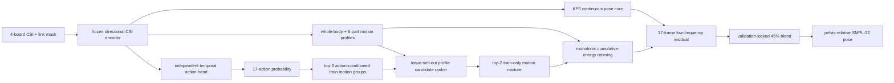

### Seen Test 결과

protocol은 `single_split_lmh_e01`, seed 17, train/validation/test
`1210/315/315`이다. 단위는 cm이며 두 모델 모두 같은 고정 test split을 사용했다.

| Seen test metric | KP6-RISK-ADAPTIVE | **KP10-ACTION-FUSED-45** | 변화 |
|---|---:|---:|---:|
| Overall pose | 13.103 | **12.885** | -0.217 |
| Distal pose | 18.989 | **18.666** | -0.323 |
| Dynamic pose | 16.505 | **16.423** | -0.082 |
| High-motion pose | 16.197 | **16.095** | -0.102 |
| Danger pose | 20.455 | **19.829** | -0.626 |
| Danger distal | 30.262 | **29.250** | -1.013 |
| Danger endpoint | 25.717 | **25.052** | -0.665 |
| Danger high-motion | 22.903 | **22.764** | -0.139 |
| Speed correlation | 0.494 | **0.514** | +0.020 |
| Danger speed correlation | 0.566 | **0.579** | +0.013 |
| Composite selection score | 1.20582 | **1.18205** | -0.02377 |

KP10은 현재 비교 범위에서 danger pose와 danger distal을 함께 가장 많이 줄인 모델이다.
다만 danger distal `29.25 cm`는 부상 부위를 의학적으로 확정할 수준이 아니며, pose 출력만
보고 실제 충돌 순서를 사실로 단정하면 안 된다.

### KP11-DYNAMIC-MOTION 후보: validation 기각

KP11은 현행 KP10의 CSI-only pose를 보존한 채 낙상 동작을 직접 교정하려는 후속 후보다.
잠긴 KP10 anchor와 frozen P2 feature를 받고, CSI의 1/3/7-frame 차분 및 15-frame
high-pass를 short/medium/global 시간축으로 융합한다. P2가 **CSI로 예측한** 17행동·3위험
soft 확률을 FiLM 조건으로 사용하고, parent-relative 뼈 방향을 회전한 뒤 FK로 전신을 다시
조립한다. phase, relative contact, 7-part motion profile은 보조 감독이며, pose branch와
분류 branch의 gradient는 분리했다. 정답 행동·위험 라벨은 pose 입력으로 사용하지 않는다.

train retrieval은 같은 trial을 제외하는 leave-self-out이며, 외부 anchor의 trial 순서,
valid mask, pose row를 생성 직후 감사한다. zero-init KP11 출력은 KP10 anchor와 정확히 같다.
13 epoch 중 validation score가 가장 좋았던 epoch 1을 선택했으나 개선 폭이 0.01 cm보다
작고 motion correlation gate를 통과하지 못해 승격하지 않았다.

| Validation metric | KP10 anchor | KP11 epoch 1 | 변화 |
|---|---:|---:|---:|
| Overall pose | 11.206 | **11.198** | -0.009 cm |
| Distal pose | 16.147 | **16.131** | -0.016 cm |
| Dynamic pose | **14.640** | 14.640 | 0.000 cm |
| Danger pose | 15.682 | **15.677** | -0.006 cm |
| Danger distal | 22.898 | **22.892** | -0.006 cm |
| Danger endpoint | **18.042** | 18.053 | +0.011 cm |
| Speed correlation | 0.5441 | 0.5441 | 변화 없음 |
| Danger speed correlation | **0.6641** | 0.6640 | -0.0000 |

분류는 frozen P2 출력을 유지해 validation 329개에서 action `95.74%`, risk `97.26%`,
danger recall `65/70 = 92.86%`였다. 허용한 오경보 범위 내 scalar danger-bias 보정도
recall을 높이지 못했다. 고정 test는 열지 않았으며, **현행 최고 모델은 계속 KP10**이다.
요약 결과는 [`KP11 validation`](docs/results/kp11_dynamic_motion_validation.json)에 있다.

### 개선 안정성 감사

고정 test 예측을 모델 선택에 다시 쓰지 않고, 동일 trial의 KP6/KP10 오차 차이를 10,000회
paired bootstrap했다. 음수는 KP10 개선이며 95% 신뢰구간이 네 지표 모두 0 아래였다.

| Paired trial metric | KP10 - KP6 평균 | 95% bootstrap CI | trial 승률 |
|---|---:|---:|---:|
| Overall pose | **-0.217 cm** | [-0.392, -0.047] | 53.7% |
| Overall distal | **-0.323 cm** | [-0.583, -0.075] | 54.0% |
| Danger pose | **-0.626 cm** | [-1.178, -0.117] | 48.6% |
| Danger distal | **-1.013 cm** | [-1.842, -0.276] | 51.4% |

평균 개선은 bootstrap에서 지지되지만 trial 승률은 49~54%다. 따라서 KP10이 모든 낙상을
일관되게 개선했다고 주장하지 않으며, 일부 trial의 큰 개선이 평균을 끌어내린 효과도 있다.
감사 중 KP6에 KP10의 새 profile checkpoint를 잘못 넣은 첫 실행은 폐기했고, KP6
`seed71/83`과 KP10 `seed79/101`을 각각 잠가 재계산했다. 이 감사 결과는 이후 설정 선택에
사용하지 않는다.

행동별 사후 감사에서도 개선은 균일하지 않았다. 아래 값은 `KP10-KP6`이므로 음수가
개선이다. 이 고정 test 진단은 후속 weight 선택에 사용하지 않는다.

| 행동 | Pose 변화 | Distal 변화 | Pose trial 승률 |
|---|---:|---:|---:|
| fall_from_standing | **-1.172 cm** | **-1.913 cm** | 57.1% |
| fall_while_walking | -0.182 cm | -0.476 cm | 35.7% |
| bed_exit_fall | +0.117 cm | +0.085 cm | 35.7% |
| bed_fall | -0.114 cm | -0.165 cm | 50.0% |
| chair_exit_fall | **-1.778 cm** | **-2.596 cm** | 64.3% |
| unstable_walking | +0.163 cm | +0.191 cm | 33.3% |
| stumble_recover | +0.230 cm | +0.377 cm | 37.1% |

따라서 KP10의 장점은 특정 큰 낙상 궤적을 더 잘 보정한 것이고, 약한 불안정 보행·회복
동작과 침대 이탈 낙상은 아직 해결되지 않은 실패군이다.

### 남은 핵심 문제

| 지표 | Validation | Fixed test | 격차 |
|---|---:|---:|---:|
| Overall pose | 11.206 cm | 12.885 cm | +1.680 cm |
| Danger pose | 15.682 cm | 19.829 cm | +4.147 cm |
| Danger distal | 22.898 cm | 29.250 cm | **+6.352 cm** |

같은 seen protocol 안에서도 동적 낙상일수록 validation-test 격차가 커진다. 현재 고정 test를
보고 weight를 다시 조정하지 않는다. 다음 모델 선택은 train 내부 반복 fold와 validation만
사용하고, 최종 주장은 새로 봉인한 holdout에서 한 번만 확인해야 한다. 또한 단일 pose가
놓치는 ambiguity는 KP28의 5개 후보로 드러났지만, CSI만으로 정답 후보를 자동 선택하는
selector는 아직 없다.

### 상대 바닥 근접 보조 출력

별도 **KP13-RELATIVE-PROXIMITY** head는 CSI로 pelvis, 양 hip, 양 knee, 양 foot, head,
양 wrist가 한 프레임의 최저 관절에서 12 cm 안에 있는지를 예측한다. 이는 절대 바닥 높이나
실측 충돌 label이 아니라 root-independent **상대 바닥 근접도**다. validation에서 임계값을
고정한 뒤 one-shot test에서 전체 F1 `0.8748`, danger F1 `0.7956`을 기록했다. 양발 danger
F1은 `0.941/0.940`이지만 head는 `0.000`이므로 현재 head를 정확한 머리 충돌 detector로
해석하지 않는다. 이 출력을 motion ranker에 넣은 KP14는 validation이 나빠져 pose 모델에는
결합하지 않았다.

### 복수 자세 시뮬레이션: KP28-MULTI5

단일 point estimate가 애매한 낙상은 CSI가 예측한 상위 5개 행동별 pose를 확률과 함께
출력한다. 가설 생성은 CSI와 train-only motion bank만 사용한다. `K=5`는 validation에서
top-3보다 overall·danger·distal coverage를 모두 개선해 고정했으며, top-5 확률 평균은
validation point score가 나빠 단일 KP10을 대체하지 않는다.

고정 test에서 단일 KP10의 overall/danger/danger distal은 `12.885/19.829/29.250 cm`다.
다섯 가설 중 GT에 가장 가까운 것을 **평가 때만** 고르는 best-of-5 coverage는
`11.890/18.102/26.647 cm`였다. 315개 중 99개는 2~5순위 가설이 더 가까웠고, 평균
pairwise 차이는 `10.79 cm`다. 이는 시스템이 정답을 자동으로 골랐다는 뜻이 아니다.
서비스에서는 다섯 시뮬레이션과 CSI 확률을 함께 제시하며, 정확한 충돌 순서를 사실로
단정하지 않는다.

사후 감사에서 top-5의 실제 행동 class recall은 전체 `97.46%`, danger `92.86%`였다.
10,000회 trial-paired bootstrap의 point 대비 coverage 이득은 danger pose
`1.728 cm [1.175, 2.361]`, danger distal `2.604 cm [1.769, 3.535]`였다. 대괄호는
95% CI다. 이 수치 역시 후보 집합의 가능성을 나타낼 뿐 자동 selector 성능은 아니다.
평가 때 정답 행동 라벨까지 제공한 진단도 danger pose/distal이
`19.135/28.190 cm`에 그쳤다. 전체 coverage 이득 중 일부만 행동 분류 오류로 설명되며,
나머지는 17-class 라벨만으로 구분되지 않는 세부 궤적·시간 전개를 CSI로 선택하는 문제다.

### 재현

KP10의 8개 model checkpoint와 12개 calibration/evaluation artifact는 SHA-256 manifest로
잠겨 있다. verifier는 20개 경로 전체와 validation-only 선택, test 비선택, inference GT
미사용 정책도 함께 검사한다. 아래 검증이 실패하면 같은 모델 이름으로 성능을 보고하면
안 된다.

모델 checkpoint 8개(총 약 135.7MB)는 Git 저장소에 포함하지 않는다. 학습·평가 장비의
manifest 경로에 checkpoint를 두어야 20개 전체 검증이 통과한다. 새 clone에서는 Git에
포함된 result/config artifact 12개를 확인할 수 있지만 checkpoint는 `missing`으로
보고되는 것이 정상이다.

```powershell
python -m notifi_pose.tools.verify_kp10_release
```

```powershell
# 독립 CSI action head
python -m notifi_pose.tools.train_csi_action_classifier `
  --seed 181 --run-dir work_v2/runs/kp10_action_classifier_seed181

# train leave-self-out candidate ranker
python -m notifi_pose.tools.train_profile_candidate_ranker `
  --seed 127 --run-dir work_v2/runs/kp8_profile_candidate_ranker_seed127

# validation-only action fusion과 45% strength 선택
python -m notifi_pose.tools.calibrate_action_classifier_pose
python -m notifi_pose.tools.calibrate_kp10_action_strength

# 잠긴 설정의 one-shot test
python -m notifi_pose.tools.evaluate_action_classifier_pose
python -m notifi_pose.tools.evaluate_kp10_action_strength

# 고정 KP6/KP10 test 예측의 사후 불확실성 감사(모델 선택 금지)
python -m notifi_pose.tools.audit_kp10_paired_bootstrap

# validation target을 전부 오염시켜도 예측이 정확히 같은지 검사
python -m notifi_pose.tools.audit_kp10_target_invariance

# train/validation/test trial 및 파일 경로 중복 감사
python -m notifi_pose.tools.audit_kp10_split_integrity

# validation에서 고정한 CSI-only top-5 simulation coverage
python -m notifi_pose.tools.diagnose_kp10_hypothesis_coverage `
  --hypotheses 5 `
  --split test `
  --output work_v2/runs/kp28_hypothesis_coverage_top5/test_fixed.json

# split-local 0번 trial의 5개 CSI-only pose 후보를 GT 없이 NPZ로 출력
python -m notifi_pose.tools.diagnose_kp10_hypothesis_coverage `
  --hypotheses 5 --split test `
  --export-dir work_v2/runs/kp28_multi5_exports `
  --export-indices 0 `
  --output work_v2/runs/kp28_multi5_exports/test_export_audit.json

# CSI-only 상대 바닥 근접 head
python -m notifi_pose.tools.train_csi_contact_profile `
  --target-mode relative --seed 241 `
  --run-dir work_v2/runs/kp13_relative_proximity_seed241
python -m notifi_pose.tools.calibrate_csi_proximity_thresholds
python -m notifi_pose.tools.evaluate_csi_proximity_profile
```

결과 원본은
[`KP10 validation`](work_v2/runs/kp10_action_strength/calibration.json),
[`KP10 fixed test`](work_v2/runs/kp10_action_strength/test_fixed.json),
[`paired bootstrap audit`](work_v2/runs/kp10_action_strength/paired_bootstrap_audit.json),
[`target-invariance audit`](work_v2/runs/kp10_action_strength/target_invariance_validation.json),
[`split-integrity audit`](work_v2/runs/kp10_action_strength/split_integrity.json),
[`KP28 validation`](work_v2/runs/kp28_hypothesis_coverage_top5/validation.json),
[`KP28 fixed test`](work_v2/runs/kp28_hypothesis_coverage_top5/test_fixed.json),
[`proximity validation`](work_v2/runs/kp13_relative_proximity_seed241/thresholds.json),
[`proximity fixed test`](work_v2/runs/kp13_relative_proximity_seed241/test_fixed.json)에 저장된다.

### 최신 실험 로그

| 번호 / 날짜(KST) | 상세 내용과 목적 | Validation | Fixed test | 결론 |
|---|---|---|---|---|
| KP11-DYNAMIC-MOTION / 2026-08-06 21:36 | 잠긴 KP10 CSI-only anchor에 multi-scale dynamic CSI, predicted-action FiLM, 직접 bone rotation/FK, phase/contact/profile 보조 감독 적용 | epoch 1, overall **11.198**, danger **15.677**, danger distal **22.892** cm, speed corr 0.5441 | **미개봉** | 0.01 cm 미만 변화와 motion gate 실패로 기각, KP10 유지 |
| MHW-GVHMR-STAGE-VIS / 2026-08-06 19:01 | mhw 자세 라벨별 중앙 trial을 KP10으로 CSI-only 추론하고 원본 영상 없는 stick/공식 GVHMR-style SMPL 영상 생성 | 성능 선택 없음, GT 오차로 샘플 선택 안 함 | 16라벨 x 2모드, 32/32 영상 QA 통과 | `hmr4d` PyTorch3D renderer + parent-relative SMPL IK/LBS, 84.5MB 로컬 산출물, absence는 GT가 없어 제외 |
| SPLIT-INTEGRITY / 2026-08-06 | 역할별 trial 및 CSI/GT/video 경로 중복 감사 | train/val/test 교집합 0 | 경로 중복 0 | pose `1210/315/315`, GT 없는 84개는 전부 absence |
| TARGET-INVARIANCE / 2026-08-06 | pose·mask·class·risk·target cost 전부 poisoning | 315 trials, max pose diff **0.0**, exact equality | 미개봉 | 평가 target이 예측에 영향 없음을 실행 수준 확인 |
| CLASS-AUDIT / 2026-08-06 | 고정 KP6/KP10 동일 trial 행동별 사후 차이 | 해당 없음 | chair fall -1.778/-2.596 cm, bed-exit fall +0.117/+0.085 cm | 평균 이득의 편중 공개, 후속 선택에 사용 금지 |
| MASK-GUARD / 2026-08-06 | 추론 전용 view로 평가 target·`target_cost` 제거, `target_valid` fallback 제거 | 현재 결과 불변 | 수치 비트 단위 동일 | GT 접근을 구조적으로 차단, **198 tests** 통과 |
| MASK-AUDIT-2 / 2026-08-06 | profile 거리·후보 렌더링·warp의 잔여 `target_valid` 참조 제거 | strength **45%**, score **0.96995** | danger **19.829**, distal **29.250** | 엄격 CSI-only 재확정, 현재 최고 |
| KP29-TOP5-SELECTOR / 2026-08-06 16:28 | frozen CSI query와 top-5 motion descriptor의 train-only listwise selector | mask-audit 전 score 0.96719 | mask-audit 전 danger 19.968, distal 29.477 | 비교 불가 진단으로 보존, strict 모델에는 미포함 |
| KP28-MULTI5 / 2026-08-06 15:50 | CSI 상위 5행동의 pose uncertainty set | best-of-5 danger 14.47, distal 21.03 | coverage danger 18.102, distal 26.647 | 시뮬레이션 후보 집합 채택, 단일 예측과 구분 |
| RELEASE-LOCK / 2026-08-06 15:52 | KP10/KP28 핵심 artifact 20개 SHA-256 잠금 | 20/20 verified | 기존 고정 결과 포함 | checkpoint·중간 calibration drift 차단 |
| KP26 / 2026-08-06 15:28 | CSI confidence로 KP10 residual 성공 trial을 선별할 수 있는지 진단 | action confidence corr -0.11, danger prob 0.03, activity 약 0 | 미개봉 | 안정적인 gate 근거 없어 구현 기각 |
| BOOTSTRAP-AUDIT / 2026-08-06 15:20 | 고정 KP6/KP10 동일 trial 10,000회 paired bootstrap | 해당 없음 | danger pose CI [-1.178,-0.117] cm, distal [-1.842,-0.276] cm | 평균 개선 지지, trial 승률 49~54% 한계 명시 |
| KP25 / 2026-08-06 15:18 | 머리·몸통·팔·다리별 motion strength를 독립 validation 선택 | score 0.96922 vs 0.96948, gain 0.00026 | 미개봉 | 최소 gain 0.001 미달로 기각 |
| KP24 / 2026-08-06 15:14 | CSI와 상위 3 pose 가설의 시간축 cross-match | best score 0.97542 vs 0.96948 | 미개봉 | train 과적합으로 기각 |
| KP23 / 2026-08-06 15:09 | CSI pooled feature 기반 상위 3 pose 가설 selector | best score 0.96802, danger distal 22.901 vs 22.891 | 미개봉 | danger distal 비악화 문턱 실패로 기각 |
| KP22 / 2026-08-06 | CSI 상위 3행동의 pose 가설 coverage | oracle danger 14.80, distal 21.55 | 미개봉 | 복수 시뮬레이션 후보로 유지, 배포 성능 아님 |
| KP21 / 2026-08-06 | CSI baseline bone length로 최종 pose kinematic projection | 0% score 0.96948, 25% 0.97063 | 미개봉 | baseline 체형 오차로 기각 |
| MASK-AUDIT / 2026-08-06 | GT valid와 CSI frame mask 차이 `84/15/7` 프레임 제거 | strength 40%, score 0.96948 | score 1.18272 | 1차 감사; 이후 profile 경로의 잔여 참조를 MASK-AUDIT-2에서 제거 |
| KP20 / 2026-08-06 | CSI baseline torso/hip으로 train-motion yaw 25% 정렬 | score 0.96903 | danger 19.896, distal 29.352 | test 비열화, 기각; test 후 재조정 없음 |
| KP19 / 2026-08-06 | 최대 5 cm, 80-epoch zero-init residual refiner | epoch 1 미세차만 발생 | 미개봉 | noise-floor 및 danger gate로 identity 유지 |
| KP18 / 2026-08-06 | frozen CSI top-20 전체를 listwise profile ranking | score 0.99580 | 미개봉 | 기각 |
| KP17 / 2026-08-06 | 96D CSI-motion embedding 거리를 candidate ranker에 추가 | score 0.97874 | 미개봉 | 기각 |
| KP16 / 2026-08-06 | train-only 17행동별 motion strength 학습 | 0.97013 vs fixed 0.96952 | 미개봉 | 고정 45% 유지 |
| KP15 / 2026-08-06 | monotonic CSI action-progress head, danger 진행률 MAE 4.82% | pose score 0.97048 vs 0.96952 | 미개봉 | 보조 과제는 학습됐으나 pose 이득 없어 기각 |
| KP14 / 2026-08-06 | relative proximity 10채널을 candidate ranker에 추가 | score 0.97521 | 미개봉 | ranker 결합 기각 |
| KP13 / 2026-08-06 | CSI-only relative floor-proximity head | danger F1 0.816 | danger F1 0.796 | 보조 출력으로 유지, 충돌 label로 과장 금지 |
| KP10-S45 / 2026-08-06 | 최종 strict CSI-mask action prior strength 25-45% validation 탐색 | **45%, score 0.96995** | **danger 19.829, distal 29.250** | **현재 최고** |
| KP10-AF / 2026-08-06 | 독립 temporal action head를 기존 action logits와 결합 | score 0.96998 | danger 19.902, distal 29.370 | 채택 |
| KP8 / 2026-08-06 | leave-self-out train profile candidate ranker | score 0.97494 | danger 20.041, distal 29.571 | 채택 후 KP10으로 확장 |

### 누수 방지 계약

1. train motion bank에는 train GT만 들어간다.
2. train query의 후보를 만들 때 같은 trial은 반드시 제외한다.
3. validation만 모델, epoch, weight, threshold를 선택한다.
4. validation에서 승격된 고정 설정만 test를 한 번 평가한다.
5. test 결과가 나쁘더라도 그 결과로 다음 설정을 조정하지 않는다.
6. 실제 추론 입력은 CSI와 link mask뿐이며, CSI `inference_valid`가 없으면 실패한다.

### 평가 프로토콜 잔여 위험

`test_used_for_selection=false`는 각 실행의 weight·epoch·threshold를 test GT로 직접 고르지
않았다는 뜻이다. 그러나 연구 이력 전체에는 같은 fixed-test를 평가한 JSON이 33개 있어,
이 split은 더 이상 완전히 봉인된 single-use 최종 holdout이 아니다. KP10 수치는 동일
benchmark에서의 재현 가능한 개선으로는 유효하지만, 논문용 비편향 최종 일반화 수치로
과장하지 않는다. 최종 주장은 아직 한 번도 열지 않은 trial/person/environment holdout을
새로 봉인한 뒤 단 한 번 평가해야 한다.

KP14-KP20의 탈락 수치는 mask audit 전 진단값이다. 모두 validation에서 기각됐거나 고정
test에서 비열화됐으므로 strict 최종 모델에는 들어가지 않으며, 해당 test 결과로 후속 설정을
조정하지 않았다.

---

## 이전 모델: KP6-RISK-ADAPTIVE

KP10 이전의 seen-domain 기준 모델은 **KP6-RISK-ADAPTIVE**이다. 기존
`KP2-DH`가 CSI에서 직접 만든 연속 pose를 안정적인 기준선으로 두고, train split의 GT
motion만으로 구성한 retrieval bank에서 CSI와 가장 일치하는 동작 가설을 찾는다. 전신 속도
head에 더해 별도 anatomical profile head가 머리·몸통·양팔·양다리의 프레임별 속도를 각각
예측한다. 후보 20개의 전신 및 부위별 시간 곡선을 CSI 예측과 비교하고, validation에서 잠근
말단 중심 점수로 후보 5개를 혼합한다. 마지막으로 CSI 전신/팔다리 프로필의 누적 움직임
에너지에 맞춰 후보 동작의 시간축을 단조롭게 retiming한다. 따라서 단순한 움직임 크기뿐 아니라
어느 사지가 언제 움직였는지를 후보 선택과 진행 속도에 함께 사용한다. 마지막으로 CSI에서
예측한 17행동/3위험 확률과 후보 라벨의 일치도를 점수에 명시적으로 더한다. 이 라벨은 test
정답이 아니라 CSI 분류 head의 추론 결과다.
고정 75% motion blend 대신 CSI 위험 확률과 entropy로 trial별 비중을 정한다. validation에서
잠근 식은 `0.65 + 0.15*p(danger) - 0.10*risk_entropy`이며 범위는 `[0.40, 0.95]`다.
test 평균 비중은 전체 `0.676`, danger 확률 가중 평균 `0.783`이었다.

추론 입력은 CSI와 link mask뿐이다. action/risk, motion profile, 후보 가중치는 모두 CSI에서
예측하며 test GT, test label, 영상, 사람/환경 ID는 사용하지 않는다. motion bank에도 train GT만
들어가고 train query의 후보를 만들 때 자기 trial은 제외한다. 모델·epoch·temperature·혼합값은
validation에서만 선택한 뒤 test는 고정 설정으로 한 번 평가했다.

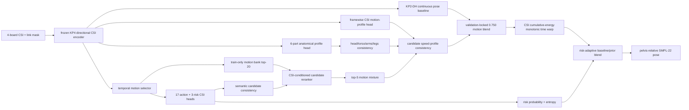

### Seen Test 결과

protocol은 `single_split_lmh_e01`, seed 17, train/validation/test `1210/315/315`이다.
단위는 cm이고 correlation은 무단위다. `KP6-SEMANTIC-WARP`는 고정 75% prior를 쓴 직전
최고, `KP6-RISK-ADAPTIVE`는 CSI 위험도에 따라 prior 비중을 조절한 danger-focused 최고다.

| Seen test metric | KP2-DH locked | KP6-SEMANTIC-WARP | **KP6-RISK-ADAPTIVE** | KP2-DH 대비 |
|---|---:|---:|---:|---:|
| Overall pose | 14.807 | **13.095** | 13.105 | -1.702 |
| Distal pose | 21.447 | **18.978** | 18.991 | -2.456 |
| Dynamic pose | 17.813 | 16.545 | **16.512** | -1.301 |
| High-motion pose | 17.455 | 16.233 | **16.205** | -1.250 |
| Danger pose | 23.300 | 20.534 | **20.479** | -2.821 |
| Danger distal | 34.396 | 30.372 | **30.292** | -4.103 |
| Danger endpoint | 28.735 | 25.807 | **25.715** | -3.020 |
| Danger high-motion | 24.417 | **22.934** | 22.945 | -1.472 |
| Speed correlation | 0.259 | **0.507** | 0.496 | +0.237 |
| Danger speed correlation | 0.367 | **0.569** | 0.568 | +0.201 |
| Composite selection score | 1.34512 | 1.21055 | **1.20725** | -0.13787 |

전신 motion-profile head는 validation에서 GT speed correlation 전체 `0.528`, danger `0.639`를
기록했다. 6부위 head는 danger에서 머리 `0.515`, 몸통 `0.504`, 양팔 `0.572/0.578`, 양다리
`0.589/0.564`의 시간 상관을 보였다. frozen encoder의 raw activity가 전체 `0.154`, danger
`0.202`였던 것과 비교하면 CSI의 부위별 시간 신호를 후보 선택에 쓸 수 있는 수준으로 높였다.
selector의 validation 분류 정확도는 17행동 `92.4%`, 3위험 `96.2%`다. semantic prior의
행동/위험 가중치 `0.35/0.50`도 validation에서만 선택했다. 다만 danger distal `30.29 cm`는
정밀한 부상 부위 판정에 충분하지 않으며, 현재 결과를 정확한
접촉 순서 복원으로 해석하면 안 된다.

### 재현

```powershell
# frozen KP4 feature cache 생성
python -m notifi_pose.tools.refresh_kp5_feature_cache --include-test

# train-only motion selector와 candidate reranker
python -m notifi_pose.tools.train_motion_retrieval_selector
python -m notifi_pose.tools.train_motion_candidate_reranker
python -m notifi_pose.tools.calibrate_reranker_uncertainty

# CSI framewise speed head와 validation-only reranking calibration
python -m notifi_pose.tools.train_csi_motion_profile
python -m notifi_pose.tools.calibrate_motion_profile_reranking

# 6부위 motion profile과 validation에서 확정된 설정의 one-shot test
python -m notifi_pose.tools.train_csi_part_motion_profile
python -m notifi_pose.tools.calibrate_part_motion_profile_reranking
python -m notifi_pose.tools.evaluate_part_motion_profile_reranking

# CSI 누적 움직임 에너지로 validation-only retiming 후 one-shot test
python -m notifi_pose.tools.calibrate_motion_profile_warping
python -m notifi_pose.tools.evaluate_motion_profile_warping

# CSI 행동/위험 예측을 후보 prior로 연결한 뒤 one-shot test
python -m notifi_pose.tools.calibrate_semantic_candidate_prior
python -m notifi_pose.tools.evaluate_semantic_candidate_prior

# CSI danger 확률/불확실도 기반 adaptive blend와 one-shot test
python -m notifi_pose.tools.calibrate_risk_adaptive_blend
python -m notifi_pose.tools.evaluate_risk_adaptive_blend
```

결과 원본은
[`adaptive validation`](work_v2/runs/kp6_risk_adaptive_blend/calibration.json),
[`adaptive fixed test`](work_v2/runs/kp6_risk_adaptive_blend/test_fixed.json),
[`part profile train`](work_v2/runs/kp5_part_motion_profile_seed83/result.json)에 저장된다.

### 최신 실험 로그

| 번호 / 날짜(KST) | 실험 | 목적 | Validation | Fixed test | 결론 |
|---|---|---|---|---|---|
| KP6-RA-EXP01 / 2026-08-06 | risk-adaptive prior blend | danger 확률에는 prior를 강화하고 risk entropy에는 약화 | score 0.99158 | overall 13.105, danger 20.479, distal 30.292 | **danger-focused 현재 최고** |
| KP6-ESP-EXP01 / 2026-08-06 | expanded semantic pool | train 후보를 20개에서 30/50개로 확장 | score 0.99230 | selected test score 1.21212 | validation 선택 재현 실패, 기각 |
| KP6-SW-EXP01 / 2026-08-06 | CSI semantic candidate prior | CSI의 17행동/3위험 확률을 후보 일치도에 명시적으로 연결 | score 0.99601 | overall 13.095, danger 20.534, distal 30.372 | overall 기준 최고 |
| KP6-PT-EXP01 / 2026-08-06 | 6-part 3D trajectory bottleneck | 부위 중심 3D 궤적으로 후보 방향·형태를 보정 | score 1.00274, weight 0 | test 미개봉 | validation 이득 없음, 기각 |
| KP6-MW-EXP01 / 2026-08-06 | CSI monotonic motion warp | CSI 전신/팔다리 누적 움직임에 맞춰 후보 시간축의 50%를 retiming | score 1.00274 | overall 13.194, danger 21.065, distal 31.177 | 이전 최고 |
| KP5-PMP-EXP01 / 2026-08-06 | 6-part CSI motion profile | 머리·몸통·양팔·양다리의 시간별 속도를 따로 예측해 후보를 보정 | score 1.00776 | overall 13.217, danger 21.213, distal 31.391 | 이전 최고 |
| KP5-MP-EXP01 / 2026-08-06 | CSI motion profile | CSI에서 프레임별 신체 속도를 학습해 후보 시간 일치도를 보정 | score 1.01044 | overall 13.287, danger 21.312, distal 31.534 | 이전 최고 |
| KP5-MPR-GR / 2026-08-06 | geometry residual reranker | 관절·속도·가속도·높이·접촉 차이로 후보 순위 보정 | score 1.00918 | overall 13.396, danger 21.400, distal 31.656 | test 일반화 실패, 기각 |
| KP5-MPR-DM / 2026-08-06 | direct differentiable mixture | 최종 혼합 pose 오차를 직접 역전파 | score 1.02552 | test 미개봉 | validation 열화, 기각 |
| KP5-MPR-RM / 2026-08-06 | train-motion multi-hypothesis | train-only 후보를 uncertainty-weighted top-3로 혼합 | score 1.01988 | overall 13.305, danger 21.335, distal 31.565 | 이전 최고 |

---

- 기존 코드: [NotiFi-CSI-to-Pose `feature/goal1`](https://github.com/NotiFi2026/NotiFi-CSI-to-Pose/tree/feature/goal1)
- 현재 통합 위치: [NotiFi/CSI-to-Pose](https://github.com/jjyoon012-git/NotiFi/tree/main/CSI-to-Pose)
- 현재 pose-first 개발 계열: **KP6-RISK-ADAPTIVE (`KP2-DH` + train-motion retrieval + CSI retiming/semantics)**
- 현재 권장 seen 후보: **V13S pose-pruned + conditioned-root + link-routed guard**
- 현재 unseen 진단 후보: **V15 early support-conditioned P2 (root 개선, 승격 보류)**
- 현재 배포 보정 prototype: **V13S-BC basic-pose pose calibration**
- 탐색적 적응 상한: **V13S-YC action-labeled calibration**
- 마지막 sealed test 모델: **V12 clean-protocol multi-expert**
- 현재 test 상태: **KineticPose seen test와 yja/E02 external test는 개봉됨**
- 현재 개발 순서: **GT motion 표현 확립 -> CSI-motion 대응 학습 -> seen 낙상 pose -> unseen calibration**
- 문서 정렬 원칙: **현재 권장 모델을 맨 위에 두고, 이전 안은 최신순으로 기록**

## 현재 모델: KP2-DH hierarchical pose candidate

2026-08-05 20:29 KST 현재 **실험상 pose 최선은 `KP2-DH`**, 안정 운영 기준선은
여전히 `V13S`다. `KP2-DH`는 기존 `KP2-C`의 연속 motion latent 전체를 버리지 않고,
그 출력 위에 몸통 방향, 팔다리 방향, 손·발 위치, 관절 속도를 직접 감독하는 작은 계층형
head를 추가한다. validation으로 선택한 30% blend에서는 기존 `KP2-CB`보다 모든 주요
평균 pose 지표가 개선됐지만, danger pose 개선은 0.030 cm에 불과해 공식 `KP-2`로
승격하지 않았다.

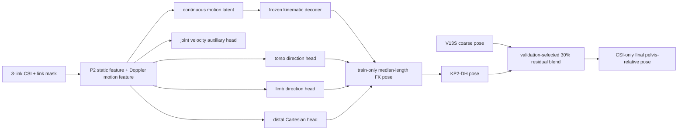

### 기존 KP2-CB 대비 결과

동일한 `single_split_lmh_e01`, seed 17, train/validation/test `1210/315/315`를 사용했다.
모델·epoch·blend strength는 validation만으로 선택했고 test는 선택에 사용하지 않았다.
아래 단위는 cm이며 correlation은 무단위다.

| Seen test metric | KP2-CB | KP2-DH | 변화 | 판정 |
|---|---:|---:|---:|---|
| Overall pose | 14.901 | **14.805** | -0.096 | 개선 |
| Distal pose | 21.587 | **21.444** | -0.143 | 개선 |
| Dynamic pose | 17.931 | **17.811** | -0.119 | 개선 |
| High-motion pose | 17.565 | **17.455** | -0.110 | 개선 |
| Danger pose | 23.329 | **23.299** | -0.030 | 미세 개선 |
| Danger distal | 34.476 | **34.394** | -0.081 | 미세 개선 |
| Danger endpoint | 28.747 | **28.735** | -0.011 | 사실상 동일 |
| Danger high-motion | **24.393** | 24.417 | +0.024 | 미세 악화 |
| Speed correlation | 0.250 | **0.261** | +0.011 | 개선 |
| Danger speed correlation | 0.361 | **0.370** | +0.009 | 개선 |

`KP2-DH` 단독 모델은 `KP2-C` 단독 대비 overall `16.391 -> 16.041 cm`, distal
`23.763 -> 23.124 cm`로 좋아졌다. 따라서 계층형 해부학 head 자체는 유효하다. 하지만
30% blend 뒤 danger 개선이 거의 사라진 것은 V13S coarse pose와 CSI motion residual이
낙상 손·발 궤적을 충분히 관측하지 못하는 문제가 아직 남아 있다는 뜻이다. 현재 수치로는
“대폭 감소”에 성공했다고 볼 수 없다.

### KP3 근본 개선 시도와 결론

2026-08-05 22:36 KST 기준으로 무작위 모듈 조합 대신 세 가지 구조적 문제를 직접 다뤘다.

1. **설치 기하 계약:** RX-North, TX1-South, TX2-West, TX3-East를 코드 상수와
   directional-moment projection으로 구현했다. 거리·높이는 알려지지 않았으므로 사용하지
   않았다. 현재 seen protocol에서는 link ID가 이미 고정 방향과 일대일 대응하므로 새 정보가
   아니며, validation이 기하 학습을 지지하지 않아 projection을 0 상태로 동결했다. 이 경로는
   설치 방향을 유지하는 unseen calibration에서만 다시 연다.
2. **시간 phase 감독:** CSI token과 GT continuous-motion token 사이에 trial 내부
   multi-positive InfoNCE를 추가했다. 인접 ±1 token을 같은 시점으로 허용하고 고속 움직임을
   우선 조회한다. pose latent와 충돌하지 않도록 독립 projection head를 사용했다. validation
   phase top-1은 `11.02% -> 14.76%`로 올랐지만 danger pose/distal은 악화돼 pose 경로에는
   채택하지 않았다.
3. **안전한 coarse-to-fine:** 출력층을 0으로 초기화해 V13S 또는 고정 30% proposal을 정확히
   재현한 뒤 CSI가 bounded correction만 예측하게 했다. 최대 60 epoch, 5-epoch warmup,
   differential LR, cosine decay, EMA, patience 15를 사용했다. epoch 부족 가설은 기각됐다.

| Seen test metric (cm) | 현재 KP2-DH 30% | KP3-CMR, V13S residual | KP3-PCR | KP3-PCR + protocol quality |
|---|---:|---:|---:|---:|
| Overall pose | **14.8054** | 14.9979 | 14.8042 | 14.8048 |
| Danger pose | **23.2990** | 23.5409 | 23.3113 | 23.3113 |
| Danger distal | **34.3945** | 34.7516 | 34.4327 | 34.4310 |
| Danger endpoint | **28.7355** | 28.9322 | 28.7518 | 28.7555 |

`KP3-CMR`은 V13S보다 모든 test 지표를 개선했지만 현재 KP2-DH보다 약했다. `KP3-PCR`은
현재 최고 proposal에서 시작해 validation score를 `1.147244 -> 1.146830`으로 낮췄으나,
test danger/distal이 각각 `+0.0123/+0.0382 cm` 악화됐다. protocol별 quality를 바로잡은
재학습도 같은 결과를 재현했다. 따라서 둘 다 **기각**하고 현재 최고 모델은 KP2-DH 30%다.

현재 split 전용 CSI-GT 관측성 감사도 새로 고정했다. `single_split_lmh_e01`의 train/val/test
중앙 절대 lag는 `13/14/14 frames`, danger는 `9/9/8 frames`다. 이는 CSI energy와 GT speed의
상관 peak이지 timestamp 오프셋 정답이 아니므로 GT를 강제로 이동하지 않는다. 과거 9B
piecewise ±15-frame 정렬과 KP2-DHA ±3-frame soft alignment도 이미 validation에서 기각됐다.
새 코드는 protocol별 audit CSV를 quality weighting에 명시적으로 연결하고, 이전
`yja_holdout` 보고서가 seen 학습에 암묵적으로 섞이지 않게 한다.

또한 checkpoint 교체 기준을 `1e-5` 흔들림에서 **validation score 최소 0.001 개선**으로
강화했다. 최종 평가는 test를 선택에 사용하지 않되 overall, danger, danger distal, danger
endpoint가 모두 비열화일 때만 deployment 후보로 표시한다.

결과 원본은
[`KP3-GPA`](work_v2/runs/kp3_gpa_projection_seed17/result.json),
[`KP3-CMR`](work_v2/runs/kp3_cmr_seed17/result.json),
[`KP3-PCR`](work_v2/runs/kp3_pcr_seed17/result.json),
[`KP3-PCR protocol quality`](work_v2/runs/kp3_pcr_protocol_quality_seed17/result.json),
[`seen alignment audit`](work_v2/reports/motion_alignment_audit_single_split_lmh_e01.json)에 있다.

```powershell
# 현재 protocol 전용 CSI-GT 관측성 감사
python -m notifi_pose.tools.audit_motion_alignment `
  --exp single_split_lmh_e01 --baseline sub

# 고정 30% proposal에서 시작하는 KP3 correction 재현
python -m notifi_pose.tools.train_coarse_motion_pose `
  --exp single_split_lmh_e01 --proposal-strength 0.30

# 전체 회귀 테스트
python -m unittest discover -s tests -v
```

### 2026-08-05 최신 실험 로그

| 번호 / 시간(KST) | 실험 | 목적과 상세 내용 | Validation 선택 | Seen test 결과 | 결론 |
|---|---|---|---|---|---|
| KP2-DH-VIS01, 23:38-23:40 | seen fall GVHMR overlay | 고정 test trial `lmh_E01_D02_t009`에 현재 최고 `V13S + 0.30 * (KP2-DH - V13S)`를 CSI-only 추론하고 neutral SMPL surface로 GT/예측 비교 | 기존 validation-lock 그대로, 재선택 없음 | trial pose 37.646 cm, root 60.096 cm, class 14/risk danger 정답 | 상체 기울기와 사지 배치가 크게 어긋남. [영상](work_v2/runs/kp2dh_seen_fall_overlay/lmh_E01_D02_t009_kp2dh_gvhmr.mp4), [대표 프레임](work_v2/runs/kp2dh_seen_fall_overlay/lmh_E01_D02_t009_kp2dh_gvhmr.png) |
| KP3-PCR-PQ-EXP01, 22:22-22:35 | protocol quality correction | `single_split_lmh_e01/sub` 전용 관측성 audit로 quality/sampler 계약 수정 후 PCR 재학습 | epoch 1, score 1.146915 | overall 14.805, danger 23.311, distal 34.431 | 기각: test danger 비열화 실패 |
| KP3-PCR-EXP01, 22:05-22:20 | proposal-conditioned residual | 현재 최고 고정 30% proposal에서 zero-init CSI correction 학습 | epoch 1, score 1.146830 | overall 14.804, danger 23.311, distal 34.433 | 기각: validation 미세차가 test에서 재현되지 않음 |
| KP3-CMR-EXP01, 21:43-22:05 | V13S coarse motion residual | V13S를 정확히 보존하며 KP2 시간 특징으로 bounded residual 학습 | epoch 9, score 1.162936 | overall 14.998, danger 23.541, distal 34.752 | 기각: V13S는 개선했지만 KP2-DH보다 약함 |
| KP3-GPA-EXP01, 21:27-21:42 | geometry + phase alignment | 고정 설치 방향 projection과 독립 token-phase InfoNCE, staged 60-epoch 학습 | epoch 0 | KP2-DH 단독과 동일 | 기각: phase retrieval은 개선됐지만 pose/danger 악화 |
| KP2-DHK-EXP01, 20:24-20:29 | danger keyframe | danger trial에서 GT 평균 관절 속도 상위 45프레임만 강화. 충돌 시점 휴리스틱은 사용하지 않음 | epoch 0 | KP2-DH와 동일 | 기각: 빠른 프레임 재가중만으로 좌표 대응이 생기지 않음 |
| KP2-DHA-EXP01, 20:18-20:24 | soft temporal alignment | GT high-motion velocity와 예측 velocity를 ±3프레임 범위에서 soft 정렬 | epoch 0 | KP2-DH와 동일 | 기각: 시점 유연성이 좌표·distal을 악화시킴 |
| KP2-DHG-EXP01, 20:12-20:18 | joint confidence gate | CSI feature로 프레임·관절별 V13S/KP2-DH 혼합 비율 학습 | epoch 0, uniform 0.3 | danger 23.300, distal 34.396 | 기각: 학습 gate가 validation을 악화시켜 고정 0.3이 우세 |
| KP2-DH-EXP01, 19:07-20:12 | hierarchical pose head | torso/limb 방향, distal 좌표, velocity를 명시적으로 감독 | epoch 9, blend 0.3 | danger 23.299, distal 34.394 | 실험 후보 유지: 일관된 미세 개선, 승격 보류 |

세 ablation이 모두 epoch 0으로 되돌아간 것은 안전장치가 정상 작동했다는 의미이기도 하다.
복잡한 모듈을 추가했다고 채택하지 않고, validation에서 실제로 개선된 계층형 head만 남겼다.
KP3까지의 결론은 loss나 residual head를 더 붙여 해결할 단계가 아니라는 것이다. GT-only
continuous decoder는 약 1.56 cm라 병목이 아니며, CSI encoder가 낙상 방향과 사지 궤적을
프레임별로 식별하는 정보가 아직 부족하다. 정확한 timestamp가 있는 trial은 그대로 사용하고,
관측성이 낮은 trial은 protocol별 quality로만 완화한다. 데이터 또는 센서 관측성 변화 없이
현재 코드에서 확인 가능한 큰 구조 개선은 여기까지 검증했다.

결과 원본은
[`KP2-DH`](work_v2/runs/kp2dh_hierarchical_pose/result.json),
[`KP2-DHG`](work_v2/runs/kp2dhg_joint_gate/result.json),
[`KP2-DHA`](work_v2/runs/kp2dha_alignment/result.json),
[`KP2-DHK`](work_v2/runs/kp2dhk_keyframes/result.json)에 있다.

```powershell
# 채택 후보: KP2-C에서 계층형 pose head 학습
python -m notifi_pose.tools.train_hierarchical_pose

# 기각된 joint confidence gate 재현
python -m notifi_pose.tools.train_gated_hierarchical_pose

# 기각된 soft alignment ablation 재현
python -m notifi_pose.tools.train_hierarchical_pose `
  --resume-checkpoint work_v2/runs/kp2dh_hierarchical_pose/best_model.pt `
  --lambda-alignment 0.02 --learning-rate 1e-4 `
  --experiment-name KP2-DHA-EXP01 --candidate-version KP2-DHA `
  --run-dir work_v2/runs/kp2dha_alignment

# 기각된 danger keyframe ablation 재현
python -m notifi_pose.tools.train_hierarchical_pose `
  --resume-checkpoint work_v2/runs/kp2dh_hierarchical_pose/best_model.pt `
  --lambda-danger-keyframe 0.05 --learning-rate 5e-5 `
  --experiment-name KP2-DHK-EXP01 --candidate-version KP2-DHK `
  --run-dir work_v2/runs/kp2dhk_keyframes
```

## 최신 실험: KP2 motion representation 재설계

2026-08-05 19:06 KST 현재 **안정 운영 모델은 V13S**, 최신 seen pose 후보는
**KP2-CB**이며 공식 `KP-2` 승격은 보류했다. KP1의 작은 residual 보정으로는 낙상 방향과
팔다리 배치를 복원하지 못해,
KP2에서는 먼저 CSI가 실제 움직임과 대응하는지 검증하고 GT 자세 자체의 motion 표현 상한을
분리해서 측정했다. 이 단계 분리 덕분에 CSI encoder와 pose decoder 중 어느 쪽이 병목인지
구분할 수 있다.

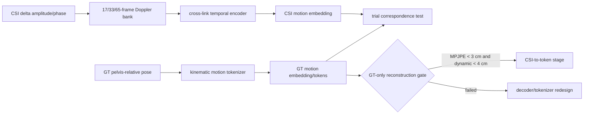

### KP2 결과 요약

동일한 `single_split_lmh_e01`의 train/validation/test `1210/315/315`와 seed 17을 사용했다.
모델 선택은 validation으로만 하고 test는 선택 후 한 번 평가했다. 단위는 cm이다.

| Experiment | Validation MPJPE | Validation dynamic | Test MPJPE | Test danger high-motion | 판정 |
|---|---:|---:|---:|---:|---|
| KP2-A Doppler + correspondence | - | - | 15.069 | 24.763 | 기각 |
| KP2-B single VQ, 256 codes | 8.445 | 9.864 | 8.600 | 11.842 | gate 실패 |
| KP2-B hierarchical RVQ, 2x512 | **6.244** | **6.986** | **6.378** | **7.999** | 현재 GT 표현 최선, gate 실패 |
| KP2-B factorized 5-part VQ | 7.397 | 7.549 | 7.381 | 8.843 | 기각 |
| KP2-B continuous latent | **1.527** | **1.884** | **1.564** | **2.252** | gate 통과 |

1. **KP2-A, Doppler correspondence:** delta 1/3 amplitude/phase 뒤에 17/33/65-frame 고정
   Doppler filter bank와 ordered cross-link pair를 추가했다. 같은 class/site의 다른 trial을
   hard negative로 둔 InfoNCE retrieval은 train에서 `12.95% -> 95.63%`로 올랐지만 test
   same-class/site top-1은 `35.87%`, positive similarity `0.3949`가 negative `0.4016`보다
   낮았다. CSI를 같은 동작 trial로 교환해도 endpoint가 0.015 cm만 변해, 움직임 대응이 아니라
   학습 trial의 nuisance를 외운 것으로 판정했다. V13S 대비 test MPJPE 개선도 0.008 cm뿐이다.
2. **KP2-B single VQ:** GT만 사용한 kinematic bone decoder와 motion-weighted loss를 먼저
   학습했다. 216/256 code가 활성화돼 codebook collapse는 없었지만 validation MPJPE가
   8.445 cm라 decoder 표현력이 부족했다.
3. **KP2-B hierarchical RVQ:** 시간 downsample을 4에서 2로 줄이고 512-code residual
   quantizer를 2단으로 늘렸다. validation MPJPE를 6.244 cm까지 낮춰 세 tokenizer 중
   최선이었지만, CSI를 연결하기 위한 사전 gate인 MPJPE 3 cm와 dynamic 4 cm에는 못 미쳤다.
4. **KP2-B factorized VQ, 18:33-18:39 KST:** torso/좌우 팔/좌우 다리의 5개 token stream을
   사용했다. 평균 231개 code가 활성화되고 danger speed correlation은 0.853이었지만,
   전신 상호작용이 약해져 validation MPJPE 7.397 cm로 hierarchical RVQ보다 나빴다.
5. **KP2-B continuous latent, 18:40-18:43 KST:** 같은 전신 encoder/decoder에서 VQ만
   제거했다. validation/test MPJPE `1.527/1.564 cm`, test danger high-motion `2.252 cm`로
   3/4 cm gate를 통과했다. train-only 전역 median skeleton으로 GT 뼈 길이 누수를 제거해도
   test MPJPE `2.196 cm`, dynamic `2.359 cm`, danger high-motion `2.580 cm`를 유지했다.

### KP2-C CSI-to-continuous-latent

frozen P2 temporal feature로 정적 자세 문맥을 받고, KP2-A Doppler encoder로 움직임을 받은 뒤
framewise gate와 residual로 합친다. 이 특징으로 2프레임당 128차원 연속 latent를 예측하고,
frozen kinematic decoder와 train-only 전역 골격으로 SMPL-22 자세를 복원한다. GT motion
encoder는 학습 시 latent teacher일 뿐 validation/test/추론 입력에는 포함되지 않는다.

| Seen test metric | V13S | KP2-C 단독 | KP2-CB, val-selected 30% blend |
|---|---:|---:|---:|
| Overall pose | 15.077 | 16.391 | **14.901** |
| Distal pose | 21.782 | 23.763 | **21.587** |
| Dynamic pose | 18.035 | 19.586 | **17.931** |
| High-motion pose | 17.677 | 19.172 | **17.565** |
| Danger pose | 23.667 | 25.462 | **23.329** |
| Danger distal | 34.799 | 37.732 | **34.476** |
| Danger endpoint | 29.198 | 31.471 | **28.747** |
| Danger high-motion | 24.803 | 26.431 | **24.393** |
| Speed correlation | 0.236 | 0.217 | **0.250** |
| Danger speed correlation | 0.338 | 0.344 | **0.361** |

`KP2-C-EXP01`, 18:45-19:03 KST는 validation epoch 18을 선택했다. 단독 모델은 validation
MPJPE 14.63 cm였지만 test에서 16.39 cm로 악화돼 승격에 실패했다. 그러나 같은
subject/environment/class의 다른 CSI로 교환하면 dynamic 오차가 `+1.672 cm`, danger
high-motion이 `+1.874 cm`, danger speed correlation이 `-0.181` 변했고, 시간 역전에서는
각각 `+6.331 cm`, `+6.764 cm`, `-0.384` 변했다. 따라서 평균 자세 shortcut이 아니라 실제
CSI 시간 정보를 사용하는 데는 성공했다.

`KP2-CB-EXP01`, 19:04-19:06 KST는 `V13S + alpha*(KP2-C - V13S)`의 alpha를 validation에서만
선택했고 `0.3`이 채택됐다. test가 이미 KP2-C 단독 실험에서 개봉된 뒤 진행한 post-hoc
결합이므로 sealed 결과로 주장하지 않는다. 다만 test에서도 위 표처럼 모든 pose 지표가
V13S보다 개선돼, 현재 다음 seed/overlay 검증 대상으로 유지한다.

핵심 결론은 세 가지다. 첫째, global trial embedding은 unseen trial의 세부 움직임 대응을
학습하지 못한다. 둘째, 이산 VQ가 GT 표현의 주 병목이므로 현재 데이터 규모에서는 연속
motion latent가 맞다. 셋째, CSI가 연속 latent 전체를 단독 복원하면 validation-test shift가
커지지만, V13S coarse에 30%만 주입하면 작더라도 모든 test pose 지표가 개선된다. 다음은
**3-seed 반복, 낙상 overlay, motion-adaptive residual gate, soft temporal alignment** 순서로
검증하며, 이를 통과하기 전에는 공식 `KP-2`로 부르지 않는다.

결과 원본은
[`KP2-A`](work_v2/runs/kp2a_exp01_doppler_correspondence/result.json),
[`KP2-A retrieval audit`](work_v2/runs/kp2a_exp01_doppler_correspondence/correspondence_audit.json),
[`single VQ`](work_v2/runs/kp2b_motion_tokenizer/result.json),
[`hierarchical RVQ`](work_v2/runs/kp2b_hierarchical_motion_tokenizer/result.json),
[`factorized VQ`](work_v2/runs/kp2b_factorized_motion_tokenizer/result.json),
[`continuous latent`](work_v2/runs/kp2b_continuous_motion_autoencoder/result.json),
[`length-prior audit`](work_v2/runs/kp2b_continuous_motion_autoencoder/length_prior_audit.json),
[`KP2-C`](work_v2/runs/kp2c_continuous_csi_pose/result.json),
[`KP2-CB blend`](work_v2/runs/kp2c_continuous_csi_pose/validation_blend.json)에 있다.

```powershell
# KP2-A 재현
python -m notifi_pose.tools.train_doppler_pose `
  --run-dir work_v2/runs/kp2a_exp01_doppler_correspondence
python -m notifi_pose.tools.audit_doppler_correspondence `
  --checkpoint work_v2/runs/kp2a_exp01_doppler_correspondence/best_model.pt

# 현재 GT motion 표현 최선인 hierarchical RVQ 재현
python -m notifi_pose.tools.pretrain_motion_tokenizer `
  --epochs 30 --batch-size 16 --hidden 192 --code-dim 128 `
  --codes 512 --downsample 2 --quantizer-levels 2 `
  --run-dir work_v2/runs/kp2b_hierarchical_motion_tokenizer

# 채택된 연속 GT motion 표현과 CSI 연결
python -m notifi_pose.tools.pretrain_motion_tokenizer `
  --epochs 30 --batch-size 16 --hidden 256 --code-dim 128 `
  --downsample 2 --continuous `
  --run-dir work_v2/runs/kp2b_continuous_motion_autoencoder
python -m notifi_pose.tools.audit_motion_length_prior
python -m notifi_pose.tools.train_continuous_pose
python -m notifi_pose.tools.calibrate_continuous_pose_blend
```

## 현재 개발 모델: NotiFi-KineticPose

`NotiFi-KineticPose`는 절대 root보다 pelvis-relative 자세, 고속 동작, 낙상 중 말단관절을
우선하는 새 모델 계열이다. 실험 이름은 `KP1-EXP01`, `KP1-EXP02`처럼 붙이고, validation과
test 및 시각화까지 통과한 조합만 공식 `KP-1`로 승격한다. 2026-08-05 현재 세 실험 모두
개선 폭이 작고 낙상 overlay가 충분하지 않아 **공식 KP-1은 아직 만들지 않았다**.

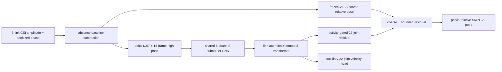

동적 분기는 정적 CSI level을 보지 않는다. 링크별 정적 offset은 모든 입력 차분에서 상쇄되고,
시간적으로 일정한 CSI에서는 activity와 residual이 정확히 0이 되어 V13S로 돌아간다. 학습과
선택 점수에는 root, 17-class, 3-risk를 넣지 않았다. 손실은 pelvis-relative 관절 위치, distal
관절, 1/3/7-frame 속도, 가속도, bone 길이/방향, danger 마지막 15프레임을 사용하며 충돌 시점
휴리스틱은 사용하지 않는다. frozen V13S coarse pose는 row별 float16 캐시로 한 번만 계산한다.

### 2026-08-05 seen 실험 로그

동일한 `single_split_lmh_e01`, seed 17에서 train/validation/test는 각각 `1210/315/315`
pose trial이고 test danger는 70개다. 모든 residual 강도와 activity threshold는 validation에서만
고르고 test는 설정을 잠근 뒤 평가했다. 아래 단위는 cm이며 correlation만 무단위다.

| Test metric | V13S | EXP01 coarse-conditioned | EXP02 pure dynamic | EXP03 + velocity aux |
|---|---:|---:|---:|---:|
| Overall pose | 15.077 | **15.041** | 15.070 | 15.058 |
| Distal pose | 21.782 | 21.758 | 21.773 | **21.758** |
| Dynamic pose | 18.035 | **17.925** | 18.029 | 17.993 |
| High-motion pose | 17.677 | **17.581** | 17.672 | 17.641 |
| Danger pose | 23.667 | **23.585** | 23.656 | 23.634 |
| Danger distal | 34.799 | **34.740** | 34.789 | 34.773 |
| Danger high-motion | 24.803 | **24.598** | 24.791 | 24.713 |
| Danger endpoint | **29.198** | 29.273 | 29.212 | 29.214 |
| Speed correlation | 0.236 | **0.247** | 0.234 | 0.236 |
| Danger speed correlation | 0.338 | **0.348** | 0.337 | 0.344 |

1. **KP1-EXP01, 16:37-17:00 KST:** coarse pose를 residual head에 제공하고 activity floor를
   0.15로 뒀다. validation은 epoch 16, strength 0.75를 선택했다. aggregate는 세 실험 중
   가장 좋지만 같은 사람/환경/동작의 CSI를 교환해도 거의 변하지 않고 temporal-mean의 overall
   악화도 0.014 cm뿐이어서, 개선의 일부가 coarse 기반 일반 보정이라고 판정해 기각했다.
2. **KP1-EXP02, 17:01-17:06 KST:** coarse 입력과 activity floor를 모두 제거해 일정 CSI에서
   exact V13S fallback을 강제했다. validation epoch 14, strength 0.75를 선택했으나 test 개선이
   0.007 cm에 그쳐 동적 분기 학습 용량이 부족하다고 판정했다.
3. **KP1-EXP03, 17:07-17:13 KST:** coarse context를 복구하되 activity floor는 0으로 유지하고
   CSI feature에서 22관절 GT 속도를 직접 예측하는 auxiliary head를 추가했다. validation은
   epoch 16, strength 1.0을 선택했다. temporal-mean CSI에서는 정확히 V13S로 돌아가 신호 근거는
   EXP01보다 명확했지만, 같은 동작 trial 교환에는 둔감하고 test endpoint가 개선되지 않아
   공식 KP-1 승격을 보류했다. activity threshold sweep도 validation이 0을 선택했다.

대표 seen overlay에서도 walking은 대략적인 직립 자세만 맞고, stumble의 큰 상체 기울기와
fall의 몸 방향·팔/다리 배치를 놓쳤다. 결과는
[`preview_contact_sheet.png`](work_v2/runs/kp1_exp03_seen_overlays/preview_contact_sheet.png),
수치는 [`EXP01`](work_v2/runs/kp1_exp01_dynamic_pose/result.json),
[`EXP02`](work_v2/runs/kp1_exp02_signal_gated/result.json),
[`EXP03`](work_v2/runs/kp1_exp03_velocity_aux/result.json), 반사실 감사는
[`EXP03 counterfactual`](work_v2/runs/kp1_exp03_velocity_aux/counterfactual.json)에 있다.

```powershell
# EXP03 재현
python -m notifi_pose.tools.train_kinetic_pose `
  --batch-size 12 --condition-on-coarse --activity-floor 0 `
  --lambda-aux-velocity 0.30 --experiment-name KP1-EXP03 `
  --run-dir work_v2/runs/kp1_exp03_velocity_aux

python -m notifi_pose.tools.audit_kinetic_pose `
  --checkpoint work_v2/runs/kp1_exp03_velocity_aux/best_model.pt `
  --output work_v2/runs/kp1_exp03_velocity_aux/counterfactual.json

python -m notifi_pose.tools.calibrate_kinetic_activity
python -m notifi_pose.tools.visualize_kinetic_pose
```

## 현재 모델: V13S validation candidate

V13S는 CSI-only p2 backbone 위에서 자세, root, 17-class, 3-risk head를 분리해 학습한 뒤
validation에서만 조합한다. V12의 세 pose seed 중 기여가 낮은 seed7을 제거해 pose를
`[seed17, seed23]=[0.60, 0.40]`으로 줄였고, core root도 0-weight expert를 제거해
`[direct-root seed7, motion-conditioned root]=[0.20, 0.80]`만 실행한다.

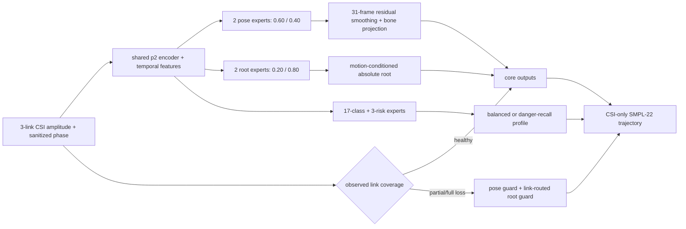

완전 링크 손실에서는 링크 0/1을 새 motion-conditioned failure root가, 링크 2를 기존
direct-root failure expert가 처리한다. 50% 구간 손실에는 pose/root guard를 모두 사용하고,
분류 fallback은 학습 분포와 맞는 완전 손실에만 켠다. 라벨·GT·action 정답으로 분기하지 않고
입력의 실제 link mask만 사용한다.

| Validation metric | Clean | One-link loss |
|---|---:|---:|
| Root-relative MPJPE | **13.30 cm** | 20.44 cm |
| Root error | **30.92 cm** | 42.77 cm |
| Danger absolute MPJPE | **44.39 cm** | 57.28 cm |
| Danger relative pose / distal | 20.23 / **29.48 cm** | 27.51 / 40.60 cm |
| Danger endpoint absolute / relative | 55.27 / **23.31 cm** | 74.03 / 32.37 cm |
| 17-class accuracy | 96.05% | 64.74% |
| Risk accuracy / macro F1 | 97.87 / 97.63% | 81.76 / 79.96% |
| Danger recall | 67/70, **95.71%** | 62/70, **88.57%** |
| Safe -> danger | 2/175 | 20/175 |

분류에는 두 운영점이 있다. 기본 **danger-recall** profile은 링크 손실 recall을
`60/70 -> 62/70`으로 높이는 대신 safe-to-danger가 `15 -> 20`으로 증가한다. 기존
**balanced** profile은 recall `60/70`, 오경보 `15`다. 낙상 누락을 우선한다는 요구에 따라
V13S lock은 danger-recall을 선택하되 두 calibration을 모두 보존한다.

3-pose V13 대비 13개 clean/교란 모드 평균에서 V13S는 MPJPE `-0.013 cm`, danger relative
pose `-0.046 cm`, distal `-0.083 cm`, endpoint pose `-0.096 cm`다. relative distal은
11/13, endpoint는 12/13 모드에서 개선됐다. 반면 root를 합친 absolute distal은 평균
`+0.021 cm`이므로 위치와 자세 지표를 섞어 해석하지 않는다. 현재 lock과 원시는
[`v13s_current_model_lock.json`](docs/results/v13s_current_model_lock.json),
[`v13s_final_robustness.json`](docs/results/v13s_final_robustness.json)에 있다. **V13S는 test를
열지 않은 validation 후보**이며 아래 V12 test 수치와 섞어 최종 성능으로 주장하지 않는다.

```powershell
python -m notifi_pose.tools.audit_v12_link_failure_guard `
  --p2-checkpoint work_v2/runs/p2_sub_single_clean_finetune/best_model.pt `
  --root-calibration docs/results/v13s_pruned_pose_root_ensemble.json `
  --classification-calibration work_v2/runs/p2_v12w_robust_classification_ensemble/validation.json `
  --pose-calibration docs/results/v12_link_failure_pose_calibration.json `
  --failure-root-calibration docs/results/v13_conditioned_link_failure_root_calibration.json `
  --secondary-failure-root-calibration docs/results/v12_link_failure_root_calibration.json `
  --secondary-root-links 2 `
  --failure-class-calibration docs/results/v13_link_specific_danger_recall_calibration.json `
  --minimum-link-coverage 0.5 `
  --classification-minimum-link-coverage 0.0 `
  --output docs/results/v13s_final_robustness.json
```

## Unseen calibration-aware 진단: V14-V16

배포 절차와 같은 `absence + standing/sitting/lying` support를 source 환경별 episode로 만들어
yja/E02에는 각 기본 자세 6개, 총 18개만 제공했다. yja GT는 보정 학습·강도 선택에 쓰지 않고
나머지 245개(낙상 50개)를 잠근 뒤 평가했다. V14는 frozen V13S 출력 뒤에 adapter를 붙였고,
V15는 support FiLM을 P2의 link fusion과 temporal encoder 사이로 앞당겼다.

| yja/E02 held-out 245 trial | Frozen V13S | V14 post-encoder | V15 early FiLM |
|---|---:|---:|---:|
| MPJPE | 29.81 cm | 29.88 cm | **29.70 cm** |
| PA-MPJPE | 10.15 cm | 10.16 cm | **10.06 cm** |
| Root error | 76.65 cm | 75.66 cm | **68.35 cm** |
| Danger absolute MPJPE | 77.74 cm | 77.60 cm | **76.22 cm** |
| Danger relative pose / distal | **38.95 / 58.20 cm** | 39.09 / 58.46 cm | 38.99 / 58.35 cm |
| 17-class accuracy | 8.98% | 8.98% | **10.61%** |
| Risk accuracy | 45.71% | 45.71% | **46.94%** |
| Danger recall | **2/50** | 2/50 | 0/50 |

V15는 target root를 8.30 cm, danger absolute를 1.52 cm 줄였지만 낙상 상대 자세는 개선하지
못했고 danger recall을 잃었다. 따라서 **root-domain adapter 진단 후보로만 보존하고 현재 모델로
승격하지 않는다**. V16은 기본 자세 moment를 source reference로 맞춘 뒤 V15를 적용했으나,
source meta-validation이 moment-alignment strength `0`을 선택해 입력 moment 정렬 가설을 기각했다.

추가 감사에서 yja pose는 per-frame similarity alignment 후 `10.15 cm`까지 내려가지만, 하나의
고정 회전은 전체 pose `29.80 -> 30.07 cm`로 개선하지 못했다. unseen 실패는 단순 설치 좌표계
회전 하나가 아니라 frame별 방향·크기·동작 상태의 불일치다. 원시는
[`v15_support_conditioned_p2_yja.json`](docs/results/v15_support_conditioned_p2_yja.json),
[`v16_moment_aligned_p2_smoke.json`](docs/results/v16_moment_aligned_p2_smoke.json),
[`yja_fixed_orientation_audit.json`](docs/results/yja_fixed_orientation_audit.json)에 있다.

```powershell
python -m notifi_pose.tools.train_calibration_aware_v15
python -m notifi_pose.tools.train_calibration_aware_v16
python -m notifi_pose.tools.diagnose_yja_fixed_orientation
```

## 배포 보정 prototype: V13S-BC

실제 설치 환경에서는 먼저 12개 `absence` CSI로 빈 환경 기준선을 제거하고, 사용자에게
`서 있기·앉아 있기·누워 있기` 세 자세만 요청한다. source train의 같은 세 자세 195개에서
기준 CSI moment와 frozen-pose prototype을 만들었다. yja/E02에서는 자세별 4개, 총 12개를
보정 parameter 적합에 사용하고 자세별 2개, 총 6개를 후보 선택에 사용했다. 나머지 245개는
보정을 모두 잠근 뒤에만 평가했으며, 그 안의 warning과 danger 125개는 보정 과정에 한 건도
사용하지 않았다. 50개 낙상은 모두 test에 남아 있다.

이 절차는 yja의 자세 GT나 영상을 사용하지 않는다. 알려진 기본 자세 이름만으로 target CSI
moment를 source 기본 자세 분포에 25% 맞추고, target 출력은 같은 label의 source-prediction
prototype에 가까워지도록 identity-regularized 3D affine을 정한다. 정적 pose label만으로는
world root나 17-class·danger 경계를 식별할 수 없으므로 **root, 분류, 위험 head는 보정된 입력을
쓰지 않고 frozen V13S 원본 CSI 경로를 그대로 유지**한다.

| yja/E02 held-out 245 trial | Frozen V13S | V13S-BC |
|---|---:|---:|
| MPJPE | **29.81 cm** | 30.32 cm |
| PA-MPJPE | **10.15 cm** | 10.34 cm |
| Root error | 76.65 cm | 76.65 cm |
| Danger absolute MPJPE | **77.74 cm** | 78.25 cm |
| Danger relative pose / distal | **38.95** / 58.20 cm | 39.12 / **58.12 cm** |
| Danger relative endpoint | 45.77 cm | **42.84 cm** |
| Pose-speed ratio | **1.416** | 1.798 |
| 17-class accuracy / macro F1 | 8.98 / 3.41% | 8.98 / 3.41% |
| Risk accuracy / macro F1 | 45.71 / 25.57% | 45.71 / 25.57% |
| Danger recall / safe -> danger | 2/50 / 11 | 2/50 / 11 |

낙상 마지막 상대 자세는 2.93 cm 개선됐지만 전체 MPJPE, PA-MPJPE, danger absolute와 움직임
속도는 악화했다. 따라서 V13S-BC는 **절차와 코드만 보존하고 모델 교체는 기각**한다. 실패 원인은
frozen encoder가 설치 calibration episode를 사용하도록 학습되지 않았다는 점이다. 다음 버전은
source 학습부터 환경별 `absence + 기본 자세 support`를 encoder FiLM/AdaNorm 조건으로 제공하는
episodic calibration-aware 모델이어야 한다. 절대 root까지 보정하려면 기본 자세 이름 외에 바닥의
알려진 anchor 위치가 추가로 필요하다.

```powershell
python -m notifi_pose.tools.calibrate_v13s_yja
```

원시 결과는 [`v13s_yja_basic_pose_calibration.json`](docs/results/v13s_yja_basic_pose_calibration.json),
보정 parameter는 `work_v2/runs/v13s_yja_basic_pose_calibration/calibration.pt`에 있다.

## 탐색적 적응 상한: V13S-YC action-labeled

V13S를 그대로 `yja/E02`에 적용하면 source와 target의 CSI 분포가 크게 달라 성능이 무너졌다.
이를 확인한 뒤 yja 263개 pose/action trial을 클래스별로 고정 분할했다. `80개`는 calibration
학습, `52개`는 calibration 후보 선택, `131개`는 모든 설정을 잠근 뒤 held-out 평가에만
사용했다. 12개 absence trial은 pose GT가 없으므로 site baseline subtraction에만 쓰고 지표에서
제외했다.

보정은 전체 encoder를 미세조정하지 않는다. Calibration-train CSI의 link/subcarrier별
amp-phase moment를 source reference에 맞추고, 공통 3D pose affine과 root affine, 17-class와
3-risk의 diagonal scale/bias만 학습한다. Moment 강도, affine ridge, joint-bias 강도와 logit
regularization은 별도 52개 calibration-validation에서 선택한다.

| yja/E02 held-out 131 trial | Frozen V13S | V13S-YC |
|---|---:|---:|
| MPJPE | 29.86 cm | **27.47 cm** |
| PA-MPJPE | **10.20 cm** | 11.13 cm |
| Root error | 71.86 cm | **59.12 cm** |
| Danger absolute MPJPE | 73.84 cm | **68.35 cm** |
| Danger relative pose / distal | 38.44 / 57.27 cm | **33.31 / 49.19 cm** |
| Danger relative endpoint | 46.20 cm | **36.25 cm** |
| Pose-speed ratio | 2.431 | **1.410** |
| 17-class accuracy / macro F1 | 9.16 / 3.04% | **28.24 / 10.38%** |
| Risk accuracy / macro F1 | 51.15 / 27.71% | 51.15 / **34.73%** |
| Danger recall | 1/25, 4.00% | **9/25, 36.00%** |
| Safe -> danger | **4** | 7 |

Root와 낙상 상대 자세는 의미 있게 개선됐지만 PA-MPJPE는 악화했고, warning recall은 여전히
0이며 danger recall도 36%에 불과하다. 따라서 calibration만으로 domain shift가 해결됐다고
볼 수 없다. 또한 전체 yja aggregate를 먼저 확인한 뒤 이 development split을 정의했으므로,
이 수치는 새로 봉인된 unseen benchmark가 아니라 **탐색적 target-adaptation 결과**다. 최종
주장은 새 피험자 또는 사전에 고정한 LOSO fold에서 다시 검증해야 한다.

```powershell
python -m notifi_pose.tools.calibrate_v13s_yja `
  --calibration-mode stratified_actions `
  --output docs/results/v13s_yja_calibrated_evaluation.json `
  --calibration-state work_v2/runs/v13s_yja_calibration/calibration.pt
```

원시 결과는 [`v13s_yja_calibrated_evaluation.json`](docs/results/v13s_yja_calibrated_evaluation.json),
보정 parameter는 `work_v2/runs/v13s_yja_calibration/calibration.pt`에 있다.

### V13 개발 기록: trial observability gate

데이터와 split을 변경하지 않고 V12 validation에 결정적 반사실 입력을 적용했다. 같은
사람·환경·행동의 다른 trial CSI로 바꾸면 MPJPE/root가 `13.30/31.28 → 15.35/38.45 cm`,
시간 역전에서는 `22.79/54.51 cm`로 악화됐다. 따라서 V12는 trial별·시간순 CSI를 실제로
사용하며, 과거 V5의 평균 자세 병목은 주된 실패 원인이 아니다. 반면 30-frame 이동에서 danger
endpoint가 `55.52 → 53.96 cm`로 우연히 개선되고 clean danger speed correlation도 `0.352`에
그쳐, 다음 ablation은 encoder 교체보다 uncertainty-aware temporal/root loss를 우선한다. test는
열지 않았다. 원시는 [`v13_observability_v12.json`](docs/results/v13_observability_v12.json)에 있다.

`uniform_30fps` train trial에만 5-frame soft root alignment를 `0.25/0.50` 비율로 추가한
V13A/B는 두 실행 모두 validation이 warm-start epoch 0을 선택했다. 가장 나은 학습 epoch도 root
`31.20 cm`로 사실상 같고 endpoint 개선은 최대 `0.12 cm`뿐이며 danger root가 악화됐다. 따라서
이 branch는 기본값 `0`으로 기각하고, 다음 단계는 CSI motion representation을 직접 강화한다.

V13C는 direct 위치와 속도 적분을 frame gate로 결합한 state-root decoder를 기존 V12RG root에서
identity warm-start했다. 네 epoch 모두 기준을 넘지 못해 epoch 0이 선택됐고, 최선 학습 epoch도
root `31.20 cm`로 동일하면서 danger/endpoint 동시 개선에 실패했다. decoder 조합만 늘리는 방향은
기각하고, feature에 GT motion 보조 감독을 주는 V13D로 이동한다.

V13D/E는 residual feature에서 5-frame root velocity와 pose speed를 예측하는 보조 head를
가중치 `0.10/0.50`으로 추가했다. 두 실행 모두 root validation이 epoch 0을 선택했고 학습 곡선도
기존 root fine-tune과 같았다. 독립 head가 보조 target만 흡수하고 root 출력에는 기여하지 못해
기각했다. 다음 실험은 현재 V12 feature의 frame/trial motion linear probe로 병목 위치를 먼저
확정한다.

V12 temporal feature에 train ridge를 맞추고 validation에서 평가한 V13 motion probe는 5-frame
root velocity `R²=0.093`, pose speed `R²=0.336`, trial 전체 root displacement `R²=0.388`을
보였다. 자세 움직임과 전체 방향은 일부 보존하지만 국소 root 속도 정보가 약하다. 따라서 다음
모델은 motion auxiliary 출력을 root decoder 입력으로 다시 주입해 실제 궤적에 사용하도록 한다.
원시는 [`v13_motion_feature_probe.json`](docs/results/v13_motion_feature_probe.json)에 있다.

V13F는 motion observation을 direct-root feature로 다시 주입해 기존 root seed와
`[0.20,0.80]`으로 결합했다. clean root/danger/endpoint가 `31.03/44.35/55.25 ->
30.94/44.38/55.21 cm`가 되어 core root로 채택했다. 반면 shared motion pretraining은
root-velocity R²를 `0.053 -> 0.202`로 높였지만 root를 `35.32 cm`로 망가뜨렸고, branch를
분리한 pretraining도 root 개선 없이 epoch 0을 선택해 둘 다 기각했다.

링크 장애 root는 새 conditioned specialist가 순환 one-link root를 `43.09 -> 42.81 cm`로
줄였지만 link2에서 회귀했다. 입력 mask로 missing link를 판별해 link0/1에는 새 expert,
link2에는 기존 direct-root expert를 쓰는 라우팅으로 `42.77 cm`까지 낮췄다. 부분 장애에서
pose/root guard를 하나씩 제거한 결과 네 burst 평균 root는 둘 다 제거 `38.74`, pose만
`38.74`, root만 `37.46`, 둘 다 `37.46 cm`였고, pose guard는 relative/endpoint를 추가로
개선해 둘 다 유지했다.

danger weight `3 -> 5` root 학습과 danger-distal loss `0 -> 0.10` pose 학습은 모두
warm-start epoch 0을 이기지 못해 기각했다. 최종 개선은 새 head 추가가 아니라 검증상 열세인
pose seed와 0-weight root expert를 제거한 V13S 조합에서 얻었다.

## 마지막 sealed test 모델: V12 clean-protocol multi-expert

V12는 팀원 p2 계열의 CSI encoder를 coarse backbone으로 유지하면서, **자세·root·분류를
서로 다른 목적 함수로 학습한 expert**로 분리한다. 입력은 4-board 수집에서 얻은 3개
논리 link의 amplitude와 sanitized phase뿐이다. 영상과 GVHMR은 GT 생성에만 쓰며
validation/test 추론에는 들어가지 않는다.

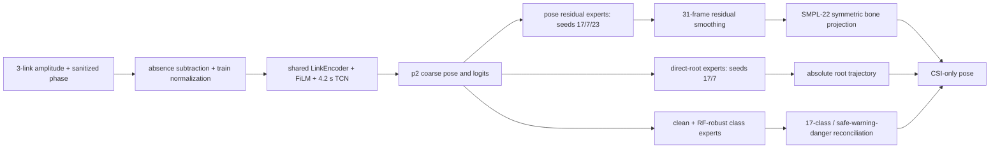

### 핵심 변경

1. **시간 오차 내성 pose 학습**: 전체 trial을 작은 범위에서 정렬해 보는 shift-robust
   loss를 사용하되 timestamp/GT 자체를 이동하거나 다시 저장하지 않는다.
2. **직접 root 복원**: velocity 누적만으로 생기던 장기 drift를 줄이기 위해 absolute root
   residual과 5/15/30-frame displacement를 함께 학습한다.
3. **cross-seed pose/root ensemble**: pose는 `0.45/0.25/0.30`, root는 `0.80/0.20`이다.
   세 번째 pose seed 단독 speed ratio는 `1.80`이라 탈락했지만 30% 혼합 시 `1.003`으로
   정상화되면서 낙상 오차를 줄였다.
4. **표현에 맞는 RF 증강**: cache가 I/Q가 아니라 `amp_phase`임을 확인해 잘못된 complex
   rotation을 폐기했다. amplitude gain과 sanitized-phase curvature만 증강한다.
5. **계층 분류**: clean expert와 RF-robust expert를 `0.5/0.5`로 섞고 17-class 확률을
   3-risk 확률과 `0.60` 비율로 조정한다. danger bias는 validation에서 고정한 `+0.35`다.
6. **해부학적 후처리**: 31-frame residual smoothing 후 좌우 대칭 bone projection을
   `0.25`만 적용해 관절 길이를 안정화한다.

모든 checkpoint, 혼합 비율, smoothing, bone projection, logit bias는 validation에서만
결정했다. 최종 test는 설정을 잠근 뒤 **한 번만** 열었고 이후 어떤 값도 바꾸지 않았다.

### 데이터와 평가 protocol

`single_split_lmh_e01`은 `ajh/mhw E01-E03 + lmh E01`만 사용한다. 문제로 확인된
`lmh E02/E03`은 train/validation/test 모두에서 제외하고, `yja`는 이 seen 실험에 쓰지 않는다.

| Split | Trials | Pose GT | Absence | 역할 |
|---|---:|---:|---:|---|
| train | 1,266 | 1,210 | 56 | 가중치 학습 |
| validation | 329 | 315 | 14 | checkpoint와 calibration 선택 |
| test | 329 | 315 | 14 | 잠금 후 1회 최종 보고 |

분할·경로 교집합, 제외 환경, calibration lock, split fingerprint 20개 검사는 모두 통과했다.
다만 pose trial 262개는 모두 `lmh/E01`의 `uniform_30fps`이고 나머지는 recorded timestamp다.
validation에서 이 군의 root는 timestamp 군보다 `+7.43 cm`였지만 subject/environment도 동시에
달라 원인을 시간 가정으로만 귀속할 수 없다. lmh pose timestamp 재수집이 다음 데이터 우선순위다.
262개는 pose 16개 시나리오 전반에 `train/val/test=172/45/45`로 퍼져 있고 danger도
`30/10/10`이므로 일부 낙상만 보정하지 않는다. 전체 timestamp를 복구한 뒤 dataset/split 버전을
올리고, 현재 V12 test와 직접 섞지 않은 새 sealed 평가를 수행해야 한다.
원시는 [`v12_protocol_integrity.json`](docs/results/v12_protocol_integrity.json)과
[`v12_alignment_strata.json`](docs/results/v12_alignment_strata.json)에 있다.

### 최종 성능

| Metric | Validation | Test |
|---|---:|---:|
| MPJPE | **13.30 cm** | **15.07 cm** |
| PA-MPJPE | **6.79 cm** | **7.12 cm** |
| Dynamic MPJPE | 16.53 cm | 18.02 cm |
| Root error | 31.28 cm | 33.79 cm |
| Danger MPJPE | 44.45 cm | 50.71 cm |
| Danger distal | 45.72 cm | 51.84 cm |
| Danger endpoint | 55.52 cm | 64.28 cm |
| Pose-speed ratio | 1.003 | 1.136 |
| 17-class accuracy / macro F1 | 96.05 / 95.19% | 94.22 / 92.54% |
| Risk accuracy / macro F1 | 97.87 / 97.63% | 97.26 / 96.55% |
| Danger recall / precision | 67/70, 95.71 / 97.10% | 64/70, 91.43 / 95.52% |
| Safe -> danger | 2/175, 1.14% | 2/175, 1.14% |


고정 baseline 대비 validation에서 MPJPE `13.63 -> 13.30 cm`, root `33.86 -> 31.28 cm`,
danger `46.06 -> 44.45 cm`, danger endpoint `56.99 -> 55.52 cm`로 개선됐다. 최종 test는
팀원이 공유한 p2 결과보다 MPJPE `15.76 -> 15.07 cm`, PA-MPJPE `8.67 -> 7.12 cm`,
root `35.45 -> 33.79 cm`, class accuracy `91.8 -> 94.2%`로 높다. 반면 팀원의 danger recall
`94.3%`보다 현재 `91.4%`가 낮아, 다음 seen 단계의 가장 중요한 미해결 항목이다.

historical V10 test와 비교하면 V12는 MPJPE `16.31 -> 15.07 cm`, dynamic `19.38 ->
18.02 cm`, class accuracy `93.31 -> 94.22%`, safe-to-danger `4 -> 2`로 좋아졌다. 그러나
root `32.29 -> 33.79 cm`, danger `47.99 -> 50.71 cm`, danger recall `95.71 -> 91.43%`는
나빠졌다. V10은 개발 중 test를 반복 확인한 이력이 있으므로 공정한 선택 기준으로 재사용하지
않고, 이 수치는 투명성을 위한 historical 비교로만 남긴다.

### 입력 강건성

validation의 ±2-frame jitter에서는 MPJPE 변화가 `+0.01 cm`뿐이다. subcarrier band 제거와
amp/phase 변화에서도 MPJPE는 각각 `15.22/14.76 cm`로 유지된다. 반면 link 하나가 완전히
사라지면 MPJPE `20.89 cm`, danger `62.11 cm`, danger recall `81.43%`로 내려간다.
RF-robust 분류 ensemble이 이때 safe-to-danger를 `15 -> 13`으로 줄였지만, **link 장애가
현재 가장 큰 입력 강건성 병목**이다.

### V12RG shift-root + missing-link guard (validation candidate)

V12 최종 test를 연 뒤에는 설정을 바꾸지 않는 원칙을 지키기 위해, 후속 모델은 test를
다시 열지 않고 validation에서만 개발했다. 최대 5-frame danger-root shift loss로 warm-start
root expert를 보강한 뒤 기존 seed7과 `0.80/0.20`으로 섞었다. 그 위에서
`80%` link-dropout으로 학습한 pose/root expert는 한 link의 frame coverage가 `50%` 이하일
때 호출한다. class/risk expert는 학습 분포와 맞는 **전 구간 link 소실**에서만 호출한다.
pose blend `0.50`, root blend `1.00`과 link별 class blend
`[1.00,1.00,0.75]`, risk blend `[0.00,1.00,0.50]`, danger bias
`[-0.25,-0.50,-0.25]`는 deterministic drop-link validation에서 선택했다. 각 link마다
danger recall 비열화 금지, risk accuracy `-0.5%p` 이내, 오경보 `+2` 이내 hard gate를 적용했다.

| Metric | V12 clean | V12RG clean | V12 link loss | V12RG link loss |
|---|---:|---:|---:|---:|
| MPJPE | 13.30 cm | 13.32 cm | 20.89 cm | **20.45 cm** |
| Root error | 31.28 cm | **31.03 cm** | 46.35 cm | **43.09 cm** |
| Danger absolute MPJPE | 44.45 cm | **44.35 cm** | 62.11 cm | **57.61 cm** |
| Danger endpoint | 55.52 cm | **55.25 cm** | 80.93 cm | **75.06 cm** |
| 17-class accuracy | 96.05% | 96.05% | 63.83% | **64.74%** |
| Risk accuracy | 97.87% | **98.18%** | 82.37% | **82.67%** |
| Danger recall | 67/70 | 67/70 | 57/70 | **60/70** |
| Safe -> danger | 2 | **1** | 13 | 15 |

| Removed link | Root V12 -> V12RG | Danger V12 -> V12RG | Recall V12 -> V12RG | FP V12 -> V12RG |
|---|---:|---:|---:|---:|
| link 0 | 45.90 -> **42.49 cm** | 57.32 -> **53.31 cm** | 61 -> 61/70 | 17 -> 17 |
| link 1 | 44.50 -> **42.38 cm** | 56.65 -> **53.51 cm** | 55 -> **61/70** | 19 -> 21 |
| link 2 | 49.77 -> **44.00 cm** | 68.93 -> **60.82 cm** | 50 -> **55/70** | 13 -> 15 |

부분 단절 위치를 선택에 쓰지 않고 초반/중간/후반/trial별 이동으로 바꿔 외삽 검증했다.

| 50% link burst | Root V12 -> V12RG | Danger V12 -> V12RG | Recall | FP V12 -> V12RG |
|---|---:|---:|---:|---:|
| early | 37.83 -> **36.85 cm** | 50.72 -> **48.64 cm** | 67 -> 67/70 | 3 -> 4 |
| middle | 38.82 -> **37.41 cm** | 53.66 -> **51.82 cm** | 65 -> 65/70 | 6 -> 6 |
| late | 39.98 -> **38.54 cm** | 56.44 -> **54.54 cm** | 64 -> 64/70 | 4 -> 5 |
| shifted | 38.98 -> **37.30 cm** | 54.80 -> **52.41 cm** | 64 -> 64/70 | 6 -> 6 |

분류 fallback까지 부분 단절에 켜는 실험은 early burst에서 recall `-1`, FP `+5`라 기각했다.
이중 coverage gate는 네 위치 모두 recall을 보존하고 FP 증가는 최대 1건으로 제한했다.
clean MPJPE가 `+0.013 cm`, 완전 link-loss 오경보가 `+2`라는 비용이 있으나 root와 낙상 absolute
trajectory 개선은 크다. 따라서 V12RG는 **다음 sealed 평가 전 validation candidate**이며, 위 V12
test 수치와 섞어 최종 성능으로 주장하지 않는다. 전체 결과는
[`v12_link_failure_guard_robustness.json`](docs/results/v12_link_failure_guard_robustness.json)에 있다.

V12RG validation의 danger 14 trial/class 분해에서는 `D02 fall_while_walking`의 MPJPE/root가
`48.71/45.84 cm`로 가장 크고, `D03 bed_exit_fall`의 평균 정렬 이동이 `12.86 frame`,
`D04 bed_fall`의 distal 오차가 `50.22 cm`, `D05 chair_exit_fall`의 endpoint가 `58.25 cm`로
각각 가장 약했다. 다음 단계는 14개 표본에 맞춘 class 전용 head가 아니라, 학습기에 이미 있는
root-displacement, shift/multiscale temporal, distal/end-state loss의 가중치와 lag를 하나씩 분리
ablation하고 class별 지표로 회귀 여부를 확인하는 것이다.


```powershell
python -m notifi_pose.tools.audit_v12_link_failure_guard `
  --p2-checkpoint work_v2/runs/p2_sub_single_clean_finetune/best_model.pt `
  --root-calibration docs/results/v12_shift_robust_root_calibration.json `
  --classification-calibration work_v2/runs/p2_v12w_robust_classification_ensemble/validation.json `
  --pose-calibration docs/results/v12_link_failure_pose_calibration.json `
  --failure-root-calibration docs/results/v12_link_failure_root_calibration.json `
  --failure-class-calibration docs/results/v12_link_specific_classification_calibration.json `
  --minimum-link-coverage 0.5 `
  --classification-minimum-link-coverage 0.0 `
  --output docs/results/v12_link_failure_guard_robustness.json
```

### 추론 비용

RTX GPU에서 `[1,304,3,114,2]` 한 trial의 forward latency는 평균 `101.0 ms`,
p95 `113.7 ms`다(10회 warmup 뒤 100회 측정). 7개 expert의 frozen p2 state가 bitwise
동일함을 확인한 뒤 backbone, CSI motion feature, normalized subcarrier feature를 공유하고,
분류 expert는 pose/root head를 건너뛰는 logit-only 경로를 사용한다. validation JSON의 모든
항목은 최적화 전후 `delta=0`이고, latency는 `147.0 -> 101.0 ms`로 `31.3%` 감소했다. 중복 제거 후
inference graph는 `2,647,249` parameter, 저장 state는 약 `11.0 MB`다. 남은 residual head도
여전히 여러 개이므로 더 작은 배포 모델이 필요하면 teacher-student distillation을 적용한다. 측정 원본은
[`v12_runtime_benchmark.json`](docs/results/v12_runtime_benchmark.json)에 있다. validation 329개
전체에서 pose/root/class/risk tensor의 최대 절대차가 모두 정확히 `0`인 검증은
[`v12_shared_equivalence.json`](docs/results/v12_shared_equivalence.json)에 있다.

### 재현

최종 evaluator는 validation lock의 protocol과 `test_used_for_selection=false`를 확인한다.

```powershell
python -m notifi_pose.tools.evaluate_v12_final `
  --p2-checkpoint work_v2/runs/p2_sub_single_clean_finetune/best_model.pt `
  --root-calibration work_v2/runs/p2_v12aa_pose_seed23_w30/validation.json `
  --classification-calibration work_v2/runs/p2_v12w_robust_classification_ensemble/validation.json `
  --exp single_split_lmh_e01 --open-test `
  --output work_v2/runs/p2_v12_final_locked/final_evaluation.json
```

원시 최종 결과는 [`v12_final_evaluation.json`](docs/results/v12_final_evaluation.json),
강건성 결과는 [`v12_input_robustness.json`](docs/results/v12_input_robustness.json), 압축 요약은
[`v12_final_summary.json`](docs/results/v12_final_summary.json)에 있다. split, cache, checkpoint,
calibration, 핵심 source 40개의 SHA-256은
[`v12_release_manifest.json`](docs/results/v12_release_manifest.json)에 고정했다.

```powershell
# checkpoint/cache까지 있는 연구 작업본의 완전 검증
python -m notifi_pose.tools.verify_v12_release_manifest

# Git 공개본: 외부 보관 checkpoint/cache의 누락만 허용
python -m notifi_pose.tools.verify_v12_release_manifest --allow-missing-model-artifacts
```

## 이전 모델: V10 P2-V9 dual hybrid

V10은 팀원 p2의 낮은 pose 오차와 안정적인 분류, V9의 낙상 trajectory 보정, V9C의
root trajectory를 validation gate로 결합한다. 팀원 checkpoint를 그대로 복사하지 않고
동일한 `single_split_lmh_e01`에서 p2를 재현·fine-tune한 뒤 결합했다.

```text
amplitude + sanitized phase -> absence baseline subtraction
  -> shared LinkEncoder + FiLM + concat + 4.2s TCN
  -> p2 coarse pose + 17-class/risk logits
  -> V9 bone-rotation trajectory residual (strength 0.35)

same CSI -> previous V9C root expert
  -> p2 root와 validation blend (strength 0.50)

classification: p2 class logits 유지
risk: p2 risk logits 유지 + validation danger bias 2.95
```

모든 결합 강도에는 `0` 후보가 있다. pose, root, class, risk를 validation에서 독립적으로
선택하며 test는 강도나 bias 선택에 사용하지 않는다. root residual은 validation root error가
최소 `0.5cm` 개선될 때만 활성화한다.

### V10 seen test 결과

| Metric | 로컬 p2 기준 | 이전 V9C | 현재 V10 dual |
|---|---:|---:|---:|
| MPJPE | 16.57cm | 20.41cm | **16.31cm** |
| Dynamic MPJPE | 19.70cm | 20.19cm | **19.38cm** |
| Root error | 36.25cm | 33.54cm | **32.29cm** |
| Danger MPJPE | 53.63cm | 51.14cm | **47.99cm** |
| Danger distal | 55.68cm | 55.78cm | **51.19cm** |
| Danger endpoint | 66.01cm | 71.39cm | **61.17cm** |
| 17-class accuracy | **93.31%** | 87.84% | **93.31%** |
| 17-class macro F1 | **91.44%** | 84.89% | **91.44%** |
| Risk accuracy | 96.66% | 95.14% | **96.96%** |
| Risk macro F1 | 95.81% | 94.43% | **96.44%** |
| Danger recall | 63/70, 90.00% | 66/70, 94.29% | **67/70, 95.71%** |
| Safe -> danger | 2/175, 1.14% | 7/175, 4.00% | 4/175, 2.29% |

팀원이 보고한 원 p2 수치 `15.76cm`보다는 현재 V10 MPJPE가 `0.55cm` 높다. 반면 현재
로컬 코드와 GT로 다시 학습한 p2를 동일 evaluator에서 비교하면 `16.57 -> 16.31cm`로
개선됐다. 특히 root와 danger absolute trajectory는 두 이전 모델을 모두 앞섰다.

현재 한계는 두 encoder를 함께 실행해 추론 비용이 증가한다는 점이다. 다음 단계는 이 dual
모델을 teacher로 고정하고 p2 temporal feature 하나에 V9C root를 distillation해 단일 encoder로
줄이는 것이다.

## 이전 모델: V9C clean-split multi-task

팀원 모델을 가져오지 않고 기존 V9 encoder/trajectory decoder를 그대로 확장했다. 동일한
V9 temporal feature에 다음 세 head를 직접 연결한다.

1. `pose head`: SMPL-22의 frame별 3D pose와 root trajectory 복원
2. `class head`: safe 9개, warning 3개, danger 5개를 합친 17개 세부 동작 분류
3. `risk head`: safe, warning, danger 3단계 위험 분류

분할은 `single_split_lmh_e01`이다. `ajh/mhw`는 E01-E03을 모두 사용하고, 오류가 보고된
`lmh` E02/E03은 완전히 제외해 E01만 사용한다. train/validation/test는 trial 단위로
분리하며, test는 모델 선택이나 logit calibration에 사용하지 않는다.

| Split | 전체 trials | Pose GT | Absence | Subjects / environments |
|---|---:|---:|---:|---|
| train | 1,266 | 1,210 | 56 | ajh/mhw E01-E03, lmh E01 |
| validation | 329 | 315 | 14 | ajh/mhw E01-E03, lmh E01 |
| test | 329 | 315 | 14 | ajh/mhw E01-E03, lmh E01 |

학습에는 inverse-frequency class/risk weight와 danger 추가 가중치를 사용했다. checkpoint는
validation danger-recall hard gate를 통과한 후보 중에서 고르고, 마지막 danger logit bias도
validation에서만 선택한다. 선택값은 temporal-prior strength `0.75`, danger-logit bias
`+1.75`이다.

### 현재 test 결과

| 평가 항목 | V9A raw | 현재 V9C | 해석 |
|---|---:|---:|---|
| MPJPE | 20.38cm | 20.41cm | prior로 0.03cm 악화 |
| Dynamic MPJPE | 20.17cm | 20.19cm | 사실상 동일 |
| Root error | 33.54cm | 33.54cm | 동일 |
| Danger MPJPE | 51.16cm | 51.14cm | 0.02cm 개선 |
| Danger distal MPJPE | 55.89cm | 55.78cm | 0.11cm 개선 |
| Danger endpoint MPJPE | 71.42cm | 71.39cm | 0.03cm 개선 |
| Pose-speed ratio | 1.196 | 1.150 | 과도한 움직임 감소 |
| 17-class accuracy | 87.84% | 87.84% | pose prior와 무관 |
| 17-class macro F1 | 84.89% | 84.89% | pose prior와 무관 |
| Risk accuracy | 94.53% | **95.14%** | validation bias 적용 후 개선 |
| Risk macro F1 | 93.33% | **94.43%** | validation bias 적용 후 개선 |
| Danger recall | 62/70, 88.57% | **66/70, 94.29%** | 낙상 4건 추가 검출 |
| Danger precision | 87.32% | 85.71% | recall 증가의 비용 |
| Safe -> danger | 5/175, 2.86% | 7/175, 4.00% | 오경보 2건 증가 |

현재 결론은 명확하다. 세 분류 head와 danger-recall calibration은 효과가 있지만 temporal
denoising prior의 pose 개선은 매우 작고 전체 MPJPE는 오히려 소폭 나빠졌다. 따라서 현재
V9C는 위험 분류 기준 모델로 채택하되, 낙상 자세 복원 자체가 해결됐다고 보지 않는다.
특히 17-class에서 `D03 bed_exit_fall` recall이 `5/14=35.71%`로 가장 약하므로 다음 실험은
낙상 세부 동작 간 구별과 CSI-conditioned trajectory 다양성에 집중한다.

## 이전 모델: 9안 Stage C - Fall Trajectory Reconstruction

현재는 사용자가 지정한
[`feature/goal1/work_v2/splits`](https://github.com/NotiFi2026/NotiFi-CSI-to-Pose/tree/feature/goal1/work_v2/splits)의
`single_split`을 사용한다. `ajh/lmh/mhw`와 `E01/E02/E03`이 train, validation,
test에 모두 포함되고 trial만 분리된 **seen-subject + seen-environment + unseen-trial**
protocol이다.

| Split | Pose trials | Subjects | Environments |
|---|---:|---|---|
| train | 1,556 | ajh, lmh, mhw | E01, E02, E03 |
| validation | 405 | ajh, lmh, mhw | E01, E02, E03 |
| test | 405 | ajh, lmh, mhw | E01, E02, E03 |

split 간 trial ID 중복은 0이며 yja와 LOSO 데이터는 현재 seen 학습과 모델 선택에
사용하지 않는다.

```mermaid
flowchart LR
    A["3-link CSI"] --> B["GraphFormer baseline"]
    A --> C["Raw CSI branch"]
    A --> D["Temporal-difference branch"]
    C --> E["Motion-first encoder"]
    D --> E
    B --> F["Action-conditioned coarse pose"]
    E --> G["Phase / impact conditioning"]
    F --> H["Keyframe 6D bone rotations"]
    G --> H
    H --> I["Bounded high-frequency residual"]
    I --> J["V2 anchor + root velocity integration"]
    G --> K["Contact / injury heads"]
    J --> L["Validation-only branch calibration"]
    L --> M["Frozen calibrated V2"]
    M --> N["Contact-guided root temporal encoder"]
    K --> N
    N --> O["Support-aware anchor / velocity refinement"]
    O --> P["Validation-selected root strength"]
    P --> Q["SMPL-22 pose + refined root"]
    A --> R["Raw CSI multi-scale motion"]
    Q --> S["Full-sequence trajectory features"]
    R --> S
    S --> T["Dilated temporal blocks + Transformer"]
    T --> U["Bone-preserving rotation + root residual"]
    U --> V["Validation scale: pose 0.15 / root 0.5"]
    V --> W["GT-only temporal denoising prior"]
    W --> X["Validation prior strength 1.0"]
    X --> Y["CSI-only SMPL-22 trajectory"]
```

1. timestamp 완전성, 유효 link 수, CSI-GT motion correlation으로 trial 품질 가중치를 만든다.
2. root는 첫 anchor와 keyframe velocity residual을 적분해 궤적 연속성을 유지한다.
3. speed, moving, fall phase, impact, predicted action/risk로 decoder를 condition한다.
4. 4-frame keyframe의 6D bone rotation을 예측하고 SMPL tree FK로 bone length를 보존한다.
5. 저주파 rotation branch와 최대 2cm의 고주파 Cartesian residual을 분리한다.
6. 7안까지는 발 접촉, 부위별 충돌, 최초 접촉 관절, impact speed, 바닥 높이를 보조 학습했다.
7. head-only 학습 후 기존 backbone의 마지막 temporal block만 낮은 learning rate로 미세조정한다.
8. 7안 Stage A는 V2 pose를 고정하고 예측 foot contact, phase, impact, 상대 foot speed로
   root anchor와 velocity만 보정한다.
9. 8안은 raw CSI event feature를 추가하되 validation gate를 통과한 injury-contact
   residual만 `0.75`로 사용한다.
10. 9안은 최초 충돌 예측을 새 loss에서 제거하고 frame pose/root, 5-frame displacement,
    root drop, torso/shoulder orientation, endpoint로 전체 낙상 궤적을 학습한다.
11. train GT만 noise와 frame/joint masking으로 오염시켜 학습한 temporal denoising prior가
    과도한 frame-to-frame 움직임을 안정화한다.

### Seen test 결과

| Metric | 기존 GraphFormer | 7안 | 9A trajectory | 9B alignment | 현재 9C |
|---|---:|---:|---:|---:|---:|
| MPJPE | 24.17cm | 21.29cm | **20.60cm** | 21.29cm | 20.68cm |
| Dynamic MPJPE | 23.39cm | 20.90cm | **20.40cm** | 20.90cm | 20.41cm |
| Root error | 33.06cm | 31.81cm | **31.61cm** | 31.94cm | **31.61cm** |
| Danger MPJPE | - | - | 51.15cm | 51.95cm | **51.14cm** |
| Danger distal | - | - | 55.72cm | 56.93cm | **55.64cm** |
| Danger endpoint | - | - | 69.72cm | 71.23cm | **69.66cm** |
| Pose-speed ratio | 1.058 | 1.167 | 1.217 | 1.167 | **1.163** |

무보정 V2는 test MPJPE `18.11cm`까지 내려갔지만 pose-speed ratio가 `2.088`로
실제 움직임의 두 배를 만들어 공식 결과에서 제외했다. validation에서만 branch 강도를
`rotation=0.10`, `high-pose=0.00`, `root=0.50`으로 선택한 결과가 위 표다.
무보정 checkpoint에 shuffled CSI를 넣으면 MPJPE `34.69cm`, root error `58.33cm`로
악화되어 trial-specific CSI를 사용한다는 gate도 확인했다.

7안은 validation에서 epoch 8과 root strength `0.50`을 선택했다. test root error는
`32.33 -> 31.81cm`로 개선됐고 pose를 고정했기 때문에 MPJPE와 speed ratio는 유지됐다.
반면 impact MPJPE는 `54.72 -> 54.89cm`, foot-contact F1은 `0.708 -> 0.701`로 소폭
악화됐다. 따라서 7안은 root Stage A로 채택하되 impact/contact 개선으로 해석하지 않는다.

8안은 physical impact proxy와 `(frame, joint)` event head를 추가했다. 전체 event model은
test에서 일반화하지 못해 event/joint/speed strength를 모두 `0`으로 되돌렸다. validation이
contact strength `0.75`만 선택했고, test injury-contact F1은 `0.354 -> 0.423`으로
개선됐다. first-contact, impact speed, pose, root는 7안과 동일하다.

9A는 `어느 관절이 먼저 충돌했는가` 대신 전체 낙상 sequence를 복원한다. 최대 가속도
frame과 휴리스틱 impact score를 새 loss에서 제거했고 MPJPE를 `21.29 -> 20.60cm`로
낮췄다. 다만 speed ratio가 `1.217`로 gate 1.2를 넘어서 단독 최종 모델로 쓰지 않는다.

9B는 timestamp를 유지하면서 8개 연속 구간에 ±15-frame offset을 허용한 constrained
alignment loss를 시험했다. validation이 pose residual strength `0`을 선택했고 test도
악화되어 기각했다. GT나 timestamp를 이동한 결과물은 저장하지 않았다.

9C는 내부 train GT만 사용한 temporal denoising prior를 9A에 적용한다. test MPJPE는
`20.68cm`, dynamic MPJPE는 `20.41cm`, speed ratio는 `1.163`이다. danger MPJPE
`51.14cm`와 endpoint `69.66cm`는 여전히 크므로 낙상 복원이 해결됐다고 해석하지 않는다.
8안 contact 출력은 분석용으로 남아 있지만 9안의 새 stage는 impact/contact target을
학습하지 않는다. 동결된 7안 base에 남은 과거 휴리스틱 영향은 base 재학습 때 제거한다.

실패한 구조를 포함한 번호·날짜·시간·목적·방법·결과·결정은
[`docs/experiment_log.md`](docs/experiment_log.md)에 계속 누적한다. 원시 결과 JSON은
[`docs/results`](docs/results)에 있으며 checkpoint와 데이터셋은 저장소에 포함하지 않는다.
6안의 코드 대응, 손실, 보정 규칙은
[`docs/seen_reconstruction_v2.md`](docs/seen_reconstruction_v2.md), 7안 root stage는
[`docs/seen_reconstruction_v3.md`](docs/seen_reconstruction_v3.md), 8안 event stage는
[`docs/impact_event_v8.md`](docs/impact_event_v8.md), 현재 9안은
[`docs/fall_trajectory_v9.md`](docs/fall_trajectory_v9.md)에 정리했다.

## 모델안별 성능 이력

서로 다른 test protocol의 숫자는 직접 우열 비교하지 않는다. 1~4안은 `yja/E02 unseen`
동일 조건, seen 기준선~8안은 제공된 `single_split seen` 동일 조건이다. 5안은 새 모델이
아니라 CSI observability 진단이므로 성능선에서 분리했다.

| 안 | 핵심 변경 | 평가 protocol | MPJPE | Impact | Root | Speed ratio | 판정 |
|---:|---|---|---:|---:|---:|---:|---|
| 1안 | Robust GraphFormer | yja/E02 unseen | 29.57cm | 84.14cm | 59.23cm | 0.721 | 기준 |
| 2안 | Impact-aware calibration | yja/E02 unseen | 29.45cm | 83.84cm | 59.23cm | 0.718 | 소폭 개선 |
| 3안 | Coherent displacement | yja/E02 unseen | 29.48cm | 82.82cm | 59.23cm | 0.714 | impact 개선 |
| 4안 | Latent rectified flow | yja/E02 unseen | 29.86cm | **81.03cm** | 59.52cm | 0.697 | impact만 개선, 전체 미채택 |
| 5안 | CSI observability 진단 | yja/E02 unseen | 29.57cm 정상 / 29.59cm shuffled | - | - | - | encoder 병목 확인 |
| 6안 | Seen Reconstruction V2 | single_split seen | **21.29cm** | **54.72cm** | 32.33cm | 1.167 | 채택 |
| 7안 A | Contact-guided root | single_split seen | **21.29cm** | 54.89cm | **31.81cm** | 1.167 | 현재 root 모델 |
| 8안 A | Contact-calibrated event | single_split seen | 21.29cm | 54.89cm | 31.81cm | 1.167 | contact F1 0.423 |
| 9안 A | Full-sequence trajectory | single_split seen | **20.60cm** | - | **31.61cm** | 1.217 | 위치 개선, 속도 gate 초과 |
| 9안 B | Bounded alignment | single_split seen | 21.29cm | - | 31.94cm | 1.167 | validation이 pose branch 기각 |
| 9안 C | Temporal denoising prior | single_split seen | 20.68cm | - | **31.61cm** | **1.163** | 현재 모델, danger 51.14cm |

### 1~4안: yja/E02 unseen 흐름

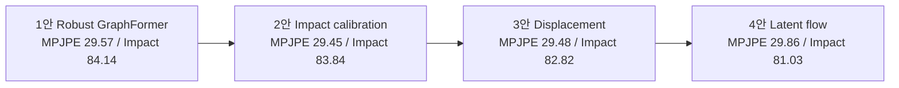

### Seen 모델 흐름

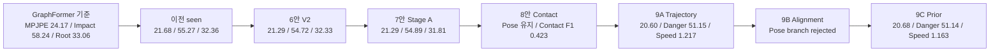

단위는 cm다. 각 안의 원시 출처와 protocol은
[`docs/results/model_plan_history.json`](docs/results/model_plan_history.json)에 고정한다.

### 실행 순서

```powershell
python -m notifi_pose.tools.audit_motion_alignment
python -m notifi_pose.tools.train_motion_first --exp single_split `
  --epochs 12 --patience 4 --batch-size 12 `
  --run-dir work_v2/runs/motion_first_seen
python -m notifi_pose.tools.train_seen_action_residual `
  --epochs 20 --patience 6 --batch-size 12
python -m notifi_pose.tools.calibrate_seen_action_residual
python -m notifi_pose.tools.train_seen_root_residual `
  --epochs 20 --patience 6 --batch-size 12
python -m notifi_pose.tools.train_seen_v2 `
  --head-epochs 12 --finetune-epochs 6 --patience 4 --batch-size 8 `
  --run-dir work_v2/runs/seen_reconstruction_v2
python -m notifi_pose.tools.diagnose_seen_v2_components
python -m notifi_pose.tools.calibrate_seen_v2
python -m notifi_pose.tools.train_seen_v3_root `
  --epochs 16 --patience 5 --batch-size 8 `
  --run-dir work_v2/runs/seen_v3_contact_root
python -m notifi_pose.tools.audit_impact_targets --split val
python -m notifi_pose.tools.audit_impact_alignment
python -m notifi_pose.tools.train_impact_event `
  --epochs 15 --patience 5 --batch-size 8 `
  --run-dir work_v2/runs/impact_event_v8c_raw
python -m notifi_pose.tools.calibrate_impact_event
python -m notifi_pose.tools.train_seen_v4_trajectory `
  --epochs 12 --batch-size 8 --alignment-weight 0 `
  --run-dir work_v2/runs/seen_v4_v9a_no_impact
python -m notifi_pose.tools.train_seen_v4_trajectory `
  --epochs 12 --batch-size 8 --alignment-weight 0.15 `
  --run-dir work_v2/runs/seen_v4_v9b_bounded_alignment
python -m notifi_pose.tools.train_motion_prior_v9 `
  --epochs 10 --batch-size 12 `
  --run-dir work_v2/priors/temporal_denoiser_v9
python -m notifi_pose.tools.calibrate_motion_prior_v9 `
  --trajectory-run work_v2/runs/seen_v4_v9a_no_impact `
  --prior-run work_v2/priors/temporal_denoiser_v9 `
  --run-dir work_v2/runs/seen_v4_v9c_motion_prior
```

현재 seen gate는 완전히 통과하지 않았다. 다음 목표는 MPJPE 20cm 이하,
danger MPJPE 45cm 이하, root 25cm 이하, pose-speed ratio 0.8~1.2다. 이 기준에 가까워지면
동일한 backbone을 고정하고 calibration/domain adaptation을 붙여 yja E02와 LOSO를
unseen protocol로 다시 평가한다.

## 기존 모델과의 차이

7안은 calibrated 6안을 동결한 뒤 contact-guided root branch를 추가했다. 현재 8안은
7안 전체를 동결하고 event/contact head만 별도로 학습한 뒤 branch별로 보정한다.

| 구분 | 6안 V2 | 7안 Stage A | 현재 8안 Stage A |
|---|---|---|---|
| CSI motion | motion-first + gated fusion | root/contact dynamics | raw amplitude/phase delta 1/3/7/15-frame 추가 |
| Pose decoder | phase-aware 6D rotation + FK | 6안 pose 고정 | 7안 pose/root 완전 고정 |
| Root | anchor + root-step 적분 | contact support-aware 적분 | 7안 root 그대로 유지 |
| Event target | 가속도 peak/높이 heuristic | 동일 보조 head | 감속+가속도+하강+표면근접 physical proxy |
| 학습 | head + 제한적 fine-tuning | 새 root branch만 학습 | event/contact head만 학습 |
| 모델 선택 | branch calibration + speed gate | root/impact + identity 후보 | event/joint/contact/speed branch별 validation gate |

7안에서 8안으로 pose/root는 유지되고 injury-contact F1만 0.354→0.423으로 개선됐다.
event timing과 최초 충돌 부위 branch는 검증 실패로 비활성화했다.

## 현재 모델 문제점 및 개선 방향

| 우선순위 | 문제 | 현재 근거 | 다음 개선 |
|---:|---|---|---|
| 1 | Root 절대 위치가 여전히 가장 큰 병목 | root 31.81cm, Stage A에서 0.52cm 개선 | 장기 anchor drift와 horizontal/vertical trajectory를 분리 학습 |
| 2 | 회전 branch가 움직임을 과장 | 무보정 speed ratio 2.088, rotation-only 1.971 | angular velocity/geodesic loss, phase별 rotation 크기 제한, keyframe 보간 개선 |
| 3 | 낙상 impact 복원이 부족 | impact 54.89cm, event timing test 약 25.6프레임 오차 | 실제 영상 impact frame/body-region 표본 annotation과 proxy 검증 |
| 4 | 고주파 branch가 실질적으로 미사용 | validation이 high-pose scale 0을 선택 | 2cm residual의 대역 분리와 temporal regularization 재설계 |
| 5 | 최초 충돌 부위 정확도가 낮음 | injury F1 0.423, 최초 접촉 정확도 0.378 | 검증된 event label 확보 후 coarse-to-fine region/joint 재학습 |
| 6 | 아직 seen 성능만 검증 | 같은 사람·환경의 unseen trial 평가 | seen gate 통과 후 backbone을 고정하고 LOSO/domain calibration 진행 |
| 7 | 저품질 trial이 남아 있음 | 품질 가중치 최솟값 0.443 | high-quality subset ablation, timestamp/link audit 강화, 자동 시간 이동은 금지 |

다음 실험은 한 번에 여러 요소를 다시 섞지 않고 아래 순서로 진행한다.

1. 완료: coarse pose를 고정하고 contact-guided root 전용 표현을 학습했다.
2. 완료: event/contact head를 적용하고 contact branch만 validation에서 채택했다.
3. danger 영상에서 실제 impact frame/body region을 표본 annotation해 proxy를 검증한다.
4. rotation branch에 angular velocity와 geodesic amplitude 제약을 추가한다.
5. MPJPE 20cm, impact 50cm, root 25cm, speed ratio 0.8~1.2를 seen gate로 재검증한다.
6. gate에 가까워진 모델만 LOSO와 yja E02 unseen adaptation으로 넘긴다.

## 연구 목표

단순 행동 분류가 아니라 프레임별 자세를 복원한다. 특히 낙상 시점에 머리, 손목, 무릎, 발목, 발이 어느 방향으로 움직이고 어느 부위가 바닥과 충돌했는지를 확인할 수 있어야 한다.

입력과 출력은 다음과 같다.

```text
입력  CSI: [B, T=304, Link=3, Subcarrier=114, I/Q-derived channel=2]
출력  pose_rel: [B, T, 22, 3]  # pelvis-relative SMPL-22
      root:     [B, T, 3]      # world-space pelvis trajectory
보조  action: 17 classes
      risk:   safe / warning / danger
```

## 기준 GraphFormer 코드 설명

`feature/goal1`의 최신 GVHMR 경로는 다음 파이프라인을 사용한다.

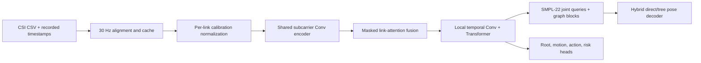

핵심 기술은 다음과 같다.

1. **Timestamp alignment**: CSI packet 시각과 `video_timestamps.csv`를 이용해 GT frame을 실제 촬영 시각에 정렬한다. `k/30` 가정은 기록이 일부 없을 때만 사용한다.
2. **CSI representation**: guard/DC subcarrier를 제거한 114개 subcarrier를 사용한다. subject, environment, label 같은 누수 가능한 metadata는 모델 입력에서 제외한다.
3. **Link-aware encoding**: TX1/TX2/TX3를 공유 encoder로 처리하고, 누락 link는 `link_mask`로 attention에서 제외한다.
4. **Temporal modeling**: dilated local convolution으로 짧은 움직임을 포착하고 Transformer로 전체 trial 문맥을 결합한다.
5. **Hybrid graph decoding**: 직접 관절 좌표와 SMPL kinematic tree 복원을 혼합해 손목·발까지 누적되는 parent error를 줄인다.
6. **Domain robustness**: site baseline subtraction, RF augmentation, balanced cross-domain batches, GroupDRO, domain-adversarial head, supervised contrastive loss를 사용한다.
7. **Auxiliary supervision**: action/risk뿐 아니라 fall phase, foot contact, velocity, acceleration, floor penetration을 함께 학습한다.

## 이전 연구안: 최신순

6안의 배경이 된 이전 시도다. 최신 안부터 내려가며, 미채택 결과도 원인 분석을 위해 유지한다.

### 5안: CSI Motion Observability 진단

**상태: 진단 완료, 다음 모델의 필수 통과 기준**

decoder를 더 바꾸기 전에 현재 모델이 CSI의 trial별 동작을 실제로 사용하는지 검사했다.

```powershell
python -m notifi_pose.tools.diagnose_observability `
  --probe-epochs 15 --overfit-steps 200 --overfit-trials 1 10
```

핵심 결과:

- 정상 CSI 대신 다른 yja E02 trial의 CSI를 넣어도 MPJPE는 `29.57 -> 29.59cm`로 `0.02cm`만 악화됐다.
- train mean-pose baseline도 `30.59cm`라 현재 모델과 차이가 `1.02cm`뿐이다.
- frozen encoder의 speed R2는 source validation `0.004`, yja E02 `-0.109`였다.
- impact F1은 source `0.148`, yja E02 `0.103`이고 timing MAE는 각각 `43.0`, `48.4` frames였다.
- 가장 동적인 1개 trial을 200 step 외워도 `9.35cm`, pose-speed ratio `0.534`에 머물렀다.

따라서 주 병목은 더 큰 pose decoder가 아니라 **CSI encoder가 speed, phase, impact를 보존하지 못하고 pose objective가 평균 자세로 붕괴하는 것**이다. domain shift도 존재하지만 source 내부에서 이미 motion observability가 낮으므로 domain adaptation만 강화해서는 해결되지 않는다.

다음 개발 순서는 다음과 같이 고정한다.

1. trial별 CSI motion energy와 GT speed의 lag/correlation으로 alignment 불량 데이터를 격리한다.
2. speed, moving, phase, impact를 먼저 예측하는 motion-first CSI encoder를 pretrain한다.
3. 정상 CSI 대비 shuffled CSI가 dynamic/impact 지표에서 명확히 나빠지는지 확인한다.
4. 1-trial overfit `MPJPE < 3cm`, pose-speed ratio `0.9-1.1`을 통과시킨다.
5. 그 뒤 velocity-space sequence decoder와 calibration을 붙이고 LOSO를 재개한다.

전체 수치와 합격 기준은 [`docs/observability_diagnostics.md`](docs/observability_diagnostics.md), 원시 결과는 [`docs/results/observability_diagnostics.json`](docs/results/observability_diagnostics.json)에 있다.

### 4안: CSI-conditioned Latent Rectified Flow

**상태: 생성형 구조 구현 및 yja 실험 완료, 실험적/미채택**

평균 자세 문제를 직접 다루기 위해 GT motion prior와 conditional rectified flow를 추가했다.

#### 4.1 GT-only kinematic motion prior

GVHMR pose를 parent-relative bone direction과 trial-level bone length code로 변환한다. decoder는 SMPL tree를 따라 pose를 복원한다. held-out subject의 GT는 prior 사전학습에 사용하지 않는다.

```text
GT pose
  -> bone direction + bounded length code
  -> latent z_gt [B,T,128]
  -> frozen kinematic decoder
  -> reconstructed SMPL-22 pose
```

yja protocol의 source validation에서 prior 자체의 재구성 MPJPE는 표시 정밀도 기준 `0.00cm`였다. 따라서 병목은 motion decoder가 아니라 CSI에서 올바른 latent trajectory를 찾는 단계다.

#### 4.2 Conditional rectified flow

CSI condition으로 만든 초기 latent `z0`에 noise를 추가하고 GT latent `z1`로 가는 vector field를 학습한다.

```text
t ~ Uniform(0, 1)
z_t = (1-t) z0 + t z1
target velocity = z1 - z0
L_flow = SmoothL1(v_theta(z_t, t, CSI), z1 - z0)
```

추론에서는 random sampling을 사용하지 않는다. CSI-derived `z0`에서 시작해 midpoint ODE solver를 고정 step으로 적분하므로 같은 CSI에 항상 같은 결과가 나온다.

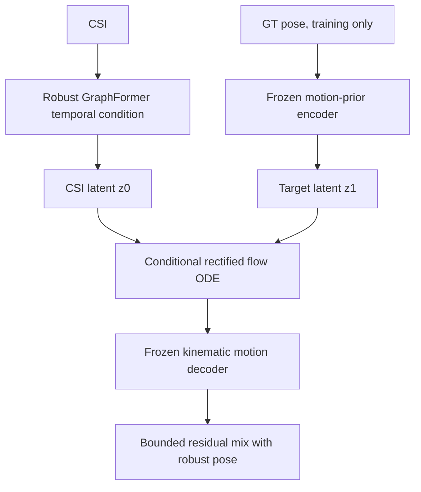

yja E02 결과:

- impact MPJPE: `84.14 -> 81.03cm` 개선
- 전체 MPJPE: `29.57 -> 29.86cm` 악화
- smoothed pose-speed ratio: `0.721 -> 0.697` 악화

충격 자세에는 이득이 있었지만 전체 복원과 동작 진폭이 나빠져 현재 모델로 채택하지 않았다. 데이터가 늘어나면 action-conditioned latent, multi-hypothesis sampling, velocity-space prior와 함께 재검토할 수 있다.

재현:

```powershell
python -m notifi_pose.tools.run_latent_flow_protocols `
  --only yja_e02 --prior-epochs 12 --epochs 15
```

### 3안: Coherent Displacement Refiner

**상태: 구현 및 실험 완료, 미채택**

인접 frame velocity 대신 5 frame, 약 167ms 동안의 평균 변위를 맞춘다. 고주파 jitter가 loss를 속이지 못하게 하고 smoothing 후에도 남는 동작을 만들려는 접근이다.

```text
L_displacement = SmoothL1(
  (pose[t+5] - pose[t]) * FPS/5,
  (GT[t+5]   - GT[t])   * FPS/5
)
```

yja E02에서 smoothed pose-speed ratio가 `0.721 -> 0.714`로 오히려 감소했다. 현재 residual decoder의 용량과 deterministic objective만으로는 motion-amplitude collapse를 해결하지 못한다고 판단해 채택하지 않았다.

재현:

```powershell
python -m notifi_pose.tools.run_coherent_protocols --only yja_e02
```

### 2안: Impact-aware Temporal Refiner

**상태: 이전 unseen/LOSO 비교 기준, 현재 seen 모델의 baseline**

기존 robust checkpoint 뒤에 0으로 초기화된 temporal residual refiner를 붙인다. 초기 출력은 기준 모델과 정확히 같으며, validation 종합 점수가 좋아질 때만 체크포인트를 교체한다.

추가 요소:

1. GT acceleration peak를 기준으로 danger trial의 impact window를 만든다.
2. 머리, 손목, 무릎, 발목, 발을 distal/injury-relevant joint로 가중한다.
3. velocity, acceleration, jerk, foot slide, floor penetration을 함께 제약한다.
4. validation에서 관절별 residual scale을 `0, 0.25, 0.5, 0.75, 1.0` 중 선택한다.
5. 일반 관절 오차가 기준 모델보다 `0.05cm` 넘게 나빠지는 scale은 금지한다.
6. test 결과는 checkpoint나 residual scale 선택에 사용하지 않는다.

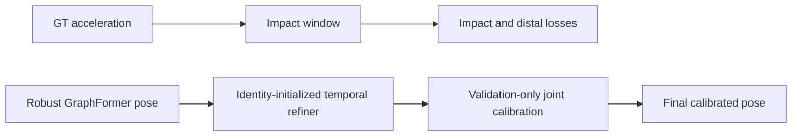

실행:

```powershell
python -m notifi_pose.tools.run_impact_protocols --only yja_e02
python -m notifi_pose.tools.run_impact_protocols --only loso
python -m notifi_pose.tools.summarize_impact_results
```

`run_impact_protocols`는 학습 후 `calibrated_model.pt`까지 자동 생성한다. 시각화 도구도 이 파일이 있으면 `best_model.pt`보다 먼저 사용한다.

### 1안: Robust GraphFormer

**상태: 기준 모델, 채택**

기존 GraphFormer에 환경 일반화 요소를 추가한 기준 모델이다.

```text
CSI encoder
  -> link attention
  -> temporal GraphFormer
  -> hybrid SMPL-22 decoder
  -> pose_rel + root

보조 학습:
  RF augmentation + GroupDRO + domain adversarial
  + cross-domain supervised contrastive
  + phase/contact/dynamics losses
```

장점:

- 구조가 단순하고 추론이 결정론적이다.
- 네 protocol에서 가장 안정적인 기본 성능을 보였다.
- 새 모델은 이 체크포인트를 epoch 0 안전 기준으로 사용한다.

한계:

- MPJPE 중심 회귀라 평균 자세 수렴을 피하기 어렵다.
- frame-to-frame velocity loss가 고주파 jitter에도 낮아질 수 있다.

실행:

```powershell
python -m notifi_pose.tools.run_robust_protocols --only yja_e02
python -m notifi_pose.tools.run_robust_protocols --only loso
python -m notifi_pose.tools.summarize_robust_runs
```

## 이전 Unseen/LOSO 실험 결과

모든 수치는 CSI-only pose trial, validation-selected checkpoint, 5-frame smoothing 기준이다.

| Protocol | Robust MPJPE | 2안 MPJPE | Robust dynamic | 2안 dynamic | Robust impact | 2안 impact |
|---|---:|---:|---:|---:|---:|---:|
| yja E02 | 29.57 | **29.45** | 30.94 | **30.79** | 84.14 | **83.84** |
| LOSO ajh | 28.10 | 28.10 | 25.98 | 25.98 | 67.14 | 67.14 |
| LOSO lmh | 32.88 | **32.81** | 31.60 | **31.50** | 60.41 | **60.14** |
| LOSO mhw | **27.16** | 27.19 | **26.23** | 26.23 | 72.18 | **72.00** |
| LOSO mean | 29.38 | **29.36** | 27.94 | **27.91** | 66.58 | **66.43** |

단위는 cm다. 자세한 관절·risk·label별 결과는 [`docs/results/impact_calibrated_results.md`](docs/results/impact_calibrated_results.md)와 JSON/CSV를 참고한다.

## 데이터 분리

### Protocol A

- train/validation: `ajh`, `lmh`, `mhw`의 사용 가능한 825개 전체 trial을 split 규약에 따라 사용
- sealed test: `yja/E02`
- yja E02 전체 275개 중 pose GT가 있는 263개를 pose 평가에 사용
- 손상된 `yja/E01`, `yja/E03` CSI는 제외

### Fixed LOSO

- `test_ajh`: lmh+mhw로 학습/검증, ajh test만 평가
- `test_lmh`: ajh+mhw로 학습/검증, lmh test만 평가
- `test_mhw`: ajh+lmh로 학습/검증, mhw test만 평가
- yja E02는 source LOSO에 섞지 않고 별도 sealed protocol로 유지

split 정의는 [`work_v2/splits/experiments.json`](work_v2/splits/experiments.json)에 있다.

## 데이터 계약

trial 하나는 다음 세 파일이 같은 폴더에 있어야 한다.

```text
data/pose_and_action/{subject}/{environment}/{risk}/{scenario}/{trial_id}/
  csi.csv
  gt_pose.npz
  original_video.mp4
```

timestamp는 학습 ZIP 외부에 둘 수 있지만 trial ID와 상대 경로가 일치해야 한다.

```text
timestamp/{subject}/{environment}/{risk}/{scenario}/{trial_id}/
  video_timestamps.csv
```

`gt_pose.npz`는 GVHMR SMPL-22 joint 순서, meter 단위, pelvis-relative pose와 world root를 제공해야 한다. 영상은 GT 재추출과 audit용이며 모델 입력에는 들어가지 않는다.

## 설치

Python 3.10과 CUDA 지원 PyTorch 환경을 권장한다.

```powershell
cd CSI-to-Pose
python -m pip install -r requirements.txt
```

데이터와 timestamp 경로를 환경변수로 지정한다.

```powershell
$env:NOTIFI_DATASET_ROOT = "D:\mhw\Dataset_Splits\NotiFi_CSI_GVHMR_v2_LOSO_60_15_25"
$env:NOTIFI_TIMESTAMP_ROOT = "D:\NotiFi-3D\Timestamp_Upload_Staging\timestamp"
$env:NOTIFI_WORK_ROOT = "$PWD\work_v2"
```

## 인덱스와 캐시 생성

```powershell
python -m notifi_pose.tools.build_index --no-verify-files
python -m notifi_pose.tools.link_quality --workers 8
python -m notifi_pose.tools.build_splits
python -m notifi_pose.tools.build_cache --workers 8 --rebuild
python -m notifi_pose.tools.build_site_baseline
python -m notifi_pose.tools.verify_alignment
```

## 단일 학습과 평가

```powershell
python -m notifi_pose.tools.train `
  --exp yja_holdout --arch robust_graphformer --decoder hybrid `
  --hidden 128 --temporal-layers 3 --heads 4 --graph-blocks 2 `
  --epochs 40 --patience 10 --batch-size 16 --baseline sub `
  --rf-augment --balanced-batches --tag robust_gf_yja_e02
```

```powershell
python -m notifi_pose.tools.evaluate_sealed `
  work_v2\runs\impact_gf_yja_e02\calibrated_model.pt `
  --dataset sealed --fold yja_E02 --smooth-window 5
```

```powershell
python -m notifi_pose.tools.visualize `
  --run impact_gf_yja_e02 --split test --n 10
```

## 테스트

```powershell
python -m unittest discover -s tests -v
python -m py_compile notifi_pose\*.py notifi_pose\tools\*.py
```

현재 94개 단위 테스트가 timestamp alignment, site baseline, GraphFormer shape, V12 expert
조합, amp-phase RF 증강, impact window, temporal refiner, latent flow objective, observability
diagnostic, loss backward를 검증한다.

## 폴더 구조

```text
CSI-to-Pose/
  README.md
  requirements.txt
  notifi_pose/
    contract.py
    dataio/
    nets.py
    losses.py
    trainer.py
    latent_flow.py
    v3.py
    tools/
  tests/
  work_v2/splits/
  docs/
    graphformer_gvhmr_v2_experiment.md
    robust_graphformer_experiment.md
    results/
  scripts/                      # 초기 MediaPipe/pilot 코드, legacy
```

대용량 dataset, cache, checkpoint, prediction NPZ, 영상은 Git에 포함하지 않는다.

## 결론

현재 권장안은 **V12 clean-protocol multi-expert**다. 최종 test MPJPE `15.07 cm`,
PA-MPJPE `7.12 cm`, class accuracy `94.22%`, risk accuracy `97.26%`이며 test는 model lock
후 한 번만 열었다. 다만 danger MPJPE `50.71 cm`, endpoint `64.28 cm`, danger recall
`91.43%`는 목표 수준이 아니고 link 하나가 사라질 때 성능 하락도 크다.

후속 **V12RG shift-root + missing-link guard**는 test를 재사용하지 않은 validation candidate다.
clean root와 risk를 각각 `31.28→31.03 cm`, `97.87→98.18%`로 유지·개선하면서, 한 link 소실 시 root
`46.35→43.09 cm`, danger absolute `62.11→57.61 cm`, danger recall `57→60/70`을 얻었다.
각 link 고정 소실 audit에서도 recall 비열화를 허용하지 않았다. 50% burst 위치 네 종류에서도
recall을 모두 보존하며 root를 `1.0~1.7 cm`, danger absolute를 `1.9~2.4 cm` 줄였다.

다음 개발 순서는 test를 다시 보지 않은 채 train/validation에서 link-reconstruction
pretraining과 danger trajectory expert를 개발하고, 새 protocol 또는 새 데이터에서 확인한 뒤
seen gate를 통과하면 LOSO/unseen calibration으로 이동하는 것이다.
