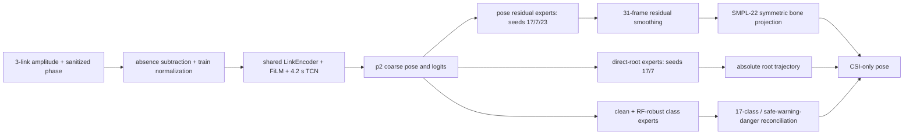
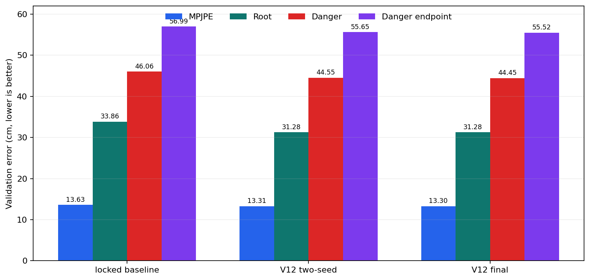
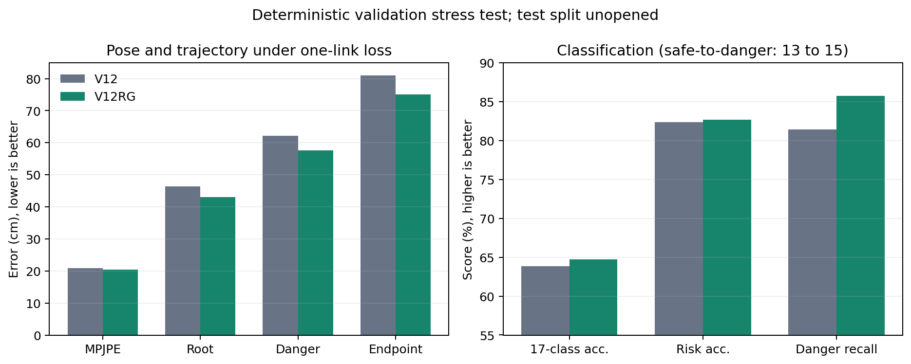
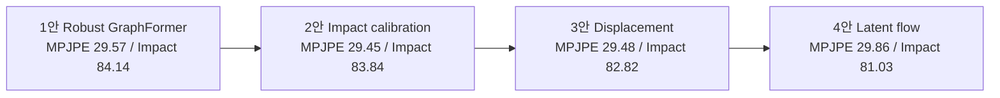
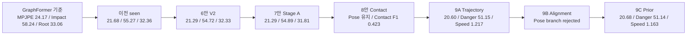
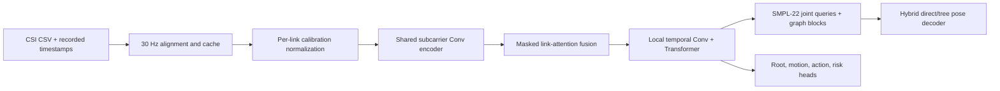
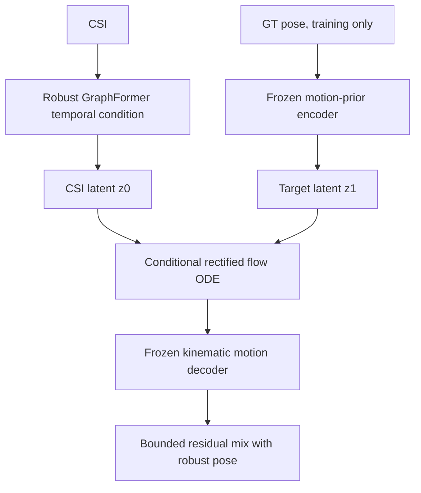
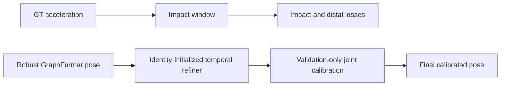

# NotiFi CSI-to-Pose

Wi-Fi CSI만 입력받아 시간에 따른 사람의 **GVHMR SMPL-22 3D pose와 root trajectory**를 복원하는 연구 코드입니다. 영상과 GVHMR은 학습용 GT 생성에만 사용하며, 검증과 실제 추론에는 CSI만 사용합니다.

- 기존 코드: [NotiFi-CSI-to-Pose `feature/goal1`](https://github.com/NotiFi2026/NotiFi-CSI-to-Pose/tree/feature/goal1)
- 현재 통합 위치: [NotiFi/CSI-to-Pose](https://github.com/jjyoon012-git/NotiFi/tree/main/CSI-to-Pose)
- 현재 권장 seen 모델: **V12 clean-protocol multi-expert**
- 다음 sealed 평가 후보: **V12RG shift-root + missing-link guard**
- 현재 개발 순서: **seen 성능 확보 후 unseen/LOSO calibration 재개**
- 문서 정렬 원칙: **현재 권장 모델을 맨 위에 두고, 이전 안은 최신순으로 기록**

## 현재 모델: V12 clean-protocol multi-expert

V12는 팀원 p2 계열의 CSI encoder를 coarse backbone으로 유지하면서, **자세·root·분류를
서로 다른 목적 함수로 학습한 expert**로 분리한다. 입력은 4-board 수집에서 얻은 3개
논리 link의 amplitude와 sanitized phase뿐이다. 영상과 GVHMR은 GT 생성에만 쓰며
validation/test 추론에는 들어가지 않는다.



### 핵심 변경

1. **시간 오차 내성 pose 학습**: 전체 trial을 작은 범위에서 정렬해 보는 shift-robust
   loss를 사용하되 timestamp/GT 자체를 이동하거나 다시 저장하지 않는다.
2. **직접 root 복원**: velocity 누적만으로 생기던 장기 drift를 줄이기 위해 absolute root
   residual과 5/15/30-frame displacement를 함께 학습한다.
3. **cross-seed pose/root ensemble**: pose는 `0.45/0.25/0.30`, root는 `0.80/0.20`이다.
   세 번째 pose seed 단독 speed ratio는 `1.80`이라 탈락했지만 30% 혼합 시 `1.003`으로
   정상화되면서 낙상 오차를 줄였다.
4. **표현에 맞는 RF 증강**: cache가 I/Q가 아니라 `amp_phase`임을 확인해 잘못된 complex
   rotation을 폐기했다. amplitude gain과 sanitized-phase curvature만 증강한다.
5. **계층 분류**: clean expert와 RF-robust expert를 `0.5/0.5`로 섞고 17-class 확률을
   3-risk 확률과 `0.60` 비율로 조정한다. danger bias는 validation에서 고정한 `+0.35`다.
6. **해부학적 후처리**: 31-frame residual smoothing 후 좌우 대칭 bone projection을
   `0.25`만 적용해 관절 길이를 안정화한다.

모든 checkpoint, 혼합 비율, smoothing, bone projection, logit bias는 validation에서만
결정했다. 최종 test는 설정을 잠근 뒤 **한 번만** 열었고 이후 어떤 값도 바꾸지 않았다.

### 데이터와 평가 protocol

`single_split_lmh_e01`은 `ajh/mhw E01-E03 + lmh E01`만 사용한다. 문제로 확인된
`lmh E02/E03`은 train/validation/test 모두에서 제외하고, `yja`는 이 seen 실험에 쓰지 않는다.

| Split | Trials | Pose GT | Absence | 역할 |
|---|---:|---:|---:|---|
| train | 1,266 | 1,210 | 56 | 가중치 학습 |
| validation | 329 | 315 | 14 | checkpoint와 calibration 선택 |
| test | 329 | 315 | 14 | 잠금 후 1회 최종 보고 |

분할·경로 교집합, 제외 환경, calibration lock, split fingerprint 20개 검사는 모두 통과했다.
다만 pose trial 262개는 모두 `lmh/E01`의 `uniform_30fps`이고 나머지는 recorded timestamp다.
validation에서 이 군의 root는 timestamp 군보다 `+7.43 cm`였지만 subject/environment도 동시에
달라 원인을 시간 가정으로만 귀속할 수 없다. lmh pose timestamp 재수집이 다음 데이터 우선순위다.
262개는 pose 16개 시나리오 전반에 `train/val/test=172/45/45`로 퍼져 있고 danger도
`30/10/10`이므로 일부 낙상만 보정하지 않는다. 전체 timestamp를 복구한 뒤 dataset/split 버전을
올리고, 현재 V12 test와 직접 섞지 않은 새 sealed 평가를 수행해야 한다.
원시는 [`v12_protocol_integrity.json`](docs/results/v12_protocol_integrity.json)과
[`v12_alignment_strata.json`](docs/results/v12_alignment_strata.json)에 있다.

### 최종 성능

| Metric | Validation | Test |
|---|---:|---:|
| MPJPE | **13.30 cm** | **15.07 cm** |
| PA-MPJPE | **6.79 cm** | **7.12 cm** |
| Dynamic MPJPE | 16.53 cm | 18.02 cm |
| Root error | 31.28 cm | 33.79 cm |
| Danger MPJPE | 44.45 cm | 50.71 cm |
| Danger distal | 45.72 cm | 51.84 cm |
| Danger endpoint | 55.52 cm | 64.28 cm |
| Pose-speed ratio | 1.003 | 1.136 |
| 17-class accuracy / macro F1 | 96.05 / 95.19% | 94.22 / 92.54% |
| Risk accuracy / macro F1 | 97.87 / 97.63% | 97.26 / 96.55% |
| Danger recall / precision | 67/70, 95.71 / 97.10% | 64/70, 91.43 / 95.52% |
| Safe -> danger | 2/175, 1.14% | 2/175, 1.14% |



고정 baseline 대비 validation에서 MPJPE `13.63 -> 13.30 cm`, root `33.86 -> 31.28 cm`,
danger `46.06 -> 44.45 cm`, danger endpoint `56.99 -> 55.52 cm`로 개선됐다. 최종 test는
팀원이 공유한 p2 결과보다 MPJPE `15.76 -> 15.07 cm`, PA-MPJPE `8.67 -> 7.12 cm`,
root `35.45 -> 33.79 cm`, class accuracy `91.8 -> 94.2%`로 높다. 반면 팀원의 danger recall
`94.3%`보다 현재 `91.4%`가 낮아, 다음 seen 단계의 가장 중요한 미해결 항목이다.

historical V10 test와 비교하면 V12는 MPJPE `16.31 -> 15.07 cm`, dynamic `19.38 ->
18.02 cm`, class accuracy `93.31 -> 94.22%`, safe-to-danger `4 -> 2`로 좋아졌다. 그러나
root `32.29 -> 33.79 cm`, danger `47.99 -> 50.71 cm`, danger recall `95.71 -> 91.43%`는
나빠졌다. V10은 개발 중 test를 반복 확인한 이력이 있으므로 공정한 선택 기준으로 재사용하지
않고, 이 수치는 투명성을 위한 historical 비교로만 남긴다.

### 입력 강건성

validation의 ±2-frame jitter에서는 MPJPE 변화가 `+0.01 cm`뿐이다. subcarrier band 제거와
amp/phase 변화에서도 MPJPE는 각각 `15.22/14.76 cm`로 유지된다. 반면 link 하나가 완전히
사라지면 MPJPE `20.89 cm`, danger `62.11 cm`, danger recall `81.43%`로 내려간다.
RF-robust 분류 ensemble이 이때 safe-to-danger를 `15 -> 13`으로 줄였지만, **link 장애가
현재 가장 큰 입력 강건성 병목**이다.

### V12RG shift-root + missing-link guard (validation candidate)

V12 최종 test를 연 뒤에는 설정을 바꾸지 않는 원칙을 지키기 위해, 후속 모델은 test를
다시 열지 않고 validation에서만 개발했다. 최대 5-frame danger-root shift loss로 warm-start
root expert를 보강한 뒤 기존 seed7과 `0.80/0.20`으로 섞었다. 그 위에서
`80%` link-dropout으로 학습한 pose/root expert는 한 link의 frame coverage가 `50%` 이하일
때 호출한다. class/risk expert는 학습 분포와 맞는 **전 구간 link 소실**에서만 호출한다.
pose blend `0.50`, root blend `1.00`과 link별 class blend
`[1.00,1.00,0.75]`, risk blend `[0.00,1.00,0.50]`, danger bias
`[-0.25,-0.50,-0.25]`는 deterministic drop-link validation에서 선택했다. 각 link마다
danger recall 비열화 금지, risk accuracy `-0.5%p` 이내, 오경보 `+2` 이내 hard gate를 적용했다.

| Metric | V12 clean | V12RG clean | V12 link loss | V12RG link loss |
|---|---:|---:|---:|---:|
| MPJPE | 13.30 cm | 13.32 cm | 20.89 cm | **20.45 cm** |
| Root error | 31.28 cm | **31.03 cm** | 46.35 cm | **43.09 cm** |
| Danger absolute MPJPE | 44.45 cm | **44.35 cm** | 62.11 cm | **57.61 cm** |
| Danger endpoint | 55.52 cm | **55.25 cm** | 80.93 cm | **75.06 cm** |
| 17-class accuracy | 96.05% | 96.05% | 63.83% | **64.74%** |
| Risk accuracy | 97.87% | **98.18%** | 82.37% | **82.67%** |
| Danger recall | 67/70 | 67/70 | 57/70 | **60/70** |
| Safe -> danger | 2 | **1** | 13 | 15 |

| Removed link | Root V12 -> V12RG | Danger V12 -> V12RG | Recall V12 -> V12RG | FP V12 -> V12RG |
|---|---:|---:|---:|---:|
| link 0 | 45.90 -> **42.49 cm** | 57.32 -> **53.31 cm** | 61 -> 61/70 | 17 -> 17 |
| link 1 | 44.50 -> **42.38 cm** | 56.65 -> **53.51 cm** | 55 -> **61/70** | 19 -> 21 |
| link 2 | 49.77 -> **44.00 cm** | 68.93 -> **60.82 cm** | 50 -> **55/70** | 13 -> 15 |

부분 단절 위치를 선택에 쓰지 않고 초반/중간/후반/trial별 이동으로 바꿔 외삽 검증했다.

| 50% link burst | Root V12 -> V12RG | Danger V12 -> V12RG | Recall | FP V12 -> V12RG |
|---|---:|---:|---:|---:|
| early | 37.83 -> **36.85 cm** | 50.72 -> **48.64 cm** | 67 -> 67/70 | 3 -> 4 |
| middle | 38.82 -> **37.41 cm** | 53.66 -> **51.82 cm** | 65 -> 65/70 | 6 -> 6 |
| late | 39.98 -> **38.54 cm** | 56.44 -> **54.54 cm** | 64 -> 64/70 | 4 -> 5 |
| shifted | 38.98 -> **37.30 cm** | 54.80 -> **52.41 cm** | 64 -> 64/70 | 6 -> 6 |

분류 fallback까지 부분 단절에 켜는 실험은 early burst에서 recall `-1`, FP `+5`라 기각했다.
이중 coverage gate는 네 위치 모두 recall을 보존하고 FP 증가는 최대 1건으로 제한했다.
clean MPJPE가 `+0.013 cm`, 완전 link-loss 오경보가 `+2`라는 비용이 있으나 root와 낙상 absolute
trajectory 개선은 크다. 따라서 V12RG는 **다음 sealed 평가 전 validation candidate**이며, 위 V12
test 수치와 섞어 최종 성능으로 주장하지 않는다. 전체 결과는
[`v12_link_failure_guard_robustness.json`](docs/results/v12_link_failure_guard_robustness.json)에 있다.

V12RG validation의 danger 14 trial/class 분해에서는 `D02 fall_while_walking`의 MPJPE/root가
`48.71/45.84 cm`로 가장 크고, `D03 bed_exit_fall`의 평균 정렬 이동이 `12.86 frame`,
`D04 bed_fall`의 distal 오차가 `50.22 cm`, `D05 chair_exit_fall`의 endpoint가 `58.25 cm`로
각각 가장 약했다. 다음 단계는 14개 표본에 맞춘 class 전용 head가 아니라, 학습기에 이미 있는
root-displacement, shift/multiscale temporal, distal/end-state loss의 가중치와 lag를 하나씩 분리
ablation하고 class별 지표로 회귀 여부를 확인하는 것이다.



```powershell
python -m notifi_pose.tools.audit_v12_link_failure_guard `
  --p2-checkpoint work_v2/runs/p2_sub_single_clean_finetune/best_model.pt `
  --root-calibration docs/results/v12_shift_robust_root_calibration.json `
  --classification-calibration work_v2/runs/p2_v12w_robust_classification_ensemble/validation.json `
  --pose-calibration docs/results/v12_link_failure_pose_calibration.json `
  --failure-root-calibration docs/results/v12_link_failure_root_calibration.json `
  --failure-class-calibration docs/results/v12_link_specific_classification_calibration.json `
  --minimum-link-coverage 0.5 `
  --classification-minimum-link-coverage 0.0 `
  --output docs/results/v12_link_failure_guard_robustness.json
```

### 추론 비용

RTX GPU에서 `[1,304,3,114,2]` 한 trial의 forward latency는 평균 `101.0 ms`,
p95 `113.7 ms`다(10회 warmup 뒤 100회 측정). 7개 expert의 frozen p2 state가 bitwise
동일함을 확인한 뒤 backbone, CSI motion feature, normalized subcarrier feature를 공유하고,
분류 expert는 pose/root head를 건너뛰는 logit-only 경로를 사용한다. validation JSON의 모든
항목은 최적화 전후 `delta=0`이고, latency는 `147.0 -> 101.0 ms`로 `31.3%` 감소했다. 중복 제거 후
inference graph는 `2,647,249` parameter, 저장 state는 약 `11.0 MB`다. 남은 residual head도
여전히 여러 개이므로 더 작은 배포 모델이 필요하면 teacher-student distillation을 적용한다. 측정 원본은
[`v12_runtime_benchmark.json`](docs/results/v12_runtime_benchmark.json)에 있다. validation 329개
전체에서 pose/root/class/risk tensor의 최대 절대차가 모두 정확히 `0`인 검증은
[`v12_shared_equivalence.json`](docs/results/v12_shared_equivalence.json)에 있다.

### 재현

최종 evaluator는 validation lock의 protocol과 `test_used_for_selection=false`를 확인한다.

```powershell
python -m notifi_pose.tools.evaluate_v12_final `
  --p2-checkpoint work_v2/runs/p2_sub_single_clean_finetune/best_model.pt `
  --root-calibration work_v2/runs/p2_v12aa_pose_seed23_w30/validation.json `
  --classification-calibration work_v2/runs/p2_v12w_robust_classification_ensemble/validation.json `
  --exp single_split_lmh_e01 --open-test `
  --output work_v2/runs/p2_v12_final_locked/final_evaluation.json
```

원시 최종 결과는 [`v12_final_evaluation.json`](docs/results/v12_final_evaluation.json),
강건성 결과는 [`v12_input_robustness.json`](docs/results/v12_input_robustness.json), 압축 요약은
[`v12_final_summary.json`](docs/results/v12_final_summary.json)에 있다. split, cache, checkpoint,
calibration, 핵심 source 40개의 SHA-256은
[`v12_release_manifest.json`](docs/results/v12_release_manifest.json)에 고정했다.

```powershell
# checkpoint/cache까지 있는 연구 작업본의 완전 검증
python -m notifi_pose.tools.verify_v12_release_manifest

# Git 공개본: 외부 보관 checkpoint/cache의 누락만 허용
python -m notifi_pose.tools.verify_v12_release_manifest --allow-missing-model-artifacts
```

## 이전 모델: V10 P2-V9 dual hybrid

V10은 팀원 p2의 낮은 pose 오차와 안정적인 분류, V9의 낙상 trajectory 보정, V9C의
root trajectory를 validation gate로 결합한다. 팀원 checkpoint를 그대로 복사하지 않고
동일한 `single_split_lmh_e01`에서 p2를 재현·fine-tune한 뒤 결합했다.

```text
amplitude + sanitized phase -> absence baseline subtraction
  -> shared LinkEncoder + FiLM + concat + 4.2s TCN
  -> p2 coarse pose + 17-class/risk logits
  -> V9 bone-rotation trajectory residual (strength 0.35)

same CSI -> previous V9C root expert
  -> p2 root와 validation blend (strength 0.50)

classification: p2 class logits 유지
risk: p2 risk logits 유지 + validation danger bias 2.95
```

모든 결합 강도에는 `0` 후보가 있다. pose, root, class, risk를 validation에서 독립적으로
선택하며 test는 강도나 bias 선택에 사용하지 않는다. root residual은 validation root error가
최소 `0.5cm` 개선될 때만 활성화한다.

### V10 seen test 결과

| Metric | 로컬 p2 기준 | 이전 V9C | 현재 V10 dual |
|---|---:|---:|---:|
| MPJPE | 16.57cm | 20.41cm | **16.31cm** |
| Dynamic MPJPE | 19.70cm | 20.19cm | **19.38cm** |
| Root error | 36.25cm | 33.54cm | **32.29cm** |
| Danger MPJPE | 53.63cm | 51.14cm | **47.99cm** |
| Danger distal | 55.68cm | 55.78cm | **51.19cm** |
| Danger endpoint | 66.01cm | 71.39cm | **61.17cm** |
| 17-class accuracy | **93.31%** | 87.84% | **93.31%** |
| 17-class macro F1 | **91.44%** | 84.89% | **91.44%** |
| Risk accuracy | 96.66% | 95.14% | **96.96%** |
| Risk macro F1 | 95.81% | 94.43% | **96.44%** |
| Danger recall | 63/70, 90.00% | 66/70, 94.29% | **67/70, 95.71%** |
| Safe -> danger | 2/175, 1.14% | 7/175, 4.00% | 4/175, 2.29% |

팀원이 보고한 원 p2 수치 `15.76cm`보다는 현재 V10 MPJPE가 `0.55cm` 높다. 반면 현재
로컬 코드와 GT로 다시 학습한 p2를 동일 evaluator에서 비교하면 `16.57 -> 16.31cm`로
개선됐다. 특히 root와 danger absolute trajectory는 두 이전 모델을 모두 앞섰다.

현재 한계는 두 encoder를 함께 실행해 추론 비용이 증가한다는 점이다. 다음 단계는 이 dual
모델을 teacher로 고정하고 p2 temporal feature 하나에 V9C root를 distillation해 단일 encoder로
줄이는 것이다.

## 이전 모델: V9C clean-split multi-task

팀원 모델을 가져오지 않고 기존 V9 encoder/trajectory decoder를 그대로 확장했다. 동일한
V9 temporal feature에 다음 세 head를 직접 연결한다.

1. `pose head`: SMPL-22의 frame별 3D pose와 root trajectory 복원
2. `class head`: safe 9개, warning 3개, danger 5개를 합친 17개 세부 동작 분류
3. `risk head`: safe, warning, danger 3단계 위험 분류

분할은 `single_split_lmh_e01`이다. `ajh/mhw`는 E01-E03을 모두 사용하고, 오류가 보고된
`lmh` E02/E03은 완전히 제외해 E01만 사용한다. train/validation/test는 trial 단위로
분리하며, test는 모델 선택이나 logit calibration에 사용하지 않는다.

| Split | 전체 trials | Pose GT | Absence | Subjects / environments |
|---|---:|---:|---:|---|
| train | 1,266 | 1,210 | 56 | ajh/mhw E01-E03, lmh E01 |
| validation | 329 | 315 | 14 | ajh/mhw E01-E03, lmh E01 |
| test | 329 | 315 | 14 | ajh/mhw E01-E03, lmh E01 |

학습에는 inverse-frequency class/risk weight와 danger 추가 가중치를 사용했다. checkpoint는
validation danger-recall hard gate를 통과한 후보 중에서 고르고, 마지막 danger logit bias도
validation에서만 선택한다. 선택값은 temporal-prior strength `0.75`, danger-logit bias
`+1.75`이다.

### 현재 test 결과

| 평가 항목 | V9A raw | 현재 V9C | 해석 |
|---|---:|---:|---|
| MPJPE | 20.38cm | 20.41cm | prior로 0.03cm 악화 |
| Dynamic MPJPE | 20.17cm | 20.19cm | 사실상 동일 |
| Root error | 33.54cm | 33.54cm | 동일 |
| Danger MPJPE | 51.16cm | 51.14cm | 0.02cm 개선 |
| Danger distal MPJPE | 55.89cm | 55.78cm | 0.11cm 개선 |
| Danger endpoint MPJPE | 71.42cm | 71.39cm | 0.03cm 개선 |
| Pose-speed ratio | 1.196 | 1.150 | 과도한 움직임 감소 |
| 17-class accuracy | 87.84% | 87.84% | pose prior와 무관 |
| 17-class macro F1 | 84.89% | 84.89% | pose prior와 무관 |
| Risk accuracy | 94.53% | **95.14%** | validation bias 적용 후 개선 |
| Risk macro F1 | 93.33% | **94.43%** | validation bias 적용 후 개선 |
| Danger recall | 62/70, 88.57% | **66/70, 94.29%** | 낙상 4건 추가 검출 |
| Danger precision | 87.32% | 85.71% | recall 증가의 비용 |
| Safe -> danger | 5/175, 2.86% | 7/175, 4.00% | 오경보 2건 증가 |

현재 결론은 명확하다. 세 분류 head와 danger-recall calibration은 효과가 있지만 temporal
denoising prior의 pose 개선은 매우 작고 전체 MPJPE는 오히려 소폭 나빠졌다. 따라서 현재
V9C는 위험 분류 기준 모델로 채택하되, 낙상 자세 복원 자체가 해결됐다고 보지 않는다.
특히 17-class에서 `D03 bed_exit_fall` recall이 `5/14=35.71%`로 가장 약하므로 다음 실험은
낙상 세부 동작 간 구별과 CSI-conditioned trajectory 다양성에 집중한다.

## 이전 모델: 9안 Stage C - Fall Trajectory Reconstruction

현재는 사용자가 지정한
[`feature/goal1/work_v2/splits`](https://github.com/NotiFi2026/NotiFi-CSI-to-Pose/tree/feature/goal1/work_v2/splits)의
`single_split`을 사용한다. `ajh/lmh/mhw`와 `E01/E02/E03`이 train, validation,
test에 모두 포함되고 trial만 분리된 **seen-subject + seen-environment + unseen-trial**
protocol이다.

| Split | Pose trials | Subjects | Environments |
|---|---:|---|---|
| train | 1,556 | ajh, lmh, mhw | E01, E02, E03 |
| validation | 405 | ajh, lmh, mhw | E01, E02, E03 |
| test | 405 | ajh, lmh, mhw | E01, E02, E03 |

split 간 trial ID 중복은 0이며 yja와 LOSO 데이터는 현재 seen 학습과 모델 선택에
사용하지 않는다.

```mermaid
flowchart LR
    A["3-link CSI"] --> B["GraphFormer baseline"]
    A --> C["Raw CSI branch"]
    A --> D["Temporal-difference branch"]
    C --> E["Motion-first encoder"]
    D --> E
    B --> F["Action-conditioned coarse pose"]
    E --> G["Phase / impact conditioning"]
    F --> H["Keyframe 6D bone rotations"]
    G --> H
    H --> I["Bounded high-frequency residual"]
    I --> J["V2 anchor + root velocity integration"]
    G --> K["Contact / injury heads"]
    J --> L["Validation-only branch calibration"]
    L --> M["Frozen calibrated V2"]
    M --> N["Contact-guided root temporal encoder"]
    K --> N
    N --> O["Support-aware anchor / velocity refinement"]
    O --> P["Validation-selected root strength"]
    P --> Q["SMPL-22 pose + refined root"]
    A --> R["Raw CSI multi-scale motion"]
    Q --> S["Full-sequence trajectory features"]
    R --> S
    S --> T["Dilated temporal blocks + Transformer"]
    T --> U["Bone-preserving rotation + root residual"]
    U --> V["Validation scale: pose 0.15 / root 0.5"]
    V --> W["GT-only temporal denoising prior"]
    W --> X["Validation prior strength 1.0"]
    X --> Y["CSI-only SMPL-22 trajectory"]
```



1. timestamp 완전성, 유효 link 수, CSI-GT motion correlation으로 trial 품질 가중치를 만든다.
2. root는 첫 anchor와 keyframe velocity residual을 적분해 궤적 연속성을 유지한다.
3. speed, moving, fall phase, impact, predicted action/risk로 decoder를 condition한다.
4. 4-frame keyframe의 6D bone rotation을 예측하고 SMPL tree FK로 bone length를 보존한다.
5. 저주파 rotation branch와 최대 2cm의 고주파 Cartesian residual을 분리한다.
6. 7안까지는 발 접촉, 부위별 충돌, 최초 접촉 관절, impact speed, 바닥 높이를 보조 학습했다.
7. head-only 학습 후 기존 backbone의 마지막 temporal block만 낮은 learning rate로 미세조정한다.
8. 7안 Stage A는 V2 pose를 고정하고 예측 foot contact, phase, impact, 상대 foot speed로
   root anchor와 velocity만 보정한다.
9. 8안은 raw CSI event feature를 추가하되 validation gate를 통과한 injury-contact
   residual만 `0.75`로 사용한다.
10. 9안은 최초 충돌 예측을 새 loss에서 제거하고 frame pose/root, 5-frame displacement,
    root drop, torso/shoulder orientation, endpoint로 전체 낙상 궤적을 학습한다.
11. train GT만 noise와 frame/joint masking으로 오염시켜 학습한 temporal denoising prior가
    과도한 frame-to-frame 움직임을 안정화한다.

### Seen test 결과

| Metric | 기존 GraphFormer | 7안 | 9A trajectory | 9B alignment | 현재 9C |
|---|---:|---:|---:|---:|---:|
| MPJPE | 24.17cm | 21.29cm | **20.60cm** | 21.29cm | 20.68cm |
| Dynamic MPJPE | 23.39cm | 20.90cm | **20.40cm** | 20.90cm | 20.41cm |
| Root error | 33.06cm | 31.81cm | **31.61cm** | 31.94cm | **31.61cm** |
| Danger MPJPE | - | - | 51.15cm | 51.95cm | **51.14cm** |
| Danger distal | - | - | 55.72cm | 56.93cm | **55.64cm** |
| Danger endpoint | - | - | 69.72cm | 71.23cm | **69.66cm** |
| Pose-speed ratio | 1.058 | 1.167 | 1.217 | 1.167 | **1.163** |

무보정 V2는 test MPJPE `18.11cm`까지 내려갔지만 pose-speed ratio가 `2.088`로
실제 움직임의 두 배를 만들어 공식 결과에서 제외했다. validation에서만 branch 강도를
`rotation=0.10`, `high-pose=0.00`, `root=0.50`으로 선택한 결과가 위 표다.
무보정 checkpoint에 shuffled CSI를 넣으면 MPJPE `34.69cm`, root error `58.33cm`로
악화되어 trial-specific CSI를 사용한다는 gate도 확인했다.

7안은 validation에서 epoch 8과 root strength `0.50`을 선택했다. test root error는
`32.33 -> 31.81cm`로 개선됐고 pose를 고정했기 때문에 MPJPE와 speed ratio는 유지됐다.
반면 impact MPJPE는 `54.72 -> 54.89cm`, foot-contact F1은 `0.708 -> 0.701`로 소폭
악화됐다. 따라서 7안은 root Stage A로 채택하되 impact/contact 개선으로 해석하지 않는다.

8안은 physical impact proxy와 `(frame, joint)` event head를 추가했다. 전체 event model은
test에서 일반화하지 못해 event/joint/speed strength를 모두 `0`으로 되돌렸다. validation이
contact strength `0.75`만 선택했고, test injury-contact F1은 `0.354 -> 0.423`으로
개선됐다. first-contact, impact speed, pose, root는 7안과 동일하다.

9A는 `어느 관절이 먼저 충돌했는가` 대신 전체 낙상 sequence를 복원한다. 최대 가속도
frame과 휴리스틱 impact score를 새 loss에서 제거했고 MPJPE를 `21.29 -> 20.60cm`로
낮췄다. 다만 speed ratio가 `1.217`로 gate 1.2를 넘어서 단독 최종 모델로 쓰지 않는다.

9B는 timestamp를 유지하면서 8개 연속 구간에 ±15-frame offset을 허용한 constrained
alignment loss를 시험했다. validation이 pose residual strength `0`을 선택했고 test도
악화되어 기각했다. GT나 timestamp를 이동한 결과물은 저장하지 않았다.

9C는 내부 train GT만 사용한 temporal denoising prior를 9A에 적용한다. test MPJPE는
`20.68cm`, dynamic MPJPE는 `20.41cm`, speed ratio는 `1.163`이다. danger MPJPE
`51.14cm`와 endpoint `69.66cm`는 여전히 크므로 낙상 복원이 해결됐다고 해석하지 않는다.
8안 contact 출력은 분석용으로 남아 있지만 9안의 새 stage는 impact/contact target을
학습하지 않는다. 동결된 7안 base에 남은 과거 휴리스틱 영향은 base 재학습 때 제거한다.

실패한 구조를 포함한 번호·날짜·시간·목적·방법·결과·결정은
[`docs/experiment_log.md`](docs/experiment_log.md)에 계속 누적한다. 원시 결과 JSON은
[`docs/results`](docs/results)에 있으며 checkpoint와 데이터셋은 저장소에 포함하지 않는다.
6안의 코드 대응, 손실, 보정 규칙은
[`docs/seen_reconstruction_v2.md`](docs/seen_reconstruction_v2.md), 7안 root stage는
[`docs/seen_reconstruction_v3.md`](docs/seen_reconstruction_v3.md), 8안 event stage는
[`docs/impact_event_v8.md`](docs/impact_event_v8.md), 현재 9안은
[`docs/fall_trajectory_v9.md`](docs/fall_trajectory_v9.md)에 정리했다.

## 모델안별 성능 이력

서로 다른 test protocol의 숫자는 직접 우열 비교하지 않는다. 1~4안은 `yja/E02 unseen`
동일 조건, seen 기준선~8안은 제공된 `single_split seen` 동일 조건이다. 5안은 새 모델이
아니라 CSI observability 진단이므로 성능선에서 분리했다.

| 안 | 핵심 변경 | 평가 protocol | MPJPE | Impact | Root | Speed ratio | 판정 |
|---:|---|---|---:|---:|---:|---:|---|
| 1안 | Robust GraphFormer | yja/E02 unseen | 29.57cm | 84.14cm | 59.23cm | 0.721 | 기준 |
| 2안 | Impact-aware calibration | yja/E02 unseen | 29.45cm | 83.84cm | 59.23cm | 0.718 | 소폭 개선 |
| 3안 | Coherent displacement | yja/E02 unseen | 29.48cm | 82.82cm | 59.23cm | 0.714 | impact 개선 |
| 4안 | Latent rectified flow | yja/E02 unseen | 29.86cm | **81.03cm** | 59.52cm | 0.697 | impact만 개선, 전체 미채택 |
| 5안 | CSI observability 진단 | yja/E02 unseen | 29.57cm 정상 / 29.59cm shuffled | - | - | - | encoder 병목 확인 |
| 6안 | Seen Reconstruction V2 | single_split seen | **21.29cm** | **54.72cm** | 32.33cm | 1.167 | 채택 |
| 7안 A | Contact-guided root | single_split seen | **21.29cm** | 54.89cm | **31.81cm** | 1.167 | 현재 root 모델 |
| 8안 A | Contact-calibrated event | single_split seen | 21.29cm | 54.89cm | 31.81cm | 1.167 | contact F1 0.423 |
| 9안 A | Full-sequence trajectory | single_split seen | **20.60cm** | - | **31.61cm** | 1.217 | 위치 개선, 속도 gate 초과 |
| 9안 B | Bounded alignment | single_split seen | 21.29cm | - | 31.94cm | 1.167 | validation이 pose branch 기각 |
| 9안 C | Temporal denoising prior | single_split seen | 20.68cm | - | **31.61cm** | **1.163** | 현재 모델, danger 51.14cm |

### 1~4안: yja/E02 unseen 흐름



### Seen 모델 흐름



단위는 cm다. 각 안의 원시 출처와 protocol은
[`docs/results/model_plan_history.json`](docs/results/model_plan_history.json)에 고정한다.

### 실행 순서

```powershell
python -m notifi_pose.tools.audit_motion_alignment
python -m notifi_pose.tools.train_motion_first --exp single_split `
  --epochs 12 --patience 4 --batch-size 12 `
  --run-dir work_v2/runs/motion_first_seen
python -m notifi_pose.tools.train_seen_action_residual `
  --epochs 20 --patience 6 --batch-size 12
python -m notifi_pose.tools.calibrate_seen_action_residual
python -m notifi_pose.tools.train_seen_root_residual `
  --epochs 20 --patience 6 --batch-size 12
python -m notifi_pose.tools.train_seen_v2 `
  --head-epochs 12 --finetune-epochs 6 --patience 4 --batch-size 8 `
  --run-dir work_v2/runs/seen_reconstruction_v2
python -m notifi_pose.tools.diagnose_seen_v2_components
python -m notifi_pose.tools.calibrate_seen_v2
python -m notifi_pose.tools.train_seen_v3_root `
  --epochs 16 --patience 5 --batch-size 8 `
  --run-dir work_v2/runs/seen_v3_contact_root
python -m notifi_pose.tools.audit_impact_targets --split val
python -m notifi_pose.tools.audit_impact_alignment
python -m notifi_pose.tools.train_impact_event `
  --epochs 15 --patience 5 --batch-size 8 `
  --run-dir work_v2/runs/impact_event_v8c_raw
python -m notifi_pose.tools.calibrate_impact_event
python -m notifi_pose.tools.train_seen_v4_trajectory `
  --epochs 12 --batch-size 8 --alignment-weight 0 `
  --run-dir work_v2/runs/seen_v4_v9a_no_impact
python -m notifi_pose.tools.train_seen_v4_trajectory `
  --epochs 12 --batch-size 8 --alignment-weight 0.15 `
  --run-dir work_v2/runs/seen_v4_v9b_bounded_alignment
python -m notifi_pose.tools.train_motion_prior_v9 `
  --epochs 10 --batch-size 12 `
  --run-dir work_v2/priors/temporal_denoiser_v9
python -m notifi_pose.tools.calibrate_motion_prior_v9 `
  --trajectory-run work_v2/runs/seen_v4_v9a_no_impact `
  --prior-run work_v2/priors/temporal_denoiser_v9 `
  --run-dir work_v2/runs/seen_v4_v9c_motion_prior
```

현재 seen gate는 완전히 통과하지 않았다. 다음 목표는 MPJPE 20cm 이하,
danger MPJPE 45cm 이하, root 25cm 이하, pose-speed ratio 0.8~1.2다. 이 기준에 가까워지면
동일한 backbone을 고정하고 calibration/domain adaptation을 붙여 yja E02와 LOSO를
unseen protocol로 다시 평가한다.

## 기존 모델과의 차이

7안은 calibrated 6안을 동결한 뒤 contact-guided root branch를 추가했다. 현재 8안은
7안 전체를 동결하고 event/contact head만 별도로 학습한 뒤 branch별로 보정한다.

| 구분 | 6안 V2 | 7안 Stage A | 현재 8안 Stage A |
|---|---|---|---|
| CSI motion | motion-first + gated fusion | root/contact dynamics | raw amplitude/phase delta 1/3/7/15-frame 추가 |
| Pose decoder | phase-aware 6D rotation + FK | 6안 pose 고정 | 7안 pose/root 완전 고정 |
| Root | anchor + root-step 적분 | contact support-aware 적분 | 7안 root 그대로 유지 |
| Event target | 가속도 peak/높이 heuristic | 동일 보조 head | 감속+가속도+하강+표면근접 physical proxy |
| 학습 | head + 제한적 fine-tuning | 새 root branch만 학습 | event/contact head만 학습 |
| 모델 선택 | branch calibration + speed gate | root/impact + identity 후보 | event/joint/contact/speed branch별 validation gate |

7안에서 8안으로 pose/root는 유지되고 injury-contact F1만 0.354→0.423으로 개선됐다.
event timing과 최초 충돌 부위 branch는 검증 실패로 비활성화했다.

## 현재 모델 문제점 및 개선 방향

| 우선순위 | 문제 | 현재 근거 | 다음 개선 |
|---:|---|---|---|
| 1 | Root 절대 위치가 여전히 가장 큰 병목 | root 31.81cm, Stage A에서 0.52cm 개선 | 장기 anchor drift와 horizontal/vertical trajectory를 분리 학습 |
| 2 | 회전 branch가 움직임을 과장 | 무보정 speed ratio 2.088, rotation-only 1.971 | angular velocity/geodesic loss, phase별 rotation 크기 제한, keyframe 보간 개선 |
| 3 | 낙상 impact 복원이 부족 | impact 54.89cm, event timing test 약 25.6프레임 오차 | 실제 영상 impact frame/body-region 표본 annotation과 proxy 검증 |
| 4 | 고주파 branch가 실질적으로 미사용 | validation이 high-pose scale 0을 선택 | 2cm residual의 대역 분리와 temporal regularization 재설계 |
| 5 | 최초 충돌 부위 정확도가 낮음 | injury F1 0.423, 최초 접촉 정확도 0.378 | 검증된 event label 확보 후 coarse-to-fine region/joint 재학습 |
| 6 | 아직 seen 성능만 검증 | 같은 사람·환경의 unseen trial 평가 | seen gate 통과 후 backbone을 고정하고 LOSO/domain calibration 진행 |
| 7 | 저품질 trial이 남아 있음 | 품질 가중치 최솟값 0.443 | high-quality subset ablation, timestamp/link audit 강화, 자동 시간 이동은 금지 |

다음 실험은 한 번에 여러 요소를 다시 섞지 않고 아래 순서로 진행한다.

1. 완료: coarse pose를 고정하고 contact-guided root 전용 표현을 학습했다.
2. 완료: event/contact head를 적용하고 contact branch만 validation에서 채택했다.
3. danger 영상에서 실제 impact frame/body region을 표본 annotation해 proxy를 검증한다.
4. rotation branch에 angular velocity와 geodesic amplitude 제약을 추가한다.
5. MPJPE 20cm, impact 50cm, root 25cm, speed ratio 0.8~1.2를 seen gate로 재검증한다.
6. gate에 가까워진 모델만 LOSO와 yja E02 unseen adaptation으로 넘긴다.

## 연구 목표

단순 행동 분류가 아니라 프레임별 자세를 복원한다. 특히 낙상 시점에 머리, 손목, 무릎, 발목, 발이 어느 방향으로 움직이고 어느 부위가 바닥과 충돌했는지를 확인할 수 있어야 한다.

입력과 출력은 다음과 같다.

```text
입력  CSI: [B, T=304, Link=3, Subcarrier=114, I/Q-derived channel=2]
출력  pose_rel: [B, T, 22, 3]  # pelvis-relative SMPL-22
      root:     [B, T, 3]      # world-space pelvis trajectory
보조  action: 17 classes
      risk:   safe / warning / danger
```

## 기준 GraphFormer 코드 설명

`feature/goal1`의 최신 GVHMR 경로는 다음 파이프라인을 사용한다.



핵심 기술은 다음과 같다.

1. **Timestamp alignment**: CSI packet 시각과 `video_timestamps.csv`를 이용해 GT frame을 실제 촬영 시각에 정렬한다. `k/30` 가정은 기록이 일부 없을 때만 사용한다.
2. **CSI representation**: guard/DC subcarrier를 제거한 114개 subcarrier를 사용한다. subject, environment, label 같은 누수 가능한 metadata는 모델 입력에서 제외한다.
3. **Link-aware encoding**: TX1/TX2/TX3를 공유 encoder로 처리하고, 누락 link는 `link_mask`로 attention에서 제외한다.
4. **Temporal modeling**: dilated local convolution으로 짧은 움직임을 포착하고 Transformer로 전체 trial 문맥을 결합한다.
5. **Hybrid graph decoding**: 직접 관절 좌표와 SMPL kinematic tree 복원을 혼합해 손목·발까지 누적되는 parent error를 줄인다.
6. **Domain robustness**: site baseline subtraction, RF augmentation, balanced cross-domain batches, GroupDRO, domain-adversarial head, supervised contrastive loss를 사용한다.
7. **Auxiliary supervision**: action/risk뿐 아니라 fall phase, foot contact, velocity, acceleration, floor penetration을 함께 학습한다.

## 이전 연구안: 최신순

6안의 배경이 된 이전 시도다. 최신 안부터 내려가며, 미채택 결과도 원인 분석을 위해 유지한다.

### 5안: CSI Motion Observability 진단

**상태: 진단 완료, 다음 모델의 필수 통과 기준**

decoder를 더 바꾸기 전에 현재 모델이 CSI의 trial별 동작을 실제로 사용하는지 검사했다.

```powershell
python -m notifi_pose.tools.diagnose_observability `
  --probe-epochs 15 --overfit-steps 200 --overfit-trials 1 10
```

핵심 결과:

- 정상 CSI 대신 다른 yja E02 trial의 CSI를 넣어도 MPJPE는 `29.57 -> 29.59cm`로 `0.02cm`만 악화됐다.
- train mean-pose baseline도 `30.59cm`라 현재 모델과 차이가 `1.02cm`뿐이다.
- frozen encoder의 speed R2는 source validation `0.004`, yja E02 `-0.109`였다.
- impact F1은 source `0.148`, yja E02 `0.103`이고 timing MAE는 각각 `43.0`, `48.4` frames였다.
- 가장 동적인 1개 trial을 200 step 외워도 `9.35cm`, pose-speed ratio `0.534`에 머물렀다.

따라서 주 병목은 더 큰 pose decoder가 아니라 **CSI encoder가 speed, phase, impact를 보존하지 못하고 pose objective가 평균 자세로 붕괴하는 것**이다. domain shift도 존재하지만 source 내부에서 이미 motion observability가 낮으므로 domain adaptation만 강화해서는 해결되지 않는다.

다음 개발 순서는 다음과 같이 고정한다.

1. trial별 CSI motion energy와 GT speed의 lag/correlation으로 alignment 불량 데이터를 격리한다.
2. speed, moving, phase, impact를 먼저 예측하는 motion-first CSI encoder를 pretrain한다.
3. 정상 CSI 대비 shuffled CSI가 dynamic/impact 지표에서 명확히 나빠지는지 확인한다.
4. 1-trial overfit `MPJPE < 3cm`, pose-speed ratio `0.9-1.1`을 통과시킨다.
5. 그 뒤 velocity-space sequence decoder와 calibration을 붙이고 LOSO를 재개한다.

전체 수치와 합격 기준은 [`docs/observability_diagnostics.md`](docs/observability_diagnostics.md), 원시 결과는 [`docs/results/observability_diagnostics.json`](docs/results/observability_diagnostics.json)에 있다.

### 4안: CSI-conditioned Latent Rectified Flow

**상태: 생성형 구조 구현 및 yja 실험 완료, 실험적/미채택**

평균 자세 문제를 직접 다루기 위해 GT motion prior와 conditional rectified flow를 추가했다.

#### 4.1 GT-only kinematic motion prior

GVHMR pose를 parent-relative bone direction과 trial-level bone length code로 변환한다. decoder는 SMPL tree를 따라 pose를 복원한다. held-out subject의 GT는 prior 사전학습에 사용하지 않는다.

```text
GT pose
  -> bone direction + bounded length code
  -> latent z_gt [B,T,128]
  -> frozen kinematic decoder
  -> reconstructed SMPL-22 pose
```

yja protocol의 source validation에서 prior 자체의 재구성 MPJPE는 표시 정밀도 기준 `0.00cm`였다. 따라서 병목은 motion decoder가 아니라 CSI에서 올바른 latent trajectory를 찾는 단계다.

#### 4.2 Conditional rectified flow

CSI condition으로 만든 초기 latent `z0`에 noise를 추가하고 GT latent `z1`로 가는 vector field를 학습한다.

```text
t ~ Uniform(0, 1)
z_t = (1-t) z0 + t z1
target velocity = z1 - z0
L_flow = SmoothL1(v_theta(z_t, t, CSI), z1 - z0)
```

추론에서는 random sampling을 사용하지 않는다. CSI-derived `z0`에서 시작해 midpoint ODE solver를 고정 step으로 적분하므로 같은 CSI에 항상 같은 결과가 나온다.



yja E02 결과:

- impact MPJPE: `84.14 -> 81.03cm` 개선
- 전체 MPJPE: `29.57 -> 29.86cm` 악화
- smoothed pose-speed ratio: `0.721 -> 0.697` 악화

충격 자세에는 이득이 있었지만 전체 복원과 동작 진폭이 나빠져 현재 모델로 채택하지 않았다. 데이터가 늘어나면 action-conditioned latent, multi-hypothesis sampling, velocity-space prior와 함께 재검토할 수 있다.

재현:

```powershell
python -m notifi_pose.tools.run_latent_flow_protocols `
  --only yja_e02 --prior-epochs 12 --epochs 15
```

### 3안: Coherent Displacement Refiner

**상태: 구현 및 실험 완료, 미채택**

인접 frame velocity 대신 5 frame, 약 167ms 동안의 평균 변위를 맞춘다. 고주파 jitter가 loss를 속이지 못하게 하고 smoothing 후에도 남는 동작을 만들려는 접근이다.

```text
L_displacement = SmoothL1(
  (pose[t+5] - pose[t]) * FPS/5,
  (GT[t+5]   - GT[t])   * FPS/5
)
```

yja E02에서 smoothed pose-speed ratio가 `0.721 -> 0.714`로 오히려 감소했다. 현재 residual decoder의 용량과 deterministic objective만으로는 motion-amplitude collapse를 해결하지 못한다고 판단해 채택하지 않았다.

재현:

```powershell
python -m notifi_pose.tools.run_coherent_protocols --only yja_e02
```

### 2안: Impact-aware Temporal Refiner

**상태: 이전 unseen/LOSO 비교 기준, 현재 seen 모델의 baseline**

기존 robust checkpoint 뒤에 0으로 초기화된 temporal residual refiner를 붙인다. 초기 출력은 기준 모델과 정확히 같으며, validation 종합 점수가 좋아질 때만 체크포인트를 교체한다.

추가 요소:

1. GT acceleration peak를 기준으로 danger trial의 impact window를 만든다.
2. 머리, 손목, 무릎, 발목, 발을 distal/injury-relevant joint로 가중한다.
3. velocity, acceleration, jerk, foot slide, floor penetration을 함께 제약한다.
4. validation에서 관절별 residual scale을 `0, 0.25, 0.5, 0.75, 1.0` 중 선택한다.
5. 일반 관절 오차가 기준 모델보다 `0.05cm` 넘게 나빠지는 scale은 금지한다.
6. test 결과는 checkpoint나 residual scale 선택에 사용하지 않는다.



실행:

```powershell
python -m notifi_pose.tools.run_impact_protocols --only yja_e02
python -m notifi_pose.tools.run_impact_protocols --only loso
python -m notifi_pose.tools.summarize_impact_results
```

`run_impact_protocols`는 학습 후 `calibrated_model.pt`까지 자동 생성한다. 시각화 도구도 이 파일이 있으면 `best_model.pt`보다 먼저 사용한다.

### 1안: Robust GraphFormer

**상태: 기준 모델, 채택**

기존 GraphFormer에 환경 일반화 요소를 추가한 기준 모델이다.

```text
CSI encoder
  -> link attention
  -> temporal GraphFormer
  -> hybrid SMPL-22 decoder
  -> pose_rel + root

보조 학습:
  RF augmentation + GroupDRO + domain adversarial
  + cross-domain supervised contrastive
  + phase/contact/dynamics losses
```

장점:

- 구조가 단순하고 추론이 결정론적이다.
- 네 protocol에서 가장 안정적인 기본 성능을 보였다.
- 새 모델은 이 체크포인트를 epoch 0 안전 기준으로 사용한다.

한계:

- MPJPE 중심 회귀라 평균 자세 수렴을 피하기 어렵다.
- frame-to-frame velocity loss가 고주파 jitter에도 낮아질 수 있다.

실행:

```powershell
python -m notifi_pose.tools.run_robust_protocols --only yja_e02
python -m notifi_pose.tools.run_robust_protocols --only loso
python -m notifi_pose.tools.summarize_robust_runs
```

## 이전 Unseen/LOSO 실험 결과

모든 수치는 CSI-only pose trial, validation-selected checkpoint, 5-frame smoothing 기준이다.

| Protocol | Robust MPJPE | 2안 MPJPE | Robust dynamic | 2안 dynamic | Robust impact | 2안 impact |
|---|---:|---:|---:|---:|---:|---:|
| yja E02 | 29.57 | **29.45** | 30.94 | **30.79** | 84.14 | **83.84** |
| LOSO ajh | 28.10 | 28.10 | 25.98 | 25.98 | 67.14 | 67.14 |
| LOSO lmh | 32.88 | **32.81** | 31.60 | **31.50** | 60.41 | **60.14** |
| LOSO mhw | **27.16** | 27.19 | **26.23** | 26.23 | 72.18 | **72.00** |
| LOSO mean | 29.38 | **29.36** | 27.94 | **27.91** | 66.58 | **66.43** |

단위는 cm다. 자세한 관절·risk·label별 결과는 [`docs/results/impact_calibrated_results.md`](docs/results/impact_calibrated_results.md)와 JSON/CSV를 참고한다.

## 데이터 분리

### Protocol A

- train/validation: `ajh`, `lmh`, `mhw`의 사용 가능한 825개 전체 trial을 split 규약에 따라 사용
- sealed test: `yja/E02`
- yja E02 전체 275개 중 pose GT가 있는 263개를 pose 평가에 사용
- 손상된 `yja/E01`, `yja/E03` CSI는 제외

### Fixed LOSO

- `test_ajh`: lmh+mhw로 학습/검증, ajh test만 평가
- `test_lmh`: ajh+mhw로 학습/검증, lmh test만 평가
- `test_mhw`: ajh+lmh로 학습/검증, mhw test만 평가
- yja E02는 source LOSO에 섞지 않고 별도 sealed protocol로 유지

split 정의는 [`work_v2/splits/experiments.json`](work_v2/splits/experiments.json)에 있다.

## 데이터 계약

trial 하나는 다음 세 파일이 같은 폴더에 있어야 한다.

```text
data/pose_and_action/{subject}/{environment}/{risk}/{scenario}/{trial_id}/
  csi.csv
  gt_pose.npz
  original_video.mp4
```

timestamp는 학습 ZIP 외부에 둘 수 있지만 trial ID와 상대 경로가 일치해야 한다.

```text
timestamp/{subject}/{environment}/{risk}/{scenario}/{trial_id}/
  video_timestamps.csv
```

`gt_pose.npz`는 GVHMR SMPL-22 joint 순서, meter 단위, pelvis-relative pose와 world root를 제공해야 한다. 영상은 GT 재추출과 audit용이며 모델 입력에는 들어가지 않는다.

## 설치

Python 3.10과 CUDA 지원 PyTorch 환경을 권장한다.

```powershell
cd CSI-to-Pose
python -m pip install -r requirements.txt
```

데이터와 timestamp 경로를 환경변수로 지정한다.

```powershell
$env:NOTIFI_DATASET_ROOT = "D:\mhw\Dataset_Splits\NotiFi_CSI_GVHMR_v2_LOSO_60_15_25"
$env:NOTIFI_TIMESTAMP_ROOT = "D:\NotiFi-3D\Timestamp_Upload_Staging\timestamp"
$env:NOTIFI_WORK_ROOT = "$PWD\work_v2"
```

## 인덱스와 캐시 생성

```powershell
python -m notifi_pose.tools.build_index --no-verify-files
python -m notifi_pose.tools.link_quality --workers 8
python -m notifi_pose.tools.build_splits
python -m notifi_pose.tools.build_cache --workers 8 --rebuild
python -m notifi_pose.tools.build_site_baseline
python -m notifi_pose.tools.verify_alignment
```

## 단일 학습과 평가

```powershell
python -m notifi_pose.tools.train `
  --exp yja_holdout --arch robust_graphformer --decoder hybrid `
  --hidden 128 --temporal-layers 3 --heads 4 --graph-blocks 2 `
  --epochs 40 --patience 10 --batch-size 16 --baseline sub `
  --rf-augment --balanced-batches --tag robust_gf_yja_e02
```

```powershell
python -m notifi_pose.tools.evaluate_sealed `
  work_v2\runs\impact_gf_yja_e02\calibrated_model.pt `
  --dataset sealed --fold yja_E02 --smooth-window 5
```

```powershell
python -m notifi_pose.tools.visualize `
  --run impact_gf_yja_e02 --split test --n 10
```

## 테스트

```powershell
python -m unittest discover -s tests -v
python -m py_compile notifi_pose\*.py notifi_pose\tools\*.py
```

현재 94개 단위 테스트가 timestamp alignment, site baseline, GraphFormer shape, V12 expert
조합, amp-phase RF 증강, impact window, temporal refiner, latent flow objective, observability
diagnostic, loss backward를 검증한다.

## 폴더 구조

```text
CSI-to-Pose/
  README.md
  requirements.txt
  notifi_pose/
    contract.py
    dataio/
    nets.py
    losses.py
    trainer.py
    latent_flow.py
    v3.py
    tools/
  tests/
  work_v2/splits/
  docs/
    graphformer_gvhmr_v2_experiment.md
    robust_graphformer_experiment.md
    results/
  scripts/                      # 초기 MediaPipe/pilot 코드, legacy
```

대용량 dataset, cache, checkpoint, prediction NPZ, 영상은 Git에 포함하지 않는다.

## 결론

현재 권장안은 **V12 clean-protocol multi-expert**다. 최종 test MPJPE `15.07 cm`,
PA-MPJPE `7.12 cm`, class accuracy `94.22%`, risk accuracy `97.26%`이며 test는 model lock
후 한 번만 열었다. 다만 danger MPJPE `50.71 cm`, endpoint `64.28 cm`, danger recall
`91.43%`는 목표 수준이 아니고 link 하나가 사라질 때 성능 하락도 크다.

후속 **V12RG shift-root + missing-link guard**는 test를 재사용하지 않은 validation candidate다.
clean root와 risk를 각각 `31.28→31.03 cm`, `97.87→98.18%`로 유지·개선하면서, 한 link 소실 시 root
`46.35→43.09 cm`, danger absolute `62.11→57.61 cm`, danger recall `57→60/70`을 얻었다.
각 link 고정 소실 audit에서도 recall 비열화를 허용하지 않았다. 50% burst 위치 네 종류에서도
recall을 모두 보존하며 root를 `1.0~1.7 cm`, danger absolute를 `1.9~2.4 cm` 줄였다.

다음 개발 순서는 test를 다시 보지 않은 채 train/validation에서 link-reconstruction
pretraining과 danger trajectory expert를 개발하고, 새 protocol 또는 새 데이터에서 확인한 뒤
seen gate를 통과하면 LOSO/unseen calibration으로 이동하는 것이다.
