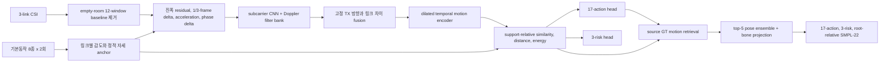

# NotiFi CSI-to-Pose

카메라 없이 3-link Wi-Fi CSI만으로 17개 행동, 3단계 위험도, SMPL-22 3D 동작을 추정하는 연구 코드입니다. 영상과 GVHMR는 source 학습용 GT로만 사용하며 배포 추론 입력에는 포함하지 않습니다.

## 현재 모델: CAL20 + CAL17 + CAL23 v4

현재 승격 모델은 다음 세 부분으로 구성됩니다.

1. **CAL20-RELATIVE-MOTION-DG**: 정적 반사와 trial 크기를 제거하고 support-relative CSI motion을 인코딩합니다.
2. **CAL17-SAFE-STYLE-TRANSPORT**: 새 사용자의 안전한 기본동작 anchor로 source 행동 prototype을 target 공간에 옮깁니다.
3. **CAL23-POSE-ENSEMBLE**: CSI가 선택한 source GT 궤적 5개를 결합해 물리적으로 가능한 3D 동작을 시뮬레이션합니다.

CAL20은 337,043개 학습 파라미터이며 model state는 약 1.35 MB입니다. 58.3 MB 배포 bundle 중 약 56.82 MB는 신경망이 아니라 1,210개 source pose 후보 라이브러리입니다.



### 핵심 설계

- **환경 기준 제거**: 빈 공간 CSI 12개 window를 평균해 정적 multipath 기준을 빼고, 링크별 움직임 감도는 안전한 전환 동작으로 정규화합니다.
- **동작 우선 표현**: trial별 feature 평균과 분산을 제거하고, TX1/TX2/TX3의 고정 방향과 링크 간 차이만 보존합니다.
- **source-only domain generalization**: 다른 site의 같은 행동만 positive로 묶는 supervised contrastive loss와 site adversarial head를 사용합니다.
- **시간 오차 허용**: source GT motion descriptor 학습은 ±6프레임 shift 중 최소 손실을 사용합니다.
- **좌표보다 자세 우선**: 복원은 pelvis-relative SMPL-22를 사용하며 정확한 방 안 절대 위치는 목표에서 분리합니다.
- **누수 방지**: outer subject, yja label/GT, query pose는 모델·threshold·calibration 선택에 사용하지 않습니다.

## 현재 성능

평가는 `ajh`, `mhw`, `lmh`를 사람 단위로 통째로 제외하는 nested source LOSO입니다. epoch는 24로 고정하고 epoch 8~24 SWA를 사용했습니다. 아래 값은 사전에 고정한 support seed 17017의 7개 outer site, 1,098개 query pooled 결과입니다. Macro-F1도 site 평균이 아니라 전체 pooled confusion matrix에서 다시 계산했습니다.

### 분류와 calibration

| 모델 | 17-action Acc | Action Macro-F1 | 3-risk Acc | Risk Macro-F1 | Danger Recall | Danger 5종 Acc | Non-danger Specificity |
|---|---:|---:|---:|---:|---:|---:|---:|
| CAL14 이전 기준 | 8.47% | 7.14% | 35.61% | 29.52% | 45.71% | 10.95% | 65.73% |
| CAL20, calibration 전 | 27.41% | 20.90% | 47.09% | 34.60% | 29.52% | 8.57% | 89.08% |
| **CAL20 + CAL17 v4** | **35.52%** | **27.60%** | 43.44% | 31.74% | **40.48%** | 5.71% | 76.84% |

CAL17은 action과 danger recall을 크게 높이지만 danger 세부유형은 아직 구분하지 못합니다. 임의 unseen에서 seen 수준이라고 주장할 수 있는 상태가 아닙니다.

site별 최악값은 Action 27.39%, Danger recall 10.00%, Non-danger specificity 55.26%입니다. 7개 site 간 표준편차도 각각 5.60%p, 22.89%p, 14.88%p로 특히 위험 탐지가 불안정합니다. pooled 평균보다 worst-site가 훨씬 낮으므로 현재 모델은 임의 환경 보장 모델이 아니라 source-LOSO 기준선입니다.

### 3D 동작 시뮬레이션

| 모델 | Pose | Distal | PA-Pose | Danger Pose | Danger Distal |
|---|---:|---:|---:|---:|---:|
| CAL15 단일 궤적 | 30.61 cm | 45.27 cm | **10.58 cm** | 38.24 cm | 56.57 cm |
| **CAL23 v4 top-5 ensemble** | **29.68 cm** | **44.20 cm** | 11.27 cm | **37.82 cm** | **56.13 cm** |

CAL23은 전체·말단·낙상 오차를 줄였지만 PA-Pose는 0.72 cm 나빠졌습니다. “정답 궤적 복원”보다 CSI와 일치하는 가능한 동작 시뮬레이션에 가깝습니다.

### Seen 참고값

기존 `KP10-ACTION-FUSED-45` seen test는 pose 12.885 cm, danger pose 19.829 cm, 17-action 95.74%, 3-risk 97.26%, danger recall 92.86%였습니다. 현재 source-LOSO와 큰 차이가 있으며, 이는 CSI가 사람·환경 지문을 강하게 포함한다는 증거입니다.

## Calibration 계약

새 사용자·환경에서 다음 CSI만 수집합니다.

- empty-room 12개 window
- 걷기, 서기, 앉기, 눕기, 눕기→서기, 서기→눕기, 앉기→서기, 서기→앉기 각 2회
- 총 28개 window, target GT와 영상은 불필요

동일 query 1,042개로 support 수를 비교한 결과입니다.

| 동작별 support | Action Acc | Risk Acc | Danger Recall | Specificity |
|---|---:|---:|---:|---:|
| 1회, 총 8개 | 30.33% | 41.84% | 26.67% | 85.26% |
| **2회, 총 16개** | **33.49%** | 41.55% | **40.48%** | 76.21% |
| 3회, 총 24개 | 33.78% | **42.80%** | 29.52% | 84.63% |

같은 동작을 세 번 반복하면 action만 0.29%p 오르고 danger가 10.95%p 하락했습니다. 현재 권장값은 동작별 2회입니다.

2개 absence를 고르는 seed를 네 번 바꾸면 danger recall은 28.10~42.86%, specificity는 74.76~89.64%로 흔들렸습니다. 12개 전체를 평균하면 Action 35.52%, danger 40.48%, specificity 76.84%로 seed 의존성이 사라져 v4 계약으로 승격했습니다. 안전한 기본동작만으로 낙상 경계를 완전히 calibration할 수 없다는 한계는 남습니다.

CAL20 학습 episode는 기존과 같은 absence 2개를 사용하지만 canonicalizer는 개수와 무관한 평균 baseline을 계산합니다. 같은 checkpoint의 source nested LOSO에서 2/4/6/12개를 직접 비교한 뒤 배포 입력만 12개로 승격했습니다.

12-window baseline에서 support seed 다섯 개를 바꾸면 Action은 평균 34.06%, 표준편차 0.99%p, 최악 32.88%였습니다. Danger recall은 평균 33.62%, 표준편차 4.02%p, 최악 28.57%였습니다. 세 후보 중 latent가 가까운 두 개를 자동 선택하는 실험도 danger 평균이 31.62%로 낮아 폐기했습니다. 따라서 표의 고정 protocol 수치와 실제 support 변동성을 함께 봐야 합니다.

### RF 변화 스트레스

고정 checkpoint와 calibration 설정을 유지하고 outer target의 support·absence·query에만 큰 링크별 gain/phase 변화를 합성했습니다. Action은 35.52%로 유지됐고 danger recall은 40.48→37.14%였습니다. 반면 링크 완전 손실은 별도 고장 조건입니다.

| 조건 | Action Acc | Risk Acc | Danger Recall | Specificity |
|---|---:|---:|---:|---:|
| clean | 35.52% | 43.44% | 40.48% | 76.84% |
| gain + phase shift | 35.52% | 42.71% | 37.14% | 76.65% |
| TX1 loss | 32.42% | 40.53% | 33.33% | 73.82% |
| TX2 loss | 34.15% | 39.44% | 61.43% | 61.58% |
| TX3 loss | 33.15% | 40.98% | 39.52% | 70.43% |

이는 실제 새 방 측정이 아니라 source outer에 가한 결정적 합성 스트레스이므로 arbitrary unseen 보장의 근거로 과장하지 않습니다.

RTX 5060 Ti에서 16개 support를 포함한 encoder forward는 단일 trial 평균 31.7 ms, batch 8 평균 40.4 ms였습니다. CAL17 분류까지 36.3 ms, CAL23 3D 복원까지 46.1 ms였습니다. CSI 수집·cache 전처리 시간은 제외한 값입니다.

## 배포 bundle

`deployment_model.pt`, CAL17 source prototype, CAL23 source pose library를 하나로 묶습니다. 설정은 yja가 아니라 nested source fold에서 선택된 값의 중앙값으로 고정합니다.

```powershell
python scripts/export_cal20_deployment.py `
  --run-dir work_v2/runs/cal20_relative_motion_dg_v1_swa `
  --calibration work_v2/runs/cal20_relative_motion_dg_v1_swa/cal17.json `
  --pose-result work_v2/runs/cal20_relative_motion_dg_v1_swa/cal23.json `
  --uniform-grid-result work_v2/runs/cal20_relative_motion_dg_v1_swa/uniform_grid_risk.json `
  --output work_v2/runs/cal20_relative_motion_dg_v1_swa/deployment.pt `
  --absence-trials 12
```

현장 API는 cache 전처리와 같은 `[B,304,3,114,2]` CSI tensor와 `[B,304,3]` link mask를 받습니다.

```python
from notifi_pose.deployment import CAL20Deployment, load_csi_csv_batch

runtime = CAL20Deployment.load("deployment.pt")
support_csi, support_mask, _ = load_csi_csv_batch(support_csv_paths)
absence_csi, absence_mask, _ = load_csi_csv_batch(absence_csv_paths)
calibration = runtime.calibrate(
    support_csi, support_mask, support_labels,
    absence_csi, absence_mask,
)
query_csi, query_mask, quality = load_csi_csv_batch(query_csv_paths)
result = runtime.predict(query_csi, query_mask, calibration)
```

`result`에는 17-action/3-risk 확률과 ID, root-relative SMPL-22 pose, top-5 retrieval trial ID, 링크별 coverage와 `abstain`이 포함됩니다. coverage 50% 이상인 링크가 두 개 미만일 때만 결과를 사용할 수 없는 입력으로 표시합니다. 기본동작 anchor geometry가 source 범위를 벗어나면 `calibration_domain_warning`을 함께 내지만 추론을 막지는 않습니다. hard gate는 숨긴 source site도 3/7만 통과해 폐기했습니다. 실제 v4 bundle은 58.3 MB이며 source prototype 7개 site와 source pose 후보 1,210개, 입력 결과 파일의 SHA-256을 포함했습니다. 새 query의 label, 영상, pose GT는 API 인자가 아닙니다.

### 카메라 없는 시간 격자

학습 cache는 정확한 GT pairing을 위해 video timestamp 시각에 CSI를 보간하지만, 실제 제품은 카메라 없이 CSI 자체의 30Hz 격자를 사용합니다. v4의 source-inner 위험 설정 중앙값을 모든 fold에 고정하면 raw 30Hz에서 Action 36.52%, Action F1 27.43%, Risk 41.71%, Risk F1 32.16%, Danger 40.95%, Specificity 77.78%입니다. timestamp-grid Danger 40.48%와 0.48%p 차이로 시간 격자 gap은 사실상 닫혔지만, arbitrary unseen 보장을 뜻하지는 않습니다.

## 데이터 분석

사용한 source는 `ajh/E01-E03`, `mhw/E01-E03`, `lmh/E01`입니다. `yja/E02`는 봉인된 최종 unseen test이며 이번 구조 선택과 실험에 사용하지 않았습니다. `yja/E01`, `yja/E03`은 CSI 품질 문제로 제외합니다.

- raw feature에서 subject probe 99.07%, site probe 98.28%로 사람·환경 지문이 행동보다 매우 강했습니다.
- subject-LOSO 17-action은 10.58%, dynamic-only는 11.74%로 raw 통계만으로 행동 일반화가 어려웠습니다.
- target support shift는 absence 1.070, static 0.837, dynamic 0.536으로 정적 환경 변화가 가장 컸습니다.
- yja support의 링크 motion correlation은 약 0.94~0.96으로 source보다 높아, 링크 방향 차이가 약해지는 환경이 존재했습니다.
- CAL20은 절대 state를 head에 직접 전달하지 않고 target support와의 상대 거리·유사도만 사용해 이 문제를 줄였습니다.

| site | 평균 동적 분산 | 평균 진폭 속도 | 평균 coverage | 링크 motion 상관 | 관찰된 특징 |
|---|---:|---:|---:|---:|---|
| ajh E01-E03 | 1.90 | 7.67 | 0.936 | 0.489 | E03의 coverage가 가장 낮고 mask 단절이 많음 |
| mhw E01-E03 | 2.77 | 8.47 | 0.983 | 0.710 | 높은 동적 분산과 안정적인 packet coverage |
| lmh E01 | 2.71 | 11.93 | 0.975 | 0.821 | source 중 속도·가속도 에너지가 가장 큼 |
| yja E02 calibration 28개 | 1.48 | 7.68 | 0.986 | 0.970 | 정적 크기는 높고 링크별 움직임은 지나치게 비슷함 |

`yja E02` 행은 12개 absence와 사전에 정한 16개 calibration support만의 진단입니다. query 행동 label, 영상, pose GT, test 성능은 사용하지 않았습니다.

분석 재현:

```powershell
python scripts/analyze_cal12_domains.py `
  --work-root $env:NOTIFI_WORK_ROOT `
  --output work_v2/reports/cal12_domain_analysis
```

## 학습과 평가

```powershell
$env:NOTIFI_DATASET_ROOT = "D:\NotiFi-3D\Dataset_Splits\NotiFi_CSI_GVHMR_v2_LOSO_60_15_25"
$env:NOTIFI_WORK_ROOT = "C:\path\to\work_v2"
```

### 1. CAL20 source nested LOSO

```powershell
python scripts/train_cal20_source_folds.py `
  --run-dir work_v2/runs/cal20_relative_motion_dg_v1_swa `
  --epochs 24 --batch-size 8 --use-doppler --phase-strength 0.25 `
  --motion-grounding --lambda-motion-grounding 0.30 `
  --fixed-swa --swa-start 8
```

### 2. CAL17 basic-action calibration

```powershell
python scripts/calibrate_cal17_style_transport.py `
  --run-dir work_v2/runs/cal20_relative_motion_dg_v1_swa `
  --output work_v2/runs/cal20_relative_motion_dg_v1_swa/cal17.json `
  --absence-trials 12
```

Support 안정성은 `--support-seed`, 반복 수는 `--shots-per-prompt`, 공통 query 비교는 `--query-exclusion-shots`로 재현할 수 있습니다.

### 3. CAL23 CSI-only pose simulation

```powershell
python scripts/evaluate_cal23_pose_ensemble.py `
  --run-dir work_v2/runs/cal20_relative_motion_dg_v1_swa `
  --calibration work_v2/runs/cal20_relative_motion_dg_v1_swa/cal17.json `
  --output work_v2/runs/cal20_relative_motion_dg_v1_swa/cal23.json `
  --absence-trials 12
```

### 4. 합성 RF stress

```powershell
python scripts/evaluate_cal20_rf_stress.py `
  --run-dir work_v2/runs/cal20_relative_motion_dg_v1_swa `
  --calibration work_v2/runs/cal20_relative_motion_dg_v1_swa/cal17.json `
  --output work_v2/runs/cal20_relative_motion_dg_v1_swa/rf_stress.json `
  --absence-trials 12
```

### 5. 카메라 없는 uniform grid

```powershell
python scripts/evaluate_cal20_uniform_grid.py `
  --run-dir work_v2/runs/cal20_relative_motion_dg_v1_swa `
  --calibration work_v2/runs/cal20_relative_motion_dg_v1_swa/cal17.json `
  --dataset-root $env:NOTIFI_DATASET_ROOT `
  --output work_v2/runs/cal20_relative_motion_dg_v1_swa/uniform_grid.json `
  --retune-risk-on-inner --absence-trials 12
```

`--retune-on-inner`는 grid-aware CAL17 실험 재현용이며 현재 승격 설정은 아닙니다.
배포용 위험 설정은 `--retune-risk-on-inner` 결과를 exporter의 `--uniform-grid-result`에 전달합니다.

### 6. Calibration geometry 진단

```powershell
python scripts/evaluate_calibration_geometry_gate.py `
  --run-dir work_v2/runs/cal20_relative_motion_dg_v1_swa `
  --output work_v2/runs/cal20_relative_motion_dg_v1_swa/geometry_gate.json `
  --absence-trials 12
```

## 실험 로그

최신순이며, outer 결과를 보고 설정을 다시 고른 실험은 없습니다.

| 번호 | 날짜/시간 KST | 목적 | 결과 | 판정 |
|---|---|---|---|---|
| 52 | 2026-08-08 07시 | deployment target 누수 fail-closed | yja·target subject·query label/GT 표식 하나라도 오염 시 runtime 로드 거부 | **채택** |
| 51 | 2026-08-08 07시 | staged 코드 최종 재현 | CAL17·CAL23 fold별 설정과 전체 JSON이 공식 결과와 완전 일치 | **통과** |
| 50 | 2026-08-08 07시 | v4 배포 계약·출처 최종 감사 | absence 개수 불일치 즉시 차단, source 7-site·yja 봉인·3개 결과 해시 검증 | **통과** |
| 49 | 2026-08-08 06시 | 3회 수집 후 latent-consistent 2회 선택 | Action 평균 +0.86%p, danger 평균 -1.62%p | 폐기 |
| 48 | 2026-08-08 06시 | v4 actual raw serving smoke | 16 support+12 absence, 분류·SMPL-22·retrieval 정상 | **통과** |
| 47 | 2026-08-08 06시 | v4 합성 RF stress | gain/phase Action 변화 0, danger -3.33%p; link loss 취약 | 정적 shift 통과 |
| 46 | 2026-08-08 06시 | 12-window CAL23 재평가 | Pose 29.68 cm, danger 37.82 cm | **채택** |
| 45 | 2026-08-08 06시 | 12-window uniform 30Hz 고정 bundle | Action 36.52%, danger 40.95%, specificity 77.78% | **채택** |
| 44 | 2026-08-08 06시 | absence 2/4/6/12개 안정성 | 2개 danger 표준편차 6.27%p, 12개 seed 의존성 제거 | **12-window 채택** |
| 43 | 2026-08-08 06시 | anchor geometry 기반 CAL17 연속 shrink | 3/3 fold가 inner에서 shrink 없음 선택, outer 동일 | 폐기, warning-only 유지 |
| 42 | 2026-08-08 06시 | 저수준 링크 공통성분 제거 probe | site-LOSO 16.94→6.86%, common+relative hybrid 17.19% | 완전 제거 폐기, CAL20 hybrid 유지 |
| 41 | 2026-08-08 06시 | 1,210 source + 허용된 target support 도메인 재분석 | subject/site fingerprint 99.07/98.28%, yja query label·GT 미사용 | **통과** |
| 40 | 2026-08-08 06시 | 정리된 최종 코드로 CAL23 재현 | 기존 3개 outer fold와 수치·설정 완전 일치 | **통과** |
| 39 | 2026-08-08 06시 | raw CSV→calibration→분류·복원 serving smoke | 16 support+2 absence, 모든 출력·retrieval ID 정상 | **통과** |
| 38 | 2026-08-08 06시 | source-only anchor geometry hard gate | 숨긴 site 3/7만 통과 | hard gate 폐기, warning만 유지 |
| 37 | 2026-08-08 06시 | uniform-grid risk-only source-inner retune | 고정 bundle: Action 37.34%, danger 40.00%, specificity 79.47% | v3에서 채택 |
| 36 | 2026-08-08 06시 | uniform-grid inner CAL17 retune | Danger 40.00%, Action F1 27.52% | 폐기 |
| 35 | 2026-08-08 06시 | 카메라 없는 균일 30Hz raw CSV 평가 | Action 37.34%, danger 36.19%, specificity 83.05% | loader 채택, 위험 gap 기록 |
| 34 | 2026-08-08 06시 | source-only deployment bundle/API | 58.3 MB, 17-action·3-risk·SMPL-22 end-to-end smoke 통과 | v3 기반 채택 |
| 33 | 2026-08-08 06시 | target-only gain/phase 및 link-loss stress | gain/phase action -0.27%p, TX1 loss -2.91%p | 정적 shift 통과, 링크 고장은 잔여 문제 |
| 32 | 2026-08-08 05시 | CAL20 action + CAL31 risk no-harm 결합 | Risk F1 37.92%, danger recall 25.71% | 폐기 |
| 31 | 2026-08-08 05시 | 8-bin temporal pyramid | Action 28.05%, danger recall 20.00% after CAL17 | 폐기 |
| 30 | 2026-08-08 04시 | calibration scale clip 2→4 | Action 35.43%, 개선 없음 | 폐기 |
| 29 | 2026-08-08 04시 | anchor ridge geometry alignment | Action 33.33%, danger 41.43% | 폐기 |
| 27 | 2026-08-08 04시 | CSI motion 기반 속도·shift 정렬 | Danger pose -0.16 cm, 170초 추가 | 폐기 |
| 26 | 2026-08-08 04시 | stronger adversarial/contrastive invariance | Action 33.70% after CAL17 | 폐기 |
| 25 | 2026-08-08 04시 | GroupDRO worst-site 최적화 | Action 32.70%, subtype 2.38% | 폐기 |
| 23 | 2026-08-08 | top-5 train-pose ensemble | Pose 29.74 cm, danger 37.81 cm | **채택** |
| 20+17 | 2026-08-08 | relative-motion encoder + safe style transport | Action 36.16%, danger recall 41.90% | v3 기준선 |

## 남은 핵심 문제

1. **Danger 5종 구분 5.71%**: 현재 CSI embedding이 낙상 문맥과 말단 방향을 충분히 분리하지 못합니다.
2. **Danger distal 56.13 cm**: CSI motion descriptor가 source GT 궤적의 올바른 팔·다리 가설을 고르기에는 약합니다.
3. **링크 고장 취약성**: TX1 손실은 action을 약 3.1%p 낮추고, TX2 손실은 specificity를 61.58%까지 낮춰 과경보를 만듭니다.
4. **사람 일반화 표본 부족**: source가 사실상 3명이고 `lmh`는 E01만 있어 arbitrary unseen 보장을 할 수 없습니다.
5. **안전 support의 한계**: 기본동작은 환경 기준선에는 유용하지만 실제 낙상 경계를 직접 관측하지 않습니다.
6. **정확한 절대 위치**: 설치 거리·높이가 고정되지 않아 별도 geometry 입력 없이는 신뢰하기 어렵습니다.

현재 현실적인 목표는 CSI-only 행동·위험 탐지와 가능한 3D 낙상 시뮬레이션입니다. 부상 부위나 최초 접촉 부위를 임상 수준으로 확정하는 모델은 아닙니다.

## 주요 파일

- `notifi_pose/cal12.py`: 물리 기반 support canonicalization과 domain loss
- `notifi_pose/cal13.py`: source pose motion descriptor와 shift-robust loss
- `notifi_pose/cal14.py`: cosine classifier
- `notifi_pose/cal17.py`: safe-anchor prototype transport
- `notifi_pose/cal20.py`: 현재 relative-motion encoder
- `notifi_pose/deployment.py`: calibration과 CSI-only 분류·복원 배포 API
- `scripts/train_cal20_source_folds.py`: CAL20 source nested LOSO 학습
- `scripts/source_calibration_data.py`: cache·support·absence episode 공용 도구
- `scripts/calibrate_cal17_style_transport.py`: calibration 선택과 평가
- `scripts/evaluate_cal23_pose_ensemble.py`: CSI-only 3D pose simulation
- `scripts/evaluate_cal20_rf_stress.py`: target-only RF 변화와 링크 손실 검증
- `scripts/evaluate_cal20_uniform_grid.py`: 카메라 없는 30Hz raw CSI 평가
- `scripts/evaluate_calibration_geometry_gate.py`: source-only domain warning 진단
- `scripts/export_cal20_deployment.py`: source prototype과 pose library bundle 생성

Checkpoint와 원본 데이터는 용량 및 개인정보 때문에 Git에 포함하지 않습니다.

## 검증

```powershell
python -m compileall -q notifi_pose scripts tests
python -m unittest discover -s tests -p "test_*.py"
```

최종 승격 시 전체 224개 테스트를 통과했습니다. 새 테스트 20개는 calibration window 수, exporter·runtime target 누수 차단, 불완전 support 거부, CSI-only 분류·pose simulation, nested split, 시간 이동 허용 손실과 모델 복원을 검사합니다.
