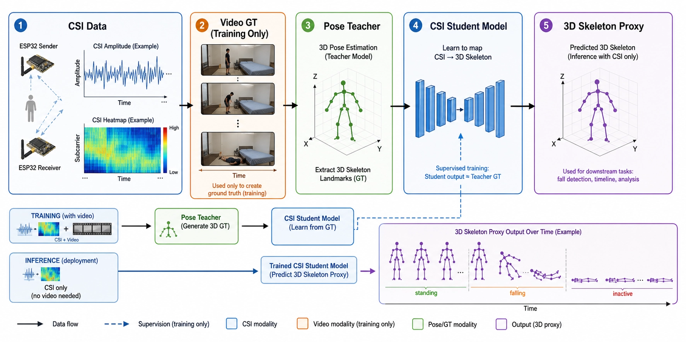

# NotiFi CSI-to-Pose

NotiFi CSI-to-Pose는 WiFi CSI 신호만으로 사람의 자세와 움직임 흐름을 **3D skeleton proxy**로 복원하는 실험 기능입니다.




## 1. 기능 요약

카메라 기반 낙상 감지는 노인의 얼굴, 신체, 생활 공간이 노출되어 사생활 침해 우려가 큽니다.  
단순 safe/alert 분류만으로는 왜 위험하다고 판단했는지 보호자와 사용자가 이해하기 어렵습니다.  
낙상, 불안정 보행, 무활동은 순간적인 결과보다 몸의 움직임 흐름을 함께 봐야 정확한 해석이 가능합니다.  
CSI-to-Pose는 WiFi CSI 신호만으로 사람의 자세와 움직임을 3D skeleton proxy로 복원하는 실험 기능입니다.  
학습 단계에서는 CSI와 동기화된 영상에서 pose teacher GT를 추출하고, 실제 사용 단계에서는 CSI만 입력받습니다.  
예측 대상은 머리, 어깨, 팔꿈치, 손목, 골반, 무릎, 발목으로 구성된 13-point skeleton입니다.  
시간에 따른 skeleton sequence를 통해 자세 변화, 낙상 시작/종료 구간, 움직임 후 정지 여부를 추정합니다.  
첫 설정 단계에서 body template 또는 SMPL-X 기반 체형 정보를 선택적으로 생성해 개인 체형 차이를 보정합니다.  
CSI-to-Pose는 safe/alert 모델의 판단 결과에 “어떤 움직임 때문에 위험했는지”를 설명하는 보조 기능으로 활용됩니다.  
이를 통해 카메라 없이도 낙상/보행/무활동 흐름을 해석하여 개인정보 보호와 위험 감지 설명 가능성을 동시에 높입니다.

## 2. 폴더 구성

```text
CSI-to-Pose/
  README.md
  requirements.txt
  scripts/
    save_csi_raw.py
    collect_csi_video.py
    preview_pose_camera.py
    extract_pose_features.py
    build_body_shape_template.py
    train_csi_to_pose.py
    render_pose_comparison.py
  docs/
    feature_spec_and_dataset_manual_2026-06-30.md
  assets/
    csi-to-pose-overview.png
    unstable-walking-csi-to-pose-human-readable.gif
```

생성 데이터는 기본적으로 아래에 저장됩니다.

```text
CSI-to-Pose/csi_to_pose/
  data/
  videos/
  pose_gt/
  pose_overlays/
  pose_plots/
  body_templates/
  models/
  collection_logs/
```

`csi_to_pose/` 아래 산출물은 용량과 개인정보 이슈가 있어 git에 올리지 않습니다.

## 3. 환경 준비

각자 로컬에서 레포를 받은 뒤 `CSI-to-Pose` 폴더로 이동합니다.

```bash
cd PATH_TO_NOTIFI/CSI-to-Pose
python -m pip install -r requirements.txt
```

macOS에서 matplotlib 캐시 권한 문제가 있으면 아래처럼 실행합니다.

```bash
export MPLCONFIGDIR=/private/tmp/mplconfig
```

Windows PowerShell 예시:

```powershell
cd PATH_TO_NOTIFI\CSI-to-Pose
python -m pip install -r requirements.txt
```

## 4. 포트와 카메라 확인

### macOS 포트 확인

```bash
find /dev -maxdepth 1 \( -name 'cu.usbmodem*' -o -name 'cu.usbserial*' \) -print
```

예:

```text
/dev/cu.usbmodem101
```

### Windows 포트 확인

장치 관리자에서 `USB Serial Device (COMx)`를 확인하거나 PowerShell에서 확인합니다.

```powershell
[System.IO.Ports.SerialPort]::GetPortNames()
```

예:

```text
COM4
```

### 카메라 확인

먼저 skeleton이 잘 잡히는지 확인합니다.

```bash
python scripts/preview_pose_camera.py --camera 0
```

카메라가 여러 개면 `--camera 1`, `--camera 2`를 시도합니다.  
창이 뜨면 전신이 최대한 보이게 서고, `POSE DETECTED`가 안정적으로 나오는지 확인합니다.  
종료는 preview 창에서 `q`를 누릅니다.

## 5. 수집 전 기기 세팅

| 항목 | 기준 |
| --- | --- |
| 보드 | Seeed Studio XIAO ESP32-C6 기반 sender 1개, receiver 1개 |
| 펌웨어 | ESP-CSI `csi_send`, `csi_recv` |
| 송수신기 거리 | 1.5m 권장 |
| 허용 거리 | 1.2m-2.0m, 단 한 세션 중 위치 고정 |
| 보드 높이 | 70-100cm |
| 안테나 방향 | 두 보드 모두 세로 방향 고정 |
| 사람 위치 | sender-receiver 사이 또는 바로 근처 |
| 카메라 위치 | 정면 또는 대각 정면 |
| 영상 범위 | 머리부터 발목까지 최대한 포함 |
| 조명 | MediaPipe가 관절을 잡을 수 있을 정도로 밝게 |

권장 배치:

```text
receiver --- 75cm --- 사람 행동 영역 --- 75cm --- sender
```

## 6. CSI + Video 동시 수집

기본 명령 형식:

```bash
python scripts/collect_csi_video.py \
  --port "COM_PORT" \
  --subject "SUBJECT" \
  --label "LABEL" \
  --trial t001 \
  --duration DURATION_SECONDS \
  --repeat REPEAT_COUNT \
  --ambient quiet \
  --delay 3 \
  --break_sec 1.5 \
  --camera 0 \
  --preview_pose \
  --note "csi_to_pose_collection"
```

macOS 예시:

```bash
python scripts/collect_csi_video.py \
  --port "/dev/cu.usbmodem101" \
  --subject "yja" \
  --label unstable_walking \
  --trial t001 \
  --duration 20 \
  --repeat 25 \
  --ambient quiet \
  --delay 3 \
  --break_sec 1.5 \
  --camera 0 \
  --preview_pose \
  --note "camera_front, 1.5m, unstable_walking"
```

Windows PowerShell 예시:

```powershell
python scripts\collect_csi_video.py `
  --port "COM4" `
  --subject "mhw" `
  --label unstable_walking `
  --trial t001 `
  --duration 20 `
  --repeat 25 `
  --ambient quiet `
  --delay 3 `
  --break_sec 1.5 `
  --camera 0 `
  --preview_pose `
  --no_sound `
  --note "camera_front, 1.5m, unstable_walking"
```

수집 중에는 시작 직후 손을 크게 들거나 박수 1회를 해서 CSI와 video sync 지점을 남깁니다.

## 7. Pose GT 추출

수집이 끝나면 각 MP4에서 13-point skeleton proxy와 derived feature를 추출합니다.

```bash
python scripts/extract_pose_features.py \
  --video csi_to_pose/videos/warning/gait/unstable_walking/SUBJECT/SUBJECT_unstable_walking_t001.mp4 \
  --label unstable_walking \
  --subject SUBJECT \
  --trial t001
```

예:

```bash
python scripts/extract_pose_features.py \
  --video csi_to_pose/videos/warning/gait/unstable_walking/yja/yja_unstable_walking_t001.mp4 \
  --label unstable_walking \
  --subject yja \
  --trial t001
```

생성 파일:

```text
csi_to_pose/pose_gt/full_33_landmarks/{label}/{subject}/...
csi_to_pose/pose_gt/proxy_13/{label}/{subject}/...
csi_to_pose/pose_overlays/{label}/{subject}/...
csi_to_pose/pose_plots/{label}/{subject}/...
```

성공 기준:

```text
pose detected rate >= 90%
head / shoulder / hip / knee가 안정적으로 잡힘
overlay 영상에서 skeleton이 심하게 튀지 않음
```

## 8. Body Template 생성

여러 trial의 proxy13 결과를 기반으로 사람 형태가 읽히는 body shape proxy를 만들 수 있습니다.

```bash
python scripts/build_body_shape_template.py \
  --label unstable_walking \
  --subject SUBJECT \
  --trials t001 t002 t003 t004 t005 t006 t007 t008 t009 t010
```

출력:

```text
csi_to_pose/body_templates/{subject}/{subject}_body_shape_template.json
```

이 파일은 `render_pose_comparison.py`에서 skeleton 아래에 사람 형태 proxy를 덧그릴 때 사용됩니다.

## 9. Pilot 학습 및 복원 확인

`train_csi_to_pose.py`는 수집된 CSI와 proxy13 GT로 작은 TCN pilot 모델을 학습합니다.  
먼저 하나의 label에서 복원이 되는지 확인하는 용도입니다.

```bash
python scripts/train_csi_to_pose.py \
  --label unstable_walking \
  --subject SUBJECT \
  --trials t001 t002 t003 t004 t005 t006 t007 t008 t009 t010 \
  --train_trials t001 t002 t003 t004 t005 t006 t007 t008 \
  --val_trials t009 \
  --test_trials t010 \
  --epochs 80 \
  --log_every 10
```

예측 결과를 사람이 보기 좋게 렌더링합니다.

```bash
python scripts/render_pose_comparison.py \
  --prediction csi_to_pose/models/unstable_walking/SUBJECT/predictions/SUBJECT_unstable_walking_t010_prediction.csv
```

출력:

```text
csi_to_pose/models/{label}/{subject}/human_readable/
```

## 10. 수집 라벨 및 개수

라벨당 10회는 복원 성능 확인에 부족했습니다.  
시간이 빠듯한 v1 기준으로 아래처럼 수집합니다.

### Priority A: 필수 수집

총 275 trials.

| label | 초/trial | 횟수 | 목적 |
| --- | ---: | ---: | --- |
| `standing_still` | 20 | 25 | 서 있는 기본 skeleton |
| `sitting_still` | 20 | 25 | 앉은 자세 skeleton |
| `lying_still` | 20 | 25 | 누운 자세 skeleton |
| `walking` | 20 | 25 | 정상 보행 |
| `unstable_walking` | 20 | 25 | 불안정 보행 |
| `sit_to_stand` | 10 | 25 | 앉기에서 서기 |
| `stand_to_sit` | 10 | 25 | 서기에서 앉기 |
| `lie_to_stand` | 10 | 25 | 누운 상태에서 일어나기 |
| `stand_to_lie_normal` | 10 | 25 | 선 상태에서 눕기 |
| `bed_exit_failed` | 10 | 25 | 침대에서 일어나려다 실패 |
| `post_fall_inactive` | 20 | 25 | 낙상 후 무활동 |

### Priority B: 성능 개선용

총 105 trials.

| label | 초/trial | 횟수 | 목적 |
| --- | ---: | ---: | --- |
| `hand_move` | 20 | 15 | 손/팔 움직임 |
| `bed_sitting_to_stand_fall` | 10 | 15 | 침대 앉은 상태에서 일어서다 낙상 |
| `bed_lying_to_stand_fall` | 10 | 15 | 침대 누운 상태에서 일어나려다 낙상 |
| `chair_sitting_to_stand_fall` | 10 | 15 | 의자에서 일어서다 낙상 |
| `chair_stand_to_sit_fall` | 10 | 15 | 의자에 앉으려다 낙상 |
| `lying_convulsive_like_movement` | 10 | 15 | 경련 의심 움직임 |
| `normal_breathing_visible` | 20 | 15 | 정상 호흡 참고 |

### Priority C: 시간이 남을 때

| label | 초/trial | 횟수 | 목적 |
| --- | ---: | ---: | --- |
| `walking_trip_fall` | 10 | 10 | 보행 중 발 걸림 낙상 |
| `walking_turn_fall` | 10 | 10 | 방향 전환 중 낙상 |
| `lying_fast_breath` | 20 | 10 | 빠른 호흡 |
| `lying_slow_breath` | 20 | 10 | 느린 호흡 |
| `lying_irregular_breath` | 20 | 10 | 불규칙 호흡 |

## 11. 품질 확인 체크리스트

각 trial 이후 확인합니다.

```text
CSI_DATA frame이 0개가 아닌가?
MP4 영상이 정상 재생되는가?
사람 전신 또는 최소 머리/어깨/골반/무릎이 보이는가?
pose detected rate가 90% 이상인가?
overlay에서 skeleton이 심하게 튀거나 뒤집히지 않는가?
label과 다른 행동이 섞이지 않았는가?
```

실패한 trial은 삭제하고 같은 trial 번호로 다시 수집합니다.

## 12. 안전 수칙

낙상 라벨은 실제로 세게 넘어지지 않습니다.

```text
매트, 침대, 이불 등 충격 완화 공간에서만 수행
빠르게 쓰러지지 말고 천천히 무너지는 방식으로 수집
혼자 수집할 경우 보행 낙상은 Priority C로 미룸
어지러움, 통증, 호흡 불편이 있으면 즉시 중단
```

## 13. 팀원별 기본 실행 예시

각자 아래 값만 바꿔서 사용합니다.

```text
SUBJECT: 본인 이니셜 또는 짧은 이름
PORT: 본인 receiver 포트
CAMERA: 본인 노트북 카메라 index
LABEL: 현재 수집 라벨
```

macOS:

```bash
export SUBJECT="yja"
export PORT="/dev/cu.usbmodem101"
export CAMERA="0"

python scripts/collect_csi_video.py \
  --port "$PORT" \
  --subject "$SUBJECT" \
  --label standing_still \
  --trial t001 \
  --duration 20 \
  --repeat 25 \
  --ambient quiet \
  --delay 3 \
  --break_sec 1.5 \
  --camera "$CAMERA" \
  --preview_pose \
  --note "csi_to_pose_v1, 1.5m, camera_front"
```

Windows PowerShell:

```powershell
$SUBJECT="mhw"
$PORT="COM4"
$CAMERA="0"

python scripts\collect_csi_video.py `
  --port "$PORT" `
  --subject "$SUBJECT" `
  --label standing_still `
  --trial t001 `
  --duration 20 `
  --repeat 25 `
  --ambient quiet `
  --delay 3 `
  --break_sec 1.5 `
  --camera "$CAMERA" `
  --preview_pose `
  --no_sound `
  --note "csi_to_pose_v1, 1.5m, camera_front"
```

## 14. 개인정보 원칙

CSI-to-Pose는 영상 복원 기능이 아닙니다.  
영상은 학습용 pose GT를 만들기 위한 도구이며, 실제 배포 단계에서는 사용하지 않습니다.

```text
Training only: CSI + Video
Deployment: CSI only
```

팀 공유 시에는 원본 영상보다 `proxy13.csv`, `overlay.mp4`, `derived_features.png`, 학습 결과를 우선 공유합니다.

## Updated mixed-subject training pipeline

The repository now includes an updated CSI-only pose reconstruction training flow:

- `scripts/train_csi_to_pose_mixed.py`
  - reads `split_manifest/manifest_full.csv`
  - uses `split_mode1` as the train/validation/test split by default
  - caches parsed CSI features as `.npz` files to avoid repeatedly parsing every raw CSI CSV
  - trains a residual TCN from CSI amplitude features to 13-point canonical 3D skeleton proxy
  - saves metrics, predictions, plots, a best checkpoint, and sample reconstruction videos
- `scripts/render_clinical_review.py`
  - renders GT vs CSI-only reconstruction videos
  - shows GT on the left and CSI-only reconstruction on the right
  - adds joint-motion and suspected load-region summaries
  - can render every test prediction with `--all-test`

Recommended training command:

```powershell
python scripts\train_csi_to_pose_mixed.py `
  --split-policy manifest `
  --epochs 70 `
  --patience 12 `
  --batch-size 512 `
  --amp `
  --out-root outputs\manifest_split_all_labels
```

Render every test reconstruction in the clinical review style:

```powershell
python scripts\render_clinical_review.py `
  --output-root outputs\manifest_split_all_labels `
  --all-test `
  --out-subdir clinical_review_videos_no_gray
```

Expected input layout:

```text
CSI-to-Pose/
  split_manifest/manifest_full.csv
  csi_to_pose_{subject}/
    csi/...
    pose_gt/proxy_13/...
```

Large generated artifacts such as feature caches, model checkpoints, predictions, and rendered videos should remain outside git or under ignored output directories.
