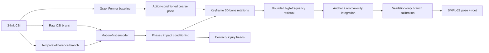
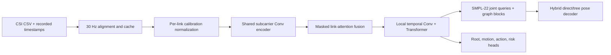
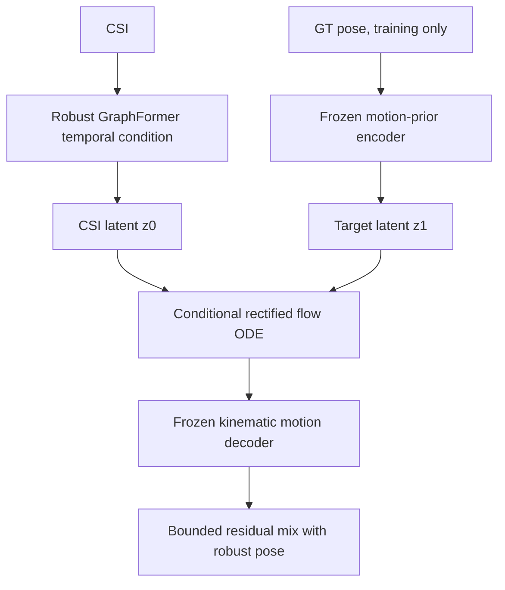
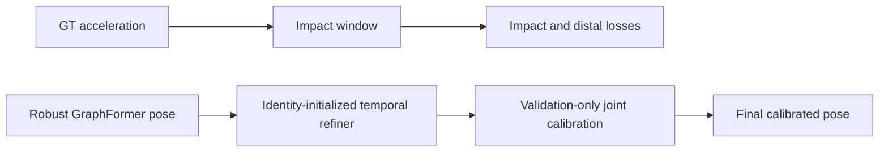

# NotiFi CSI-to-Pose

Wi-Fi CSI만 입력받아 시간에 따른 사람의 **GVHMR SMPL-22 3D pose와 root trajectory**를 복원하는 연구 코드입니다. 영상과 GVHMR은 학습용 GT 생성에만 사용하며, 검증과 실제 추론에는 CSI만 사용합니다.

- 기존 코드: [NotiFi-CSI-to-Pose `feature/goal1`](https://github.com/NotiFi2026/NotiFi-CSI-to-Pose/tree/feature/goal1)
- 현재 통합 위치: [NotiFi/CSI-to-Pose](https://github.com/jjyoon012-git/NotiFi/tree/main/CSI-to-Pose)
- 현재 권장 seen 모델: **6안 - quality-weighted phase-aware 6D rotation + keyframe root refinement**
- 현재 개발 순서: **seen 성능 확보 후 unseen/LOSO calibration 재개**
- 문서 정렬 원칙: **현재 권장 모델을 맨 위에 두고, 이전 안은 최신순으로 기록**

## 현재 모델: 6안 - Seen Reconstruction V2

현재는 사용자가 지정한
[`feature/goal1/work_v2/splits`](https://github.com/NotiFi2026/NotiFi-CSI-to-Pose/tree/feature/goal1/work_v2/splits)의
`single_split`을 사용한다. `ajh/lmh/mhw`와 `E01/E02/E03`이 train, validation,
test에 모두 포함되고 trial만 분리된 **seen-subject + seen-environment + unseen-trial**
protocol이다.

| Split | Pose trials | Subjects | Environments |
|---|---:|---|---|
| train | 1,556 | ajh, lmh, mhw | E01, E02, E03 |
| validation | 405 | ajh, lmh, mhw | E01, E02, E03 |
| test | 405 | ajh, lmh, mhw | E01, E02, E03 |

split 간 trial ID 중복은 0이며 yja와 LOSO 데이터는 현재 seen 학습과 모델 선택에
사용하지 않는다.



1. timestamp 완전성, 유효 link 수, CSI-GT motion correlation으로 trial 품질 가중치를 만든다.
2. root는 첫 anchor와 keyframe velocity residual을 적분해 궤적 연속성을 유지한다.
3. speed, moving, fall phase, impact, predicted action/risk로 decoder를 condition한다.
4. 4-frame keyframe의 6D bone rotation을 예측하고 SMPL tree FK로 bone length를 보존한다.
5. 저주파 rotation branch와 최대 2cm의 고주파 Cartesian residual을 분리한다.
6. 발 접촉, 부위별 충돌, 최초 접촉 관절, impact speed, 바닥 높이를 보조 학습한다.
7. head-only 학습 후 기존 backbone의 마지막 temporal block만 낮은 learning rate로 미세조정한다.

### Seen test 결과

| Metric | 기존 GraphFormer | 현재 모델 | 변화 |
|---|---:|---:|---:|
| MPJPE | 24.17cm | **21.29cm** | -11.9% |
| Dynamic MPJPE | 23.39cm | **20.90cm** | -10.6% |
| Distal MPJPE | 35.44cm | **31.53cm** | -11.0% |
| Impact MPJPE | 58.24cm | **54.72cm** | -6.0% |
| Root error | 33.06cm | **32.33cm** | -2.2% |
| Pose-speed ratio | 1.058 | 1.167 | 정상 범위 유지 |

무보정 V2는 test MPJPE `18.11cm`까지 내려갔지만 pose-speed ratio가 `2.088`로
실제 움직임의 두 배를 만들어 공식 결과에서 제외했다. validation에서만 branch 강도를
`rotation=0.10`, `high-pose=0.00`, `root=0.50`으로 선택한 결과가 위 표다.
무보정 checkpoint에 shuffled CSI를 넣으면 MPJPE `34.69cm`, root error `58.33cm`로
악화되어 trial-specific CSI를 사용한다는 gate도 확인했다.

실패한 구조를 포함한 번호·날짜·시간·목적·방법·결과·결정은
[`docs/experiment_log.md`](docs/experiment_log.md)에 계속 누적한다. 원시 결과 JSON은
[`docs/results`](docs/results)에 있으며 checkpoint와 데이터셋은 저장소에 포함하지 않는다.
개선안 1-7의 코드 대응, 손실, 보정 규칙은
[`docs/seen_reconstruction_v2.md`](docs/seen_reconstruction_v2.md)에 정리했다.

### 실행 순서

```powershell
python -m notifi_pose.tools.audit_motion_alignment
python -m notifi_pose.tools.train_motion_first --exp single_split `
  --epochs 12 --patience 4 --batch-size 12 `
  --run-dir work_v2/runs/motion_first_seen
python -m notifi_pose.tools.train_seen_action_residual `
  --epochs 20 --patience 6 --batch-size 12
python -m notifi_pose.tools.calibrate_seen_action_residual
python -m notifi_pose.tools.train_seen_root_residual `
  --epochs 20 --patience 6 --batch-size 12
python -m notifi_pose.tools.train_seen_v2 `
  --head-epochs 12 --finetune-epochs 6 --patience 4 --batch-size 8 `
  --run-dir work_v2/runs/seen_reconstruction_v2
python -m notifi_pose.tools.diagnose_seen_v2_components
python -m notifi_pose.tools.calibrate_seen_v2
```

현재 seen gate는 완전히 통과하지 않았다. 다음 목표는 MPJPE 20cm 이하,
impact 50cm 이하, root 25cm 이하, pose-speed ratio 0.8~1.2다. 이 기준에 가까워지면
동일한 backbone을 고정하고 calibration/domain adaptation을 붙여 yja E02와 LOSO를
unseen protocol로 다시 평가한다.

## 기존 모델과의 차이

직전 권장 모델은 **action-conditioned pose residual + validation scale 0.5 +
keyframe root residual** 조합이었다. 6안은 이 출력을 coarse baseline으로 보존하고,
그 위에 품질·위상·회전·접촉 표현과 제한적인 backbone 미세조정을 추가한다.

| 구분 | 기준 GraphFormer | 직전 권장 모델 | 현재 6안 |
|---|---|---|---|
| 데이터 사용 | trial 동일 가중치 | 동일 가중치 | timestamp/link/관측성 품질 가중치 |
| CSI motion | 단일 temporal 표현 | raw/delta motion-first | motion-first + gated feature fusion |
| Pose decoder | Cartesian hybrid decoder | action-conditioned Cartesian residual | phase-aware keyframe 6D rotation + FK |
| 고주파 보정 | 직접 pose 출력 | frame residual | 최대 2cm bounded residual, 현재 scale 0 |
| Root | 직접 root 회귀 | keyframe root residual | anchor + root-step 적분 |
| 보조 출력 | action/risk/phase/contact | action/risk/motion | feet/injury contact, 최초 충돌, impact speed, floor |
| 학습 | backbone 전체 학습 | backbone 동결, head 학습 | head 학습 후 마지막 temporal block만 0.1배 LR |
| 모델 선택 | validation MPJPE | residual scale 보정 | branch별 보정 + pose-speed 0.8~1.2 hard gate |

직전 모델에서 현재 6안으로 MPJPE는 21.68→21.29cm, impact는
55.27→54.72cm, root는 32.36→32.33cm로 개선됐다.

## 현재 모델 문제점 및 개선 방향

| 우선순위 | 문제 | 현재 근거 | 다음 개선 |
|---:|---|---|---|
| 1 | Root 절대 위치가 가장 큰 병목 | root 32.33cm, 직전 대비 0.03cm 개선 | body-centric root velocity, contact/floor 제약, anchor와 이동량 분리 학습 |
| 2 | 회전 branch가 움직임을 과장 | 무보정 speed ratio 2.088, rotation-only 1.971 | angular velocity/geodesic loss, phase별 rotation 크기 제한, keyframe 보간 개선 |
| 3 | 낙상 impact 복원이 부족 | impact 54.72cm, 목표 50cm 이하 | danger 전환 구간 oversampling, phase-specific decoder, 접촉 일관성 loss |
| 4 | 고주파 branch가 실질적으로 미사용 | validation이 high-pose scale 0을 선택 | 2cm residual의 대역 분리와 temporal regularization 재설계 |
| 5 | 부상 관련 head 정확도가 낮음 | injury F1 0.354, 최초 접촉 정확도 0.378 | event-level contact localization, class imbalance 보정, uncertainty calibration |
| 6 | 아직 seen 성능만 검증 | 같은 사람·환경의 unseen trial 평가 | seen gate 통과 후 backbone을 고정하고 LOSO/domain calibration 진행 |
| 7 | 저품질 trial이 남아 있음 | 품질 가중치 최솟값 0.443 | high-quality subset ablation, timestamp/link audit 강화, 자동 시간 이동은 금지 |

다음 실험은 한 번에 여러 요소를 다시 섞지 않고 아래 순서로 진행한다.

1. coarse pose를 고정하고 root 전용 표현과 contact/floor loss만 비교한다.
2. rotation branch에 angular velocity와 geodesic amplitude 제약을 추가한다.
3. danger transition 중심 impact/contact curriculum을 적용한다.
4. MPJPE 20cm, impact 50cm, root 25cm, speed ratio 0.8~1.2를 seen gate로 재검증한다.
5. gate에 가까워진 모델만 LOSO와 yja E02 unseen adaptation으로 넘긴다.

## 연구 목표

단순 행동 분류가 아니라 프레임별 자세를 복원한다. 특히 낙상 시점에 머리, 손목, 무릎, 발목, 발이 어느 방향으로 움직이고 어느 부위가 바닥과 충돌했는지를 확인할 수 있어야 한다.

입력과 출력은 다음과 같다.

```text
입력  CSI: [B, T=304, Link=3, Subcarrier=114, I/Q-derived channel=2]
출력  pose_rel: [B, T, 22, 3]  # pelvis-relative SMPL-22
      root:     [B, T, 3]      # world-space pelvis trajectory
보조  action: 17 classes
      risk:   safe / warning / danger
```

## 기준 GraphFormer 코드 설명

`feature/goal1`의 최신 GVHMR 경로는 다음 파이프라인을 사용한다.



핵심 기술은 다음과 같다.

1. **Timestamp alignment**: CSI packet 시각과 `video_timestamps.csv`를 이용해 GT frame을 실제 촬영 시각에 정렬한다. `k/30` 가정은 기록이 일부 없을 때만 사용한다.
2. **CSI representation**: guard/DC subcarrier를 제거한 114개 subcarrier를 사용한다. subject, environment, label 같은 누수 가능한 metadata는 모델 입력에서 제외한다.
3. **Link-aware encoding**: TX1/TX2/TX3를 공유 encoder로 처리하고, 누락 link는 `link_mask`로 attention에서 제외한다.
4. **Temporal modeling**: dilated local convolution으로 짧은 움직임을 포착하고 Transformer로 전체 trial 문맥을 결합한다.
5. **Hybrid graph decoding**: 직접 관절 좌표와 SMPL kinematic tree 복원을 혼합해 손목·발까지 누적되는 parent error를 줄인다.
6. **Domain robustness**: site baseline subtraction, RF augmentation, balanced cross-domain batches, GroupDRO, domain-adversarial head, supervised contrastive loss를 사용한다.
7. **Auxiliary supervision**: action/risk뿐 아니라 fall phase, foot contact, velocity, acceleration, floor penetration을 함께 학습한다.

## 이전 연구안: 최신순

6안의 배경이 된 이전 시도다. 최신 안부터 내려가며, 미채택 결과도 원인 분석을 위해 유지한다.

### 5안: CSI Motion Observability 진단

**상태: 진단 완료, 다음 모델의 필수 통과 기준**

decoder를 더 바꾸기 전에 현재 모델이 CSI의 trial별 동작을 실제로 사용하는지 검사했다.

```powershell
python -m notifi_pose.tools.diagnose_observability `
  --probe-epochs 15 --overfit-steps 200 --overfit-trials 1 10
```

핵심 결과:

- 정상 CSI 대신 다른 yja E02 trial의 CSI를 넣어도 MPJPE는 `29.57 -> 29.59cm`로 `0.02cm`만 악화됐다.
- train mean-pose baseline도 `30.59cm`라 현재 모델과 차이가 `1.02cm`뿐이다.
- frozen encoder의 speed R2는 source validation `0.004`, yja E02 `-0.109`였다.
- impact F1은 source `0.148`, yja E02 `0.103`이고 timing MAE는 각각 `43.0`, `48.4` frames였다.
- 가장 동적인 1개 trial을 200 step 외워도 `9.35cm`, pose-speed ratio `0.534`에 머물렀다.

따라서 주 병목은 더 큰 pose decoder가 아니라 **CSI encoder가 speed, phase, impact를 보존하지 못하고 pose objective가 평균 자세로 붕괴하는 것**이다. domain shift도 존재하지만 source 내부에서 이미 motion observability가 낮으므로 domain adaptation만 강화해서는 해결되지 않는다.

다음 개발 순서는 다음과 같이 고정한다.

1. trial별 CSI motion energy와 GT speed의 lag/correlation으로 alignment 불량 데이터를 격리한다.
2. speed, moving, phase, impact를 먼저 예측하는 motion-first CSI encoder를 pretrain한다.
3. 정상 CSI 대비 shuffled CSI가 dynamic/impact 지표에서 명확히 나빠지는지 확인한다.
4. 1-trial overfit `MPJPE < 3cm`, pose-speed ratio `0.9-1.1`을 통과시킨다.
5. 그 뒤 velocity-space sequence decoder와 calibration을 붙이고 LOSO를 재개한다.

전체 수치와 합격 기준은 [`docs/observability_diagnostics.md`](docs/observability_diagnostics.md), 원시 결과는 [`docs/results/observability_diagnostics.json`](docs/results/observability_diagnostics.json)에 있다.

### 4안: CSI-conditioned Latent Rectified Flow

**상태: 생성형 구조 구현 및 yja 실험 완료, 실험적/미채택**

평균 자세 문제를 직접 다루기 위해 GT motion prior와 conditional rectified flow를 추가했다.

#### 4.1 GT-only kinematic motion prior

GVHMR pose를 parent-relative bone direction과 trial-level bone length code로 변환한다. decoder는 SMPL tree를 따라 pose를 복원한다. held-out subject의 GT는 prior 사전학습에 사용하지 않는다.

```text
GT pose
  -> bone direction + bounded length code
  -> latent z_gt [B,T,128]
  -> frozen kinematic decoder
  -> reconstructed SMPL-22 pose
```

yja protocol의 source validation에서 prior 자체의 재구성 MPJPE는 표시 정밀도 기준 `0.00cm`였다. 따라서 병목은 motion decoder가 아니라 CSI에서 올바른 latent trajectory를 찾는 단계다.

#### 4.2 Conditional rectified flow

CSI condition으로 만든 초기 latent `z0`에 noise를 추가하고 GT latent `z1`로 가는 vector field를 학습한다.

```text
t ~ Uniform(0, 1)
z_t = (1-t) z0 + t z1
target velocity = z1 - z0
L_flow = SmoothL1(v_theta(z_t, t, CSI), z1 - z0)
```

추론에서는 random sampling을 사용하지 않는다. CSI-derived `z0`에서 시작해 midpoint ODE solver를 고정 step으로 적분하므로 같은 CSI에 항상 같은 결과가 나온다.



yja E02 결과:

- impact MPJPE: `84.14 -> 81.03cm` 개선
- 전체 MPJPE: `29.57 -> 29.86cm` 악화
- smoothed pose-speed ratio: `0.721 -> 0.697` 악화

충격 자세에는 이득이 있었지만 전체 복원과 동작 진폭이 나빠져 현재 모델로 채택하지 않았다. 데이터가 늘어나면 action-conditioned latent, multi-hypothesis sampling, velocity-space prior와 함께 재검토할 수 있다.

재현:

```powershell
python -m notifi_pose.tools.run_latent_flow_protocols `
  --only yja_e02 --prior-epochs 12 --epochs 15
```

### 3안: Coherent Displacement Refiner

**상태: 구현 및 실험 완료, 미채택**

인접 frame velocity 대신 5 frame, 약 167ms 동안의 평균 변위를 맞춘다. 고주파 jitter가 loss를 속이지 못하게 하고 smoothing 후에도 남는 동작을 만들려는 접근이다.

```text
L_displacement = SmoothL1(
  (pose[t+5] - pose[t]) * FPS/5,
  (GT[t+5]   - GT[t])   * FPS/5
)
```

yja E02에서 smoothed pose-speed ratio가 `0.721 -> 0.714`로 오히려 감소했다. 현재 residual decoder의 용량과 deterministic objective만으로는 motion-amplitude collapse를 해결하지 못한다고 판단해 채택하지 않았다.

재현:

```powershell
python -m notifi_pose.tools.run_coherent_protocols --only yja_e02
```

### 2안: Impact-aware Temporal Refiner

**상태: 이전 unseen/LOSO 비교 기준, 현재 seen 모델의 baseline**

기존 robust checkpoint 뒤에 0으로 초기화된 temporal residual refiner를 붙인다. 초기 출력은 기준 모델과 정확히 같으며, validation 종합 점수가 좋아질 때만 체크포인트를 교체한다.

추가 요소:

1. GT acceleration peak를 기준으로 danger trial의 impact window를 만든다.
2. 머리, 손목, 무릎, 발목, 발을 distal/injury-relevant joint로 가중한다.
3. velocity, acceleration, jerk, foot slide, floor penetration을 함께 제약한다.
4. validation에서 관절별 residual scale을 `0, 0.25, 0.5, 0.75, 1.0` 중 선택한다.
5. 일반 관절 오차가 기준 모델보다 `0.05cm` 넘게 나빠지는 scale은 금지한다.
6. test 결과는 checkpoint나 residual scale 선택에 사용하지 않는다.



실행:

```powershell
python -m notifi_pose.tools.run_impact_protocols --only yja_e02
python -m notifi_pose.tools.run_impact_protocols --only loso
python -m notifi_pose.tools.summarize_impact_results
```

`run_impact_protocols`는 학습 후 `calibrated_model.pt`까지 자동 생성한다. 시각화 도구도 이 파일이 있으면 `best_model.pt`보다 먼저 사용한다.

### 1안: Robust GraphFormer

**상태: 기준 모델, 채택**

기존 GraphFormer에 환경 일반화 요소를 추가한 기준 모델이다.

```text
CSI encoder
  -> link attention
  -> temporal GraphFormer
  -> hybrid SMPL-22 decoder
  -> pose_rel + root

보조 학습:
  RF augmentation + GroupDRO + domain adversarial
  + cross-domain supervised contrastive
  + phase/contact/dynamics losses
```

장점:

- 구조가 단순하고 추론이 결정론적이다.
- 네 protocol에서 가장 안정적인 기본 성능을 보였다.
- 새 모델은 이 체크포인트를 epoch 0 안전 기준으로 사용한다.

한계:

- MPJPE 중심 회귀라 평균 자세 수렴을 피하기 어렵다.
- frame-to-frame velocity loss가 고주파 jitter에도 낮아질 수 있다.

실행:

```powershell
python -m notifi_pose.tools.run_robust_protocols --only yja_e02
python -m notifi_pose.tools.run_robust_protocols --only loso
python -m notifi_pose.tools.summarize_robust_runs
```

## 이전 Unseen/LOSO 실험 결과

모든 수치는 CSI-only pose trial, validation-selected checkpoint, 5-frame smoothing 기준이다.

| Protocol | Robust MPJPE | 2안 MPJPE | Robust dynamic | 2안 dynamic | Robust impact | 2안 impact |
|---|---:|---:|---:|---:|---:|---:|
| yja E02 | 29.57 | **29.45** | 30.94 | **30.79** | 84.14 | **83.84** |
| LOSO ajh | 28.10 | 28.10 | 25.98 | 25.98 | 67.14 | 67.14 |
| LOSO lmh | 32.88 | **32.81** | 31.60 | **31.50** | 60.41 | **60.14** |
| LOSO mhw | **27.16** | 27.19 | **26.23** | 26.23 | 72.18 | **72.00** |
| LOSO mean | 29.38 | **29.36** | 27.94 | **27.91** | 66.58 | **66.43** |

단위는 cm다. 자세한 관절·risk·label별 결과는 [`docs/results/impact_calibrated_results.md`](docs/results/impact_calibrated_results.md)와 JSON/CSV를 참고한다.

## 데이터 분리

### Protocol A

- train/validation: `ajh`, `lmh`, `mhw`의 사용 가능한 825개 전체 trial을 split 규약에 따라 사용
- sealed test: `yja/E02`
- yja E02 전체 275개 중 pose GT가 있는 263개를 pose 평가에 사용
- 손상된 `yja/E01`, `yja/E03` CSI는 제외

### Fixed LOSO

- `test_ajh`: lmh+mhw로 학습/검증, ajh test만 평가
- `test_lmh`: ajh+mhw로 학습/검증, lmh test만 평가
- `test_mhw`: ajh+lmh로 학습/검증, mhw test만 평가
- yja E02는 source LOSO에 섞지 않고 별도 sealed protocol로 유지

split 정의는 [`work_v2/splits/experiments.json`](work_v2/splits/experiments.json)에 있다.

## 데이터 계약

trial 하나는 다음 세 파일이 같은 폴더에 있어야 한다.

```text
data/pose_and_action/{subject}/{environment}/{risk}/{scenario}/{trial_id}/
  csi.csv
  gt_pose.npz
  original_video.mp4
```

timestamp는 학습 ZIP 외부에 둘 수 있지만 trial ID와 상대 경로가 일치해야 한다.

```text
timestamp/{subject}/{environment}/{risk}/{scenario}/{trial_id}/
  video_timestamps.csv
```

`gt_pose.npz`는 GVHMR SMPL-22 joint 순서, meter 단위, pelvis-relative pose와 world root를 제공해야 한다. 영상은 GT 재추출과 audit용이며 모델 입력에는 들어가지 않는다.

## 설치

Python 3.10과 CUDA 지원 PyTorch 환경을 권장한다.

```powershell
cd CSI-to-Pose
python -m pip install -r requirements.txt
```

데이터와 timestamp 경로를 환경변수로 지정한다.

```powershell
$env:NOTIFI_DATASET_ROOT = "D:\mhw\Dataset_Splits\NotiFi_CSI_GVHMR_v2_LOSO_60_15_25"
$env:NOTIFI_TIMESTAMP_ROOT = "D:\NotiFi-3D\Timestamp_Upload_Staging\timestamp"
$env:NOTIFI_WORK_ROOT = "$PWD\work_v2"
```

## 인덱스와 캐시 생성

```powershell
python -m notifi_pose.tools.build_index --no-verify-files
python -m notifi_pose.tools.link_quality --workers 8
python -m notifi_pose.tools.build_splits
python -m notifi_pose.tools.build_cache --workers 8 --rebuild
python -m notifi_pose.tools.build_site_baseline
python -m notifi_pose.tools.verify_alignment
```

## 단일 학습과 평가

```powershell
python -m notifi_pose.tools.train `
  --exp yja_holdout --arch robust_graphformer --decoder hybrid `
  --hidden 128 --temporal-layers 3 --heads 4 --graph-blocks 2 `
  --epochs 40 --patience 10 --batch-size 16 --baseline sub `
  --rf-augment --balanced-batches --tag robust_gf_yja_e02
```

```powershell
python -m notifi_pose.tools.evaluate_sealed `
  work_v2\runs\impact_gf_yja_e02\calibrated_model.pt `
  --dataset sealed --fold yja_E02 --smooth-window 5
```

```powershell
python -m notifi_pose.tools.visualize `
  --run impact_gf_yja_e02 --split test --n 10
```

## 테스트

```powershell
python -m unittest discover -s tests -v
python -m py_compile notifi_pose\*.py notifi_pose\tools\*.py
```

현재 36개 단위 테스트가 timestamp alignment, site baseline, GraphFormer shape, impact window, temporal refiner, latent flow objective, observability diagnostic, loss backward를 검증한다.

## 폴더 구조

```text
CSI-to-Pose/
  README.md
  requirements.txt
  notifi_pose/
    contract.py
    dataio/
    nets.py
    losses.py
    trainer.py
    latent_flow.py
    v3.py
    tools/
  tests/
  work_v2/splits/
  docs/
    graphformer_gvhmr_v2_experiment.md
    robust_graphformer_experiment.md
    results/
  scripts/                      # 초기 MediaPipe/pilot 코드, legacy
```

대용량 dataset, cache, checkpoint, prediction NPZ, 영상은 Git에 포함하지 않는다.

## 결론

현재 권장안은 **6안 Seen Reconstruction V2의 validation-calibrated 구성**이다.
기준 GraphFormer 대비 MPJPE, dynamic, distal, impact, root를 모두 개선했고
pose-speed ratio 1.167로 물리 속도 gate를 통과했다.

무보정 6안의 MPJPE 18.11cm는 pose-speed ratio 2.088이라 채택하지 않는다.
현재 공식 성능은 MPJPE 21.29cm, impact 54.72cm, root 32.33cm이며 연구 목표를
완전히 달성한 최종 모델은 아니다.

다음 개발 순서는 root trajectory 개선, rotation dynamics 안정화,
impact/contact curriculum, seen gate 재검증, LOSO/unseen 적응 순서다.
