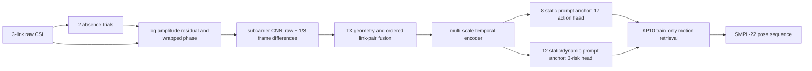
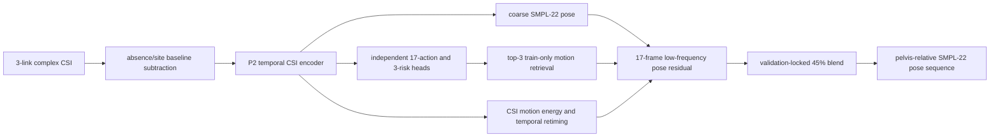

# NotiFi CSI-to-Pose

Wi-Fi CSI만 입력받아 시간에 따른 사람의 GVHMR SMPL-22 3D pose와 행동을 복원하는
연구 코드입니다. 영상과 GVHMR은 학습용 GT 생성에만 사용하며 실제 추론에는 CSI와
link mask만 사용합니다.

## 현재 모델: CAL8-KP10-RAW-META-CAL

`CAL8-KP10`은 KP10 pose 복원기 앞에 source-only로 학습한 raw CSI calibration
ensemble을 붙인 unseen 대응 버전입니다. 사용자는 새 환경에서 GT나 영상을 제공하지 않고,
빈 공간 2회와 알려진 안전 동작 12회만 수행합니다.



- **환경 기준선:** absence CSI의 링크별 진폭을 log residual로 만들고 위상은 원형 차이로
  바꿉니다. target query 라벨과 pose GT는 사용하지 않습니다.
- **행동 head:** 걷기·서기·앉기·눕기 각 2회, 총 8개 prompt로 새 사용자의 정적
  latent anchor를 source prototype에 맞춥니다.
- **위험 head:** 위 8개에 lie/stand 및 sit/stand 전환 4개를 더해 새 사용자의 동적
  반사 범위를 추정합니다.
- **선택 원칙:** `ajh+mhw` 학습, `lmh/E01` holdout에서 두 head의 역할과 결합을
  잠근 뒤 `yja/E02`를 한 번만 평가했습니다.

### Unseen yja/E02 결과

CAL8은 CAL6의 10개 support에 안전 전환동작 4개를 추가하므로 query가 `265`에서
`261`개로 줄었습니다. danger trial은 세 실험 모두 50개로 같습니다.

| Metric | KP10 no calibration | CAL6-KP10 | CAL8-KP10 |
|---|---:|---:|---:|
| 17-action accuracy | 7.17% | 9.06% | **14.94%** |
| 17-action macro-F1 | 7.99% | **8.40%** | 6.28% |
| 3-risk accuracy | 37.36% | 52.45% | **55.94%** |
| 3-risk macro-F1 | 27.60% | 23.28% | **56.33%** |
| Danger recall | 1/50 (2%) | 0/50 (0%) | **29/50 (58%)** |
| Safe -> danger | 34/140 | **1/140** | 20/136 |
| Overall pose | 30.42 cm | **28.15 cm** | 29.79 cm |
| Danger pose | 39.39 cm | 38.31 cm | **37.23 cm** |
| Danger distal | 58.42 cm | 56.88 cm | **55.12 cm** |
| Danger endpoint | 46.84 cm | 45.61 cm | **43.61 cm** |
| Danger high-motion | 37.88 cm | 37.75 cm | **36.16 cm** |

**판정:** CAL8은 위험 분류와 낙상 pose를 개선했지만 완성된 calibration 모델은 아닙니다.
전체 pose는 CAL6보다 1.64 cm 나빠졌고, 세부행동 macro-F1과 safe 오경보도 해결되지
않았습니다. 따라서 CAL8은 unseen 위험/낙상 개발 기준이며, 일반 pose 기준은 CAL6,
seen 기준은 아래 KP10을 유지합니다. yja 결과는 후속 구조 선택에 재사용하지 않습니다.

### 최신 실험 로그

| 번호 | 날짜/시간 (KST) | 목적 | 결과 | 판정 |
|---|---|---|---|---|
| CAL8-04 | 2026-08-07 19:04 | source-locked ensemble의 yja/E02 1회 평가 | danger recall 58%, danger pose 37.23 cm | 위험/낙상 개선, 전체 pose 퇴행 |
| CAL8-03 | 2026-08-07 18시대 | 정적 action head + 동적 risk head source 결합 | lmh danger recall 50%, specificity 84.8% | 두 head 역할 고정 |
| CAL8-02 | 2026-08-07 18시대 | source prompt prototype anchor 정렬 | lmh action 5.5% -> 15.9% | 부분 개선 |
| CAL8-01 | 2026-08-07 17시대 | raw CSI subcarrier/temporal encoder | source 학습 성공, lmh holdout 실패 | 단독 사용 기각 |

## Seen 기준 모델: KP10-ACTION-FUSED-45

Seen pose의 기준은 yja 결과를 이용하지 않은 `KP10-ACTION-FUSED-45`입니다.



KP10은 CSI encoder가 예측한 행동 확률로 train-only motion 후보를 고르고, CSI motion
energy로 후보의 시간축을 단조 retiming합니다. 정답 행동, 정답 위험도, test pose,
영상은 추론 분기나 후보 선택에 사용하지 않습니다.

### Source/Seen 성능

평가 protocol은 `single_split_lmh_e01`, seed 17, train/validation/test
`1210/315/315`입니다. 아래 test는 KP10 설정을 validation에서 잠근 뒤 한 번 평가한 값입니다.

| Seen test metric | KP10 |
|---|---:|
| Overall pose | 12.885 cm |
| Distal pose | 18.666 cm |
| Dynamic pose | 16.423 cm |
| High-motion pose | 16.095 cm |
| Danger pose | 19.829 cm |
| Danger distal | 29.250 cm |
| Danger endpoint | 25.052 cm |
| Speed correlation | 0.514 |
| Danger speed correlation | 0.579 |

동결된 분류 출력의 validation 성능은 17행동 `95.74%`, 3위험 `97.26%`, danger recall
`65/70 = 92.86%`입니다. 이 값들은 source/seen 성능이며 unseen 성능으로 해석하지 않습니다.

## 평가 원칙

### yja/E02 sealed test

`yja/E02`는 최종 test입니다. 모델 개발과 선택 과정에서는 다음 정보를 사용하지 않습니다.

- yja query 행동·위험 라벨
- yja pose GT와 프레임별 오차
- yja confusion matrix, overlay와 정성 결과
- yja 성능을 이용한 architecture, loss, threshold, calibration protocol 선택

모델 구조, seed, checkpoint, calibration 행동, threshold와 artifact hash를 모두 source-only
검증에서 잠근 뒤에만 yja를 평가합니다. yja 결과가 낮아도 그 결과에 맞춰 같은 모델을
수정하지 않습니다.

### Source-only nested LOSO 목표

새 모델과 calibration은 아래 내부 fold만으로 개발합니다.

1. `ajh` holdout: `mhw + lmh`로 학습하고 ajh로 검증
2. `mhw` holdout: `ajh + lmh`로 학습하고 mhw로 검증
3. `lmh` holdout: `ajh + mhw`로 학습하고 lmh로 검증

평균 성능과 최악 fold 성능을 함께 사용합니다. yja는 fold, prototype, normalization 통계,
early stopping과 hyperparameter 선택에 포함하지 않습니다.

현재 CAL8은 이 protocol 중 `lmh` holdout 한 fold만 완료했습니다. 따라서 yja 위험 지표가
개선됐더라도 3-fold 일반화를 입증한 최종 모델로 간주하지 않습니다.

## 데이터 분리

- source train/validation: `ajh`, `mhw`, `lmh`
- sealed test: `yja/E02`
- 제외: 손상된 `yja/E01`, `yja/E03`
- 12개 absence trial은 site baseline용이며 pose 평가에서 제외

split 정의는 [`work_v2/splits/experiments.json`](work_v2/splits/experiments.json)과
[`work_v2/splits/sealed_index.csv`](work_v2/splits/sealed_index.csv)에 있습니다.

## 데이터 계약

```text
data/pose_and_action/{subject}/{environment}/{risk}/{scenario}/{trial_id}/
  csi.csv
  gt_pose.npz
  original_video.mp4

timestamp/{subject}/{environment}/{risk}/{scenario}/{trial_id}/
  video_timestamps.csv
```

`gt_pose.npz`는 GVHMR SMPL-22 joint 순서와 meter 단위의 pelvis-relative pose 및 world root를
제공해야 합니다. CSI, GT, 영상과 timestamp의 trial ID가 모두 일치해야 합니다.

물리 link 순서는 항상 다음과 같습니다.

- RX: North
- TX1: South
- TX2: West
- TX3: East
- 모델 입력 순서: `[TX1, TX2, TX3]`

## 설치

Python 3.10과 CUDA 지원 PyTorch 환경을 권장합니다.

```powershell
cd CSI-to-Pose
python -m pip install -r requirements.txt

$env:NOTIFI_DATASET_ROOT = "D:\mhw\Dataset_Splits\NotiFi_CSI_GVHMR_v2_LOSO_60_15_25"
$env:NOTIFI_TIMESTAMP_ROOT = "D:\NotiFi-3D\Timestamp_Upload_Staging\timestamp"
$env:NOTIFI_WORK_ROOT = "$PWD\work_v2"
```

## 인덱스와 캐시

```powershell
python -m notifi_pose.tools.build_index --no-verify-files
python -m notifi_pose.tools.link_quality --workers 8
python -m notifi_pose.tools.build_splits
python -m notifi_pose.tools.build_cache --workers 8 --rebuild
python -m notifi_pose.tools.build_site_baseline
python -m notifi_pose.tools.verify_alignment
```

## KP10 재현

```powershell
python -m notifi_pose.tools.train_csi_action_classifier `
  --seed 181 --run-dir work_v2/runs/kp10_action_classifier_seed181

python -m notifi_pose.tools.calibrate_action_classifier_pose
python -m notifi_pose.tools.calibrate_kp10_action_strength
python -m notifi_pose.tools.evaluate_action_classifier_pose
python -m notifi_pose.tools.evaluate_kp10_action_strength
```

핵심 결과 파일은 다음과 같습니다.

- [`KP10 fixed test`](work_v2/runs/kp10_action_strength/test_fixed.json)
- [`KP10 validation`](work_v2/runs/kp10_action_strength/calibration.json)
- [`KP10 bootstrap audit`](work_v2/runs/kp10_action_strength/paired_bootstrap_audit.json)
- [`KP11 rejection audit`](docs/results/kp11_dynamic_motion_validation.json)

## CAL8 source-only 재현

두 모델 모두 raw CSI encoder를 처음부터 학습합니다. `yja` 행은 학습, early stopping,
ensemble 선택에 포함되지 않습니다.

```powershell
python scripts/train_cal8_raw_source.py --mode static
python scripts/train_cal8_raw_source.py --mode dynamic
python scripts/evaluate_cal8_source_ensemble.py
```

기본 출력은 각각 아래에 저장됩니다. checkpoint(`*.pt`)는 용량과 test 오염 방지를 위해
Git에 올리지 않습니다.

```text
work_v2/runs/cal8_raw_source_anchor/
work_v2/runs/cal8_raw_source_dynamic_anchor_v2/
work_v2/runs/cal8_source_ensemble/result.json
```

핵심 구현은 [`notifi_pose/meta_calibration.py`](notifi_pose/meta_calibration.py), 계약 테스트는
[`tests/test_meta_calibration.py`](tests/test_meta_calibration.py)에 있습니다.

## 다음 개발 순서

1. CAL8을 ajh/mhw/lmh 3-fold nested LOSO로 재검증합니다.
2. 세부행동 macro-F1 저하와 safe-to-danger 20/136을 먼저 줄입니다.
3. danger 개선을 유지하면서 overall pose가 CAL6 28.15 cm를 넘도록 pose 결합부를 고칩니다.
4. 세 fold에서 비퇴행한 후보만 artifact hash와 함께 잠급니다.
5. 기존 yja 결과는 후속 선택에 사용하지 않고, 추가 평가는 새 sealed subject로 수행합니다.
