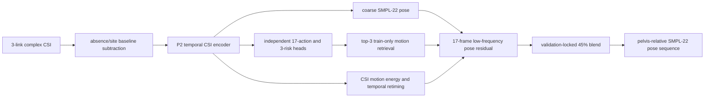

# NotiFi CSI-to-Pose

Wi-Fi CSI만 입력받아 시간에 따른 사람의 GVHMR SMPL-22 3D pose와 행동을 복원하는
연구 코드입니다. 영상과 GVHMR은 학습용 GT 생성에만 사용하며 실제 추론에는 CSI와
link mask만 사용합니다.

## 현재 기준 모델: KP10-ACTION-FUSED-45

현재 개발 기준은 yja 결과를 이용하지 않은 `KP10-ACTION-FUSED-45`입니다. 현재 branch에는
승격된 unseen calibration 모델이 없습니다.



KP10은 CSI encoder가 예측한 행동 확률로 train-only motion 후보를 고르고, CSI motion
energy로 후보의 시간축을 단조 retiming합니다. 정답 행동, 정답 위험도, test pose,
영상은 추론 분기나 후보 선택에 사용하지 않습니다.

### Source/Seen 성능

평가 protocol은 `single_split_lmh_e01`, seed 17, train/validation/test
`1210/315/315`입니다. 아래 test는 KP10 설정을 validation에서 잠근 뒤 한 번 평가한 값입니다.

| Seen test metric | KP10 |
|---|---:|
| Overall pose | 12.885 cm |
| Distal pose | 18.666 cm |
| Dynamic pose | 16.423 cm |
| High-motion pose | 16.095 cm |
| Danger pose | 19.829 cm |
| Danger distal | 29.250 cm |
| Danger endpoint | 25.052 cm |
| Speed correlation | 0.514 |
| Danger speed correlation | 0.579 |

동결된 분류 출력의 validation 성능은 17행동 `95.74%`, 3위험 `97.26%`, danger recall
`65/70 = 92.86%`입니다. 이 값들은 source/seen 성능이며 unseen 성능으로 해석하지 않습니다.

## 평가 원칙

### yja/E02 sealed test

`yja/E02`는 최종 test입니다. 모델 개발과 선택 과정에서는 다음 정보를 사용하지 않습니다.

- yja query 행동·위험 라벨
- yja pose GT와 프레임별 오차
- yja confusion matrix, overlay와 정성 결과
- yja 성능을 이용한 architecture, loss, threshold, calibration protocol 선택

모델 구조, seed, checkpoint, calibration 행동, threshold와 artifact hash를 모두 source-only
검증에서 잠근 뒤에만 yja를 평가합니다. yja 결과가 낮아도 그 결과에 맞춰 같은 모델을
수정하지 않습니다.

### Source-only nested LOSO

새 모델과 calibration은 아래 내부 fold만으로 개발합니다.

1. `ajh` holdout: `mhw + lmh`로 학습하고 ajh로 검증
2. `mhw` holdout: `ajh + lmh`로 학습하고 mhw로 검증
3. `lmh` holdout: `ajh + mhw`로 학습하고 lmh로 검증

평균 성능과 최악 fold 성능을 함께 사용합니다. yja는 fold, prototype, normalization 통계,
early stopping과 hyperparameter 선택에 포함하지 않습니다.

## 데이터 분리

- source train/validation: `ajh`, `mhw`, `lmh`
- sealed test: `yja/E02`
- 제외: 손상된 `yja/E01`, `yja/E03`
- 12개 absence trial은 site baseline용이며 pose 평가에서 제외

split 정의는 [`work_v2/splits/experiments.json`](work_v2/splits/experiments.json)과
[`work_v2/splits/sealed_index.csv`](work_v2/splits/sealed_index.csv)에 있습니다.

## 데이터 계약

```text
data/pose_and_action/{subject}/{environment}/{risk}/{scenario}/{trial_id}/
  csi.csv
  gt_pose.npz
  original_video.mp4

timestamp/{subject}/{environment}/{risk}/{scenario}/{trial_id}/
  video_timestamps.csv
```

`gt_pose.npz`는 GVHMR SMPL-22 joint 순서와 meter 단위의 pelvis-relative pose 및 world root를
제공해야 합니다. CSI, GT, 영상과 timestamp의 trial ID가 모두 일치해야 합니다.

물리 link 순서는 항상 다음과 같습니다.

- RX: North
- TX1: South
- TX2: West
- TX3: East
- 모델 입력 순서: `[TX1, TX2, TX3]`

## 설치

Python 3.10과 CUDA 지원 PyTorch 환경을 권장합니다.

```powershell
cd CSI-to-Pose
python -m pip install -r requirements.txt

$env:NOTIFI_DATASET_ROOT = "D:\mhw\Dataset_Splits\NotiFi_CSI_GVHMR_v2_LOSO_60_15_25"
$env:NOTIFI_TIMESTAMP_ROOT = "D:\NotiFi-3D\Timestamp_Upload_Staging\timestamp"
$env:NOTIFI_WORK_ROOT = "$PWD\work_v2"
```

## 인덱스와 캐시

```powershell
python -m notifi_pose.tools.build_index --no-verify-files
python -m notifi_pose.tools.link_quality --workers 8
python -m notifi_pose.tools.build_splits
python -m notifi_pose.tools.build_cache --workers 8 --rebuild
python -m notifi_pose.tools.build_site_baseline
python -m notifi_pose.tools.verify_alignment
```

## KP10 재현

```powershell
python -m notifi_pose.tools.train_csi_action_classifier `
  --seed 181 --run-dir work_v2/runs/kp10_action_classifier_seed181

python -m notifi_pose.tools.calibrate_action_classifier_pose
python -m notifi_pose.tools.calibrate_kp10_action_strength
python -m notifi_pose.tools.evaluate_action_classifier_pose
python -m notifi_pose.tools.evaluate_kp10_action_strength
```

핵심 결과 파일은 다음과 같습니다.

- [`KP10 fixed test`](work_v2/runs/kp10_action_strength/test_fixed.json)
- [`KP10 validation`](work_v2/runs/kp10_action_strength/calibration.json)
- [`KP10 bootstrap audit`](work_v2/runs/kp10_action_strength/paired_bootstrap_audit.json)
- [`KP11 rejection audit`](docs/results/kp11_dynamic_motion_validation.json)

## 다음 개발 순서

1. KP10을 source-only 기준선으로 고정합니다.
2. calibration adapter는 세 source subject의 nested LOSO에서만 설계합니다.
3. 17행동, 3위험, danger recall, safe-to-danger와 pose를 동시에 평가합니다.
4. 세 fold에서 비퇴행한 후보만 artifact hash와 함께 잠급니다.
5. 잠긴 후보만 yja/E02에서 한 번 평가합니다.
