# NotiFi CSI-to-Pose

카메라 없이 3-link Wi-Fi CSI만으로 17개 행동, 3단계 위험도, SMPL-22 3D 동작을 추정하는 연구 코드입니다. 영상과 GVHMR는 source 학습용 GT로만 사용하며 배포 추론 입력에는 포함하지 않습니다.

## 현재 모델: CAL65/CAL64 + CAL23 v4

현재 연구 후보는 목적에 따라 세 가지 분류 profile과 하나의 복원기로 나뉩니다. CAL64/65는 source-LOSO evaluator까지 검증됐고, 기존 exporter가 만드는 단일 `deployment.pt`는 아직 CAL60까지만 지원합니다.

1. **CAL65-DIVERSE-INVARIANCE-ENSEMBLE**: Danger recall 우선 기본안입니다. CAL60과 CAL58의 보정된 확률을 50:50으로 결합합니다.
2. **CAL64-BALANCED-ENSEMBLE**: 오경보와 최악 환경 성능을 더 중시합니다. CAL60과 CAL46을 결합합니다.
3. **CAL60-PHYSICAL-INVARIANCE-DG**: 연산량이 제한된 현장의 단일 모델입니다.
4. **CAL23 v4 POSE-ENSEMBLE**: 분류 결과와 CSI motion descriptor로 source GT 궤적을 검색·결합해 pelvis-relative SMPL-22 동작을 시뮬레이션합니다.

모든 profile은 query 영상·행동 정답·pose GT 없이 동작합니다. `yja/E02`는 최종 unseen test로 계속 봉인했으며, 아래 구조와 설정 선택에는 한 번도 사용하지 않았습니다.

CAL60은 `478,676`개 학습 파라미터이며 FP32 model state는 약 `1.83 MiB`입니다. CAL64/65는 두 member 합계 `957,352`개 파라미터입니다. 두 member를 포함한 실제 CAL64/65 latency는 exporter 구현 후 별도로 재측정해야 합니다.

```mermaid
flowchart LR
    A["3-link CSI"] --> B["12 empty-room windows로 정적 multipath 제거"]
    S["안전 기본동작 8종 x 2회"] --> C["링크 감도와 자세 anchor"]
    B --> D["진폭·위상 residual / delta / acceleration"]
    C --> D
    D --> E["subcarrier CNN + Doppler filter bank"]
    E --> F["RX-N, TX1-S, TX2-W, TX3-E 링크 융합"]
    F --> G["dilated temporal encoder"]
    G --> H["실제 시간 bin + 누적 motion-progress bin"]
    C --> I["support-relative similarity / distance / energy"]
    H --> I
    I --> J1["CAL60 또는 CAL58/CAL46 member"]
    I --> J2["독립 member"]
    J1 --> K["CAL17 source prototype transport"]
    J2 --> K
    K --> L["확률 50:50 deep ensemble"]
    L --> M["17-action + 3-risk"]
    L --> N["CAL23 source GT top-k retrieval"]
    N --> O["root-relative SMPL-22 simulation"]
```



### CAL33에서 바뀐 점

- **속도에 덜 민감한 진행 표현**: 실제 프레임 시간과 누적 움직임 진행률을 각각 Gaussian bin으로 풀링합니다. 같은 낙상을 빠르거나 느리게 수행해도 순서는 유지됩니다.
- **물리적으로 가능한 반사 증강**: 설치 계약상 좌우인 TX2-West와 TX3-East만 함께 교환합니다. CSI·mask·absence·support를 episode 단위로 바꿔 calibration 관계를 깨지 않습니다.
- **단조 시간 변형**: query의 시작·끝과 프레임 순서를 보존한 채 수행 속도만 바꿉니다. phase를 뒤집거나 임의 프레임을 섞지 않습니다.
- **고정 SWA**: source-inner epoch 선택의 작은 표본 변동을 줄이기 위해 epoch 6~12의 가중치를 평균합니다.
- **다양한 불변성 ensemble**: 같은 모델을 복제하지 않고, 오류가 다른 CAL60·CAL58 또는 CAL46을 각자 CAL17 보정한 후 확률 공간에서만 결합합니다.
- **pose 결측 방어**: source GVHMR 후보의 비유한 frame을 양끝 고정 선형 보간해 검색 descriptor와 출력이 NaN이 되지 않게 합니다.
- **run 내부 누수 방지**: 각 run의 outer subject는 epoch·threshold·ensemble 운용점 선택에 사용하지 않으며, target query label/GT와 `yja/E02` query에는 접근하지 않습니다. 여러 run의 모델군 승격에는 source outer benchmark를 비교했으므로 이것은 개발 성능이고, 완전 독립 최종 평가는 계속 봉인했습니다.

시간 변형 불변성은 [ICML 2025 hard-coded time-series invariances](https://proceedings.mlr.press/v267/germain25a.html), 시간·주파수 domain shift는 [RAINCOAT, ICML 2023](https://proceedings.mlr.press/v202/he23b.html), source domain randomization은 [FIXED, CPAL 2024](https://proceedings.mlr.press/v234/lu24a.html), Wi-Fi cross-domain 원칙은 [Widar3.0, MobiSys 2019](https://cswu.me/papers/mobisys19_widar3_paper.pdf)와 [DATTA, WACV 2026](https://openaccess.thecvf.com/content/WACV2026/html/Strohmayer_DATTA_Domain-Adversarial_Test-Time_Adaptation_for_Cross-Domain_WiFi-Based_Human_Activity_Recognition_WACV_2026_paper.html)를 참고했습니다. 논문 모듈을 이름만 붙여 복사하지 않고, 현재 3-link 설치 계약과 source-only protocol에서 ablation을 통과한 부분만 남겼습니다.

[Origin AI의 공식 Wi-Fi sensing white paper](https://www.originwirelessai.com/wp-content/uploads/2025/05/Origin-AI_Wifi-Sensing-White-Paper-2025-05-16-PROOF.pdf)가 공개한 ACF 기반 motion statistic도 CAL69에서 직접 probe했습니다. 점유·움직임 검출에는 맞는 접근이지만 absence를 제외한 16개 동작의 source subject-LOSO가 11.57%라, 세부 동작·pose용 backbone에는 넣지 않았습니다.

## 현재 성능

평가는 `ajh`, `mhw`, `lmh`를 사람 단위로 통째로 숨기는 nested source LOSO입니다. 각 표 값은 7개 outer site의 query 1,098개와 support seed `17017/17027/17037/17047/17057`에서 얻은 평균±표준편차입니다. CAL64/65는 CAL60 학습 seed `12012/22012`까지 합친 10회 평균이며, Macro-F1은 site 값을 trial 수로 가중했습니다.

### 분류와 calibration

| 모델 | Action Acc | Action F1 | Risk Acc | Risk F1 | Danger Recall | Danger 5종 | Safe→Danger | 최악 site Action |
|---|---:|---:|---:|---:|---:|---:|---:|---:|
| CAL33 이전 고재현 | 36.43±1.16% | 29.09±1.17% | 45.68±0.82% | 35.16±0.53% | 44.57±1.07% | 7.90±1.37% | 20.94±1.07% | 28.15±1.47% |
| CAL46 단일 균형 | 38.27±0.34% | 30.80±0.73% | **50.98±0.81%** | 38.94±1.14% | 28.57±0.85% | 8.38±1.40% | **10.77±0.95%** | 29.94±0.99% |
| CAL60 단일, seed 22012 | 40.60±0.47% | 32.59±0.55% | **51.09±1.07%** | **41.56±1.40%** | 44.86±2.24% | 10.10±1.26% | 16.46±1.30% | 33.76±2.01% |
| **CAL64 균형 ensemble, 2 train seeds** | **40.35±1.32%** | **32.69±1.64%** | 50.05±1.11% | 39.85±1.48% | 43.76±3.41% | 10.52±1.21% | **17.46±1.79%** | **31.53±3.97%** |
| **CAL65 고재현 ensemble, 2 train seeds** | **40.42±1.42%** | **32.62±1.62%** | **50.61±0.52%** | **40.51±1.04%** | **46.81±4.12%** | **11.05±0.97%** | 18.42±1.29% | 30.13±4.35% |

보수적인 두 학습 seed 평균에서 CAL65는 CAL33 대비 Action `+3.99%p`, Risk `+4.93%p`, Danger recall `+2.24%p`, Danger 5종 `+3.15%p`, 최악 site Action `+1.98%p`이며 Safe→Danger는 `-2.52%p` 줄었습니다. CAL64는 Danger recall을 3.05%p 덜 얻는 대신 오경보와 최악 site 성능이 더 안정적입니다. 단일 모델이 필요하면 CAL60 seed 22012가 가장 강합니다.

Danger subtype D01~D05는 outer site마다 정확히 6개씩인 균형 분포라 균등 무작위 기준이 20%입니다. CAL65의 11.05%는 chance보다 낮으므로, 현재 결과로 낙상 세부유형이나 충돌 부위를 식별한다고 주장할 수 없습니다.

최고 측정 조합인 seed 22012에서는 CAL64가 Action `41.20%`, 최악 site `34.90%`, CAL65가 Action `41.11%`, Danger `49.33%`였습니다. seed 12012로 바꾸면 각각 Action `39.49/39.73%`, Danger `42.00/44.29%`로 떨어졌습니다. 따라서 최고값을 대표 성능으로 쓰지 않고 위 표는 두 학습 seed를 모두 포함합니다.

CAL65의 2개 학습 seed × 5개 support seed를 site별로 다시 집계하면 평균이 숨기던 실패가 더 선명합니다.

| Outer site | Action | Action F1 | Risk | Risk F1 | Danger Recall | Danger 5종 | Safe→Danger |
|---|---:|---:|---:|---:|---:|---:|---:|
| ajh/E01 | 39.24% | 30.75% | 49.87% | 33.42% | 21.00% | 8.67% | **0.39%** |
| ajh/E02 | 36.62% | 28.39% | 41.72% | 30.41% | 33.67% | 4.00% | 26.58% |
| ajh/E03 | 38.22% | 26.73% | 44.20% | 22.80% | **2.00%** | 1.33% | 3.03% |
| lmh/E01 | **53.01%** | **46.58%** | 60.38% | 48.12% | **86.67%** | **37.33%** | 12.40% |
| mhw/E01 | 42.23% | 34.02% | **61.53%** | **60.00%** | 55.00% | 6.33% | 16.05% |
| mhw/E02 | **30.32%** | 25.01% | 50.32% | 48.67% | 66.00% | 9.00% | **38.42%** |
| mhw/E03 | 43.38% | 36.93% | 46.31% | 40.15% | 63.33% | 10.67% | 31.97% |

따라서 46.81% Danger 평균만으로 배포 가능하다고 판단하면 안 됩니다. cache의 all-link coverage는 `ajh/E03 83.97%`, `mhw/E02 99.56%`입니다. CAL71의 단순 link-burst dropout은 전자를 고치지 못했으므로 packet 누락만 원인이라고 단정할 수 없습니다. 다음 진단은 링크별 신호 분포와 mask 위치를 분리하고, 단순 가림 대신 gap-aware imputation·quality-conditioned temporal encoder를 검증해야 합니다. 후자의 오경보는 정상 품질의 큰 motion·환경 반사를 danger로 과해석하는 경계를 줄여야 합니다. 두 문제를 같은 calibration scale 하나로 풀 수 없습니다.

두 학습 seed를 따로 봐도 support-seed 표준편차는 `ajh/E03` Danger가 `0.00/1.33%p`, `mhw/E02` Safe→Danger가 `2.71/1.53%p`라 support 재선택으로 해결되지 않는 구조적 실패입니다. 반면 `ajh/E02` Danger는 `10.33/9.52%p`, `mhw/E03`은 `8.94/11.93%p`여서 기본동작 support의 대표성 문제도 큽니다.

### 3D 동작 시뮬레이션

| 모델 | Pose | Distal | PA-Pose | Danger Pose | Danger Distal |
|---|---:|---:|---:|---:|---:|
| **CAL23 v4 top-5** | **29.68 cm** | **44.20 cm** | 11.27 cm | **37.82 cm** | **56.13 cm** |
| CAL63 분류 deep-ensemble pose | 30.03 cm | 44.49 cm | **10.60 cm** | 38.29 cm | 57.03 cm |

CAL63은 분류 확률과 CSI motion descriptor를 두 모델에서 평균했지만 실제 pose와 danger pose가 모두 나빠져 폐기했습니다. 복원기는 CAL23 v4를 유지합니다. 현재 출력은 정답 궤적의 정밀 회귀라기보다, CSI 행동과 시간 변화에 맞는 가능한 source 동작 시뮬레이션입니다.

### Seen 참고값

기존 `KP10-ACTION-FUSED-45` seen test는 pose 12.885 cm, danger pose 19.829 cm, 17-action 95.74%, 3-risk 97.26%, danger recall 92.86%였습니다. source-LOSO와의 큰 차이는 여전히 남아 있으며, 현재 수치로 “어떤 unseen에서도 seen과 같다”고 주장하지 않습니다.

## Calibration 계약

새 사용자·환경에서 다음 CSI만 수집합니다.

- empty-room 12개 window
- 걷기, 서기, 앉기, 눕기, 눕기→서기, 서기→눕기, 앉기→서기, 서기→앉기 각 2회
- 총 28개 window, target GT와 영상은 불필요

동일 query 1,042개로 support 수를 비교한 결과입니다.

| 동작별 support | Action Acc | Risk Acc | Danger Recall | Specificity |
|---|---:|---:|---:|---:|
| 1회, 총 8개 | 30.33% | 41.84% | 26.67% | 85.26% |
| **2회, 총 16개** | **33.49%** | 41.55% | **40.48%** | 76.21% |
| 3회, 총 24개 | 33.78% | **42.80%** | 29.52% | 84.63% |

같은 동작을 세 번 반복하면 action만 0.29%p 오르고 danger가 10.95%p 하락했습니다. 현재 권장값은 동작별 2회입니다.

2개 absence를 고르는 seed를 네 번 바꾸면 danger recall은 28.10~42.86%, specificity는 74.76~89.64%로 흔들렸습니다. 12개 전체를 평균하면 Action 35.52%, danger 40.48%, specificity 76.84%로 seed 의존성이 사라져 v4 계약으로 승격했습니다. 안전한 기본동작만으로 낙상 경계를 완전히 calibration할 수 없다는 한계는 남습니다.

CAL20 학습 episode는 기존과 같은 absence 2개를 사용하지만 canonicalizer는 개수와 무관한 평균 baseline을 계산합니다. 같은 checkpoint의 source nested LOSO에서 2/4/6/12개를 직접 비교한 뒤 배포 입력만 12개로 승격했습니다.

빈방 log-amplitude의 링크·subcarrier별 평균과 표준편차로 먼저 무차원화하는 방식은 최신 [OpenCSI self-calibration preprint](https://arxiv.org/abs/2607.26665)의 quiet-period 정규화와 같은 방향입니다. 다만 OpenCSI 자체도 이 정규화가 절대 움직임 크기를 지워 세부 동작 구분에는 한계가 있다고 범위를 제한합니다. 그래서 본 모델은 빈방 통계만으로 끝내지 않고, 8개 기본동작에서 추정한 링크별 동적 감도를 별도로 보존합니다. OpenCSI의 baseline age·maturity 감시는 아직 구현하지 않았습니다.

12-window baseline에서 support seed 다섯 개를 바꾸면 Action은 평균 34.06%, 표준편차 0.99%p, 최악 32.88%였습니다. Danger recall은 평균 33.62%, 표준편차 4.02%p, 최악 28.57%였습니다. 세 후보 중 latent가 가까운 두 개를 자동 선택하는 실험도 danger 평균이 31.62%로 낮아 폐기했습니다. 따라서 표의 고정 protocol 수치와 실제 support 변동성을 함께 봐야 합니다.

### RF 변화 스트레스

고정 checkpoint와 calibration 설정을 유지하고 outer target의 support·absence·query에만 큰 링크별 gain/phase 변화를 합성했습니다. Action은 35.52%로 유지됐고 danger recall은 40.48→37.14%였습니다. 반면 링크 완전 손실은 별도 고장 조건입니다.

| 조건 | Action Acc | Risk Acc | Danger Recall | Specificity |
|---|---:|---:|---:|---:|
| clean | 35.52% | 43.44% | 40.48% | 76.84% |
| gain + phase shift | 35.52% | 42.71% | 37.14% | 76.65% |
| TX1 loss | 32.42% | 40.53% | 33.33% | 73.82% |
| TX2 loss | 34.15% | 39.44% | 61.43% | 61.58% |
| TX3 loss | 33.15% | 40.98% | 39.52% | 70.43% |

이는 실제 새 방 측정이 아니라 source outer에 가한 결정적 합성 스트레스이므로 arbitrary unseen 보장의 근거로 과장하지 않습니다.

RTX 5060 Ti에서 현재 CAL60을 50회 측정한 encoder forward는 16개 support와 12개 absence를 포함해 단일 trial 평균 32.08 ms, batch 8 평균 41.10 ms였습니다. 이전 단일 모델에서 측정한 CAL17 분류까지 36.3 ms, CAL23 3D 복원까지 46.1 ms는 참고값이며 새 checkpoint의 end-to-end 수치는 아직 재측정하지 않았습니다. CSI 수집·cache 전처리 시간은 모두 제외합니다.

## 배포 bundle

`deployment_model.pt`, CAL17 source prototype, CAL23 source pose library를 하나로 묶습니다. 설정은 yja가 아니라 nested source fold에서 선택된 값의 중앙값으로 고정합니다.

현재 exporter와 `CAL20Deployment`는 단일 CAL60 계열 bundle용입니다. CAL64/65의 표는 두 fold checkpoint를 source-inner에서 각각 CAL17 보정한 연구 평가 결과이며, 실제 제품에 넣으려면 두 deployment bundle과 고정 ensemble risk config를 하나로 내보내는 exporter/runtime 작업 및 latency 재측정이 추가로 필요합니다. 이 작업 전에는 CAL64/65를 완성된 제품 bundle이라고 부르지 않습니다.

```powershell
python scripts/export_cal20_deployment.py `
  --run-dir work_v2/runs/cal60_seed22012 `
  --calibration work_v2/runs/cal60_seed22012/cal17.json `
  --pose-result work_v2/runs/cal60_seed22012/cal23.json `
  --uniform-grid-result work_v2/runs/cal60_seed22012/uniform_grid_risk.json `
  --output work_v2/runs/cal60_seed22012/deployment.pt `
  --absence-trials 12
```

현장 API는 cache 전처리와 같은 `[B,304,3,114,2]` CSI tensor와 `[B,304,3]` link mask를 받습니다.

```python
from notifi_pose.deployment import CAL20Deployment, load_csi_csv_batch

runtime = CAL20Deployment.load("deployment.pt")
support_csi, support_mask, _ = load_csi_csv_batch(support_csv_paths)
absence_csi, absence_mask, _ = load_csi_csv_batch(absence_csv_paths)
calibration = runtime.calibrate(
    support_csi, support_mask, support_labels,
    absence_csi, absence_mask,
)
query_csi, query_mask, quality = load_csi_csv_batch(query_csv_paths)
result = runtime.predict(query_csi, query_mask, calibration)
```

`result`에는 17-action/3-risk 확률과 ID, root-relative SMPL-22 pose, top-5 retrieval trial ID, 링크별 coverage와 `abstain`이 포함됩니다. coverage 50% 이상인 링크가 두 개 미만일 때만 결과를 사용할 수 없는 입력으로 표시합니다. 기본동작 anchor geometry가 source 범위를 벗어나면 `calibration_domain_warning`을 함께 내지만 추론을 막지는 않습니다. hard gate는 숨긴 source site도 3/7만 통과해 폐기했습니다. 실제 v4 bundle은 58.3 MB이며 source prototype 7개 site와 source pose 후보 1,210개, 입력 결과 파일의 SHA-256을 포함했습니다. 새 query의 label, 영상, pose GT는 API 인자가 아닙니다.

### 카메라 없는 시간 격자

학습 cache는 정확한 GT pairing을 위해 video timestamp 시각에 CSI를 보간하지만, 실제 제품은 카메라 없이 CSI 자체의 30Hz 격자를 사용합니다. v4의 source-inner 위험 설정 중앙값을 모든 fold에 고정하면 raw 30Hz에서 Action 36.52%, Action F1 27.43%, Risk 41.71%, Risk F1 32.16%, Danger 40.95%, Specificity 77.78%입니다. timestamp-grid Danger 40.48%와 0.48%p 차이로 시간 격자 gap은 사실상 닫혔지만, arbitrary unseen 보장을 뜻하지는 않습니다.

## 데이터 분석

사용한 source는 `ajh/E01-E03`, `mhw/E01-E03`, `lmh/E01`입니다. `yja/E02`는 봉인된 최종 unseen test이며 이번 구조 선택과 실험에 사용하지 않았습니다. `yja/E01`, `yja/E03`은 CSI 품질 문제로 제외합니다.

- raw feature에서 subject probe 99.07%, site probe 98.28%로 사람·환경 지문이 행동보다 매우 강했습니다.
- subject-LOSO 17-action은 10.58%, dynamic-only는 11.74%로 raw 통계만으로 행동 일반화가 어려웠습니다.
- target support shift는 absence 1.070, static 0.837, dynamic 0.536으로 정적 환경 변화가 가장 컸습니다.
- yja support의 링크 motion correlation은 약 0.94~0.96으로 source보다 높아, 링크 방향 차이가 약해지는 환경이 존재했습니다.
- CAL20은 절대 state를 head에 직접 전달하지 않고 target support와의 상대 거리·유사도만 사용해 이 문제를 줄였습니다.

| site | 평균 동적 분산 | 평균 진폭 속도 | 평균 coverage | 링크 motion 상관 | 관찰된 특징 |
|---|---:|---:|---:|---:|---|
| ajh E01-E03 | 1.90 | 7.67 | 0.936 | 0.489 | E03의 coverage가 가장 낮고 mask 단절이 많음 |
| mhw E01-E03 | 2.77 | 8.47 | 0.983 | 0.710 | 높은 동적 분산과 안정적인 packet coverage |
| lmh E01 | 2.71 | 11.93 | 0.975 | 0.821 | source 중 속도·가속도 에너지가 가장 큼 |
| yja E02 calibration 28개 | 1.48 | 7.68 | 0.986 | 0.970 | 정적 크기는 높고 링크별 움직임은 지나치게 비슷함 |

`yja E02` 행은 12개 absence와 사전에 정한 16개 calibration support만의 진단입니다. query 행동 label, 영상, pose GT, test 성능은 사용하지 않았습니다.

분석 재현:

```powershell
python scripts/analyze_cal12_domains.py `
  --work-root $env:NOTIFI_WORK_ROOT `
  --output work_v2/reports/cal12_domain_analysis
```

## 학습과 평가

```powershell
$env:NOTIFI_DATASET_ROOT = "D:\NotiFi-3D\Dataset_Splits\NotiFi_CSI_GVHMR_v2_LOSO_60_15_25"
$env:NOTIFI_WORK_ROOT = "C:\path\to\work_v2"
```

### 1. CAL60 source nested LOSO

```powershell
python scripts/train_cal20_source_folds.py `
  --run-dir work_v2/runs/cal60_seed22012 `
  --epochs 12 --batch-size 8 --training-seed 22012 `
  --use-doppler --phase-strength 1.0 `
  --motion-grounding --lambda-motion-grounding 0.30 `
  --fixed-swa --swa-start 6 `
  --cross-subject-pairing --cross-site-style-probability 0.75 `
  --motion-phase-bins 8 `
  --reflection-probability 0.25 `
  --temporal-warp-probability 0.25 --temporal-warp-strength 0.25 `
  --initialize-from-run work_v2/runs/cal46_seed22012
```

`--initialize-from-run`은 각 fold와 deployment의 `target_subject_used=false`, `sealed_yja_used=false`, `outer_holdout_used_for_selection=false`를 검사하고 하나라도 다르면 중단합니다. CAL60 추론에 KP3~KP9를 순차 실행할 필요는 없지만, 위 성능을 재현하려면 같은 source-clean CAL46 초기 가중치가 필요합니다. CAL46은 CAL33에서 motion-progress adapter를 학습한 CAL34를 epoch 6~12 고정 SWA로 안정화한 checkpoint입니다.

CAL58 member는 같은 CAL46 seed 12012에서 좌우 반사만 끄고 시간변형만 사용합니다.

```powershell
python scripts/train_cal20_source_folds.py `
  --run-dir work_v2/runs/cal58_seed12012 `
  --epochs 12 --batch-size 8 --training-seed 12012 `
  --use-doppler --phase-strength 1.0 `
  --motion-grounding --lambda-motion-grounding 0.30 `
  --fixed-swa --swa-start 6 `
  --cross-subject-pairing --cross-site-style-probability 0.75 `
  --motion-phase-bins 8 `
  --temporal-warp-probability 0.25 --temporal-warp-strength 0.25 `
  --initialize-from-run work_v2/runs/cal46_seed12012
```

### 2. CAL64/CAL65 calibration ensemble

```powershell
python scripts/calibrate_cal62_deep_ensemble.py `
  --run-dir-a work_v2/runs/cal60_seed22012 `
  --run-dir-b work_v2/runs/cal58_seed12012 `
  --run-name CAL65-DIVERSE-INVARIANCE-ENSEMBLE `
  --output work_v2/runs/cal65_seed17017.json `
  --support-seed 17017 --absence-trials 12
```

CAL64는 `--run-dir-b`만 `cal46_seed12012`로 바꾸고 run name을 `CAL64-BALANCED-ENSEMBLE`로 지정합니다. 각 member의 CAL17 action transport와 ensemble 위험 운용점은 source-inner에서만 고르고 outer에 고정합니다. 5-seed 표는 `17017/17027/17037/17047/17057`을 각각 실행한 결과입니다.

### 3. CAL23 CSI-only pose simulation

```powershell
python scripts/evaluate_cal23_pose_ensemble.py `
  --run-dir work_v2/runs/cal20_relative_motion_dg_v1_swa `
  --calibration work_v2/runs/cal20_relative_motion_dg_v1_swa/cal17.json `
  --output work_v2/runs/cal20_relative_motion_dg_v1_swa/cal23.json `
  --absence-trials 12
```

### 4. 합성 RF stress

```powershell
python scripts/evaluate_cal20_rf_stress.py `
  --run-dir work_v2/runs/cal20_relative_motion_dg_v1_swa `
  --calibration work_v2/runs/cal20_relative_motion_dg_v1_swa/cal17.json `
  --output work_v2/runs/cal20_relative_motion_dg_v1_swa/rf_stress.json `
  --absence-trials 12
```

### 5. 카메라 없는 uniform grid

```powershell
python scripts/evaluate_cal20_uniform_grid.py `
  --run-dir work_v2/runs/cal20_relative_motion_dg_v1_swa `
  --calibration work_v2/runs/cal20_relative_motion_dg_v1_swa/cal17.json `
  --dataset-root $env:NOTIFI_DATASET_ROOT `
  --output work_v2/runs/cal20_relative_motion_dg_v1_swa/uniform_grid.json `
  --retune-risk-on-inner --absence-trials 12
```

`--retune-on-inner`는 grid-aware CAL17 실험 재현용이며 현재 승격 설정은 아닙니다.
배포용 위험 설정은 `--retune-risk-on-inner` 결과를 exporter의 `--uniform-grid-result`에 전달합니다.

### 6. Calibration geometry 진단

```powershell
python scripts/evaluate_calibration_geometry_gate.py `
  --run-dir work_v2/runs/cal20_relative_motion_dg_v1_swa `
  --output work_v2/runs/cal20_relative_motion_dg_v1_swa/geometry_gate.json `
  --absence-trials 12
```

## 실험 로그

최신순입니다. 각 run의 epoch·CAL17·위험 threshold·ensemble 가중치는 source-inner에서만 선택했고 outer는 해당 run 안에서 건드리지 않았습니다. 다만 아래 여러 구조를 비교해 승격 모델을 정하는 연구 iteration에는 source outer benchmark를 반복 관찰했으므로, 이 표는 완전히 독립된 최종 test가 아닙니다. `yja/E02`는 이 편향을 피하기 위해 계속 봉인했습니다.

| 번호 | 날짜/시간 KST | 목적 | 결과 | 판정 |
|---|---|---|---|---|
| 71 | 2026-08-08 22시 | query link-burst dropout 0.25로 저-coverage 대응 | Danger +4.38%p이나 Risk -3.44%p, 오경보 +3.05%p, 최악 site -3.31%p; ajh/E03 Danger 1.33% | 폐기, 코드 제거 |
| 70 | 2026-08-08 22시 | scale 제거 32-bin motion-progress 고전 probe | non-absence 16-class Action 13.72%로 ACF보다 +2.15%p이나 Macro-F1 6.99% | 시간 순서 필요성 확인, 단독 feature는 폐기 |
| 69 | 2026-08-08 22시 | 상용 Wi-Fi motion의 scale-normalized ACF 아이디어 검증 | non-absence 16-class Action 11.57%, Macro-F1 7.52%; 세부 시간·사지 순서를 잃음 | 점유/움직임 탐지용, 세부행동에는 폐기 |
| 68 | 2026-08-08 22시 | CAL60 fine-tuning 12→24 epoch 통제 실험 | Risk F1 +0.64%p, Safe→Danger -2.98%p이나 Action -2.37%p, Danger -3.52%p, 최악 site -4.46%p | 폐기, 12 epoch 유지 |
| 66 | 2026-08-08 21시 | CAL60+이전 CAL33 고재현 ensemble | Danger 50.86%이나 Risk 47.05%, 세부낙상 9.24%, Safe→Danger 22.49% | 폐기 |
| 65 | 2026-08-08 21시 | 서로 다른 불변성 모델의 고재현 ensemble | 2 train-seed 평균 Action 40.42%, Risk 50.61%, Danger 46.81%, Safe→Danger 18.42% | **고재현 기본안 채택** |
| 64 | 2026-08-08 21시 | 고성능+저오경보 균형 ensemble | 2 train-seed 평균 Action 40.35%, 최악 site 31.53%, Danger 43.76%, Safe→Danger 17.46% | **균형안 채택** |
| 63 | 2026-08-08 20시 | 분류 deep ensemble을 pose retrieval에도 적용 | Pose 30.03 cm, Danger pose 38.29 cm로 CAL23보다 악화 | 폐기 |
| 62 | 2026-08-08 20시 | 독립 CAL60 두 시드의 확률 ensemble | Action 40.98%, Danger 48.10%, 최악 site 34.39% | diverse ensemble 대조군 |
| 61 | 2026-08-08 20시 | 같은 행동 진행률의 cross-person contrastive | Action 변화 +0.07%p이나 Risk·세부낙상·오경보 악화 | 폐기 |
| 60 | 2026-08-08 19시 | 좌우 물리 반사+단조 시간변형 | 두 학습 seed 평균 Action 39.77%, Risk 50.28%, Danger 45.00% | **단일 모델 채택** |
| 59 | 2026-08-08 19시 | matched extra-training control | 시간변형은 control 대비 Action +2.53%p, Danger +12.00%p | 증강 효과 확인 |
| 58 | 2026-08-08 18시 | 단조 시간변형 확률 0.25 | Action 39.29%, Risk 51.62%, Danger 37.90% | CAL65 member 채택 |
| 57 | 2026-08-08 14시 | CAL33 12-window·5-seed 안정성 | Action 34.06→36.43%, Risk F1 31.72→35.16%, Danger 33.62→44.57%; safe 오경보 +4.48%p | **고재현 후보 채택** |
| 56 | 2026-08-08 14시 | 사람·환경 지문을 직접 교란하는 source 학습 | 다른 사람 episode pairing + absence 정적 style 교환으로 CAL20-only Action +1.28%p, Danger +3.81%p | **채택** |
| 55 | 2026-08-08 13시 | temporal residual·hierarchy·KP action head 재설계 | CAL21/31/32는 F1·Danger 동시 개선 실패, KP hierarchy+soft는 기존 seed223보다 낮음 | 폐기 |
| 54 | 2026-08-08 07시 | legacy KP5 row-cache 의존성 제거 | cache index 조건이 기존 1,210개 row와 순서까지 완전 일치 | **채택** |
| 53 | 2026-08-08 07시 | subject별 motion energy와 위험 탐지 진단 | amplitude velocity와 평균 danger recall 상관 0.995, 단 n=3 | 후속 가설만 채택 |
| 52 | 2026-08-08 07시 | deployment target 누수 fail-closed | yja·target subject·query label/GT 표식 하나라도 오염 시 runtime 로드 거부 | **채택** |
| 51 | 2026-08-08 07시 | staged 코드 최종 재현 | CAL17·CAL23 fold별 설정과 전체 JSON이 공식 결과와 완전 일치 | **통과** |
| 50 | 2026-08-08 07시 | v4 배포 계약·출처 최종 감사 | absence 개수 불일치 즉시 차단, source 7-site·yja 봉인·3개 결과 해시 검증 | **통과** |
| 49 | 2026-08-08 06시 | 3회 수집 후 latent-consistent 2회 선택 | Action 평균 +0.86%p, danger 평균 -1.62%p | 폐기 |
| 48 | 2026-08-08 06시 | v4 actual raw serving smoke | 16 support+12 absence, 분류·SMPL-22·retrieval 정상 | **통과** |
| 47 | 2026-08-08 06시 | v4 합성 RF stress | gain/phase Action 변화 0, danger -3.33%p; link loss 취약 | 정적 shift 통과 |
| 46 | 2026-08-08 06시 | 12-window CAL23 재평가 | Pose 29.68 cm, danger 37.82 cm | **채택** |
| 45 | 2026-08-08 06시 | 12-window uniform 30Hz 고정 bundle | Action 36.52%, danger 40.95%, specificity 77.78% | **채택** |
| 44 | 2026-08-08 06시 | absence 2/4/6/12개 안정성 | 2개 danger 표준편차 6.27%p, 12개 seed 의존성 제거 | **12-window 채택** |
| 43 | 2026-08-08 06시 | anchor geometry 기반 CAL17 연속 shrink | 3/3 fold가 inner에서 shrink 없음 선택, outer 동일 | 폐기, warning-only 유지 |
| 42 | 2026-08-08 06시 | 저수준 링크 공통성분 제거 probe | site-LOSO 16.94→6.86%, common+relative hybrid 17.19% | 완전 제거 폐기, CAL20 hybrid 유지 |
| 41 | 2026-08-08 06시 | 1,210 source + 허용된 target support 도메인 재분석 | subject/site fingerprint 99.07/98.28%, yja query label·GT 미사용 | **통과** |
| 40 | 2026-08-08 06시 | 정리된 최종 코드로 CAL23 재현 | 기존 3개 outer fold와 수치·설정 완전 일치 | **통과** |
| 39 | 2026-08-08 06시 | raw CSV→calibration→분류·복원 serving smoke | 16 support+2 absence, 모든 출력·retrieval ID 정상 | **통과** |
| 38 | 2026-08-08 06시 | source-only anchor geometry hard gate | 숨긴 site 3/7만 통과 | hard gate 폐기, warning만 유지 |
| 37 | 2026-08-08 06시 | uniform-grid risk-only source-inner retune | 고정 bundle: Action 37.34%, danger 40.00%, specificity 79.47% | v3에서 채택 |
| 36 | 2026-08-08 06시 | uniform-grid inner CAL17 retune | Danger 40.00%, Action F1 27.52% | 폐기 |
| 35 | 2026-08-08 06시 | 카메라 없는 균일 30Hz raw CSV 평가 | Action 37.34%, danger 36.19%, specificity 83.05% | loader 채택, 위험 gap 기록 |
| 34 | 2026-08-08 06시 | source-only deployment bundle/API | 58.3 MB, 17-action·3-risk·SMPL-22 end-to-end smoke 통과 | v3 기반 채택 |
| 33 | 2026-08-08 06시 | target-only gain/phase 및 link-loss stress | gain/phase action -0.27%p, TX1 loss -2.91%p | 정적 shift 통과, 링크 고장은 잔여 문제 |
| 32 | 2026-08-08 05시 | CAL20 action + CAL31 risk no-harm 결합 | Risk F1 37.92%, danger recall 25.71% | 폐기 |
| 31 | 2026-08-08 05시 | 8-bin temporal pyramid | Action 28.05%, danger recall 20.00% after CAL17 | 폐기 |
| 30 | 2026-08-08 04시 | calibration scale clip 2→4 | Action 35.43%, 개선 없음 | 폐기 |
| 29 | 2026-08-08 04시 | anchor ridge geometry alignment | Action 33.33%, danger 41.43% | 폐기 |
| 27 | 2026-08-08 04시 | CSI motion 기반 속도·shift 정렬 | Danger pose -0.16 cm, 170초 추가 | 폐기 |
| 26 | 2026-08-08 04시 | stronger adversarial/contrastive invariance | Action 33.70% after CAL17 | 폐기 |
| 25 | 2026-08-08 04시 | GroupDRO worst-site 최적화 | Action 32.70%, subtype 2.38% | 폐기 |
| 23 | 2026-08-08 | top-5 train-pose ensemble | Pose 29.74 cm, danger 37.81 cm | **채택** |
| 20+17 | 2026-08-08 | relative-motion encoder + safe style transport | Action 36.16%, danger recall 41.90% | v3 기준선 |

## 남은 핵심 문제

1. **17-action 40.42%, Danger 5종 11.05%**: 균형 5종의 chance 20%보다도 낮아 세부 낙상 head는 현재 사용할 수 없습니다. 다음 단계는 class 전체를 한 벡터로 압축하는 loss가 아니라, torso/좌우 사지별 시간 token과 coarse-to-fine danger subtype head를 source-inner에서 검증하는 것입니다.
2. **Danger distal 56.13 cm**: 분류 ensemble을 pose descriptor에 그대로 적용해도 57.03 cm로 악화됐습니다. 현재 병목은 분류 정확도만이 아니라 CSI descriptor와 올바른 source 궤적의 대응입니다. 낙상 source pose 전용 생성 prior와 접촉 가능성 head가 필요합니다.
3. **Danger recall-오경보 Pareto**: CAL65의 두 학습 seed 평균은 Danger 46.81%에서 Safe→Danger 18.42%, CAL46은 오경보 10.77%에서 Danger 28.57%입니다. 현장 비용에 따라 CAL65/CAL64 profile을 명시적으로 고르고, 이후 독립 calibration set에서 conformal threshold를 정해야 합니다.
4. **개발 benchmark 재사용**: 각 run은 nested split을 지켰지만 구조 비교에는 source outer를 반복 관찰했습니다. 더 이상의 구조 선택 전에 봉인 `yja/E02`를 한 번만 평가하거나 새로운 사람을 완전 holdout으로 추가해야 합니다.
5. **사람 일반화 표본 부족**: source는 3명이며 `lmh`는 E01만 있습니다. 어떤 unseen에서도 seen 성능을 보장한다는 주장은 데이터 지지가 없습니다. 다양한 체형·속도·설치 높이의 source domain이 가장 큰 다음 개선 수단입니다.
6. **링크 고장과 calibration drift**: TX2 손실 시 specificity가 61.58%까지 낮아집니다. query link-burst dropout은 Danger만 과민하게 만들고 저-coverage site를 고치지 못했습니다. masked reconstruction 기반 gap imputation, 링크 품질에 따른 expert routing, 빈방 baseline의 age·maturity 감시와 abstention을 별도 제품 요구사항으로 다뤄야 합니다.
7. **정확한 절대 위치**: 설치 거리·높이가 고정되지 않아 별도 geometry 입력 없이는 신뢰하기 어렵습니다. 현재 pose 평가는 pelvis-relative이며 절대 방 좌표를 주장하지 않습니다.

현재 현실적인 목표는 CSI-only 행동·위험 탐지와 가능한 3D 낙상 시뮬레이션입니다. 부상 부위나 최초 접촉 부위를 임상 수준으로 확정하는 모델은 아닙니다.

## 주요 파일

- `notifi_pose/cal12.py`: 물리 기반 support canonicalization과 domain loss
- `notifi_pose/cal13.py`: source pose motion descriptor와 shift-robust loss
- `notifi_pose/cal14.py`: cosine classifier
- `notifi_pose/cal17.py`: safe-anchor prototype transport
- `notifi_pose/cal20.py`: 현재 relative-motion encoder
- `notifi_pose/deployment.py`: calibration과 CSI-only 분류·복원 배포 API
- `scripts/train_cal20_source_folds.py`: CAL20 source nested LOSO 학습
- `scripts/source_calibration_data.py`: cache·support·absence episode 공용 도구
- `scripts/calibrate_cal17_style_transport.py`: calibration 선택과 평가
- `scripts/calibrate_cal62_deep_ensemble.py`: source-clean member별 CAL17과 CAL64/65 확률 ensemble
- `scripts/evaluate_cal23_pose_ensemble.py`: CSI-only 3D pose simulation
- `notifi_pose/pose_simulation.py`: 결측 보간·시간 이동·복원 지표
- `scripts/evaluate_cal20_rf_stress.py`: target-only RF 변화와 링크 손실 검증
- `scripts/evaluate_cal20_uniform_grid.py`: 카메라 없는 30Hz raw CSI 평가
- `scripts/evaluate_calibration_geometry_gate.py`: source-only domain warning 진단
- `scripts/export_cal20_deployment.py`: source prototype과 pose library bundle 생성

Checkpoint와 원본 데이터는 용량 및 개인정보 때문에 Git에 포함하지 않습니다.

## 검증

```powershell
python -m compileall -q notifi_pose scripts tests
python -m unittest discover -s tests -p "test_*.py"
```

최종 검증에서 전체 242개 테스트를 통과했습니다. 이번 변경의 테스트는 누적 motion-progress 출력·padding 불변성, TX2/TX3 좌우 반사와 왕복 복원, 단조 시간변형의 시작·끝·순서·항등 조건 보존, 잘못된 증강 옵션과 오염 초기 checkpoint 차단, CAL60 이름 기록, deep-ensemble 확률·위험 결합과 shape/query 순서 검증, source pose 결측 보간을 추가로 검사합니다. 기존 target 누수 차단, nested split, CSI-only 분류·pose simulation 검증도 모두 유지됩니다.
