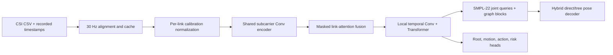
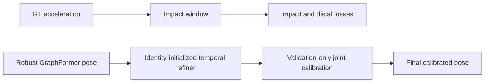
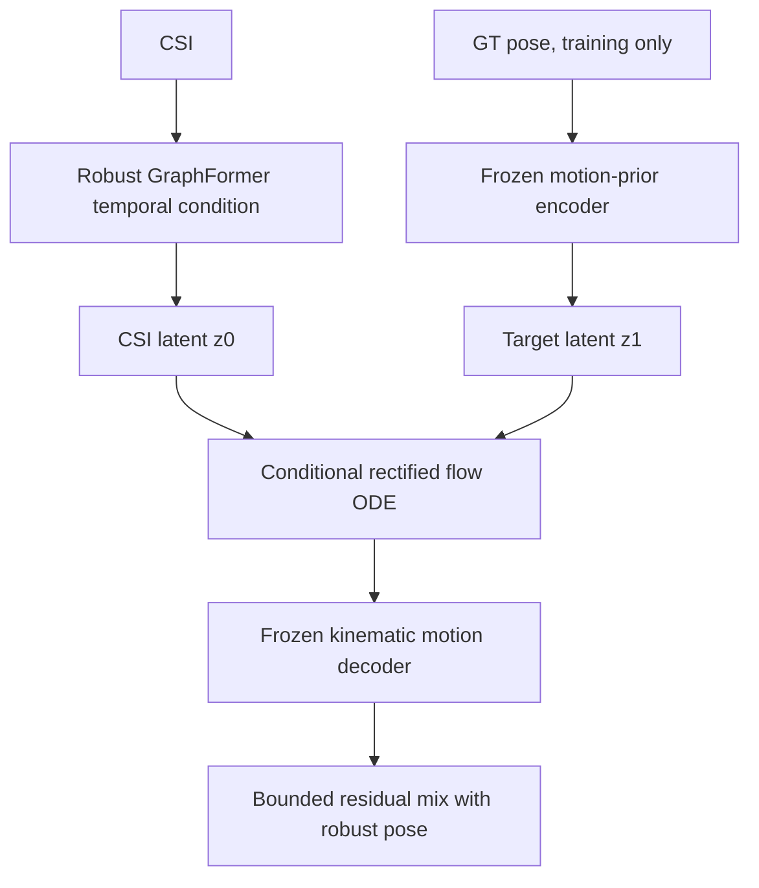

# NotiFi CSI-to-Pose

Wi-Fi CSI만 입력받아 시간에 따른 사람의 **GVHMR SMPL-22 3D pose와 root trajectory**를 복원하는 연구 코드입니다. 영상과 GVHMR은 학습용 GT 생성에만 사용하며, 검증과 실제 추론에는 CSI만 사용합니다.

- 기존 코드: [NotiFi-CSI-to-Pose `feature/goal1`](https://github.com/NotiFi2026/NotiFi-CSI-to-Pose/tree/feature/goal1)
- 현재 통합 위치: [NotiFi/CSI-to-Pose](https://github.com/jjyoon012-git/NotiFi/tree/main/CSI-to-Pose)
- 현재 권장 모델: **validation-calibrated impact GraphFormer**
- 실험 모델: **CSI-conditioned latent rectified flow**

## 연구 목표

단순 행동 분류가 아니라 프레임별 자세를 복원한다. 특히 낙상 시점에 머리, 손목, 무릎, 발목, 발이 어느 방향으로 움직이고 어느 부위가 바닥과 충돌했는지를 확인할 수 있어야 한다.

입력과 출력은 다음과 같다.

```text
입력  CSI: [B, T=304, Link=3, Subcarrier=114, I/Q-derived channel=2]
출력  pose_rel: [B, T, 22, 3]  # pelvis-relative SMPL-22
      root:     [B, T, 3]      # world-space pelvis trajectory
보조  action: 17 classes
      risk:   safe / warning / danger
```

## 기존 코드 설명

`feature/goal1`의 최신 GVHMR 경로는 다음 파이프라인을 사용한다.



핵심 기술은 다음과 같다.

1. **Timestamp alignment**: CSI packet 시각과 `video_timestamps.csv`를 이용해 GT frame을 실제 촬영 시각에 정렬한다. `k/30` 가정은 기록이 일부 없을 때만 사용한다.
2. **CSI representation**: guard/DC subcarrier를 제거한 114개 subcarrier를 사용한다. subject, environment, label 같은 누수 가능한 metadata는 모델 입력에서 제외한다.
3. **Link-aware encoding**: TX1/TX2/TX3를 공유 encoder로 처리하고, 누락 link는 `link_mask`로 attention에서 제외한다.
4. **Temporal modeling**: dilated local convolution으로 짧은 움직임을 포착하고 Transformer로 전체 trial 문맥을 결합한다.
5. **Hybrid graph decoding**: 직접 관절 좌표와 SMPL kinematic tree 복원을 혼합해 손목·발까지 누적되는 parent error를 줄인다.
6. **Domain robustness**: site baseline subtraction, RF augmentation, balanced cross-domain batches, GroupDRO, domain-adversarial head, supervised contrastive loss를 사용한다.
7. **Auxiliary supervision**: action/risk뿐 아니라 fall phase, foot contact, velocity, acceleration, floor penetration을 함께 학습한다.

## 현재 문제점

기존 robust GraphFormer의 위치 오차는 LOSO 평균 약 `29.38cm`지만 다음 문제가 남아 있다.

- 사람과 환경이 바뀌면 CSI 분포가 크게 달라진다.
- deterministic regression이 가능한 여러 동작을 평균내면서 정지 자세에 가까워진다.
- raw prediction에는 고주파 흔들림이 있지만 5-frame smoothing 후 실제 동작 진폭이 작다.
- LOSO smoothed pose-speed ratio가 평균 `0.369`다. GT 움직임을 1.0으로 볼 때 약 37%만 복원한다.
- 낙상 impact 구간의 절대 위치 오차가 LOSO 평균 약 `66.58cm`로 여전히 크다.
- action/risk 보조 head 정확도가 낮아 pose 생성에 강한 semantic condition을 공급하지 못한다.

## 1안: Robust GraphFormer

**상태: 기준 모델, 채택**

기존 GraphFormer에 환경 일반화 요소를 추가한 기준 모델이다.

```text
CSI encoder
  -> link attention
  -> temporal GraphFormer
  -> hybrid SMPL-22 decoder
  -> pose_rel + root

보조 학습:
  RF augmentation + GroupDRO + domain adversarial
  + cross-domain supervised contrastive
  + phase/contact/dynamics losses
```

장점:

- 구조가 단순하고 추론이 결정론적이다.
- 네 protocol에서 가장 안정적인 기본 성능을 보였다.
- 새 모델은 이 체크포인트를 epoch 0 안전 기준으로 사용한다.

한계:

- MPJPE 중심 회귀라 평균 자세 수렴을 피하기 어렵다.
- frame-to-frame velocity loss가 고주파 jitter에도 낮아질 수 있다.

실행:

```powershell
python -m notifi_pose.tools.run_robust_protocols --only yja_e02
python -m notifi_pose.tools.run_robust_protocols --only loso
python -m notifi_pose.tools.summarize_robust_runs
```

## 2안: Impact-aware Temporal Refiner

**상태: 현재 권장 모델, 보수적 개선**

기존 robust checkpoint 뒤에 0으로 초기화된 temporal residual refiner를 붙인다. 초기 출력은 기준 모델과 정확히 같으며, validation 종합 점수가 좋아질 때만 체크포인트를 교체한다.

추가 요소:

1. GT acceleration peak를 기준으로 danger trial의 impact window를 만든다.
2. 머리, 손목, 무릎, 발목, 발을 distal/injury-relevant joint로 가중한다.
3. velocity, acceleration, jerk, foot slide, floor penetration을 함께 제약한다.
4. validation에서 관절별 residual scale을 `0, 0.25, 0.5, 0.75, 1.0` 중 선택한다.
5. 일반 관절 오차가 기준 모델보다 `0.05cm` 넘게 나빠지는 scale은 금지한다.
6. test 결과는 checkpoint나 residual scale 선택에 사용하지 않는다.



실행:

```powershell
python -m notifi_pose.tools.run_impact_protocols --only yja_e02
python -m notifi_pose.tools.run_impact_protocols --only loso
python -m notifi_pose.tools.summarize_impact_results
```

`run_impact_protocols`는 학습 후 `calibrated_model.pt`까지 자동 생성한다. 시각화 도구도 이 파일이 있으면 `best_model.pt`보다 먼저 사용한다.

## 3안: Coherent Displacement Refiner

**상태: 구현 및 실험 완료, 미채택**

인접 frame velocity 대신 5 frame, 약 167ms 동안의 평균 변위를 맞춘다. 고주파 jitter가 loss를 속이지 못하게 하고 smoothing 후에도 남는 동작을 만들려는 접근이다.

```text
L_displacement = SmoothL1(
  (pose[t+5] - pose[t]) * FPS/5,
  (GT[t+5]   - GT[t])   * FPS/5
)
```

yja E02에서 smoothed pose-speed ratio가 `0.721 -> 0.714`로 오히려 감소했다. 현재 residual decoder의 용량과 deterministic objective만으로는 motion-amplitude collapse를 해결하지 못한다고 판단해 채택하지 않았다.

재현:

```powershell
python -m notifi_pose.tools.run_coherent_protocols --only yja_e02
```

## 4안: CSI-conditioned Latent Rectified Flow

**상태: 생성형 구조 구현 및 yja 실험 완료, 실험적/미채택**

평균 자세 문제를 직접 다루기 위해 GT motion prior와 conditional rectified flow를 추가했다.

### 4.1 GT-only kinematic motion prior

GVHMR pose를 parent-relative bone direction과 trial-level bone length code로 변환한다. decoder는 SMPL tree를 따라 pose를 복원한다. held-out subject의 GT는 prior 사전학습에 사용하지 않는다.

```text
GT pose
  -> bone direction + bounded length code
  -> latent z_gt [B,T,128]
  -> frozen kinematic decoder
  -> reconstructed SMPL-22 pose
```

yja protocol의 source validation에서 prior 자체의 재구성 MPJPE는 표시 정밀도 기준 `0.00cm`였다. 따라서 병목은 motion decoder가 아니라 CSI에서 올바른 latent trajectory를 찾는 단계다.

### 4.2 Conditional rectified flow

CSI condition으로 만든 초기 latent `z0`에 noise를 추가하고 GT latent `z1`로 가는 vector field를 학습한다.

```text
t ~ Uniform(0, 1)
z_t = (1-t) z0 + t z1
target velocity = z1 - z0
L_flow = SmoothL1(v_theta(z_t, t, CSI), z1 - z0)
```

추론에서는 random sampling을 사용하지 않는다. CSI-derived `z0`에서 시작해 midpoint ODE solver를 고정 step으로 적분하므로 같은 CSI에 항상 같은 결과가 나온다.



yja E02 결과:

- impact MPJPE: `84.14 -> 81.03cm` 개선
- 전체 MPJPE: `29.57 -> 29.86cm` 악화
- smoothed pose-speed ratio: `0.721 -> 0.697` 악화

충격 자세에는 이득이 있었지만 전체 복원과 동작 진폭이 나빠져 현재 모델로 채택하지 않았다. 데이터가 늘어나면 action-conditioned latent, multi-hypothesis sampling, velocity-space prior와 함께 재검토할 수 있다.

재현:

```powershell
python -m notifi_pose.tools.run_latent_flow_protocols `
  --only yja_e02 --prior-epochs 12 --epochs 15
```

## 실험 결과

모든 수치는 CSI-only pose trial, validation-selected checkpoint, 5-frame smoothing 기준이다.

| Protocol | Robust MPJPE | 2안 MPJPE | Robust dynamic | 2안 dynamic | Robust impact | 2안 impact |
|---|---:|---:|---:|---:|---:|---:|
| yja E02 | 29.57 | **29.45** | 30.94 | **30.79** | 84.14 | **83.84** |
| LOSO ajh | 28.10 | 28.10 | 25.98 | 25.98 | 67.14 | 67.14 |
| LOSO lmh | 32.88 | **32.81** | 31.60 | **31.50** | 60.41 | **60.14** |
| LOSO mhw | **27.16** | 27.19 | **26.23** | 26.23 | 72.18 | **72.00** |
| LOSO mean | 29.38 | **29.36** | 27.94 | **27.91** | 66.58 | **66.43** |

단위는 cm다. 자세한 관절·risk·label별 결과는 [`docs/results/impact_calibrated_results.md`](docs/results/impact_calibrated_results.md)와 JSON/CSV를 참고한다.

## 데이터 분리

### Protocol A

- train/validation: `ajh`, `lmh`, `mhw`의 사용 가능한 825개 전체 trial을 split 규약에 따라 사용
- sealed test: `yja/E02`
- yja E02 전체 275개 중 pose GT가 있는 263개를 pose 평가에 사용
- 손상된 `yja/E01`, `yja/E03` CSI는 제외

### Fixed LOSO

- `test_ajh`: lmh+mhw로 학습/검증, ajh test만 평가
- `test_lmh`: ajh+mhw로 학습/검증, lmh test만 평가
- `test_mhw`: ajh+lmh로 학습/검증, mhw test만 평가
- yja E02는 source LOSO에 섞지 않고 별도 sealed protocol로 유지

split 정의는 [`work_v2/splits/experiments.json`](work_v2/splits/experiments.json)에 있다.

## 데이터 계약

trial 하나는 다음 세 파일이 같은 폴더에 있어야 한다.

```text
data/pose_and_action/{subject}/{environment}/{risk}/{scenario}/{trial_id}/
  csi.csv
  gt_pose.npz
  original_video.mp4
```

timestamp는 학습 ZIP 외부에 둘 수 있지만 trial ID와 상대 경로가 일치해야 한다.

```text
timestamp/{subject}/{environment}/{risk}/{scenario}/{trial_id}/
  video_timestamps.csv
```

`gt_pose.npz`는 GVHMR SMPL-22 joint 순서, meter 단위, pelvis-relative pose와 world root를 제공해야 한다. 영상은 GT 재추출과 audit용이며 모델 입력에는 들어가지 않는다.

## 설치

Python 3.10과 CUDA 지원 PyTorch 환경을 권장한다.

```powershell
cd CSI-to-Pose
python -m pip install -r requirements.txt
```

데이터와 timestamp 경로를 환경변수로 지정한다.

```powershell
$env:NOTIFI_DATASET_ROOT = "D:\mhw\Dataset_Splits\NotiFi_CSI_GVHMR_v2_LOSO_60_15_25"
$env:NOTIFI_TIMESTAMP_ROOT = "D:\NotiFi-3D\Timestamp_Upload_Staging\timestamp"
$env:NOTIFI_WORK_ROOT = "$PWD\work_v2"
```

## 인덱스와 캐시 생성

```powershell
python -m notifi_pose.tools.build_index --no-verify-files
python -m notifi_pose.tools.link_quality --workers 8
python -m notifi_pose.tools.build_splits
python -m notifi_pose.tools.build_cache --workers 8 --rebuild
python -m notifi_pose.tools.build_site_baseline
python -m notifi_pose.tools.verify_alignment
```

## 단일 학습과 평가

```powershell
python -m notifi_pose.tools.train `
  --exp yja_holdout --arch robust_graphformer --decoder hybrid `
  --hidden 128 --temporal-layers 3 --heads 4 --graph-blocks 2 `
  --epochs 40 --patience 10 --batch-size 16 --baseline sub `
  --rf-augment --balanced-batches --tag robust_gf_yja_e02
```

```powershell
python -m notifi_pose.tools.evaluate_sealed `
  work_v2\runs\impact_gf_yja_e02\calibrated_model.pt `
  --dataset sealed --fold yja_E02 --smooth-window 5
```

```powershell
python -m notifi_pose.tools.visualize `
  --run impact_gf_yja_e02 --split test --n 10
```

## 테스트

```powershell
python -m unittest discover -s tests -v
python -m py_compile notifi_pose\*.py notifi_pose\tools\*.py
```

현재 16개 단위 테스트가 timestamp alignment, site baseline, GraphFormer shape, impact window, temporal refiner, latent flow objective, loss backward를 검증한다.

## 폴더 구조

```text
CSI-to-Pose/
  README.md
  requirements.txt
  notifi_pose/
    contract.py
    dataio/
    nets.py
    losses.py
    trainer.py
    latent_flow.py
    v3.py
    tools/
  tests/
  work_v2/splits/
  docs/
    graphformer_gvhmr_v2_experiment.md
    robust_graphformer_experiment.md
    results/
  scripts/                      # 초기 MediaPipe/pilot 코드, legacy
```

대용량 dataset, cache, checkpoint, prediction NPZ, 영상은 Git에 포함하지 않는다.

## 결론

현재 권장안은 **2안 impact-aware calibrated GraphFormer**다. 기준 모델을 망가뜨리지 않으면서 전체·dynamic·distal·impact 오차를 작게 개선한다.

다만 CSI-only 동작 진폭 복원은 아직 해결되지 않았다. 다음 연구 우선순위는 손실을 더 붙이는 것이 아니라 다음 세 가지다.

1. subject/environment 수와 동일 동작 반복을 늘려 CSI→motion latent 대응의 식별 가능성을 높인다.
2. action/phase를 정확히 추정한 뒤 latent generator의 condition으로 사용한다.
3. velocity-space motion prior와 multi-hypothesis flow를 도입하고, MPJPE와 함께 smoothed motion amplitude를 필수 선택 지표로 사용한다.
