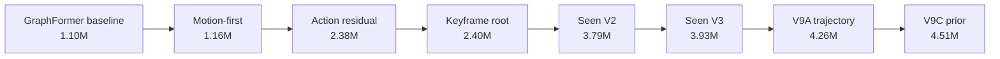
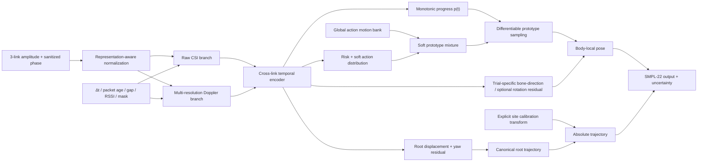

# NotiFi CSI-to-Pose 종합 진단과 10안 설계

초안 시각: 2026-08-04 15:39 KST  
최종 감사 반영: 2026-08-04 18:05 KST  
대상: `single_split` seen protocol과 1~9안 전체 코드·데이터·캐시·체크포인트  
목적: 실제 병목을 분리하고 다음 구현과 실험을 재현 가능한 순서로 고정한다.

> **중요:** 후속 데이터 계보 감사에서 보정된 lmh GT 295개가 실제 학습 경로와 cache에
> 한 건도 반영되지 않았고, 50개 dev_test GT도 오염된 사실을 확인했다. 따라서 이 문서의
> 기존 9A/9C/prototype 숫자는 모두 `pre-GT-repair historical`이다. 현재 승격 가능한 모델은
> 없으며 V9A만 수정 전 비교용, V9C prior는 기각한다. 최종 실행 순서와 gate는
> [`final_code_audit_and_v10_execution_plan.md`](final_code_audit_and_v10_execution_plan.md)를 우선한다.

## 0. 결론

현재 모델의 가장 큰 문제는 모델 크기가 아니다. **잘못된 GT와 stale cache**,
**표현 계약을 위반한 RF augmentation**, **반복 촬영된 동작의 강한 site/action 사전정보보다
못한 디코더**, **trial별 CSI 변화에 비해 지나치게 작은 pose residual**, **과거 휴리스틱 목표를
품은 8단 동결 cascade**, **실제 목표를 가리지 못하는 평가 지표**가 한꺼번에 상한을 만들고 있다.

따라서 10안은 다음 한 문장으로 정의한다.

> **CSI가 예측한 동작 분포와 단조 진행도로 site-independent action motion bank를 시간축에 맞추고,
> empty-room calibration adapter와 CSI가 trial-specific local pose 및 root trajectory residual과
> 불확실성을 직접 복원하는 end-to-end 모델**

9A와 9C는 수정 전 재현 기록으로만 보존한다. V9C prior는 V9A보다 local MPJPE를 평균
`0.072cm` 악화했고 bootstrap 95% CI `[-0.085,-0.059]cm` 전체가 음수이므로 기각한다.
10안은 기존 checkpoint를 이어받지 않고 corrected cache에서 처음부터 재학습한다.

## 1. 이번 감사에서 새로 확인한 사실

### 1.1 현재 9C보다 단순한 motion prototype이 훨씬 강하다

train GT만으로 만든 동일 길이 prototype을 seen test에 적용했다. `site`는 알려진 seen calibration ID이고, class는 GT와 CSI 예측을 각각 비교했다.

| 방법 | Local pose | Root | Absolute pose | Danger local | Danger absolute | Speed corr. |
|---|---:|---:|---:|---:|---:|---:|
| class prototype, GT class | 23.65cm | 36.71cm | 46.96cm | 28.34cm | 52.41cm | 0.186 |
| subject×class, GT class | 20.53cm | 34.56cm | 43.30cm | 25.69cm | 48.66cm | 0.377 |
| environment×class, GT class | 21.03cm | 36.10cm | 44.50cm | 27.20cm | 51.03cm | 0.218 |
| site×class, GT class | **11.68cm** | **28.31cm** | **32.31cm** | **17.72cm** | **35.10cm** | **0.462** |
| site×class, CSI hard class | 14.14cm | 31.63cm | 36.57cm | 25.18cm | 46.71cm | 0.430 |
| site×class, CSI soft class | **13.92cm** | **30.81cm** | **35.64cm** | **23.55cm** | **44.27cm** | **0.437** |
| 현재 9C | 20.68cm | 31.61cm | 41.58cm | 28.91cm | 51.14cm | 0.352 |

이 결과의 올바른 해석은 다음과 같다.

1. seen split에는 동일 사람·환경·행동을 반복한 강한 choreography prior가 있다.
2. 이를 사용하지 않는 모델이 복원 문제를 불필요하게 어렵게 풀고 있다.
3. prototype 자체가 최종 답은 아니다. trial별 속도, 방향, 자세 차이가 평균화되므로 CSI residual이 반드시 필요하다.
4. `site×class`는 unseen에서 사용할 수 없는 oracle이 아니라 **seen에서 반드시 이겨야 하는 기준선**이다. 이후 `universal action prototype + site adapter`로 분해해야 한다.

### 1.1.1 CSI embedding retrieval은 평균 prototype을 조금 더 개선한다

frozen motion-first CSI embedding으로 동일 site/action의 train trajectory를 cosine 검색했다.
이웃 수 `k=1/3/5`는 validation의 local+root+danger absolute 조합 점수로만 선택했고, 세
mode 모두 `k=5`가 선택됐다.

| Validation-selected retrieval | Local pose | Root | Absolute pose | Danger local | Danger absolute | Speed corr. |
|---|---:|---:|---:|---:|---:|---:|
| GT class, top-5 | **11.29cm** | **26.92cm** | **30.77cm** | 17.55cm | 34.96cm | 0.477 |
| CSI hard class, top-5 | 13.77cm | 30.38cm | 35.21cm | 25.02cm | 47.03cm | 0.451 |
| CSI soft class, top-5 | **13.54cm** | **29.55cm** | **34.28cm** | **23.40cm** | 44.66cm | **0.456** |

soft retrieval은 soft 평균 prototype의 local/root/absolute `13.92/30.81/35.64cm`를
`13.54/29.55/34.28cm`로 개선했다. 다만 danger absolute는 `44.27 -> 44.66cm`로
0.39cm 나빠졌다. 따라서 retrieval을 무조건 대체재로 쓰지 않는다. **mean prototype을
안전한 초기값으로 두고 retrieval confidence가 높은 경우에만 top-K 후보를 convex mixture하는
방식**을 10안 ablation으로 둔다. GT class top-5가 매우 강하므로 danger class/progress가
개선되면 retrieval 상한도 더 올라갈 가능성이 있다.

### 1.2 9C는 CSI를 쓰지만 local pose의 trial 차이는 적게 쓴다

전체 405 test trial에서 CSI를 의도적으로 망가뜨렸다.

| 입력 | Local pose | Root | Danger absolute | Speed corr. | 해석 |
|---|---:|---:|---:|---:|---|
| 정상 | 20.68cm | 31.61cm | 51.14cm | 0.352 | 기준 |
| 같은 site/class의 다른 trial CSI | 20.90cm | 34.34cm | 52.93cm | 0.199 | local pose 변화가 겨우 +0.22cm |
| 시간 역순 | 22.93cm | 41.32cm | 58.20cm | -0.002 | 시간 순서는 사용함 |
| 30-frame shift | 23.36cm | 34.54cm | 54.98cm | 0.048 | 정렬에 민감함 |
| block 역순 | 22.87cm | 43.07cm | 58.74cm | -0.010 | 장기 순서는 사용함 |
| 시간 평균 CSI | 26.15cm | 45.26cm | 66.04cm | -0.002 | motion 정보는 필요함 |
| amplitude only | 27.99cm | 47.22cm | 62.38cm | 0.331 | phase도 유용함 |
| phase only | 28.86cm | 46.84cm | 64.23cm | 0.127 | amplitude도 유용함 |
| link 1/2/3 단독 | 25.41~25.94cm | 44.78~46.63cm | 60.64~62.93cm | 0.201~0.313 | 다중 링크 융합은 유용함 |

결론은 “CSI가 쓸모없다”가 아니다. 시간 순서, 세 링크, amplitude와 sanitized phase 모두 사용한다. 그러나 **같은 site/class 안에서 trial을 바꾸어도 local pose가 거의 변하지 않으므로 출력의 큰 부분이 action/site template이고, CSI는 주로 root와 속도에 제한적으로 반영**된다.

### 1.3 danger action 인식이 decoder의 상한을 낮춘다

전체 action accuracy는 `87.65%`, ECE는 `3.49%`지만 risk별로 분해하면 다르다.

| Risk | N | Accuracy | 평균 confidence |
|---|---:|---:|---:|
| safe | 207 | 96.14% | 93.97% |
| warning | 108 | 92.59% | 95.37% |
| danger | 90 | **62.22%** | 77.61% |

danger 세부 action 정확도는 D01 `50.0%`, D02 `72.2%`, D03 `27.8%`, D04 `72.2%`, D05 `88.9%`다. 따라서 hard class template은 위험하고 soft mixture가 더 낫다. 특히 bed-exit fall인 D03 개선이 10안의 첫 classification gate다.

### 1.4 현재 danger trajectory는 local articulation을 과소 복원한다

9C test에서 danger GT local pose speed는 `0.223m/s`인데 예측은 `0.089m/s`다. 반면 root speed ratio는 `1.235`, absolute speed ratio는 `0.981`이다. 즉 전체 몸의 이동은 어느 정도 만들지만, 관절이 접히고 회전하는 국소 동작이 평균 자세에 가깝다.

가장 어려운 danger local pose는 D03 `31.72cm`, D04 `31.49cm`이고, absolute pose는 D02 `59.63cm`가 가장 나쁘다. `S01 walking`은 local pose `15.12cm`지만 root가 `55.69cm`이므로 local/absolute/root 문제를 반드시 분리해야 한다.

## 2. 현재 코드의 실제 실행 구조

9C는 하나의 jointly trained encoder-decoder가 아니다.



대부분의 앞단을 동결한 채 다음 residual을 붙였다. 이 방식은 이전 결과를 보존하기 쉽지만 다음 문제가 있다.

- 뒤 stage가 upstream representation을 고칠 수 없다.
- 과거에 사용한 impact/phase/contact 휴리스틱이 새 loss에서 지워져도 frozen feature에 남는다.
- stage별 calibration scale이 서로의 오차를 가린다.
- 전체 성능 개선이 어느 CSI 표현에서 왔는지 추적하기 어렵다.
- 4.51M parameter 자체는 크지 않지만 학습 목적이 8번 갈라져 **objective debt**가 크다.

## 3. 문제점과 해결책

우선순위는 P0가 구현 전에 반드시 고칠 것, P1이 10안 핵심, P2가 핵심을 통과한 뒤의 개선, P3가 unseen 단계다.

### P0-1. amplitude/phase를 I/Q처럼 회전하는 잘못된 RF augmentation

현재 contract는 `CSI_REPRESENTATION="amp_phase"`다. 그런데 `dataset.py::_augment_rf()`는 마지막 두 채널을 직교 I/Q로 간주해 회전한다. `train_motion_first.py`, `train_motion_pose.py`, `train_seen_residual.py`가 이를 켠다. 따라서 현재 9C의 frozen motion backbone은 물리적으로 잘못된 증강으로 pretrain됐다.

해결:

- representation별 augmentation을 별도 함수로 분리한다.
- amplitude는 log-gain, link gain, 좁은 subcarrier mask, 약한 correlated noise만 쓴다.
- sanitized phase는 global offset, subcarrier linear slope, 약한 wrapped noise를 물리 검증 후 쓴다.
- I/Q rotation은 `iq` contract일 때만 허용한다.
- subcarrier dropout은 train mean imputation→normalization→zero gate 순서로 처리하고 별도 validity
  token을 encoder에 전달한다. 현재처럼 pre-norm raw zero만 넣지 않는다.
- unit test에서 amplitude가 음수가 되지 않는지, phase 범위와 mask가 유지되는지 검사한다.
- V10 base는 수정된 augmentation으로 처음부터 재학습한다.

### P0-2. timestamp 품질의 불균형과 lmh 근사 정렬

timestamp는 없애면 안 된다. 현재 ajh 825, mhw 825, yja 275는 complete지만 lmh는 complete 36, `uniform_30fps` compatibility 788이다. 일부 lmh trial은 짧은 timestamp 행을 GT 전체 프레임에 `linspace`로 늘린다. 시작/끝 시간은 보존하지만 어떤 video frame이 누락됐는지는 알 수 없다.

해결:

- timestamp는 모든 frame loss의 기준으로 유지한다.
- `exact`, `partial_scaled`, `uniform_30fps`를 명시적 품질 등급으로 분리한다.
- 10안 최초 비교는 `ajh+mhw exact`와 `lmh approximate`를 별도 표로 보고한다.
- partial trial은 motion descriptor 기반 작은 보정만 허용하고 GT 자체는 재저장하지 않는다.
- 자유로운 DTW로 raw pose를 맞추지 않는다. timestamp identity 주변의 단조 progress만 학습한다.
- 최종 성능 주장은 exact subset, all data 두 결과를 함께 제시한다.

### P0-2B. 정확한 frame time을 사용한 뒤 cache에서 버리고 다시 30Hz로 가정함

현재 CSI resampling에는 `frame_times()`가 사용되지만 cache에는 `frame_time`이 저장되지 않는다.
Transformer positional encoding은 frame index만 사용하고 모든 speed/acceleration/5-frame loss는
`TARGET_FPS=30`을 곱한다. 즉 정확한 timestamp로 CSI를 가져온 뒤 모델과 loss가 실제 `Δt`를
잊는다.

2,366 pose trial을 다시 감사한 결과:

- exact timestamp 1,578 trial의 single-frame fixed-30Hz speed scale은 p05/median/p95
  `0.450/0.930/1.410`이다.
- frame transition의 `14.5%`가 true speed의 0.75배 미만, `23.4%`가 1.25배 초과로 계산된다.
- 5-frame window에서는 p05/median/p95가 `0.846/1.032/1.218`로 완화되지만 여전히 다르다.
- `ajh_E02_S04_t006`의 마지막 timestamp는 직전 frame에서 `3.312초` 떨어져 있다. 이 trial은
  train에 들어가며 현재 index-based Transformer에서는 바로 인접한 frame처럼 처리된다.

해결:

- cache에 `frame_time [N,T]`, `delta_t [N,T]`, `transition_valid [N,T]`, packet age/gap을 저장한다.
- velocity는 `(x[t]-x[t-1])/delta_t[t]`, lag-5는 실제 elapsed time으로 나눈다.
- positional encoding도 seconds 기반 Fourier/time2vec로 바꾼다.
- `dt > max(0.2s, 5×trial median)`인 discontinuity는 derivative loss와 local convolution 연결을
  끊고 gap token으로 표시한다.
- partial timestamp를 보간하기 전에 trailing outlier와 discontinuity를 검출한다.
- 10-D에서는 fixed grid와 **irregular packet token + exact frame-time query cross-attention**을
  비교한다. 후자는 CSI packet을 억지로 30Hz로 만들지 않고 GT timestamp에서 pose를 query한다.

### P0-2C. model standardization과 empty-room calibration을 같은 `fit()`으로 취급함

`TrainConfig.norm_source`는 선언만 있고 trainer와 CLI에서 사용되지 않는다. 실제 `PerLinkNorm`은
shuffled train 20 batch(320 trial)로 fit된다. 그런데 class 주석은 배포 시 empty-room 10초로 같은
buffer를 다시 fit할 수 있다고 설명한다. `SiteBaseline(sub)`가 이미 설치별 empty-room 평균을 뺀 뒤라
이 동작은 학습/배포 분포 불일치이자 이중 calibration이다.

108 source absence trial로 refit한 실측에서 subcarrier/channel별 `sigma_absence/sigma_train` 중앙은
`0.199`였고, 같은 validation amplitude의 normalized std는 `1.14→14.76`, p99 절댓값은
`4.85→68.53`이 됐다. 살아 있는 link의 site별 absence sigma도 `4.80x` 차이다.

해결:

- model standardizer는 train 전체에서 fit하고 immutable checkpoint buffer로 고정한다.
- 새 설치의 empty-room CSI는 별도 calibration encoder/adapter 입력으로만 쓴다.
- adapter는 학습 때도 source site별 empty-room bundle을 통해 같은 경로를 사용한다.
- `SiteBaseline sub/sub_z`, model standardizer, installation adapter를 별도 class와 hash로 관리한다.
- 배포 API에서 `model.norm.fit(empty_room)`를 금지하고 bundle validation 실패 시 canonical-only 출력을 낸다.

### P0-3. 현재 speed metric이 실제 동작 복원을 잘 설명하지 못함

공식 `pose_speed_ratio`는 root-relative joint speed의 trial별 비율을 평균한다. 정지 action의 GT 분모가 작아 S02/S03/S04에서 4~5배 값이 나오고, danger under-motion을 상쇄한다. `dynamic_mpjpe`도 root-relative speed로 frame을 고르므로 rigid body fall translation을 놓친다.

해결:

- 기존 ratio는 historical metric으로만 남기고 model selection에서 제거한다.
- pooled ratio를 `sum(pred speed)/sum(GT speed)`로 계산한다.
- pose/root/absolute 각각 speed MAE, pooled ratio, Pearson/Spearman correlation을 낸다.
- moving frame은 local pose와 root 중 하나가 threshold를 넘으면 포함한다.
- danger action별 local/root/absolute MPJPE와 endpoint, root drop, torso angle을 낸다.
- 3 seed와 trial bootstrap 95% CI 없이는 작은 차이를 채택하지 않는다.

### P0-4. test set가 반복 개발로 사실상 development set가 됨

split 자체에는 trial 중복이 없고 site×class 연속 block과 validation buffer도 있다. 그러나 동일한 405 test를 1~9안에서 반복 확인했으므로 현재 test는 통계적으로 최종 holdout이 아니다.

해결:

- 현재 405개는 `dev_test`로 이름을 바꿔 진단과 ablation에 계속 쓴다.
- 아직 한 번도 열지 않은 trial 또는 새 촬영분을 `final_seen_holdout`으로 봉인한다.
- final holdout은 10안 구조와 hyperparameter를 동결한 뒤 한 번만 연다.
- yja E02와 participant+installation 3-fold는 seen gate 이후 joint-shift 평가용으로 유지한다.

또한 현 domain은 `subject_environment` 9개이고 physical installation ID/geometry field가 0개다. 같은
E01이 사람 간 같은 물리 장소라는 근거가 없어 LOSO는 participant와 그 사람의 installation shift를
동시에 측정한다. 세 participant fold는 진단일 뿐 population generalization 추정이 아니다. 다음
수집은 여러 사람이 같은 설치를 공유하고 같은 사람이 여러 설치를 방문하는 factorial design으로 한다.
현 LOEO는 seen participant 안의 environment shift 진단으로는 유지한다.

선택 규칙 자체도 versioning되지 않았다. V9A는 speed ratio `1.186` 후보를 feasible로 저장해 상한
`1.20`으로 실행됐지만 V9B와 현재 source는 `1.15`를 쓴다. 현재 source로 V9A 후보를 재선택하면
pose strength가 `0.15`에서 `0.0`으로 바뀐다. result에 source hash가 없어 단순한 code checkout만으로
점수를 재현할 수 없다. selection formula, threshold, smoother, metric version을 checkpoint에 저장하고
하나라도 바뀌면 새 experiment로 취급한다.

### P0-5. injury/충돌에 대한 현재 데이터의 식별 불가능성

GVHMR pose만으로 실제 부상 부위, 충격력, 최초 접촉을 정답으로 알 수 없다. pose의 2차 미분 최대값은 급격한 동작일 뿐 실제 충돌 센서가 아니다. 현재 injury/contact 수치는 heuristic proxy 성능이다.

해결:

- 새 base에서 `impact_window`, 최대 가속도 frame, `first_contact`, injury joint loss를 제거한다.
- 연구 목표를 우선 “낙상 전 과정의 3D pose와 root trajectory 복원”으로 쓴다.
- 부상 추론이 필요하면 실제 body-region outcome annotation, pressure/contact mat, IMU 또는 전문가가 검증한 biomechanics target을 별도 수집한다.
- 그 전에는 `injury prediction` 대신 `pose-derived possible contact/impact proxy`라고 표기한다.

### P1-1. decoder가 강한 seen prior보다 약함

현재 action residual의 `max_delta=0.08m`와 calibration `0.5`는 joint당 실효 약 4cm 범위다. 기본 standing-like pose를 lying/fall로 바꾸기에 구조적으로 부족하다. 여러 작은 residual이 누적되지만 각 stage가 앞 stage를 고칠 수 없다.

해결:

- train GT로 `site×action×normalized-progress` prototype bank를 만든다.
- CSI action probability로 prototype을 soft mixture한다.
- frozen CSI embedding top-K retrieval과 평균 prototype의 convex gate를 validation에서 비교한다.
- 모델의 residual을 zero-init해 첫 epoch 출력이 이미 강한 prototype baseline이 되게 한다.
- pose residual은 joint rotation 6D 또는 local bone direction으로 예측하며 4cm clamp를 제거한다.
- root는 첫 frame 기준 displacement와 yaw를 별도 예측한다.
- prototype, progress, residual encoder를 warm-up 후 end-to-end로 공동 미세조정한다.

### P1-2. action만 있고 “동작 진행도”가 없음

동일 action이라도 넘어지는 시점과 속도가 다르다. 고정 frame index prototype은 평균 동작을 만들고, 현재 bounded hard alignment는 validation에서 기각됐다.

해결:

- 각 frame에서 양수 increment `softplus(d_t)`를 예측하고 cumulative sum을 0~1로 정규화해 단조 progress `p(t)`를 만든다.
- timestamp 기반 normalized time을 prior로 두고 slope/curvature가 과도하게 벗어나지 않게 regularize한다.
- 시작과 마지막 valid frame은 0과 1에 anchor한다.
- 반복 action끼리 Temporal Cycle Consistency를 적용해 같은 진행도의 표현을 가깝게 한다.
- 선택적으로 Soft-DTW divergence 또는 Drop-DTW를 저차원 motion energy/root velocity descriptor에만 적용한다.
- GT pose나 timestamp 파일 자체를 이동시키거나 덮어쓰지 않는다.

### P1-3. encoder가 delay/Doppler 구조와 시간 간격을 충분히 보존하지 않음

`SubcarrierConvEncoder`는 local convolution 후 subcarrier 축을 mean과 max로 접는다. link attention과 Transformer는 유용하지만 명시적인 delay/Doppler 구조를 잃는다. cache에는 mask만 있고 모델은 packet age, 실제 gap, `Δt`, RSSI를 쓰지 않는다.

해결:

- branch A: 현재 amplitude+sanitized-phase raw token branch를 정정해 유지한다.
- branch B: short/medium/long STFT 또는 learnable spectrogram으로 Doppler/DFS를 만든다.
- link×frequency×time token에 link ID, actual `Δt`, nearest-packet age, gap, RSSI, validity를 넣는다.
- 세 link token을 너무 일찍 평균하지 않고 cross-link attention 뒤에 pooling한다.
- raw branch와 Doppler branch를 cross-attention으로 결합한다.
- spectrogram branch는 SLNet의 super-resolution/polarized convolution 메커니즘과 RFBoost의 물리 기반 time-frequency augmentation을 ablation한다.

### P1-4. local pose와 absolute root를 한 문제처럼 취급함

GVHMR은 camera/world Y-up 좌표지만 board geometry와 camera extrinsic이 데이터 contract에 없다. 동일 site에서 root를 외울 수 있어도 새로운 환경의 absolute position/yaw는 CSI만으로 좌표계가 정해지지 않는다.

해결:

- decoder를 `body-local articulation`과 `root displacement/yaw relative to first frame`으로 분리한다.
- seen에서는 site calibration transform으로 absolute coordinates를 복구한다.
- unseen에서는 board 위치/방향 또는 짧은 calibration motion으로 site transform을 추정한다.
- geometry가 없으면 unseen absolute root를 주 목표로 주장하지 않고 canonical trajectory로 평가한다.
- link는 CSV 순서가 아니라 board serial/TX identity와 antenna position/orientation로 bind한다. V9A의
  CSI+mask 순열 반사실은 worst local/root/danger absolute를 `+6.24/+17.24/+13.82cm` 악화했다.
- unordered link set을 쓰면 geometry-conditioned token과 permutation unit test를 함께 둔다.

### P1-5. motion prior의 train/inference mismatch

현재 prior 학습은 synthetic `observed` mask를 입력하지만 inference wrapper는 mask를 전달하지 않아 모든 joint가 observed인 것으로 처리된다. 이전 GT frame 복사와 child를 parent로 바꾸는 corruption도 실제 base error 분포와 다르다. prior는 local pose만 바꾸고 root는 못 고치며, clean GT를 1.74cm 왜곡한다.

해결:

- 10안 deterministic model이 prototype baseline을 이기기 전에는 prior를 붙이지 않는다.
- prior 학습용 입력은 train fold에서 out-of-fold로 생성한 실제 base prediction을 쓴다.
- local pose와 root trajectory prior를 분리한다.
- CSI feature, action distribution, uncertainty, true validity mask를 condition으로 전달한다.
- endpoint는 마지막 배열 15 frame이 아니라 sample별 마지막 valid frame에서 계산한다.
- AMASS/BABEL은 motion pretraining에만 쓰고 NotiFi CSI와 가짜 pair를 만들지 않는다.

### P1-6. danger imbalance를 단순 oversampling으로만 다룸

현재 danger는 sampler 약 4배와 loss 약 2배가 겹쳐 실효 약 8배가 될 수 있다. 그런데 D03 accuracy는 27.8%이고 local articulation은 여전히 collapse한다. 더 큰 weight는 답이 아니다.

robust 경로의 별도 `CrossDomainBatchSampler`도 dataset을 한 번씩 순회하지 않는다. 100 epoch
모의실험에서 epoch당 unique coverage는 약 `60%`, duplicate draw는 약 `40%`였고, raw danger
`16.6~17.6%`는 sampled `29.4%`가 됐다. 여기에 raw inverse-risk CE를 곱한 danger CE 질량은
`51.0~52.8%`였다. 100 epoch trial별 노출 횟수의 최대/최소도 `5.6~5.9x`였다. 이것은 단순한
batch pairing이 아니라 학습분포 자체를 크게 바꾸는 intervention이다.

해결:

- 기본 sampler는 without-replacement epoch traversal로 두고 모든 trial의 1회 노출을 보장한다.
- class-balanced sampler, inverse-frequency CE, GroupDRO는 동시에 켜지 말고 하나씩 독립 ablation한다.
- 비교할 때 epoch 수가 아니라 optimizer step과 unique-trial exposure를 맞춘다.
- pair batch가 필요하면 weighted permutation 또는 coverage-preserving batch constraint를 사용한다.
- risk head → action head의 계층형 분류와 supervised contrastive action embedding을 비교한다.
- soft class mixture를 사용해 오분류의 불연속 영향을 줄인다.
- D01~D05를 균일하게 뽑고 progress 구간도 균일하게 뽑는다.
- loss는 uncertainty weighting 또는 GradNorm으로 충돌을 조정한다.

### P2-1. deterministic 평균 회귀의 다중 가능성 문제

같은 CSI에서도 일부 관절 방향은 모호할 수 있다. SmoothL1 단일 출력은 평균 자세를 만들어 정지 collapse를 유도한다.

해결:

- 먼저 prototype-residual deterministic 모델로 신호 사용성을 확인한다.
- 그 뒤 K개 motion hypothesis와 calibrated confidence를 출력한다.
- best-of-K만 보고하지 말고 top-1 expected error와 coverage/calibration도 보고한다.
- diffusion은 residual/trajectory prior에 제한해 쓰고 CSI evidence를 강하게 condition한다.

### P2-2. 외부 데이터 사용 위치가 불명확함

외부 Wi-Fi 데이터와 NotiFi GVHMR을 억지로 짝지으면 label noise가 생긴다.

해결:

- CSI-Bench와 Person-in-WiFi 3D는 RF encoder pretraining/representation 검증에만 사용한다.
- AMASS+BABEL, UP-Fall+GVHMR pseudo pose는 motion prior와 fall trajectory library에만 사용한다.
- hardware/layout가 다른 외부 CSI와 NotiFi pose를 fake pair로 만들지 않는다.
- 외부 data pretraining의 이득은 NotiFi train-only fine-tune 후 동일 seen gate로 판단한다.

### P3. unseen calibration은 seen 복원 후 분리해 진행

seen도 template baseline보다 못한 상태에서 GroupDRO, domain adversarial, TTA를 붙이면 representation 문제와 adaptation 문제를 구분할 수 없다.

역사적 robust run에서는 같은 action·다른 domain을 당기는 SupCon과 domain adversarial이 shared pooled
embedding에 함께 걸렸고 action accuracy가 yja `4.18%`, LOSO 평균 `5.93%`로 chance 수준이었다. 잘못된
RF augmentation도 함께 있었으므로 개별 loss의 인과는 분리되지 않았지만, invariant semantic 정보와
domain-equivariant absolute/kinematic 정보를 한 latent에서 동시에 요구한 설계는 바꿔야 한다.

해결:

- 10A~10D seen gate를 먼저 통과한다.
- 그 다음 universal action prototype과 subject/site adapter를 분리한다.
- semantic/action token과 calibration-conditioned kinematic token을 분리하고 domain loss는 전자에만 건다.
- kinematic token은 train-only pose teacher와 own-trial/time alignment를 쓰되, 같은-action 다른 trial을
  모두 negative로 두지 않는다. GT trajectory가 충분히 다른 경우만 negative, 가까운 반복은 ignore한다.
- empty-room baseline, known board geometry, 5~10초 calibration motion의 조건을 각각 별도 protocol로 정의한다.
- `no calibration`, `empty-room only`, `few-shot unlabeled`, `few-shot labeled`를 섞지 않고 별도 표로 보고한다.
- CoTTA/EATA류 test-time adaptation은 마지막 ablation이며, base가 CSI-dependent gate를 통과한 뒤에만 사용한다.

## 4. 10안 구조



### 출력 표현

- `pose_local[t, 22, 3]`: pelvis-centered canonical FK. 현 joints-only GT는 unit bone direction을
  예측하고, 전원 SMPL rotation을 재추출한 경우에만 6D joint rotation/FK를 쓴다.
- `root_delta[t, 3]`: 첫 valid frame 기준 누적 displacement.
- `root_yaw[t]`: 첫 frame 기준 heading 변화.
- `action_prob[17]`: soft prototype mixture에 사용.
- `progress[t]`: 0~1 단조 동작 진행도.
- `log_variance`: pose/root uncertainty.

### 손실

```text
L = L_local_pose
  + L_root_relative
  + L_absolute_seen
  + L_velocity_5f
  + L_direction
  + L_bone_direction
  + L_rotation_geodesic  # 전원 full-SMPL GT가 있을 때만
  + L_progress_identity
  + L_progress_cycle
  + L_action_hierarchical
  + L_uncertainty
```

제거할 손실은 `impact_window`, 최대 가속도 impact, first-contact joint, injury speed, 휴리스틱 floor
collision이다. legacy contact classifier도 새 baseline에는 넣지 않는다. 다만 CSI residual/root gate를
통과한 뒤 실제 floor geometry가 있는 protocol에서 continuous foot penetration/slide regularizer를 별도
ablation할 수 있다. 이것은 충돌·부상 label이 아니며, learned contact event를 주장하려면 annotation이 필요하다.

## 5. 구현 순서와 실험 gate

### 10-0. contract와 평가 수리

구현:

1. amp/phase augmentation 수정과 unit test.
2. cache에 frame time/Δt/discontinuity를 보존하고 derivative loss를 actual-time으로 수정.
3. timestamp quality enum과 exact/approx report.
4. pooled motion metrics와 absolute/danger subgroup evaluator.
5. current test를 `dev_test`로 명시.
6. site×action prototype baseline을 seen diagnostic tool로만 정식 편입.
7. ajh/lmh/mhw joints-only와 yja full-SMPL target schema를 통일하거나 direction-only 계약을 확정.

통과 조건:

- soft site×class baseline을 재현: local `13.92±0.05cm`, root `30.81±0.05cm`, danger absolute `44.27±0.05cm`.
- metric unit tests가 정지/등속/root-only/짧은 padding synthetic sequence를 통과.
- RF augmentation contract test 통과.

### 10-A. soft prototype/retrieval decoder

구현: 기존 action logits을 사용해 soft site×action 평균 prototype을 **진단용으로만** 재현하고,
production 경로는 subject/site 독립 global action bank로 만든다. progress는 timestamp normalized
time으로 고정한다. 별도 진단 branch는 CSI embedding top-5 train trajectory와 평균 prototype을
confidence-gated convex mixture한다. validation이 선택하지 않으면 retrieval branch는 제거한다.

목적: 학습 가능한 decoder 이전에 강한 출발점을 pipeline 안에서 재현한다.

중단 조건: repository pipeline 결과가 offline prototype audit보다 0.2cm 이상 나쁘면 indexing,
padding, site key 또는 normalization 오류부터 고친다. retrieval은 validation에서 평균 prototype을
이기지 못하거나 danger absolute를 일관되게 악화시키면 사용하지 않는다.

### 10-B. action + monotonic progress

구현: hierarchy action head와 monotonic progress head를 공동 학습한다. pose residual은 아직 0으로 고정한다.

통과 조건:

- danger action accuracy `62.22%` 초과, D03 `27.8%` 초과.
- soft prototype local pose가 `13.92cm`보다 개선.
- shift/reverse perturbation에서 progress와 pose가 의도대로 악화.
- learned progress가 timestamp identity에서 비정상적으로 꺾이지 않음.

### 10-C. trial-specific pose/root residual

구현: zero-init bone-direction residual과 root displacement/yaw residual을 열고 joint fine-tune한다.
전원 full-SMPL GT를 재추출한 protocol에서만 rotation residual로 교체한다.

1차 목표:

- overall local `<13.5cm`.
- danger absolute `<44.0cm`.
- root `<30.0cm`.
- danger local predicted/GT pooled speed ratio `0.8~1.2`.

CSI 의존성 gate:

- same-site/class trial shuffle가 local pose를 최소 `+2cm` 또는 danger absolute를 `+5cm` 악화시켜야 한다.
- time-mean, reverse, link ablation 결과를 항상 같이 저장한다.

위 gate를 못 넘으면 residual decoder가 다시 template만 복사한 것이므로 더 큰 prior를 붙이지 않는다.

### 10-D. raw + Doppler encoder ablation

비교:

1. corrected raw branch only.
2. Doppler branch only.
3. raw + Doppler.
4. `Δt/gap/RSSI` 제외.
5. link attention 제외.
6. RFBoost-style augmentation 제외.

채택 조건: 3 seed 평균과 bootstrap CI에서 10-C보다 local/danger absolute 또는 CSI shuffle gate가 유의하게 개선될 때만 유지한다.

### 10-E. motion prior와 external pretraining

10-C/10-D를 통과한 뒤에만 수행한다.

- out-of-fold base errors를 복원하는 root/local conditional prior.
- AMASS+BABEL fall/lie/get-up motion masked pretraining.
- CSI-Bench 또는 Person-in-WiFi 기반 RF encoder pretraining.
- deterministic, K-hypothesis, diffusion residual을 같은 protocol로 비교.

중단 조건: clean sequence distortion이 0.5cm를 넘거나 CSI shuffle penalty가 줄면 prior가 신호를 덮는 것이므로 기각한다.

### 10-F. final seen과 unseen 전환

seen 최종 gate:

- final unseen-to-development seen holdout에서 10-C 목표 유지.
- 3 seed, 95% CI, action별 결과, perturbation 결과 완비.
- soft prototype baseline보다 유의하게 우수.

그 뒤 ajh/lmh/mhw participant+installation 3-fold와 yja E02를 연다. joint shift에서는 canonical local pose/root-relative trajectory를 먼저 평가하고, absolute root는 calibration 조건별로 분리한다.

## 6. 최신 연구와 코드 연결

| 연구 | 가져올 메커니즘 | NotiFi 적용 위치 | 그대로 복사하지 않는 이유 |
|---|---|---|---|
| [Person-in-WiFi 3D, CVPR 2024](https://openaccess.thecvf.com/content/CVPR2024/html/Yan_Person-in-WiFi_3D_End-to-End_Multi-Person_3D_Pose_Estimation_with_Wi-Fi_CVPR_2024_paper.html) | multi-receiver token, Transformer encoder, query/refinement decoder | cross-link CSI encoder와 direct refinement 비교 | 장비·layout·좌표·dataset이 다름 |
| [RoHM, CVPR 2024](https://openaccess.thecvf.com/content/CVPR2024/html/Zhang_RoHM_Robust_Human_Motion_Reconstruction_via_Diffusion_CVPR_2024_paper.html) | global trajectory와 local pose 분리 | root/local decoder 분리 | 입력이 RF가 아니며 diffusion은 후순위 |
| [PhaseMP, ICCV 2023](https://openaccess.thecvf.com/content/ICCV2023/html/Shi_PhaseMP_Robust_3D_Pose_Estimation_via_Phase-conditioned_Human_Motion_Prior_ICCV_2023_paper.html) | phase-conditioned transition prior | 단조 progress와 motion phase | 주기 동작 중심이라 낙상에는 progress로 변형 필요 |
| [ReMoDiffuse, ICCV 2023](https://openaccess.thecvf.com/content/ICCV2023/html/Zhang_ReMoDiffuse_Retrieval-Augmented_Motion_Diffusion_Model_ICCV_2023_paper.html) | semantic+kinematic retrieval, condition mixture | soft prototype retrieval/mixture | 생성 diffusion은 baseline 통과 후 검토 |
| [MotionBERT, ICCV 2023](https://openaccess.thecvf.com/content/ICCV2023/papers/Zhu_MotionBERT_A_Unified_Perspective_on_Learning_Human_Motion_Representations_ICCV_2023_paper.pdf) | masked/noisy motion pretraining | GT/AMASS motion prior | CSI encoder를 대신하지 않음 |
| [SLNet, NSDI 2023](https://www.usenix.org/conference/nsdi23/presentation/yang-zheng) | learned spectrogram super-resolution, polarized convolution | multi-resolution Doppler branch | task별 frequency 설정 ablation 필요 |
| [RFBoost, IMWUT 2024](https://arxiv.org/abs/2410.07230) | 물리 기반 time/frequency/space RF augmentation | representation-aware augmentation | amp/phase에 I/Q 회전을 적용하면 안 됨 |
| [RF-Diffusion, MobiCom 2024](https://arxiv.org/abs/2404.09140) | RF time-frequency diffusion pretraining/augmentation | data-scarce RF pretraining 후보 | paired pose 정보를 만들지는 못함 |
| [Widar 3.0, MobiSys 2019](https://cswu.me/papers/mobisys19_widar3_paper.pdf) | body-coordinate velocity profile, Doppler 기반 domain factorization | canonical motion representation | 3D pose decoder가 아니며 setup가 다름 |
| [DiffusionPoser, CVPR 2024](https://openaccess.thecvf.com/content/CVPR2024/html/Van_Wouwe_DiffusionPoser_Real-time_Human_Motion_Reconstruction_From_Arbitrary_Sparse_Sensors_Using_CVPR_2024_paper.html) | sparse observation conditional diffusion | multi-hypothesis prior 후보 | IMU 관측과 CSI 관측성 차이 |
| [EnvPoser, CVPR 2025](https://openaccess.thecvf.com/content/CVPR2025/html/Xia_EnvPoser_Environment-aware_Realistic_Human_Motion_Estimation_from_Sparse_Observations_with_CVPR_2025_paper.html) | uncertainty와 environment constraint | uncertainty head와 site calibration | scene geometry가 현재 데이터에 없음 |
| [UMotion, CVPR 2025](https://openaccess.thecvf.com/content/CVPR2025/html/Liu_UMotion_Uncertainty-driven_Human_Motion_Estimation_from_Inertial_and_Ultra-wideband_Units_CVPR_2025_paper.html) | uncertainty-driven fusion | link/hypothesis confidence | sensor modality가 다름 |
| [Continuous-Time Human Motion Field, ICCV 2025](https://openaccess.thecvf.com/content/ICCV2025/html/Wang_Continuous-Time_Human_Motion_Field_from_Event_Cameras_ICCV_2025_paper.html) | timestamp로 임의 시각의 pose를 query하는 continuous motion field | irregular CSI packet encoder와 exact frame-time query | event camera와 CSI의 measurement model은 다름 |
| [Motion Synthesis with Sparse and Flexible Keyjoint Control, ICCV 2025](https://openaccess.thecvf.com/content/ICCV2025/html/Hwang_Motion_Synthesis_with_Sparse_and_Flexible_Keyjoint_Control_ICCV_2025_paper.html) | sparse keyjoint trajectory를 먼저 완성한 뒤 full body 생성 | CSI-observable root/torso anchor와 full-body decoder 분리 후보 | 어떤 joint가 CSI-observable한지 먼저 검증 필요 |
| [FisherPoser, CVPR 2026](https://openaccess.thecvf.com/content/CVPR2026/html/Xia_FisherPoser_Human_Motion_Estimation_from_Sparse_Observations_with_Hierarchical_Region-Wise_CVPR_2026_paper.html) | SO(3) joint uncertainty, region token, parent-conditioned hierarchy | rotation decoder의 joint/region uncertainty | VR tracker보다 CSI가 훨씬 간접 관측임 |
| [Ultra Diffusion Poser, CVPR 2026](https://openaccess.thecvf.com/content/CVPR2026/html/Hollidt_Ultra_Diffusion_Poser_Diffusion-Based_Human_Motion_Tracking_from_Sparse_Inertial_CVPR_2026_paper.html) | 측정된 sensor geometry를 해석적으로 복원하고 diffusion guidance에 사용 | board/link/camera geometry를 calibration condition으로 명시 | UWB 거리와 CSI는 다르며 diffusion 자체는 후순위 |
| [Neural Riemannian Motion Fields, CVPR 2026](https://openaccess.thecvf.com/content/CVPR2026/html/Yu_Geometric_Neural_Distance_Fields_for_Learning_Human_Motion_Priors_CVPR_2026_paper.html) | 회전·각속도·각가속도의 고차 manifold prior | full-SMPL GT 확보 뒤 OOF residual prior 후보 | joints-only GT에는 twist 정답이 없음 |
| [DT-Pose, 2025](https://arxiv.org/abs/2501.09411) | temporal-consistent contrastive/masked reconstruction와 topology-constrained GCN decoder | RF encoder pretraining과 canonical FK baseline | 논문 설정·데이터를 먼저 재현해야 함 |
| [WiFlow, 2026 preprint](https://arxiv.org/abs/2602.08661) | temporal/asymmetric convolution과 axial keypoint attention | corrected frequency-time encoder ablation | peer-reviewed top-tier 근거가 아니며 보고 성능을 그대로 비교하지 않음 |
| [SkeletonDiffusion, CVPR 2025](https://openaccess.thecvf.com/content/CVPR2025/html/Curreli_Nonisotropic_Gaussian_Diffusion_for_Realistic_3D_Human_Motion_Prediction_CVPR_2025_paper.html) | skeleton-aware non-isotropic noise | bone-aware prior | 먼저 deterministic CSI dependence를 증명해야 함 |
| [POMP, CVPR 2025](https://openaccess.thecvf.com/content/CVPR2025/html/Ji_POMP_Physics-consistent_Motion_Generative_Model_through_Phase_Manifolds_CVPR_2025_paper.html) | phase manifold와 physics consistency | progress-conditioned prior | 실제 contact label 없이 물리 claim 제한 |
| [PhysDiff, ICCV 2023](https://openaccess.thecvf.com/content/ICCV2023/html/Yuan_PhysDiff_Physics-Guided_Human_Motion_Diffusion_Model_ICCV_2023_paper.html) | physics-guided motion correction | 최종 prior의 penetration/slip 검사 | 현재 floor/extrinsic가 불완전 |
| [TCC, CVPR 2019](https://openaccess.thecvf.com/content_CVPR_2019/html/Dwibedi_Temporal_Cycle-Consistency_Learning_CVPR_2019_paper.html) | 반복 영상의 시간 cycle consistency | 같은 action trial progress 학습 | hard frame correspondence로 쓰지 않음 |
| [Soft-DTW, ICML 2017](https://proceedings.mlr.press/v70/cuturi17a.html), [divergence, AISTATS 2021](https://proceedings.mlr.press/v130/blondel21a.html) | differentiable monotonic alignment | low-dimensional descriptor 보조 loss | raw pose 자유 워핑은 label을 흐림 |
| [Drop-DTW, NeurIPS 2021](https://proceedings.neurips.cc/paper/2021/hash/729c68884bd359ade15d5f163166738a-Abstract.html) | outlier/drop alignment | 누락 frame이 의심되는 partial timestamp trial | exact timestamp trial에는 불필요 |

외부 데이터 후보:

- [CSI-Bench, NeurIPS 2025](https://papers.nips.cc/paper_files/paper/2025/hash/f7c68372b3d39e8d7a093eb2edaaad87-Abstract-Datasets_and_Benchmarks_Track.html): 26개 환경·35명 규모 RF representation pretraining 후보. 3D pose GT는 없으므로 decoder 학습에는 직접 쓰지 않는다.
- [AMASS](https://amass.is.tue.mpg.de/)와 [BABEL](https://babel.is.tue.mpg.de/data.html): SMPL motion prior와 fall/lie/get-up motion retrieval에 사용한다.
- [BABEL](https://babel.is.tue.mpg.de/data.html)은 frame-level fall/lie/get-up 검색에 쓰되 AMASS motion
  license와 split을 그대로 지킨다.
- [Improved 3D Skeleton UP-Fall](https://zenodo.org/records/12773013)은 5명 낙상/일상 3D skeleton을
  제공하지만 SMPL-22·NotiFi CSI pair·부상 라벨은 아니다. skeleton retarget 후 motion-bank pretraining
  ablation에만 쓰고 supervised CSI decoder나 injury 정답으로 사용하지 않는다.

## 7. 데이터와 평가에서 계속 지켜야 할 것

1. 영상과 GT는 training/validation target에만 쓰며 test inference 입력은 CSI뿐이다.
2. action label은 inference에서 GT를 쓰지 않는다. prototype baseline도 CSI soft class를 공식 값으로 쓴다.
3. site ID는 seen calibration 조건에서만 허용하며 unseen 결과와 혼합하지 않는다.
4. site baseline이 target site absence trial을 사용하면 `empty-room calibrated`로 명시한다.
5. classification-only trial과 absence trial을 pose GT처럼 쓰지 않는다.
6. external motion과 external CSI를 가짜 pair로 연결하지 않는다.
7. trial, subject, environment, action, timestamp quality별 결과를 항상 저장한다.
8. 정정된 lmh 영상/GT의 lineage와 checksum을 별도 manifest로 보존한다.

## 8. 하지 않을 것

- 9C 위에 10번째 frozen refiner를 단순히 추가하지 않는다.
- pose 2차 미분 최고점을 실제 충돌 시각으로 부르지 않는다.
- 정확한 timestamp가 있는 trial을 DTW로 임의 이동하지 않는다.
- current 405 test에서 좋아진 뒤 같은 숫자를 final generalization으로 주장하지 않는다.
- MPJPE 하나와 기존 trial-average speed ratio만으로 모델을 고르지 않는다.
- 10-C의 CSI dependence gate를 못 넘은 상태에서 diffusion, AMASS, TTA로 넘어가지 않는다.
- seen site prototype 결과를 unseen 성능으로 표현하지 않는다.

## 9. 최종 판단

지금까지의 실험은 실패만 누적된 것이 아니다. multi-link, amplitude+phase, temporal order가 실제로 필요한 것과, root와 일부 motion이 CSI에 반응하는 것을 확인했다. 9A는 휴리스틱 impact 없이 trajectory loss로 local pose를 개선했고 9C는 과속을 줄였다. 다만 이 개선 폭은 강한 seen prototype baseline보다 작다.

따라서 다음 성공 여부를 가르는 질문은 단순하다.

> **10안이 site/action 평균 동작을 복사하는 데서 멈추지 않고, 같은 site/action의 다른 trial CSI를 넣었을 때 실제 trial별 자세와 궤적 차이를 복원하는가?**

이 질문을 10-C의 shuffle gate로 통과하기 전에는 unseen calibration을 시작하지 않는다. 통과하면 그때부터 site-conditioned prior를 universal action prior와 explicit calibration adapter로 분해해 participant+installation 3-fold와 yja E02로 확장한다.
