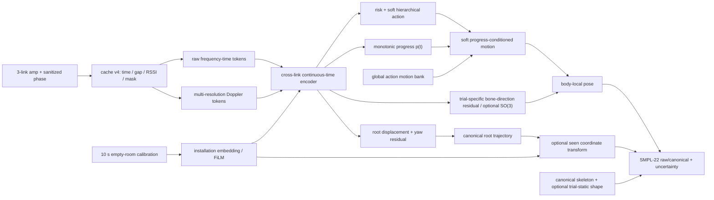

# NotiFi CSI-to-Pose 최종 코드 감사와 V10 실행안

작성 시각: 2026-08-04 18:10 KST  
대상: `feature/goal1` 기반 `work_v2`, 1~9안, 현재 데이터·캐시·체크포인트·평가 경로  
상태: 구현 전 설계 확정안. 이 문서의 P0가 끝나기 전에는 새 성능을 비교하지 않는다.

## 1. 최종 결론

현재 **승격 가능한 모델은 없다.** V9A는 수정 전 데이터에서 가장 나은 역사적 비교 모델이고,
V9C prior는 통계적으로 V9A를 악화시키므로 기각한다. 기존 수치는 모두
`pre-GT-repair historical dev_test`로만 보존한다.

가장 큰 문제는 모델 크기가 아니다.

1. 보정된 lmh GT 295개가 실제 D 드라이브 학습 데이터와 캐시에 한 건도 반영되지 않았다.
2. `amplitude + sanitized phase`를 I/Q처럼 회전하는 RF 증강이 frozen motion encoder를 오염시켰다.
3. 8단 frozen cascade는 과거 오차와 휴리스틱을 계속 물려받고 공동 수정할 수 없다.
4. 모델은 CSI를 사용하지만 같은 site/action 안의 trial별 local pose 차이는 거의 복원하지 못한다.
5. 정확한 frame timestamp를 CSI resampling 후 버리고, loss와 모델은 다시 고정 30 Hz를 가정한다.
6. 현재 평가·split·checkpoint 계보만으로는 재현성과 최종 일반화 주장을 할 수 없다.
7. robust sampler·inverse CE·GroupDRO가 같은 불균형을 중복 보정하고 epoch draw의 40%를 반복한다.
8. train-fitted standardizer를 empty-room으로 다시 fit하면 validation amplitude std가 13배 커진다.
9. TX 순서만 바꿔도 root error가 최대 17.24cm 증가하지만 board geometry/identity manifest가 없다.
10. joint-only GT에서 식별할 수 없는 bone twist를 6D rotation target처럼 취급할 수 없다.

따라서 V10은 기존 V9C 위에 refiner를 추가하는 모델이 아니다. 데이터·cache contract를 고친 뒤
`일반 action motion bank + calibration adapter + monotonic progress + CSI-specific rotation/root residual`
을 한 모델로 처음부터 학습한다. `site×action` prototype은 seen 진단 기준선으로만 쓰며 배포
decoder에 site ID를 하드코딩하지 않는다.

### 우선순위 한 장

| 순위 | 병목 | 직접 증거 | 지금 할 일 | 다음 단계 조건 |
|---:|---|---|---|---|
| 1 | GT·cache 계보 | corrected 295개 중 D/cache 반영 0, target local 이동 46.05cm | GT 재추출/QC, cache v4 hash | orientation/jump/height hard fail 0 |
| 2 | RF 입력 계약 | phase std 31.4x, empty-room refit val amp std 13x, subcarrier 상수 mask | amp/phase 증강·standardizer·mask 분리 | augmentation/normalization unit test 전부 통과 |
| 3 | trial motion collapse | danger local RMS GT의 23%, residual cosine 0.050 | global motion bank+progress+CSI residual end-to-end | shuffle/RMS/cosine gate 통과 |
| 4 | 시간·선택 재현성 | fixed30 scale 0.45~1.41, V9A gate source drift | actual-time loss, policy/source hash | 3 seeds·bootstrap·test selection 0회 |
| 5 | root/설치 좌표 | geometry 활성 checkpoint 0, TX 순열 root +17.24cm | canonical root+installation bundle | geometry 조건별 결과 분리 |
| 6 | unseen joint shift | robust action chance 수준, objective 충돌 | seen 통과 후 semantic/kinematic 분리 | seen gate 전 joint-shift/TTA 금지 |

## 2. 신뢰 가능한 사실과 신뢰할 수 없는 숫자

### 2.1 지금도 신뢰 가능한 구조적 사실

- 원시 데이터는 3개 sender link `TX1/TX2/TX3`를 가진다. 이는 4보드 구성이
  `3 TX + 1 RX`라는 뜻이며, 현재 tensor `[T,3,114,2]`는 맞다.
- amplitude와 sanitized phase, temporal order, 여러 link는 모두 유효하다. 각각을 제거하거나
  시간을 뒤집으면 성능이 크게 나빠진다.
- V9A는 V7보다 local MPJPE를 평균 `0.682 cm` 개선한다. bootstrap 95% CI는
  `[0.600, 0.766] cm`다.
- V9C prior는 V9A보다 local MPJPE를 평균 `0.072 cm` 악화한다. 95% CI는
  `[-0.085, -0.059] cm`다.
- 10초 빈방 calibration은 수정 전 seen cache에서 120초와 사실상 같은 결과를 냈다.

### 2.2 다시 측정해야 하는 역사적 숫자

| 항목 | 수정 전 값 | 현재 지위 |
|---|---:|---|
| V9A local / root / absolute | 20.60 / 31.61 / 41.53 cm | 역사적 비교용 |
| V9C local / root / absolute | 20.68 / 31.61 / 41.58 cm | prior 기각, 역사적 기록 |
| V9C danger local / absolute | 28.91 / 51.14 cm | 역사적 기록 |
| CSI soft site×action prototype | 13.92 / 30.81 / 35.64 cm | 수정 후 재계산할 진단 기준선 |
| CSI soft top-5 retrieval | 13.54 / 29.55 / 34.28 cm | 수정 후 재계산할 ablation |

수정 전 dev_test 405개 중 50개는 잘못된 lmh orientation GT를 사용한다. 그 50개의 잘못된 GT는
모델이 같은 잘못된 좌표계를 학습했기 때문에 absolute error가 오히려 낮았다
(`33.97 cm` 대 나머지 `42.65 cm`). 이 오염은 전체 absolute 결과를 약 `1.07 cm` 좋게 보이게 했다.

## 3. P0 데이터 계보 문제

### 3.1 orientation patch가 실제 학습 경로에 적용되지 않음

`GT수정본.zip`과 Desktop 보정본은 서로 동일하지만 모델은 D 드라이브의 수정 전 GT를 읽는다.

| 검사 | 결과 |
|---|---:|
| patch 대상 | 295 trials |
| D current와 patch가 같은 GT | 0 |
| cache와 D current가 같은 GT | 295 |
| cache와 patch가 같은 GT | 0 |
| current orientation warning | 293 |
| patch orientation warning | 1 |
| train / val / dev_test 오염 | 195 / 50 / 50 |
| old→patch local target 이동 | 평균 46.05 cm |
| old→patch absolute target 이동 | 평균 68.10 cm |

남은 1건 `lmh_E02_S01_t001`은 보정 규칙 자체가 반대로 적용돼 뒤집혔다. 올바른 방향으로 영상을
돌리고 GVHMR을 다시 실행해야 한다. 기존 validator가 일부 danger/warning scenario만 upright로
검사해 S01 오류를 통과시킨 것도 함께 고친다.

### 3.2 추가 GT 이상치

전체 cached pose 2,629개 검사에서 orientation warning 321개, 프레임 간 평균 joint jump
`>0.2 m` 15개, 절대 높이 `>2.5 m` 3개가 나왔다. 295개 patch를 반영하면 lmh E03의 2개 jump는
없어진다. 그 뒤에도 다음을 다시 추출하거나 제외해야 한다.

- lmh E01: S04 t001, t009. 영상 자체가 중간에 display orientation을 바꾼다.
- mhw E02: D04 t010, D05 t007/t008/t009, W03 t019. 정지·가림 구간에서 GT가 뒤집힌다.
- yja E02: D01 t009, D02 t004/t005/t006, D05 t010, S01 t017. GT가 54~174도 회전한다.
- 높이 전용 이상: mhw E02 D04 t008, yja E02 W01 t016.
- `yja_E02_D02_t006`은 head 높이 5.53 m, `yja_E02_W01_t016`은 7.20 m다.

frame index는 3,155개 pose 파일 모두 0부터 연속이고 joints/video 길이와 맞았다. 따라서 문제는
index가 아니라 영상 orientation, 가림, GVHMR 추적 실패다.

같은 사람에서도 GVHMR bone length가 trial마다 흔들린다. 수정 전 cache 기준 bone CV median은
사람별 `2.85~3.17%`, 한 bone의 train trial 범위는 최대 `5.78~7.90cm`였다. GT bone direction을
완벽히 알고 자기 train 평균 skeleton만 적용해도 seen local error `1.10~1.18cm`가 남았고, LOSO에서
다른 두 사람 평균 skeleton을 쓰면 local `1.29~1.67cm`, distal `1.73~2.66cm`의 shape-only 하한이
생겼다. corrected GT에서 다시 측정한 뒤 raw metric skeleton과 canonical skeleton을 둘 다 저장한다.

다만 현재 rotation GT는 공통 계약이 아니다. ajh/lmh/mhw pose `2,366`개는 모두
`gvhmr_joints_v1`로 `joints_world/transl/frame_index`만 있고, yja E02 263개만
`gvhmr_smpl_full_v1`이다. joint position만으로는 bone twist가 식별되지 않으므로 6D/SO(3) geodesic
loss를 전원에게 바로 적용할 수 없다. 선택지는 두 가지다. 첫째, 네 사람 모두 같은 GVHMR 버전으로
SMPL body pose를 재추출한다. 둘째, 현 GT를 유지하면 unit bone direction + canonical FK를 주 출력으로
쓰고 full SO(3)는 주장하지 않는다. V10-0에서 이 target schema를 먼저 확정한다.

### 3.3 cache가 원본 수정을 감지하지 못함

`build_cache`의 최신 판정은 `PREPROC_VERSION`과 `n_trials`만 본다. GT, CSI, timestamp, split이
바뀌어도 trial 수만 같으면 캐시를 그대로 쓴다. `--reindex`도 role만 바꾸며 배열을 다시 만들지
않는다. 이번 stale GT가 그대로 남은 직접 원인이다.

V10 cache v4는 다음 digest를 필수로 저장하고 열 때 다시 검증한다.

```text
dataset_fingerprint = hash(sorted(trial_id, csi_sha256, gt_sha256,
                                  timestamp_sha256, video_metadata))
split_fingerprint   = hash(dev_index + sealed_index + experiments.json)
code_fingerprint    = PREPROC_VERSION + git_commit + contract constants
cache_fingerprint   = hash(dataset_fingerprint, split_fingerprint,
                           code_fingerprint, array schema)
```

하나라도 다르면 `open_cache()`가 실패하고 rebuild 명령을 보여준다. role 변경도 split fingerprint가
달라지므로 최소한 cache index와 checkpoint lineage를 새로 만든다.

## 4. 현재 파이프라인과 단계별 문제

```mermaid
flowchart LR
    A["CSV CSI + timestamps"] --> B["amp / sanitized phase resampling"]
    B --> C["site empty-room subtraction"]
    C --> D["GraphFormer baseline"]
    D --> E["motion-first encoder"]
    E --> F["action pose residual"]
    F --> G["keyframe root residual"]
    G --> H["V2 rotation branches"]
    H --> I["V3 contact root"]
    I --> J["V9A trajectory refiner"]
    J --> K["V9C GT denoising prior"]
    K --> L["centered 5-frame smoothing"]
```



### 4.1 CSI 전처리와 증강

좋은 점은 guard 제거, amplitude/phase 변환 후 interpolation, missing-link mask, train-only normalizer다.
치명적 문제는 `_augment_rf()`가 두 채널을 complex real/imag로 회전한다는 점이다.

64 train trial, 641만 유효 값 감사 결과:

- 원래 phase std `0.504`, 증강 후 phase std `15.856`, 즉 31.4배다.
- 증강 phase의 55.0%가 `|value| > pi`, 22.5%가 `|value| > 10`이다.

subcarrier dropout도 별도 mask 없이 한 band를 0으로 만든 뒤 `PerLinkNorm`에 넣는다. 따라서 encoder가
받는 값은 normalized zero가 아니라 모든 frame에 반복되는 `-mu/sigma` 상수 패턴이다. 측정한 TX1
band의 temporal std 중앙은 정확히 0이었다. V10은 missing band를 train mean으로 impute하고
normalization 뒤 다시 0으로 gate하며 frequency encoder에 `subcarrier_valid` token을 전달한다.
- amplitude로 불리는 channel 0도 음수가 된다.

motion-first, motion-pose, seen residual이 이 증강을 사용하므로 현재 frozen motion backbone을 재사용할
수 없다. amplitude에는 nonnegative log-gain/ripple/mask/noise, phase에는 약한 additive residual
perturbation만 쓰고 I/Q rotation은 representation이 `iq`일 때만 허용한다.

cache 배열 이름이 아직 `csi_iq`인 것도 같은 오류를 유도한다. v4에서는 `csi_features`로 바꾸고
channel names를 schema에서 읽는다. hardware gain augmentation은 raw amplitude에서 calibration
subtraction 전에 적용하거나, subtraction 뒤라면 명시적으로 residual-space perturbation으로 정의한다.
raw amplitude의 nonnegative invariant와 calibrated residual이 음수일 수 있다는 사실을 테스트에서
구분한다.

float16 자체는 유지해도 된다. 64 trial, 632만 값의 float32 재계산과 비교한 결과 amplitude 상대
오차 p99는 `0.0445%`, sanitized phase 절대 오차 p99는 `0.000405 rad`, mask mismatch는 0이었다.
cache 주석의 “정수 I/Q라 무손실” 근거만 현재 표현에 맞게 고치고 정량 threshold를 회귀 테스트로 둔다.

### 4.2 시간축

exact timestamp 1,578 trial에서 fixed 30 Hz single-frame derivative와 실제 derivative의 비율은
p05/median/p95 `0.450/0.930/1.410`이다. transition의 14.5%는 0.75 미만, 23.4%는 1.25 초과다.
`ajh_E02_S04_t006`에는 3.312초 gap도 있다.

cache v4에 `frame_time`, `delta_t`, `transition_valid`, nearest packet age/gap, RSSI를 넣는다.
derivative는 실제 elapsed time으로 나누고 큰 gap은 convolution 연결과 derivative loss를 끊는다.
position encoding도 frame index 대신 seconds Fourier feature를 쓴다. 고정-grid encoder와
irregular packet token + exact frame query cross-attention을 별도 ablation한다.

충돌 휴리스틱 없이 GT 누적 이동거리로 progress를 재면 danger의 10% 진행 지점은 중앙 66.5 frame이지만
p05/p95가 `15/135 frame`이다. 같은 동작도 시작 위치가 약 4초 범위에서 흔들린다. GT를 보는 비배포
monotonic DTW oracle은 site/action prototype의 danger local/absolute를 각각 `2.37/2.40cm` 개선했다.
유효하지만 20cm대 오차를 설명할 정도는 아니므로 progress/TCC/Soft-DTW는 보조 모듈이지 핵심 decoder가
아니다. S02/S03/S04의 총 이동량은 중앙 `0.08~0.13m`에 불과해 누적 progress가 GVHMR jitter를 따라가므로
progress loss는 총 이동량 gate를 통과한 동적 trial에만 적용한다.

`target_valid`와 `observation_valid=link_mask.any()`도 분리한다. 현 seen cache에서 GT-valid인데
세 link가 모두 없는 frame은 train `0.018%`, dev_test `0.0058%`뿐이라 현재 주 병목은 아니지만,
padding과 packet gap을 같은 의미로 쓰는 API는 잘못이다. query frame은 target-valid로 유지하고
observation mask는 encoder attention과 uncertainty에만 쓴다.

### 4.3 encoder

현재 subcarrier convolution은 local frequency 정보를 본 뒤 frequency 축을 mean+max 두 통계로 즉시
접는다. link attention과 bidirectional temporal Transformer는 유효하지만 delay/Doppler 구조, packet
age, gap, RSSI, 실제 시간은 보지 않는다.

V10은 raw amp/phase branch와 multi-resolution Doppler branch를 분리한다. frequency token은 pooling
전에 cross-link attention을 거치고, 두 branch는 gated cross-attention으로 합친다. 단, 복잡한 branch는
corrected raw baseline보다 bootstrap CI에서 개선될 때만 남긴다.

`v3.py`에 `DualViewFrequencyTokenizer`, `KinematicBoneDecoder`, `V3PoseNet` 구현은 존재하지만 이를
학습한 checkpoint는 없다. 51개 checkpoint의 `arch`는 graphformer 8, impact graphformer 9,
robust graphformer 8, latent flow 2, metadata 없는 cascade 24개이고 `arch=v3`와 kinematic state key는
모두 0개다. 이 모듈은 검증된 개선안이 아니라 V10 구현 출발점으로만 재사용한다.

주파수 구조는 이미 유효하다. V9A에서 subcarrier 고정 permutation은 local/root를
`20.60/31.61 -> 28.14/48.73cm`, frequency mean 반복은 danger absolute를
`51.15 -> 65.68cm`로 악화했다. 따라서 기존 frequency branch를 버리거나 Doppler 하나로 대체하지 않는다.
114개 token을 mean+max로 일찍 접는 시점만 늦추고, Doppler는 병렬 보조 branch로 ablation한다.

### 4.4 decoder와 frozen cascade

현재 action residual의 실효 범위는 약 4 cm이고 standing-like base를 lying/fall로 바꾸기에 부족하다.
각 후단은 앞단을 freeze하므로 과거 impact/contact 목표와 잘못된 RF representation을 지울 수 없다.
체크포인트가 1.10M에서 4.51M으로 커진 것보다 8개의 서로 다른 objective가 쌓인 것이 더 큰 문제다.

V9A는 V7보다 유의하게 낫지만 개선 폭은 작다. V9C는 유의하게 나쁘므로 삭제한다. V10은 단일
encoder-decoder로 다시 학습하고, local articulation과 root displacement/yaw를 별도 head로 둔다.

절대 root 문제도 단순 좌표 원점 문제는 아니었다. stale lmh를 제외한 ajh+mhw에서 global action
template의 root error는 `35.97cm`, site/action은 `29.13cm`였지만, test 첫 root를 oracle로 맞춰도 각각
`0.83/0.52cm`만 줄었다. 같은 사람의 환경별 시작 root dispersion도 `3.73cm`뿐이었다. 주 병목은 시작
좌표가 아니라 환경별 이동 궤적과 진행을 CSI에서 못 읽는 것이다. 다만 새 설치의 절대 방향/좌표는 현재
입력에 board-camera extrinsic이 없어 물리적으로 식별되지 않으므로 canonical root displacement를 주
결과로 두고, absolute root는 geometry/calibration이 있을 때만 별도 보고한다.

### 4.5 움직임 collapse

V9A danger의 local temporal RMS는 GT `28.25 cm`에 비해 `6.63 cm`, 평균 크기 기준 약 23%다.
같은 site/action 안의 trial 간 local 차이는 GT `11.80 cm` 대 예측 `4.42 cm`이고, 예측 residual과
GT residual의 cosine은 `0.050`뿐이다. root residual cosine도 `0.106`이다.

즉 CSI를 완전히 무시하는 모델은 아니지만, trial마다 **어떻게 넘어졌는지**를 복원하지 못하고
action/site 평균 궤적 주변에서 작은 변형만 만든다. 다음 모델의 핵심 gate는 MPJPE 단독이 아니라
same-site/action CSI shuffle과 trial-residual cosine이다.

### 4.6 prior와 smoothing

V9C prior는 synthetic noisy GT와 observed mask로 학습하지만 inference에는 observed mask를 넘기지
않는다. 실제 base error 분포가 아니고 root도 못 고치며 clean GT도 1.74 cm 왜곡한다. bootstrap에서
V9A보다 일관되게 나쁘므로 제거한다.

centered 5-frame smoothing은 미래 2 frame을 사용해 offline latency가 최소 약 67 ms이며, 전체
bidirectional Transformer는 10초 전체 미래를 본다. 현재 모델은 streaming 모델이 아니다. raw와
offline-smoothed 결과를 따로 내고, 실시간이 필요하면 causal encoder와 one-sided filter를 별도 모델로
평가한다. smoothing은 local MPJPE를 평균 0.007 cm만 개선하지만 speed correlation은 0.069 올려,
위치보다 motion 지표를 크게 바꾼다.

### 4.7 calibration

`calibrated_model.pt`는 새 환경 적응 모델이 아니라 validation으로 residual strength를 고른 파일명이다.
환경 calibration은 `subject_environment` key로 미리 만든 empty-room baseline을 빼는 고정 연산이다.
알 수 없는 site key에는 아무것도 하지 않으며 runtime calibration API가 없다.

`PerLinkNorm`의 문서와 실행도 다르다. `norm_source` config는 사용되지 않고 실제 통계는 shuffled train
20 batch(320 trial)로 fit된다. 이 buffer를 주석대로 108개 empty-room trial로 다시 fit하면
`sigma_absence/sigma_train` 중앙이 `0.199`이고, 동일 validation amplitude의 정규화 표준편차가
`1.14→14.76`, p99 절댓값이 `4.85→68.53`으로 폭증했다. `SiteBaseline(sub)`가 이미 빈방 평균을
뺀 상태라 empty-room 재-fit은 이중 calibration이기도 하다.

V10은 (1) train 전체로 fit하고 checkpoint에 고정하는 immutable model standardizer와 (2) 새 설치의
empty-room bundle을 받는 calibration adapter를 분리한다. 배포 시 standardizer를 refit하지 않으며,
adapter는 학습에서도 같은 경로로 활성화한다. `sub`, `sub_z`, `PerLinkNorm`, adapter hash를 각각 저장한다.

수정 전 seen V9A 기준으로 calibration 없음은 local/root `31.32/54.25 cm`, 10초 빈방은
`20.60/31.65 cm`, 120초는 `20.60/31.61 cm`였다. 따라서 10초 수집은 충분한 후보지만, 이를 실제
배포 API와 checksum을 가진 calibration bundle로 구현하고 `none/10s/30s/120s`를 각각 보고해야 한다.
key는 subject ID가 아니라 board/link geometry와 installation ID여야 한다.

코드에 optional geometry branch는 있지만 실험에서는 활성화된 적이 없다. 51개 checkpoint 중 geometry
state key가 있는 것은 19개였으나 nonzero `board_geometry`, `geometry_available=True`, configured
`geometry_path`는 모두 0개였고 repository manifest도 0개다. 현재 구현은 geometry가 없어도 zero vector를
bias가 있는 MLP에 통과시키며, geometry가 있어도 model construction 시 한 파일을 모든 site/batch에
공유한다. V10은 per-installation hashed bundle을 batch에 전달하고 availability로 명시적으로 gate한다.

링크 identity 반사실도 이 계약이 필수임을 보여준다. CSI와 `link_mask`를 함께 순열했을 때 worst
permutation은 V9A local/root/danger absolute를 `+6.24/+17.24/+13.82cm` 악화했다. shared link
encoder만으로는 permutation invariant하지 않다. board serial/TX identity와 antenna position/orientation를
installation bundle에 넣고 CSV 등장 순서를 link identity로 사용하지 않는다. set fusion을 쓰더라도 각
link를 geometry-conditioned token으로 만들고 permutation test를 checkpoint gate에 포함한다.
geometry bundle은 3개 TX의 serial/position/orientation과 공통 RX의 serial/position/orientation를 각각
기록한다. camera-to-installation extrinsic은 별도 optional transform이며, 없으면 canonical output만 낸다.

calibration strength가 `persistent=False` buffer이고 여러 checkpoint는 strength를 별도 top-level key로만
저장한다. generic state-dict load만 하면 기본 1.0으로 돌아가 보고된 모델과 다른 출력이 될 수 있다.
V10 checkpoint는 model class/config, 모든 resolved strength, calibration bundle hash를 포함한 단일
factory로만 로드하고 raw `load_state_dict` 경로를 금지한다.

실제 source drift도 검출됐다. V9A 결과는 validation speed ratio `1.186`인 strength `0.15`를
`feasible=true`로 골라 당시 상한이 `1.20`이었음을 보여주지만, V9B와 현재 source는 상한 `1.15`를
쓴다. 저장된 V9A 후보를 현재 source로 재선택하면 strength는 `0.0`이다. result에 source fingerprint가
없어 어느 commit의 선택 규칙인지 복원할 수 없다. V10은 selection formula/threshold/smoothing/metric
version을 resolved config에 직렬화하고, 변경하면 새 experiment ID와 checkpoint lineage를 요구한다.

### 4.8 sampling과 loss weight

train pose에서 danger는 원래 17.35%다. sampler 4배, loss 2배, quality를 sampler와 loss에 중복 적용해
기대 loss mass의 70.8%가 danger에 간다. danger trial의 median 실효 weight는 safe의 11.0배다.
warning은 8.3%뿐이다. danger collapse는 부족한 가중치 문제가 아니므로 더 올리지 않는다.

subject별로도 lmh는 raw 33.3%지만 기대 loss mass 24.9%, mhw는 44.2%다. `uniform_30fps`라는
구버전 이름의 partial-scaled timestamp를 quality가 낮게 평가하고 이를 두 번 적용하기 때문이다.
approximate timestamp를 덜 신뢰하는 것은 타당하지만 결과를 숨기면 안 된다. exact-only와 all-data를
분리 보고하고 quality는 sampler 또는 loss 한 곳에만 적용한다.

sampling과 loss weighting 중 하나만 class balance를 담당하게 하고, 실제 epoch별 risk/action/progress
mass를 로그에 저장한다. hard/noisy sample을 quality weight로 두 번 억누르지 않는다.

`CrossDomainBatchSampler` 100-epoch 모의실험은 이 중복을 직접 확인했다. 네 robust split 모두 한
epoch의 고유 trial coverage가 약 `60%`이고 draw의 약 `40%`가 중복이었다. yja holdout danger는 raw
`17.6%`에서 sampled `29.4%`로 늘고, raw count 기반 inverse-risk CE까지 곱한 보조손실 질량은
`51.0%`가 됐다(LOSO `52.8%`). 100 epoch 누적 trial별 노출 횟수도 최대/최소 `5.6~5.9x`였다.
V10 기본은 without-replacement traversal로 고정하고, balanced sampler·inverse CE·GroupDRO는 동일
optimizer step과 unique-trial exposure 조건에서 하나씩만 추가한다. sampler 사용 시 epoch coverage와
중복률을 checkpoint metric에 저장한다.

robust 경로의 domain objective도 목표가 충돌한다. cross-domain SupCon은 같은 action·다른 domain의
pooled embedding을 모두 당기고, domain adversarial head와 pose decoder가 같은 shared encoder를 쓴다.
네 robust run에서 train SupCon은 모든 epoch에 활성(`2.50~2.74`)이었지만 action accuracy는 yja
`4.18%`, LOSO 평균 `5.93%`로 17-class chance `5.88%` 수준이었다. 잘못된 RF augmentation과 여러
loss가 동시에 있었으므로 SupCon 단독 원인으로 단정할 수는 없다. V10은 domain-invariant semantic/action
token과 calibration-conditioned equivariant kinematic token을 분리하고 domain invariance는 전자에만
적용한다. trial residual은 모든 같은 action을 당기는 대신 자기 CSI-pose pair를 맞춘다.

## 5. 평가와 split 문제

### 5.1 split 명칭과 범위

- 현재 405 test는 반복해서 열었으므로 `seen_dev_test`다.
- yja E02 263 pose도 여러 차례 열었으므로 `unseen_dev_test`다.
- 현재 untouched final holdout은 없다. 구조 동결 뒤 새 촬영 또는 미사용 세션을 수집해야 한다.
- yja E01/E03 CSI가 파손돼 4인 대칭 LOSO는 불가능하다.

현재 `loso`는 held-out subject의 미리 지정된 test role 135 pose만 평가하며, 그 사람 pose 789개 중
17.1%만 쓴다. 이를 `LOSO-subsampled`로 이름을 바꾸고 새 joint-shift protocol은 source 두 사람의 train+test
role로 학습, source val로 선택, held-out 사람 788/789개 전체 평가로 정의한다.

다만 index에는 physical installation ID/geometry field가 하나도 없고 domain은 9개
`subject_environment` compound key다. 같은 E01이 사람 간 같은 방이라는 근거가 없으므로 이 protocol은
순수 subject LOSO가 아니라 participant와 그 participant의 설치를 함께 빼는 joint shift다. 세 fold는
population-level 사람 일반화 추정치가 아니라 진단으로만 보고한다. subject와 environment 효과를
분리하려면 같은 instrumented installation에 여러 사람이 참여하고 같은 사람이 여러 installation을
방문하는 factorial 추가 수집이 필요하다.
현재 데이터에서도 within-subject LOEO는 `seen participant + unseen recorded installation` 진단으로는
유효하지만 여러 사람에 공통인 environment effect로 확대 해석하지 않는다.

권장 protocol은 다음 네 개다.

1. `seen_dev`: ajh/lmh/mhw, 기존 train/val/seen_dev_test. 모델 개발용.
2. `participant_plus_installations_3fold`: ajh/lmh/mhw 한 명과 그 compound domains 전체 holdout.
3. `loeo`: 같은 사람에서 한 environment 전체 holdout. environment generalization.
4. `yja_E02_asymmetric_dev`: yja E02만 holdout. 참고용이며 final/sealed라고 부르지 않는다.

### 5.2 metric

기존 trial-average speed ratio는 정지 trial의 작은 분모 때문에 왜곡된다. root-relative
`dynamic_mpjpe`는 몸 전체가 통째로 내려가는 rigid fall을 놓친다.

공식 표는 raw/causal/offline-smoothed를 분리하고 다음을 낸다.

- local, root, absolute MPJPE와 PA-MPJPE.
- distal/head/torso/leg, danger action별 결과.
- actual-time local/root/absolute velocity·acceleration MAE.
- pooled speed ratio, Pearson/Spearman correlation.
- root vertical drop, torso inclination, endpoint, temporal RMS.
- same-site/action CSI shuffle, reverse, shift, time-mean, link/channel ablation.
- 3 seeds, trial bootstrap 95% CI, parameter·latency·calibration time.

수정 전 V9A의 RTX 5060 Ti batch-1 계산은 평균 `47.4ms`, peak allocation 약 `142MB`였다. 그러나
입력 304 frame=`10.13초`, symmetric convolution, bidirectional Transformer를 모두 사용하므로
streaming-ready가 아니다. offline 자세 복원과 real-time 경보를 분리하고, 후자가 필요하면 causal
1~2초 sliding-window variant를 별도 protocol로 평가한다.

부상 부위와 실제 충돌은 현재 GT에서 식별할 수 없다. 압력 매트, IMU, 실제 contact/body-region label
없이 `injury prediction`을 주장하지 않고 `pose-derived possible contact proxy`로 제한한다.

## 6. V10 모델



핵심 원칙:

- motion bank는 subject/site 독립 global action prior다.
- calibration embedding은 empty-room CSI에서 만들며 site ID lookup을 쓰지 않는다.
- CSI residual이 trial별 관절 회전과 root trajectory를 담당한다.
- full SMPL rotation GT를 전원 재추출하면 6D/SO(3)+FK, 아니면 unit bone direction+FK를 쓴다.
- raw GVHMR skeleton과 canonical skeleton을 함께 저장하고 articulation은 canonical skeleton에서 학습한다.
- metric body shape가 필요하면 calibration 또는 trial-static scale/proportion head로만 복원한다.
- root는 첫 valid frame 기준 displacement와 yaw로 예측한다.
- action은 hard class가 아니라 soft hierarchical distribution으로 motion bank를 섞는다.
- progress는 양의 increment 누적으로 0~1 단조성을 보장한다.
- semantic/action token과 trial-specific kinematic token을 분리하고 domain loss는 semantic에만 건다.
- kinematic alignment는 train-only pose teacher와 같은 trial/time을 positive로 맞춘다. 다른 같은-action
  trial은 GT trajectory residual이 사전 정의 거리 이상일 때만 negative로 쓰고, 거의 같은 반복은
  ignore 또는 soft-positive로 둔다. 모든 같은-action을 무조건 negative로 만들지 않는다.

권장 loss:

```text
L = L_direction_cosine [+ L_rotation_geodesic when full SMPL GT exists]
  + L_local_position
  + L_root_displacement + L_yaw
  + L_actual_time_velocity + L_actual_time_acceleration
  + L_bone_direction + L_endpoint
  + L_shape_static + L_bone_consistency
  + L_action_hierarchy + L_risk
  + L_progress_identity + L_progress_cycle
  + L_csi_pose_matching_or_variance_preserving_alignment + L_uncertainty
```

negative-free VICReg/Barlow-style cross-modal alignment와 trajectory-distance-aware InfoNCE를 먼저 비교한다.
InfoNCE가 same-action clone을 false negative로 밀거나 residual diversity를 과장하면 기각한다. target A의
rotation uncertainty는 matrix-Fisher/SO(3), target B의 unit bone direction은 vMF/S2 또는 tangent-space
Gaussian으로 target contract에 맞게 분리한다.

TCC 또는 Soft-DTW는 timestamp identity 주변의 low-dimensional motion descriptor에만 보조로 쓴다.
raw pose와 GT를 자유롭게 warp하지 않는다. diffusion/K-hypothesis prior는 deterministic model이 CSI
dependence gate를 통과한 뒤 out-of-fold base error로만 학습한다.

## 7. 실행 순서와 중단 기준

### V10-0 데이터 복구

1. `lmh_E02_S01_t001`의 올바른 회전을 확정하고 GVHMR 재추출.
2. 294개 정상 patch와 t001 재추출본을 실제 D dataset에 원자적으로 적용.
3. 나머지 jump/height 이상 trial을 재추출하거나 manifest에서 `excluded_gt_qc`로 격리.
4. orientation, frame continuity, bone CV, root/pose jump, absolute height 전수 검사.
5. 전원 SMPL rotation 재추출 또는 joints-only bone-direction target 중 하나로 schema 확정.

통과: 알려진 orientation warning 0, 설명되지 않은 pose step `>0.2 m` 0, height anomaly 0.

### V10-1 lineage와 cache v4

1. source/split/code/cache fingerprint 구현.
2. frame time, delta, discontinuity, packet age/gap/RSSI array 추가.
3. stale source와 schema mismatch를 fail-fast.
4. 모든 checkpoint에 data/cache/split hash, source checkpoint hash, git commit, seed 저장.

통과: GT 한 byte 또는 split role 하나를 바꾸는 unit test에서 cache/checkpoint 로드가 실패.

### V10-2 corrected baseline 재학습

1. representation-aware augmentation unit test.
2. GraphFormer와 corrected motion-first를 seed 3개로 처음부터 학습.
3. no-calibration과 10초 calibration을 모두 평가.
4. global class, site×action diagnostic, retrieval baseline을 수정 GT로 재계산.

통과: raw CSI가 time-mean/shuffle보다 분명히 좋고, train overfit ladder가 정상 동작.

### V10-3 motion bank + action + progress

1. global action bank와 soft hierarchical class mixture.
2. identity-time progress부터 시작해 이동량 `>=0.5m` trial에만 monotonic learned progress를 추가.
3. site×action은 oracle diagnostic으로만 비교.

중단: learned progress가 identity보다 validation을 못 이기거나 boundary에 몰리면 제거.

### V10-4 CSI residual

1. local rotation residual만 연다.
2. root displacement/yaw를 연다.
3. actual-time loss와 CSI-pose contrastive objective를 순서대로 추가.

필수 gate:

- corrected diagnostic baseline보다 validation과 seen_dev_test에서 유의하게 우수.
- same-site/action CSI shuffle가 local `>=2 cm` 또는 danger absolute `>=5 cm` 악화.
- danger local temporal RMS가 GT의 최소 60%, 최종 목표 80~120%.
- danger trial-residual cosine `>0.30`, 최종 목표 `>0.50`.
- raw/causal danger pooled speed ratio `0.8~1.2`, speed correlation 양수이며 CI가 0을 넘음.
- learned progress가 GT-oracle timewarp 상한의 일부를 회복하되 static trial jitter를 키우지 않음.

gate를 못 넘으면 prior, diffusion, participant+installation joint shift로 넘어가지 않는다.

### 명시적으로 하지 않을 것

- 수정 전 V9A/V9C 또는 잘못된 RF augmentation encoder를 warm-start하지 않는다.
- V9C denoising prior, impact-window/first-contact/injury proxy를 새 baseline에 넣지 않는다.
- danger weight를 더 키우거나 balanced sampler·inverse CE·GroupDRO를 한 번에 켜지 않는다.
- `PerLinkNorm`을 새 설치 empty-room CSI로 refit하지 않는다.
- site×action prototype이나 subject/environment ID를 production decoder 입력으로 쓰지 않는다.
- validation/test에 centered smoothing만 적용한 수치를 raw/causal 성능처럼 보고하지 않는다.
- 현재 code-only V3/kinematic/geometry module을 검증된 backbone이라고 부르지 않는다.
- selection threshold, smoother, split을 같은 experiment ID 아래 조용히 바꾸지 않는다.
- seen CSI-dependence gate 이전에 joint-shift, domain adversarial, TTA, diffusion을 실행하지 않는다.
- pose-only GT로 실제 부상 부위나 충격력을 맞혔다고 주장하지 않는다.

### V10-5 encoder ablation

순서: corrected raw → +time/gap/RSSI → +Doppler → irregular packet query. 각 단계는 3 seed CI와
shuffle gate를 동시에 개선할 때만 유지한다. parameter가 늘었지만 CSI-specific residual이 늘지 않으면
삭제한다.

### V10-6 prior와 외부 데이터

- AMASS/BABEL은 motion bank/pretraining에만 사용.
- 외부 RF는 self-supervised encoder pretraining에만 사용.
- NotiFi CSI와 외부 pose를 가짜 pair로 만들지 않음.
- prior 입력은 train fold의 out-of-fold prediction과 CSI uncertainty.
- known-floor protocol의 foot penetration/slide는 별도 physics ablation으로만 두며 impact/injury target으로
  해석하지 않는다. CSI residual/root gate 전에는 추가하지 않는다.

중단: clean pose distortion `>0.5 cm`, CSI shuffle penalty 감소, top-1 expected error 악화 중 하나면 기각.

### V10-7 unseen

seen gate를 모두 통과한 뒤 participant+installation 3-fold와 LOEO를 실행한다. `no calibration`, `10s empty-room`,
`known geometry`, `few-shot unlabeled/labeled`를 섞지 않고 별도 표로 보고한다. unseen absolute root는
board-camera extrinsic 또는 calibration transform이 있을 때만 주 결과로 낸다.

## 8. 코드 수정 Issue 목록

1. `dataio/cache.py`, `tools/build_cache.py`: cache v4 schema와 source fingerprint.
2. `dataio/dataset.py`: representation-aware augmentation, time/gap/RSSI 반환.
3. `dataio/align.py`, `losses.py`: actual-time derivative와 discontinuity mask.
4. `nets.py`: seconds positional encoding, frequency token 보존, causal option.
5. `tools/build_splits.py`: `seen_dev`, participant+installation 3-fold, LOEO, asymmetric yja protocol.
6. `tools/build_site_baseline.py`: 10초 runtime-compatible calibration bundle와 installation key.
7. 새 `models/v10.py`: global motion bank, calibration adapter, action/progress, direction-or-rotation/root residual.
8. 새 `tools/evaluate_v10.py`: raw/causal/offline, subgroup, counterfactual, CI.
9. 새 `tools/gt_qc.py`: 모든 scenario orientation와 jump/height gate.
10. 모든 train/calibrate tool: provenance payload와 source checkpoint SHA-256.
11. README 하드웨어 표: `3 TX + 1 RX`, link geometry, board/camera extrinsic 기록 규약.
12. V9C prior 경로: 기본 실행과 권장 후보에서 제거하고 historical reproduction만 유지.
13. 모든 model loader: persistent=False strength를 포함한 self-contained checkpoint factory.
14. cache/model API: target-valid와 observation-valid를 분리하고 `csi_iq`를 `csi_features`로 변경.
15. target schema: raw GVHMR joints와 canonical bone-length joints, optional shape/scale를 분리 저장.
16. normalization API: immutable train standardizer와 empty-room installation adapter를 별도 class/hash로 분리.
17. sampler API: without-replacement 기본과 coverage-preserving cross-domain composer, exposure metric 저장.
18. frequency mask API: `subcarrier_valid`와 train-mean imputation/post-norm zero gate.
19. installation manifest: board serial/TX identity/antenna pose를 link token과 checkpoint에 bind.

## 9. 필수 테스트

현재 `unittest` 48개는 통과했지만 다음 회귀를 막지 못한다.

- amp/phase augmentation에서 amplitude nonnegative, phase perturbation bound, mask 보존.
- source GT/CSI/timestamp/split 변경 시 cache invalidation.
- irregular delta-t에서 velocity/acceleration 정답과 gap 차단.
- participant+installation fold가 held-out participant의 pose 100%를 평가하는지.
- prior mask의 train/inference 동일성.
- raw/causal/offline metric 분리와 padding 독립성.
- corrected GT orientation/jump/height 전수 QC.
- checkpoint가 data/cache/split/source/git hash 없이 저장되지 않는지.
- 3 TX + 1 RX hardware manifest와 tensor link order 일치.
- resolved calibration strength가 save/load round-trip 뒤 bitwise 동일한 출력인지.
- raw amplitude와 calibrated residual의 범위를 구분한 augmentation invariant.
- canonical FK의 bone length 불변성과 trial-static shape head의 시간 불변성.
- joints-only 경로가 twist를 임의 정답으로 만들지 않는지, full-SMPL 경로는 네 사람 schema가 같은지.
- progress monotonicity, dynamic-only gate, padding/gap 구간 무손실.
- empty-room bundle이 immutable model standardizer를 바꾸지 않는지와 adapter schema/hash gate.
- epoch unique coverage 100%, duplicate draw 0%인 기본 sampler와 balanced ablation exposure 로그.
- missing subcarrier가 normalized zero이고 `subcarrier_valid`를 제외하면 encoder에 상수 signature가 없는지.
- CSI+mask input 순열과 geometry token 순열이 canonical output을 보존하는지.
- selection threshold/smoother/metric version 변경이 checkpoint load 또는 experiment ID를 무효화하는지.

## 10. 연구 메커니즘 대응

| 메커니즘 | 참고 연구 | 적용 위치 | 조건 |
|---|---|---|---|
| multi-link token/refinement | Person-in-WiFi 3D, CVPR 2024 | raw frequency/link encoder | 장비 차이 고려 |
| global/local 분리 | RoHM, CVPR 2024 | local pose와 root head | diffusion은 후순위 |
| phase/progress conditioning | PhaseMP, ICCV 2023; TCC, CVPR 2019 | monotonic progress | 낙상은 비주기 동작 |
| retrieval-conditioned motion | ReMoDiffuse, ICCV 2023 | motion bank diagnostic | site ID 배포 금지 |
| exact-time query | Continuous-Time Motion Field, ICCV 2025 | irregular CSI/frame query | measurement model 재설계 |
| sparse anchor→full body | Flexible Keyjoint Control, ICCV 2025 | root/torso anchor decoder | CSI-observable anchor 검증 |
| regional SO(3) uncertainty | FisherPoser, CVPR 2026 | rotation/uncertainty head | tracker와 CSI 관측성 다름 |
| topology-constrained decoding | DT-Pose, 2025 | GCN/FK rotation decoder | corrected GT 후 비교 |
| geometry-guided conditioning | Ultra Diffusion Poser, CVPR 2026 | board/extrinsic condition | diffusion보다 geometry 원칙만 우선 |
| higher-order rotation prior | Neural Riemannian Motion Fields, CVPR 2026 | 후순위 motion prior | OOF residual gate 이후 |
| temporal/asymmetric CSI encoding | WiFlow, 2026 preprint | frequency-time baseline ablation | 재현 전 SOTA로 간주 금지 |
| Doppler/spectrogram | SLNet, NSDI 2023; Widar 3.0, MobiSys 2019 | Doppler branch | raw baseline 후 ablation |
| physical RF augmentation | RFBoost, IMWUT 2024 | augmentation | amp/phase contract 준수 |
| motion pretraining | MotionBERT, ICCV 2023; AMASS/BABEL | motion bank/prior | fake CSI-pose pair 금지 |

세부 출처와 링크는 [`comprehensive_diagnosis_and_plan_v10.md`](comprehensive_diagnosis_and_plan_v10.md)의
연구 연결 표에 유지한다.

cache schema, target-contract 분기, 파일별 API와 checkpoint payload는
[`v10_file_level_implementation_spec.md`](v10_file_level_implementation_spec.md)에 고정했다.

## 11. 최종 판단 기준

V10의 성공은 “MPJPE가 몇 mm 내려갔다”가 아니다.

> 같은 사람·장소·행동의 CSI를 서로 바꿨을 때 출력이 실제 trial별 낙상 방식과 함께 바뀌고,
> raw/causal 평가에서 관절 움직임과 root trajectory의 크기·방향·시간이 GT를 따라가야 한다.

이를 증명하기 전에는 더 큰 backbone, diffusion, joint-shift calibration을 붙이지 않는다. 먼저 GT와 lineage를
정상화하고 corrected baseline을 다시 세운 뒤, motion bank를 넘는 CSI-specific residual을 만든다.

## 12. 근거 파일

- [`results/comprehensive_audit_v10.json`](results/comprehensive_audit_v10.json)
- [`results/v10_orientation_lineage_audit.json`](results/v10_orientation_lineage_audit.json)
- [`results/v10_gt_quality_audit_all_cached.json`](results/v10_gt_quality_audit_all_cached.json)
- [`results/v10_metric_contamination_audit.json`](results/v10_metric_contamination_audit.json)
- [`results/v10_rf_augmentation_audit.json`](results/v10_rf_augmentation_audit.json)
- [`results/v10_motion_diversity_audit.json`](results/v10_motion_diversity_audit.json)
- [`results/v10_checkpoint_provenance_audit.json`](results/v10_checkpoint_provenance_audit.json)
- [`results/v10_split_protocol_audit.json`](results/v10_split_protocol_audit.json)
- [`results/v10_weighting_audit.json`](results/v10_weighting_audit.json)
- [`results/v10_calibration_duration_audit.json`](results/v10_calibration_duration_audit.json)
- [`results/v10_bootstrap_audit.json`](results/v10_bootstrap_audit.json)
- [`results/v10_mask_semantics_audit.json`](results/v10_mask_semantics_audit.json)
- [`results/v10_runtime_audit.json`](results/v10_runtime_audit.json)
- [`results/v10_cache_quantization_audit.json`](results/v10_cache_quantization_audit.json)
- [`results/v10_body_shape_audit.json`](results/v10_body_shape_audit.json)
- [`results/v10_coordinate_frame_audit.json`](results/v10_coordinate_frame_audit.json)
- [`results/v10_oracle_timewarp_audit.json`](results/v10_oracle_timewarp_audit.json)
- [`results/v10_progress_target_audit.json`](results/v10_progress_target_audit.json)
- [`results/v10_frequency_sensitivity_audit.json`](results/v10_frequency_sensitivity_audit.json)
- [`results/v10_geometry_contract_audit.json`](results/v10_geometry_contract_audit.json)
- [`results/v10_architecture_coverage_audit.json`](results/v10_architecture_coverage_audit.json)
- [`results/v10_domain_objective_audit.json`](results/v10_domain_objective_audit.json)
- [`results/v10_robust_sampler_audit.json`](results/v10_robust_sampler_audit.json)
- [`results/v10_selection_repro_audit.json`](results/v10_selection_repro_audit.json)
- [`results/v10_normalization_contract_audit.json`](results/v10_normalization_contract_audit.json)
- [`results/v10_subcarrier_mask_audit.json`](results/v10_subcarrier_mask_audit.json)
- [`results/v10_link_identity_audit.json`](results/v10_link_identity_audit.json)
- [`results/v10_domain_factorization_audit.json`](results/v10_domain_factorization_audit.json)
