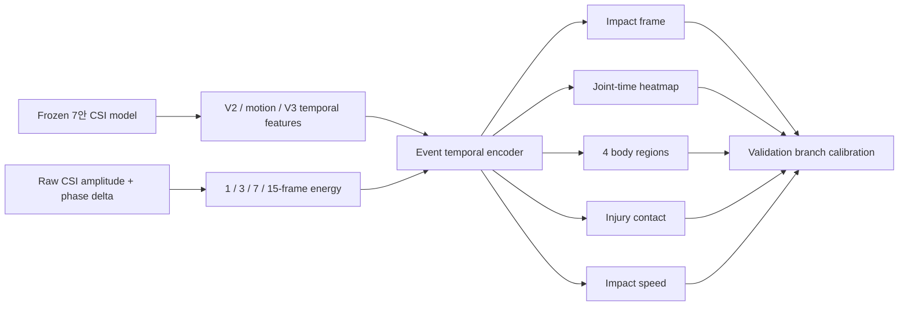

# Impact Event V8

## 채택 상태

8안은 낙상 event를 시간과 부위로 분리해 학습했지만, validation gate를 통과한 것은
`injury-contact` branch뿐이다. 현재 보정값은 다음과 같다.

```json
{
  "event_strength": 0.0,
  "joint_strength": 0.0,
  "contact_strength": 0.75,
  "speed_strength": 0.0
}
```

따라서 현재 모델은 contact F1만 개선하고 7안의 pose, root, first-contact, impact speed를
그대로 보존한다.

## Physical impact proxy

실제 의료 부상 annotation은 없으므로 GVHMR GT에서 다음 충돌 proxy를 만든다.

```text
joint impact score
  = 0.35 * post-impact deceleration
  + 0.25 * acceleration
  + 0.20 * downward approach speed
  + 0.20 * surface proximity
```

낙상 후반부를 강조하고 관절별로 시간 정규화한다. 이는 기존 높이 기준보다 물리적이지만
여전히 실제 부상 라벨이 아니다.

## 구조



## 결과

| Metric | 7안 | 8안 calibrated | 판단 |
|---|---:|---:|---|
| Injury-contact F1 | 0.354 | **0.423** | 개선, 채택 |
| First-contact accuracy | 37.8% | 37.8% | 유지 |
| Impact speed MAE | 0.553m/s | 0.553m/s | 유지 |
| Impact MPJPE | 54.89cm | 54.89cm | 유지 |
| Root error | 31.81cm | 31.81cm | 유지 |

학습된 event branch의 validation timing MAE는 29.24→25.14프레임으로 줄었지만 test에서
부위 일반화가 실패했다. 따라서 event/joint strength는 0으로 되돌렸다.

## 현재 병목

CSI 상위 5% motion 후보는 validation에서 GT event 5.5프레임 안에 있지만, 가장 큰 CSI
peak는 24.5프레임 떨어져 있다. 걷기, 침대 이탈, 의자 이탈이 충돌보다 큰 peak를 만들고
trial별 best lag도 중앙 13.5프레임으로 일정하지 않다. 자동 시간 이동은 적용하지 않았다.

다음 단계는 danger 영상에서 실제 impact frame과 body region을 소량이라도 사람이 확인해
proxy target의 precision을 측정하는 것이다. 이 확인 없이 더 큰 event model을 학습하면
라벨 휴리스틱만 더 강하게 외울 가능성이 높다.
