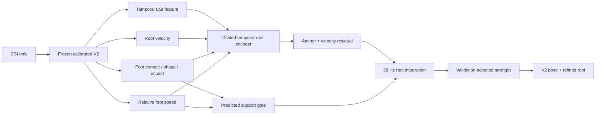

# Seen Reconstruction V3: Contact-Guided Root Stage

## 목적

7안 Stage A는 6안의 상대 SMPL-22 pose를 고정하고 CSI만으로 절대 pelvis trajectory를
개선한다. 현재 가장 큰 병목인 root error를 먼저 줄이되, 검증에서 실패하면
`root_strength=0`으로 6안을 정확히 복원할 수 있는 identity-safe 구조다.

## 파이프라인



입력에는 subject, environment, GT pose, GT contact가 들어가지 않는다. GT contact와
floor height는 train loss target으로만 사용한다. validation과 test는 CSI-only다.

## 학습과 선택

```powershell
python -m notifi_pose.tools.train_seen_v3_root `
  --epochs 16 --patience 5 --batch-size 8 `
  --run-dir work_v2/runs/seen_v3_contact_root
```

1. calibrated V2와 motion backbone을 동결한다.
2. root position, velocity, 5-frame displacement, anchor, foot contact, foot slip,
   contact height, floor penetration을 quality-weighted loss로 학습한다.
3. validation에서만 root strength `0/0.25/0.5/0.75/1.0`을 비교한다.
4. `root + 0.35 * impact + 0.05 * MPJPE`가 가장 작은 strength를 선택한다.
5. 선택 완료 후 test를 한 번 평가한다.

## 결과와 판정

validation은 epoch 8, root strength `0.50`을 선택했다.

| Metric | 6안 V2 | 7안 Stage A | 변화 |
|---|---:|---:|---:|
| MPJPE | 21.29cm | 21.29cm | 유지 |
| Dynamic MPJPE | 20.90cm | 20.90cm | 유지 |
| Distal MPJPE | 31.53cm | 31.53cm | 유지 |
| Impact MPJPE | **54.72cm** | 54.89cm | +0.17cm |
| Root error | 32.33cm | **31.81cm** | -0.52cm |
| Pose-speed ratio | 1.167 | 1.167 | 유지 |

root 중심 validation 목적과 test root 개선에 따라 Stage A를 채택한다. 다만 seen gate인
root 25cm와 impact 50cm에는 아직 못 미친다. 다음 단계에서는 이 root branch를 유지한 채
danger transition의 event-level impact/contact localization을 별도로 개선한다.
