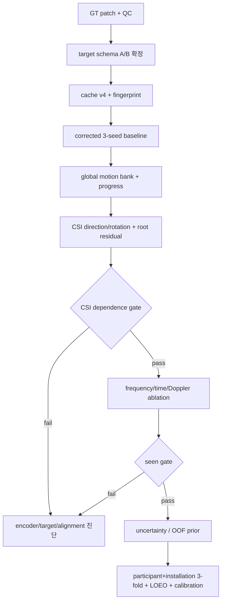

# V10 파일별 구현 명세

작성 시각: 2026-08-04 18:05 KST  
상태: 설계 확정, P0 데이터 복구 전 구현·학습 금지

이 문서는 [`final_code_audit_and_v10_execution_plan.md`](final_code_audit_and_v10_execution_plan.md)를
코드 작업 단위로 내린 명세다. 숫자는 corrected GT 재평가 전까지 역사적 진단값이다.

## 1. 먼저 확정할 두 계약

### 1.1 local pose target

현재 schema:

| subject | pose trial | schema | rotation GT |
|---|---:|---|---|
| ajh | 789 | `gvhmr_joints_v1` | 없음 |
| lmh | 788 | `gvhmr_joints_v1` | 없음 |
| mhw | 789 | `gvhmr_joints_v1` | 없음 |
| yja E02 | 263 | `gvhmr_smpl_full_v1` | 있음 |

선택 A가 우선이다.

1. **A: 전원 full-SMPL 재추출**
   같은 GVHMR commit/body model로 `global_orient`, `body_pose`, `betas`, `transl`, `joints_world`,
   `frame_index`를 저장한다. local head는 6D rotation, geodesic loss, FK를 쓴다.
2. **B: joints-only 유지**
   각 parent→child unit direction 21개와 canonical bone length를 저장한다. local head는 direction을
   정규화하고 FK한다. joint position으로 식별할 수 없는 bone twist와 SO(3) 정확도는 주장하지 않는다.

두 경로를 한 run에서 섞지 않는다. `target_contract`가 checkpoint와 결과 파일에 들어가야 한다.

### 1.2 좌표 출력

- 주 출력: pelvis-local canonical skeleton, 첫 valid frame 기준 root displacement, root yaw.
- 보조 출력: raw GVHMR metric skeleton과 trial-static shape/scale.
- absolute world root: board-camera extrinsic 또는 명시적 installation transform이 있을 때만 평가.
- `subject_id`, `environment_id`, site lookup은 production decoder 입력으로 금지한다.

## 2. cache v4

수정 파일: `notifi_pose/dataio/cache.py`, `notifi_pose/tools/build_cache.py`,
`notifi_pose/dataio/align.py`, `notifi_pose/dataio/targets.py`.

권장 array schema:

```text
csi_features       [N,304,3,114,2] float16  # amplitude, sanitized_phase
link_mask          [N,304,3]       bool
frame_time_s       [N,304]         float64
delta_time_s       [N,304]         float32
transition_valid   [N,304]         bool
packet_age_s       [N,304,3]       float16
packet_gap_s       [N,304,3]       float16
rssi               [N,304,3]       float16
pose_raw_rel       [N,304,22,3]    float32
pose_canonical_rel [N,304,22,3]    float32
bone_direction     [N,304,21,3]    float32  # target contract B
joint_rotation_6d  [N,304,22,6]    float32  # target contract A only
root_world         [N,304,3]       float32
root_delta         [N,304,3]       float32
target_valid       [N,304]         bool
shape_static       [N,22]          float32  # bone lengths or mapped betas
```

`frame_time_s`는 정밀도 손실과 장시간 gap 누적을 피하려고 float64를 쓴다. `delta_time_s[0]=0`,
`transition_valid[t]`는 양쪽 target이 valid이고 gap threshold 이내일 때만 true다. link별 age/gap은
encoder uncertainty에 쓰며 target validity를 바꾸지 않는다.

### 2.1 fingerprint

```text
trial_fingerprint = sha256(
  trial_id + csi_sha256 + gt_sha256 + timestamp_sha256 + video_metadata
)
dataset_fingerprint = sha256(sorted(trial_fingerprint))
split_fingerprint = sha256(dev_index + experiment_protocol)
code_fingerprint = PREPROC_VERSION + git_commit + schema_json
cache_fingerprint = sha256(dataset + split + code)
```

`open_cache()`는 네 fingerprint와 array shape/dtype/channel name을 검증한다. 하나라도 다르면 읽지 않고
rebuild 명령을 출력한다. `--reindex`도 split fingerprint와 role map을 새로 기록해 checkpoint lineage를
무효화한다.

### 2.2 필수 데이터 QC

새 파일: `notifi_pose/tools/gt_qc.py`.

- 영상 orientation manifest와 GT up-axis consistency.
- frame index 0 시작, 연속성, video/GT length.
- pose step `>0.2m`, root step `>0.5m`, height `>2.5m` hard gate.
- trial bone CV와 subject bone-length outlier.
- NaN/Inf, floor penetration은 warning과 hard-fail을 구분.
- 결과는 `gt_qc.json`과 `excluded_gt_qc.csv`로 저장하고 cache fingerprint에 포함.

## 3. dataset과 augmentation

수정 파일: `notifi_pose/dataio/dataset.py`.

반환 batch:

```python
{
    "csi_features": ...,
    "observation_valid": link_mask,
    "subcarrier_valid": ...,
    "target_valid": target_valid,
    "frame_time_s": frame_time_s,
    "delta_time_s": delta_time_s,
    "transition_valid": transition_valid,
    "packet_age_s": packet_age_s,
    "packet_gap_s": packet_gap_s,
    "rssi": rssi,
    "pose_canonical_rel": pose_canonical_rel,
    "bone_direction" or "joint_rotation_6d": ...,
    "root_delta": root_delta,
    "root_world": root_world,
    "shape_static": shape_static,
    "class_id": class_id,
    "risk_id": risk_id,
}
```

`_augment_rf()`는 representation dispatch로 분리한다.

- raw amplitude: positive multiplicative gain, smooth subcarrier ripple, bounded additive noise.
- sanitized phase: bounded additive offset/slope/residual noise 후 wrap 또는 재-sanitize.
- calibrated residual: 별도 residual-space scale/noise. nonnegative invariant를 적용하지 않음.
- I/Q rotation: `representation == iq`일 때만 허용.
- temporal jitter를 쓰면 CSI와 target을 같이 roll하지 않는다. 실제 alignment uncertainty를 모사하려면
  timestamp prior 안에서 CSI query만 이동하고 `frame_time_s`/validity를 함께 갱신한다.

## 4. split protocol

수정 파일: `notifi_pose/tools/build_splits.py`, `work_v2/splits/experiments.json`.

| protocol | train | validation | evaluation | 용도 |
|---|---|---|---|---|
| `seen_dev` | ajh/lmh/mhw 초기 연속 block | 중간 block | 마지막 block | 모델 개발 |
| `participant_plus_installations_ajh` | lmh+mhw train+old-test | lmh+mhw old-val | ajh 전체 | joint shift diagnostic |
| `participant_plus_installations_lmh` | ajh+mhw train+old-test | ajh+mhw old-val | lmh 전체 | joint shift diagnostic |
| `participant_plus_installations_mhw` | ajh+lmh train+old-test | ajh+lmh old-val | mhw 전체 | joint shift diagnostic |
| `loeo_*` | source의 다른 environment | source validation | held environment 전체 | environment DG |
| `yja_E02_asymmetric_dev` | source 3명 | source validation | yja E02 263 | 참고용 unseen dev |

기존 `loso`는 `loso_subsampled_historical`로 이름을 바꾼다. 새 final holdout을 수집하기 전에는
`sealed`, `final`, `test`라는 표현을 결과 제목에 쓰지 않는다.

physical installation ID가 없으므로 위 3-fold를 pure subject LOSO라고 부르지 않는다. 향후 factorial
수집에서 shared installation ID가 생긴 뒤에만 `subject_only_loso`와 `installation_only_holdout`을 만든다.

## 5. V10 모델 API

새 파일 권장:

```text
notifi_pose/v10/
  calibration.py
  encoder.py
  motion_bank.py
  progress.py
  decoder.py
  model.py
  losses.py
  checkpoint.py
```

### 5.1 calibration adapter

`CalibrationEncoder(empty_room_features, geometry_manifest) -> installation_embedding`.

권장 manifest 최소 schema:

```json
{
  "installation_id": "opaque-id",
  "rx": {"board_serial": "...", "position_m": [0, 0, 0], "orientation_xyzw": [0, 0, 0, 1]},
  "links": [
    {"link_id": "TX1", "tx_board_serial": "...", "tx_position_m": [0, 0, 0],
     "tx_orientation_xyzw": [0, 0, 0, 1], "channel_mhz": 0, "bandwidth_mhz": 0}
  ],
  "camera_to_installation": null,
  "empty_room_duration_s": 10.0,
  "schema_version": "installation-v1"
}
```

세 link에는 TX1/TX2/TX3가 각각 한 번 있어야 한다. RX와 모든 TX pose가 없으면 geometry branch를
끄고, `camera_to_installation`이 없으면 absolute world root를 출력/평가하지 않는다. 사람 이름과
environment label은 manifest에 넣지 않는다.

- model standardizer는 corrected train 전체에서 한 번 fit하고 immutable checkpoint buffer로 저장한다.
- `empty_room_features`로 standardizer를 다시 fit하지 않는다. empty-room은 adapter 입력이다.
- source site 학습과 새 설치 inference가 같은 adapter code path를 사용해야 한다.
- `site_baseline_hash`, `standardizer_hash`, `installation_bundle_hash`를 분리한다.
- geometry/empty-room bundle이 없거나 schema/hash가 맞지 않으면 adapter를 gate하고 canonical output만 낸다.
- 각 link는 CSV row order가 아니라 board serial/TX identity/antenna pose로 bind한다.
- set fusion은 geometry-conditioned link token을 사용하고 input order permutation test에서 동일한
  canonical output을 내야 한다.

- 10초 빈방 구간, link validity, board ID/order, position/orientation, camera extrinsic checksum을 받는다.
- FiLM/adapter parameter만 만들며 subject ID는 받지 않는다.
- 0초/10초/30초/120초 조건을 같은 checkpoint로 평가한다.
- unknown installation에서 lookup fallback으로 원신호를 통과시키는 방식은 금지한다.

### 5.2 encoder

```text
raw amp/phase frequency tokens
  -> per-link local frequency blocks
  -> cross-link attention before global pooling

multi-resolution temporal difference / Doppler tokens
  -> 0.1/0.3/1.0 s windows using actual time

time/gap/RSSI/observation tokens
  -> gated fusion

all branches + installation embedding
  -> semantic/action tokens (domain-invariant)
  -> kinematic trial tokens (calibration-conditioned, domain-equivariant)
  -> offline bidirectional encoder or separate causal encoder
```

현재 `SubcarrierConvEncoder`는 corrected baseline으로 남긴다. frequency token 유지, Doppler,
irregular query를 한 번에 넣지 않고 순차 ablation한다.

`v3.py`의 `DualViewFrequencyTokenizer`와 `KinematicBoneDecoder`는 참고 구현으로 재사용할 수 있지만,
이를 포함한 `arch=v3` checkpoint는 현재 0개다. 검증된 backbone으로 부르지 말고 corrected baseline과
같은 seed/protocol로 from-scratch 비교한다.

### 5.3 global motion bank

`GlobalMotionBank(action_prob, progress) -> canonical pose/root trajectory`.

- subject/site 독립 train-only motion dictionary 또는 learnable prototypes.
- action은 safe/warning/danger hierarchy와 17-class soft probability를 함께 사용.
- progress는 positive increments의 cumulative sum을 마지막 valid frame으로 정규화.
- 총 GT 이동량 `<0.5m`인 static trial은 progress loss를 끄고 identity/constant prior만 사용.
- site×action bank와 retrieval은 diagnostic baseline이며 production forward에 들어가지 않는다.

### 5.4 CSI residual decoder

- target A: region token → local 6D rotations → FK.
- target B: region token → 21 unit bone directions → canonical FK.
- root head: first-frame-relative displacement와 yaw. absolute transform은 별도 calibration layer.
- shape head: sequence pooling으로 trial-static scale/proportion만 출력. frame별 shape 출력 금지.
- uncertainty: head/torso/arms/legs region과 joint별 concentration/log-variance.
- residual은 zero-init하되 hard 4cm clamp를 두지 않는다. gradient norm과 output percentile로 폭주를 감시한다.
- domain adversarial/SupCon은 semantic/action token에만 적용한다. kinematic token은 같은-action 다른
  trial을 전부 당기지 않는 own-trial CSI-pose matching을 사용해 세부 움직임을 보존한다.
- train-only pose teacher의 같은 trial/time은 positive다. 다른 같은-action trial은 GT trajectory residual
  distance가 threshold 이상일 때만 negative이고, 가까운 반복은 ignore/soft-positive다.
- negative-free VICReg/Barlow alignment와 distance-aware InfoNCE를 독립 ablation한다.
- uncertainty likelihood는 full-SMPL target이면 matrix-Fisher/SO(3), bone-direction target이면
  vMF/S2 또는 tangent Gaussian을 사용한다.

## 6. loss와 시간

수정 파일: `notifi_pose/losses.py` 또는 새 `notifi_pose/v10/losses.py`.

```text
L_target = direction cosine or SO(3) geodesic
         + canonical local position
         + root displacement/yaw
L_time   = actual-time velocity + acceleration on transition_valid
L_task   = hierarchical action + risk + dynamic-only progress
L_signal = CSI-pose contrastive + same-group trial matching
L_shape  = trial-static shape + bone consistency
L_uncert = calibrated heteroscedastic or Fisher likelihood
```

- danger class balance는 sampler 또는 loss 한 곳에서만 적용한다.
- quality weight도 한 곳에서만 적용한다.
- 기본 train loader는 without-replacement traversal로 모든 trial을 epoch당 한 번 노출한다.
- cross-domain pair가 필요하면 coverage-preserving batch composer를 쓰고 `unique_trial_fraction`,
  `duplicate_draw_fraction`, action/risk/domain exposure를 매 epoch 기록한다.
- inverse-frequency CE와 GroupDRO는 balanced sampler와 동시에 활성화하지 않는다. 동일 optimizer
  step과 unique-trial exposure에서 각각 독립 ablation한 뒤 validation gate를 통과한 하나만 채택한다.
- subcarrier dropout은 `subcarrier_valid [B,T,L,S]`를 생성하고 train-mean imputation 뒤 normalized
  feature를 0으로 gate한다. encoder가 이 mask/token을 명시적으로 받게 한다.
- TCC/Soft-DTW는 timestamp identity 주변 low-dimensional descriptor에만 사용한다.
- impact/first-contact/injury heuristic target과 legacy contact head는 baseline에서 제거한다.
- 실제 floor geometry가 있는 경우에만 CSI residual/root gate 뒤 continuous foot penetration/slide
  regularizer를 독립 ablation한다. 이를 충돌 또는 부상 label로 해석하지 않는다.
- prior가 필요하면 train fold의 OOF base prediction/error로만 학습한다.

## 7. checkpoint contract

새 `save_checkpoint()`/`load_checkpoint()` factory 외 raw `load_state_dict()` 사용을 금지한다.

```json
{
  "format_version": "v10.0",
  "model_class": "NotiFiV10",
  "resolved_config": {},
  "target_contract": "bone_direction_v1 | smpl_rotation_v1",
  "model_state": {},
  "optimizer_state": {},
  "all_calibration_strengths": {},
  "dataset_fingerprint": "...",
  "cache_fingerprint": "...",
  "split_fingerprint": "...",
  "calibration_bundle_hash": "...",
  "source_checkpoint_hashes": [],
  "git_commit": "...",
  "source_tree_hash": "...",
  "selection_policy": {
    "metric_version": "v10.raw_causal_offline.1",
    "formula": "...",
    "thresholds": {},
    "smoother": "none | causal | offline"
  },
  "seed": 7,
  "selection_metric": "..."
}
```

`persistent=False` strength는 없애거나 resolved payload에서 반드시 복원하고 round-trip 출력 동일성을
테스트한다.

## 8. 학습 ladder

1. **V10-0**: GT patch/QC/schema 통과. 모델 학습 없음.
2. **V10-1**: cache v4와 lineage tests.
3. **V10-2**: corrected GraphFormer baseline, 3 seeds.
4. **V10-3**: global action bank + soft action + identity progress.
5. **V10-4**: dynamic-only learned progress.
6. **V10-5**: local direction/rotation residual.
7. **V10-6**: root displacement/yaw residual.
8. **V10-7**: actual-time loss와 CSI-pose contrastive.
9. **V10-8**: time/gap/RSSI, frequency token, Doppler 순차 ablation.
10. **V10-9**: deterministic gate 통과 뒤 uncertainty/prior.
11. **V10-U**: participant+installation 3-fold/LOEO/calibration protocol.

각 stage는 seed별 checkpoint, raw prediction, trial metric CSV, bootstrap JSON을 별도 디렉터리에 저장한다.
한 stage가 gate를 못 넘으면 다음 stage를 실행하지 않는다.

## 9. 평가 gate

corrected benchmark에서 baseline을 다시 측정한 뒤 절대 threshold를 freeze한다. 지금 확정 가능한 구조 gate:

- known orientation warning 0, unexplained pose jump 0, height anomaly 0.
- cache/source/split/code fingerprint 일치.
- same-site/action CSI shuffle: local `>=2cm` 또는 danger absolute `>=5cm` 악화.
- danger local temporal RMS: GT의 최소 60%, 최종 80~120%.
- danger trial residual cosine: `>0.30`, 최종 `>0.50`.
- raw/causal pooled danger speed ratio `0.8~1.2`, correlation CI가 0보다 큼.
- learned progress는 identity보다 validation을 개선하고 static jitter를 악화시키지 않음.
- 3 seeds와 trial bootstrap 95% CI, test-based selection 0회.
- 10초 calibration이 120초 대비 사전 정의 tolerance 안에 있음.

공식 표는 local/root/absolute/PA MPJPE, distal/torso/head/leg, action별 danger, actual-time
velocity/acceleration, endpoint/root drop/torso inclination, uncertainty calibration, parameter/latency/memory를
raw/causal/offline로 분리한다.

## 10. 외부 데이터

- AMASS+BABEL: fall/lie/get-up motion bank와 masked motion pretraining.
- Improved 3D Skeleton UP-Fall: SMPL-22로 retarget한 motion pretraining ablation. CSI pair나 injury label로
  취급하지 않음.
- CSI-Bench/외부 RF: masked RF encoder pretraining만. NotiFi pose와 가짜 pair 금지.
- 공개 motion prior는 NotiFi train fold에 fit하고 NotiFi validation/test pose를 섞지 않는다.

## 11. 구현 순서 의존성



가장 먼저 작성할 코드는 더 큰 backbone이 아니라 `gt_qc.py`, cache fingerprint, representation-aware
augmentation test다. 이 세 가지가 통과하기 전의 새 학습 결과는 비교표에 넣지 않는다.
