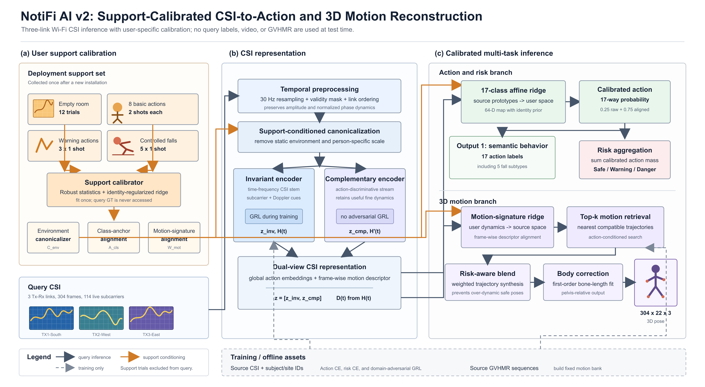

# NotiFi AI v2

NotiFi AI v2는 3개 송신 링크의 CSI만으로 17개 행동, 3단계 위험도와
pelvis-relative SMPL body-22 동작을 추정하는 unseen calibration 연구 모델이다.
현재 채택본은 `artifacts/notifi_ai_v2.pt` 하나로 배포된다. `yja/E02`는 모델
선택에 한 번도 사용하지 않았고, artifact와 설정을 잠근 뒤 최종 감사 평가를
한 번 수행했다.

## 모델 구조도



논문 및 발표 자료에는 고해상도 PNG를 사용할 수 있으며, 편집 가능한 원본은
[`docs/notifi_ai_v2_architecture_cvpr.svg`](docs/notifi_ai_v2_architecture_cvpr.svg)에
있다. 실선은 query 추론, 주황색은 calibration support 경로, 점선은 학습 및
offline motion-bank 구축 경로를 의미한다.

## 현재 채택 구조

```text
새 공간 CSI
  ├─ 빈 공간 12회
  ├─ 기본동작 8종 x 2회
  ├─ warning 동작 3종 x 1회
  └─ 통제된 danger 동작 5종 x 1회
           |
           v
  support/absence canonicalization
           |
           v
  두 CSI encoder의 행동·위험·motion descriptor
       |                         |
       v                         v
  17-class affine ridge      motion-signature ridge
  source 행동공간 → target    target 움직임 → source pose 공간
       |                         |
       v                         v
  17-action ──> 3-risk     top-k GVHMR motion retrieval
                                  |
                                  v
                     가중 합성 + 뼈 길이 일관성 보정
                                  |
                                  v
                         304 x 22 x 3 pose
```

기존 모델은 기본 자세 support를 정적 반사 기준선으로만 사용했다. 현재 모델은
기본·warning·danger support가 만드는 class geometry를 이용해 source의 17개
행동 prototype 전체를 새 사용자 공간으로 옮긴다. 64차원 행동 정렬은 적은 support에
과적합하지 않도록 identity prior가 있는 affine ridge를 사용하며, 기존 분류와
정렬 분류를 `0.25 : 0.75` 확률로 결합한다.

위험도는 별도 head의 불안정한 경계를 다시 쓰지 않고, 보정된 17개 행동 확률을
safe 9종, warning 3종, danger 5종으로 정확히 합산한다. Pose는 CSI가 예측한 시간별 motion descriptor를
calibration support로 보정한 뒤 GVHMR motion bank를 검색한다. Danger 확률의
제곱근으로 보정 강도를 조절해 정적인 동작이 과도하게 변형되는 것을 막는다.

## 검증 성능

프로토콜은 `ajh E01-E03`, `mhw E01-E03`, `lmh E01`만 사용한 source
nested subject-LOSO다. 각 outer subject는 학습과 설정 선택에서 제외했으며,
calibration support는 query에서 제거했다. 아래 값은 서로 다른 support seed
5회의 평균과 모집단 표준편차다.

### 행동·위험 분류

| 지표 | 동일 가중치 raw 경로 | 정상 calibration | 변화 |
|---|---:|---:|---:|
| 17동작 accuracy | 44.89 ± 0.87% | **53.38 ± 1.52%** | +8.48%p |
| 17동작 macro-F1 | 35.33 ± 0.94% | **47.55 ± 1.83%** | +12.22%p |
| danger 세부동작 accuracy | 13.00 ± 2.12% | **38.73 ± 6.11%** | +25.73%p |
| 3위험도 accuracy | 52.88 ± 0.86% | **68.50 ± 2.01%** | +15.62%p |
| 3위험도 macro-F1 | 43.50 ± 1.20% | **62.00 ± 2.87%** | +18.51%p |
| danger recall | 53.12 ± 3.07% | **56.90 ± 5.49%** | +3.78%p |
| safe → danger 오경보 | 18.68 ± 0.70% | **8.21 ± 1.85%** | -10.47%p |

새 모델은 warning support 3회를 추가해 기존에 비어 있던 위험 경계까지 target
좌표로 옮긴다. 위험도는 calibrated action 확률에서 파생하므로 분류와 위험도가
서로 모순되는 경우도 줄었다. 두 열은 동일한 encoder checkpoint와 동일한 1,042개
query를 사용하고 calibration 적용 여부만 다르다.

2026-08-14 재감사에서 기존 표의 `54.51%`가 배포 artifact와 다른 비-seed primary
fold checkpoint로 계산된 것을 확인했다. 현재 표는 `notifi_ai_v2.pt`의 primary
encoder SHA-256과 일치하는 seed-22012 fold 계보로 5개 support seed를 다시 실행한
결과다. 최종 봉인 `yja/E02` 결과와 pose 결과에는 이 checkpoint 불일치가 없었다.

### 3D 동작 복원

| 지표 | 기존 motion 검색 | 현재 motion 정렬 | 변화 |
|---|---:|---:|---:|
| Pose MPJPE | 29.37 ± 0.17 cm | **28.97 ± 0.16 cm** | -0.40 cm |
| Distal MPJPE | 43.41 ± 0.32 cm | **42.88 ± 0.31 cm** | -0.53 cm |
| PA-MPJPE | **10.45 ± 0.09 cm** | 10.61 ± 0.10 cm | +0.16 cm |
| Danger pose MPJPE | 38.35 ± 0.13 cm | **37.23 ± 0.38 cm** | -1.13 cm |
| Danger distal MPJPE | 56.99 ± 0.17 cm | **55.47 ± 0.53 cm** | -1.52 cm |

절대 관절 궤적과 danger 사지 오차는 5개 seed 모두 개선됐다. 반면 회전·이동·
크기를 정렬한 PA-MPJPE는 0.16 cm 악화됐다. 따라서 현재 motion 정렬은 실제
궤적과 낙상 복원에는 유효하지만, 순수 자세 모양까지 개선한 것은 아니다.

상세 수치는 `results/full_support_loso_recheck_20260814.json`과
`results/motion_ridge_pose_fixed_5seed_summary.json`에 있다. 재평가 조건과
held-out 사람별 결과는 [`docs/loso_evaluation_2026-08-14.md`](docs/loso_evaluation_2026-08-14.md)에
정리했다.

### 최종 봉인 unseen

고정 artifact를 `yja/E02`에 처음 적용했다. 전체 275개 중 absence 12개와
basic 16개, warning 3개, danger 5개를 calibration에 사용하고, 겹치지 않는
239개 query를 평가했다. 이 결과를 본 뒤 모델이나 임계값은 수정하지 않았다.

| 지표 | yja/E02 최종 결과 |
|---|---:|
| 17동작 accuracy | **65.69%** |
| 17동작 macro-F1 | **55.64%** |
| 3위험도 accuracy | **95.82%** |
| 3위험도 macro-F1 | **95.87%** |
| danger recall | **43 / 45 = 95.56%** |
| danger 세부동작 accuracy | 42.22% |
| safe → danger 오경보 | **0 / 122 = 0%** |
| Pose / danger MPJPE | 29.72 / 35.77 cm |
| Danger distal MPJPE | 51.90 cm |

정확한 support trial ID, artifact hash와 전체 지표는
`results/sealed_yja_e02_final.json`에 기록했다. 위험 그룹은 잘 일반화됐지만
세부 행동과 관절 복원은 여전히 상용 품질에 못 미친다.

## Calibration 계약

기본동작은 각각 2회 수집한다.

| ID | 동작 |
|---:|---|
| 0 | walking |
| 1 | standing still |
| 2 | sitting still |
| 3 | lying still |
| 4 | lie to stand |
| 5 | stand to lie normally |
| 7 | sit to stand |
| 8 | stand to sit |

빈 공간은 12회, danger support는 아래 5종을 각각 1회 사용한다.

warning support도 각각 1회 수집한다.

| ID | 동작 |
|---:|---|
| 9 | unstable walking |
| 10 | stumble and recover |
| 11 | failed bed exit |

| ID | 동작 |
|---:|---|
| 12 | fall from standing |
| 13 | fall while walking |
| 14 | bed-exit fall |
| 15 | bed fall |
| 16 | chair-exit fall |

Danger calibration은 실제 사용자가 맨바닥에서 수행하면 안 된다. 현재 수치는
연구 데이터의 통제된 낙상 support를 사용한 결과이며, 제품에서는 안전요원과
매트가 있는 설치 절차, 사전 등록된 사용자 동작, 또는 안전한 대체 동작으로
재설계해야 한다. Query의 행동 라벨이나 GT pose는 calibration과 추론에 사용하지
않는다.

## 설치와 실행

```powershell
python -m pip install -e .
python -m compileall -q notifi_ai_v2 notifi_pose scripts tests
python -m unittest discover -s tests -p "test_*.py" -v
python scripts/verify_artifact.py --artifact artifacts/notifi_ai_v2.pt --device cpu
```

Python API는 tensor 입력 `[B,304,3,114,2]`와 link mask `[B,304,3]`을 받는다.

```python
from notifi_pose.deployment import CAL44Deployment

runtime = CAL44Deployment.load("artifacts/notifi_ai_v2.pt")
calibration = runtime.calibrate(
    support_csi,
    support_mask,
    support_labels,
    absence_csi,
    absence_mask,
    danger_support_csi,
    danger_support_mask,
    danger_support_labels,
    warning_support_csi,
    warning_support_mask,
    warning_support_labels,
)
prediction = runtime.predict(query_csi, query_mask, calibration)

action = prediction["action_probability"]  # [B,17]
risk = prediction["risk_probability"]      # [B,3]
pose = prediction["pose_rel"]              # [B,304,22,3]
```

`notifi_pose.deployment.load_csi_csv_batch`로 raw CSV를 같은 입력 계약으로 변환할
수 있다. 링크 coverage가 부족하거나 calibration geometry가 source 범위를 벗어나면
`abstain`과 `calibration_domain_warning`이 반환된다.

## 배포 파일

| 경로 | 역할 |
|---|---|
| `artifacts/notifi_ai_v2.pt` | 두 encoder, source prototype, GVHMR bank와 full-support calibration 설정을 포함한 단일 artifact |
| `notifi_pose/deployment.py` | calibration, 17동작·3위험도 추론, pose 검색 API |
| `notifi_ai_v2/support_alignment.py` | identity-regularized support ridge |
| `notifi_pose/skeleton.py` | SMPL body-22 뼈 길이 일관성 보정 |
| `scripts/verify_artifact.py` | 단일 PT end-to-end smoke test |
| `scripts/evaluate_cal44_support_ridge.py` | source nested-LOSO 행동 검증 |
| `scripts/evaluate_motion_signature_ridge_pose.py` | source nested-LOSO pose 검증 |

Artifact 크기는 60,880,749 bytes이고 SHA-256은
`f1d055df3252bf1e0d09c62d4ce1ec953b08c3cdb0e8cd7e3f7dac5be287447c`이다.
실패한 M2/M3 체크포인트와 수백 개의 중간 JSON은 공개 패키지에서 제거했다.

## 남은 한계

- Source 사람이 3명이고 최종 unseen도 1명뿐이므로 “어떤 사용자에서도 동일 성능”은 입증되지 않았다.
- 3위험도 macro-F1 62.00%, danger recall 56.90%는 개선됐지만 상용 안전 시스템 수준이 아니다.
- Pose는 연속 관절 생성기가 아니라 calibrated motion retrieval이다. Bank에 없는 낙상은 근사 동작으로 나온다.
- Danger distal 55.47 cm는 부상 부위 판단에 쓰기에는 여전히 크다.
- `yja/E02` 최종 평가는 구조와 설정을 완전히 잠근 뒤 한 번만 수행해야 한다.

다음 승격 조건은 별도 subject에서 현재 full-support 개선을 재현하고, 연속 motion
residual decoder가 retrieval-only pose보다 danger pose와 PA-MPJPE를 동시에
개선하는 것이다.
