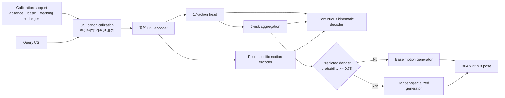

# NotiFi AI v2

NotiFi AI v2는 3개 송신기와 1개 수신기에서 수집한 CSI만으로 17개 행동, 3단계 위험도,
pelvis-relative SMPL body-22 동작을 추론하는 calibration 기반 모델이다.

현재 배포 artifact는 `notifi_ai_v2.pt`이다. 분류 calibration은 기존
full-support 방식을 유지하고, pose는 motion bank를 그대로 출력하는 대신 CSI에서 연속 관절
궤적을 생성한다. 새 사람과 환경의 정답 query는 학습, epoch 선택, threshold 선택에 사용하지
않았다.

## 현재 파이프라인



### Calibration과 분류

- 비어 있는 공간 12개로 정적 환경 반사 기준선을 만든다.
- 기본 행동 8종을 각 2개, warning 3종과 danger 5종을 각 1개 사용한다.
- support anchor와 source prototype을 identity-regularized affine ridge로 정렬한다.
- 17개 행동 확률을 safe, warning, danger 그룹으로 합산해 위험도를 계산한다.
- link coverage와 calibration geometry가 기준을 벗어나면 `abstain`과 경고를 반환한다.

### 연속 pose 복원

- 분류 가중치는 고정하고 pose 전용 CSI encoder만 source pose GT로 미세 조정한다.
- temporal Transformer가 시간 문맥을 읽고 각 관절의 방향과 뼈 길이 보정값을 생성한다.
- source GT에서 구한 평균 skeleton을 기준으로 관절을 순방향 운동학으로 누적한다.
- 최종 출력은 root-relative이므로 절대 방 위치보다 자세와 동작 형태에 집중한다.
- danger generator는 source 낙상만으로 추가 학습한다.
- 분기 조건은 GT 위험도가 아니라 CSI에서 예측한 danger 확률이다.

이 구조는 motion bank의 trial 하나를 그대로 복사하지 않는다. 다만 CSI에 없는 세부 정보를
완벽히 복원하는 생성 모델은 아니며, source motion manifold 안에서 가장 가능성 높은 연속 동작을
예측한다.

## Source-only 모델 선택

세 사람의 7개 source 환경만 사용한 nested leave-one-site-out 결과다. 바깥 holdout 환경은
학습과 epoch 선택에 사용하지 않았고, 최종 unseen 사용자도 사용하지 않았다.

| 모델 | Pose MPJPE | Distal | PA-MPJPE | Danger pose | Danger distal |
|---|---:|---:|---:|---:|---:|
| Motion retrieval | 29.12 cm | 43.14 cm | 10.68 cm | 36.80 cm | 55.01 cm |
| Retrieval + residual | 28.69 cm | 42.14 cm | 11.02 cm | 35.81 cm | 53.08 cm |
| Continuous base | 26.35 cm | 39.39 cm | **9.51 cm** | 34.07 cm | 51.00 cm |
| Continuous + predicted-risk danger expert | **26.33 cm** | **39.35 cm** | 9.58 cm | **33.86 cm** | **50.66 cm** |

현재 모델은 retrieval 대비 source pose를 약 9.6%, danger pose를 약 8.0%, danger distal을
약 7.9% 줄였다. 이 source-only 결과에 따라 danger expert와 threshold 0.75를 잠근 뒤 전체
source를 다시 학습했다.

### 채택하지 않은 실험

| 실험 | 판단 |
|---|---|
| GT motion autoencoder prior | GT 재구성은 7.46 cm였지만 CSI-to-latent가 28.19 cm라 병목을 해결하지 못함 |
| Action-conditioned prior | 행동 평균으로 수렴해 28.27 cm, danger 36.22 cm로 악화 |
| Orientation factorization | PA-MPJPE는 8.49 cm로 개선됐지만 전체 pose는 27.07 cm로 악화 |
| State + motion 분해 | 전체 26.26 cm로 소폭 개선됐지만 danger가 34.21 cm로 악화 |
| State + danger hybrid | 전체 26.22 cm였으나 복잡도 대비 0.05 cm 개선에 그쳐 미채택 |

## 봉인 Unseen 평가

잠긴 artifact를 신규 사용자/환경에 처음 적용했다. calibration support는 query에서 제외했고,
남은 239개 query의 label과 GT pose는 추론이 끝난 뒤 지표 계산에만 사용했다. 결과를 확인한 뒤
가중치, epoch, threshold를 수정하지 않았다.

### 분류

| 지표 | 결과 |
|---|---:|
| 17-action accuracy | **65.69%** |
| 17-action macro-F1 | **55.64%** |
| 3-risk accuracy | **95.82%** |
| 3-risk macro-F1 | **95.87%** |
| Danger recall | **95.56%** (43/45) |
| Danger 세부 행동 accuracy | 42.22% |
| Safe -> danger 오경보 | **0.00%** (0/122) |

### Pose

| 지표 | Retrieval | 이전 residual | 현재 continuous | Retrieval 대비 |
|---|---:|---:|---:|---:|
| Pose MPJPE | 29.72 cm | 28.43 cm | **26.96 cm** | **-9.29%** |
| Distal MPJPE | 43.84 cm | 41.83 cm | **39.17 cm** | **-10.66%** |
| PA-MPJPE | 10.81 cm | 11.73 cm | **10.24 cm** | **-5.28%** |
| Danger pose MPJPE | 35.77 cm | **33.17 cm** | 34.46 cm | -3.66% |
| Danger distal MPJPE | 51.90 cm | **48.27 cm** | 50.63 cm | -2.45% |

현재 모델은 전체 동작과 말단 복원에서는 가장 좋지만, 낙상만 보면 이전 residual 모델이 더
좋다. unseen 결과를 보고 두 모델을 섞으면 test 적응이 되므로 현재 artifact는 source-only
선택을 유지한다. 다음 승격 조건은 별도 unseen subject에서도 개선을 재현하면서 danger pose와
danger distal이 residual 기준까지 동시에 내려가는 것이다.

평가 원본은 `results/sealed_unseen_continuous_danger_final.json`에 있다.

## 지원 동작

| 위험도 | ID | 동작 |
|---|---:|---|
| safe | 0 | walking |
| safe | 1 | standing still |
| safe | 2 | sitting still |
| safe | 3 | lying still |
| safe | 4 | lie to stand |
| safe | 5 | stand to lie normally |
| safe | 6 | absence |
| safe | 7 | sit to stand |
| safe | 8 | stand to sit |
| warning | 9 | unstable walking |
| warning | 10 | stumble and recover |
| warning | 11 | failed bed exit |
| danger | 12 | fall from standing |
| danger | 13 | fall while walking |
| danger | 14 | bed-exit fall |
| danger | 15 | bed fall |
| danger | 16 | chair-exit fall |

## 실행

```powershell
python -m pip install -e .
python -m compileall -q notifi_ai_v2 notifi_pose scripts tests
python -m unittest discover -s tests -p "test_*.py" -v
python scripts/verify_artifact.py `
  --artifact artifacts/notifi_ai_v2.pt `
  --device cpu
```

Python API 입력은 CSI `[B,304,3,114,2]`, link mask `[B,304,3]`이다.

```python
from notifi_pose.deployment import CAL44Deployment

runtime = CAL44Deployment.load(
    "artifacts/notifi_ai_v2.pt"
)
calibration = runtime.calibrate(
    basic_csi,
    basic_mask,
    basic_labels,
    absence_csi,
    absence_mask,
    danger_csi,
    danger_mask,
    danger_labels,
    warning_csi,
    warning_mask,
    warning_labels,
)
prediction = runtime.predict(
    query_csi,
    query_mask,
    calibration,
    simulate_pose=True,
    risk_profile="conservative",
)

action = prediction["action_probability"]  # [B,17]
risk = prediction["risk_probability"]      # [B,3]
pose = prediction["pose_rel"]              # [B,304,22,3]
danger_route = prediction["continuous_danger_expert_used"]
```

## 주요 파일

| 경로 | 역할 |
|---|---|
| `notifi_pose/deployment.py` | calibration, 분류, 위험도, continuous pose를 묶은 배포 API |
| `notifi_ai_v2/continuous_motion.py` | 연속 kinematic pose generator와 복합 손실 |
| `notifi_ai_v2/support_alignment.py` | full-support affine alignment |
| `scripts/train_continuous_motion_loso.py` | retrieval-free generator source nested-LOSO |
| `scripts/train_pose_specific_encoder_loso.py` | pose 전용 CSI encoder 검증 |
| `scripts/train_danger_expert_loso.py` | predicted-risk danger expert 검증 |
| `scripts/train_continuous_pose_deployment.py` | 전체 source 고정 학습과 artifact export |
| `scripts/evaluate_sealed_continuous_pose.py` | 잠긴 artifact 최종 unseen 감사 |
| `scripts/verify_artifact.py` | 단일 artifact end-to-end smoke test |

현재 artifact SHA-256은
`24d23f077e251101003f14b89b4974a54fe0478629d9065f7aa874b7722f9aaf`이다.

## 남은 문제

- source 사용자는 세 명뿐이어서 사람과 환경 변화의 분산을 충분히 학습했다고 보기 어렵다.
- GT-only motion prior가 7.46 cm까지 내려가므로 decoder 용량보다 CSI-to-motion 표현이 주 병목이다.
- source danger 학습 trial은 175개여서 빠른 낙상의 다양한 방향과 관절 궤적이 부족하다.
- danger 세부 행동 accuracy 42.22%는 위험 탐지는 잘해도 넘어지는 유형을 아직 혼동한다는 뜻이다.
- danger distal 50.63 cm는 어느 신체 부위가 바닥에 접근했는지 제품 수준으로 판단하기에 크다.
- 고정된 body-22 평균 skeleton을 사용하므로 사용자 체형 차이를 직접 모델링하지 않는다.
- CSI와 GT의 trial별 시간 오차는 temporal context로 완화할 뿐 명시적으로 추정하지 않는다.

따라서 다음 핵심은 decoder를 더 크게 만드는 일이 아니라, source-only self-supervised pretraining과
시간 정렬을 통해 CSI encoder가 환경보다 실제 움직임을 더 안정적으로 표현하게 만드는 것이다.
