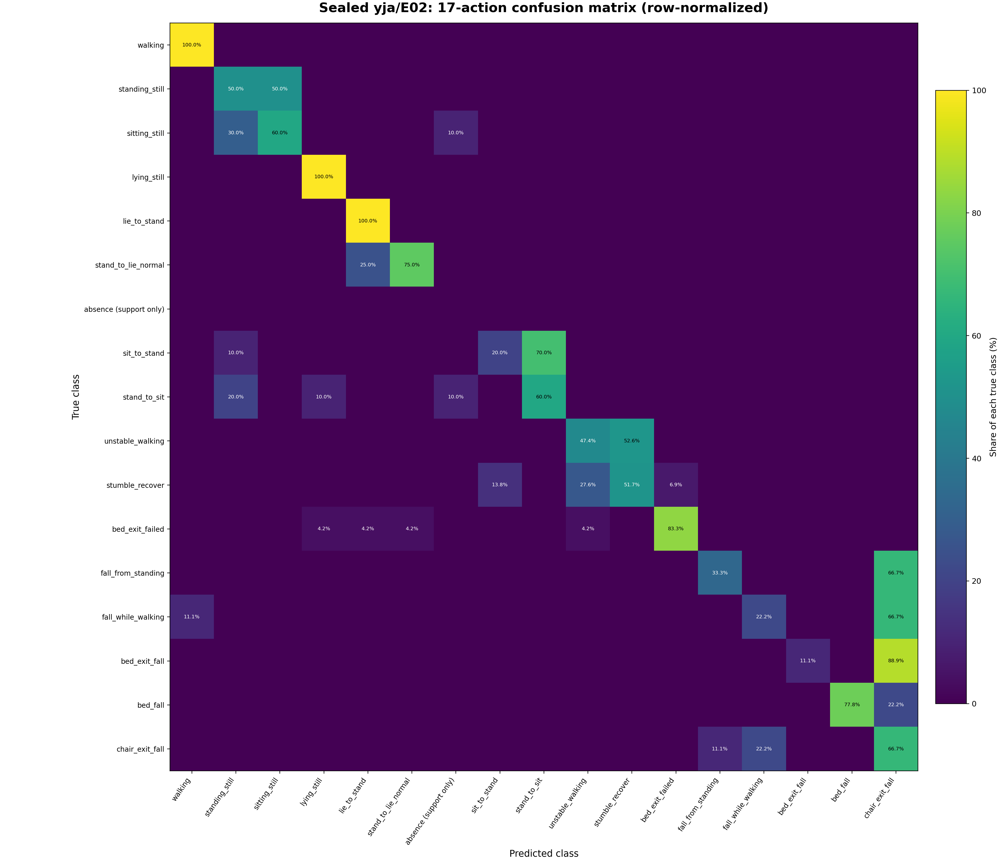
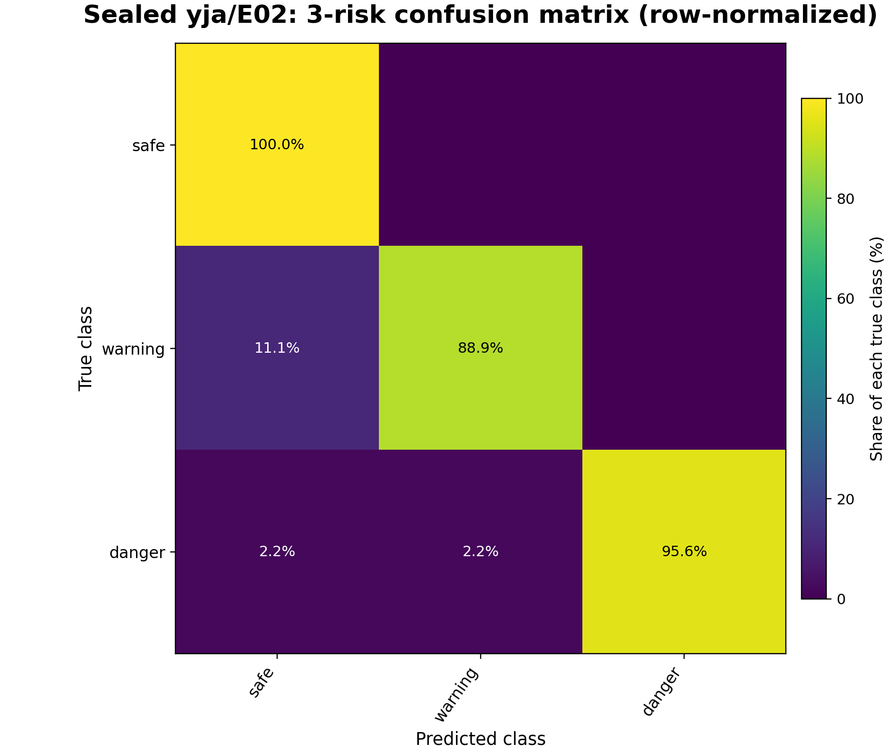
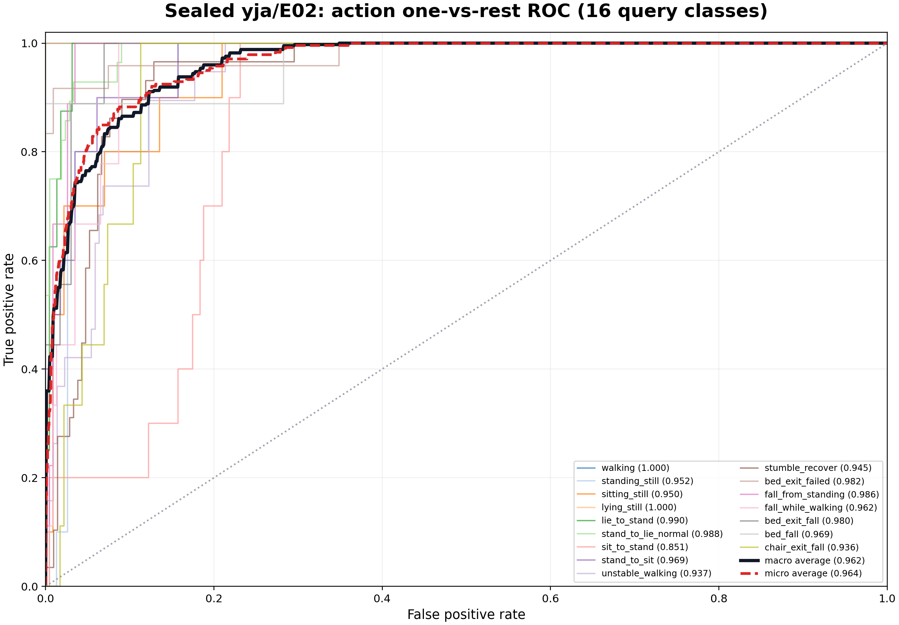
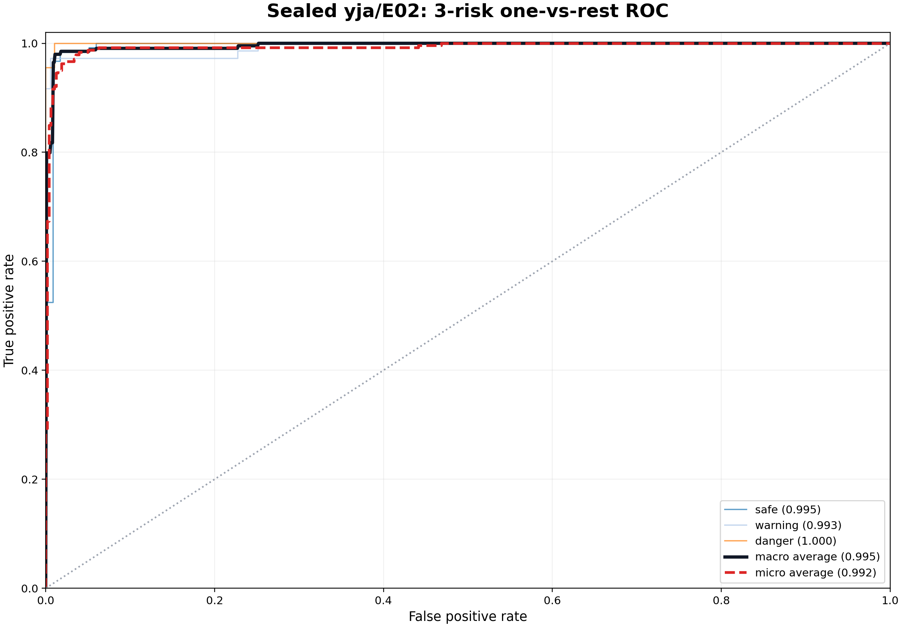
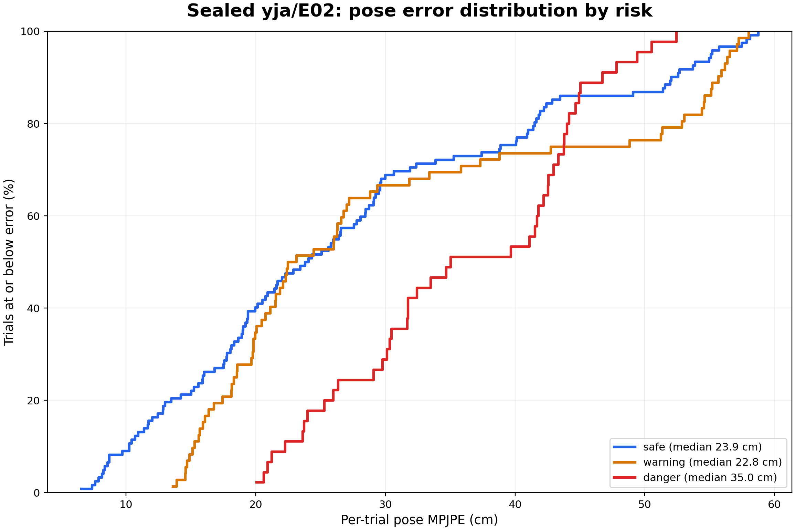

# yja/E02 봉인 Unseen 평가

이 문서는 고정된 `NotiFi AI v2` artifact를 신규 사용자·환경인 `yja/E02`에
calibration한 뒤 평가한 결과다. 저장소는
[`jjyoon012-git/NotiFi/NotiFi_AI_v2`](https://github.com/jjyoon012-git/NotiFi/tree/main/NotiFi_AI_v2)이며,
평가에 사용한 artifact는 [`notifi_ai_v2.pt`](../../../artifacts/notifi_ai_v2.pt)다.

## 평가 계약

- 학습 데이터: `ajh/E01-E03`, `mhw/E01-E03`, `lmh/E01`
- 봉인 평가 데이터: `yja/E02`
- 전체 trial: 275개
- calibration: absence 12개, basic 16개, warning 3개, danger 5개
- 최종 query: calibration support와 겹치지 않는 239개
- support seed: `17017`
- artifact SHA-256: `f1d055df3252bf1e0d09c62d4ce1ec953b08c3cdb0e8cd7e3f7dac5be287447c`
- `yja/E02` query의 라벨과 pose GT는 추론 이후 평가에만 사용
- `yja/E02` 결과는 학습, hyperparameter 선택, calibration 설정 선택에 사용하지 않음

## 전체 성능

| 지표 | 결과 |
|---|---:|
| 17동작 accuracy | **65.69%** |
| 17동작 macro-F1 | **55.64%** |
| 16개 query 동작 macro ROC-AUC | **96.21%** |
| 16개 query 동작 micro ROC-AUC | **96.36%** |
| 3위험도 accuracy | **95.82%** |
| 3위험도 macro-F1 | **95.87%** |
| 3위험도 macro ROC-AUC | **99.55%** |
| 3위험도 micro ROC-AUC | **99.23%** |
| danger recall | **95.56%** |
| danger 세부 동작 accuracy | **42.22%** |
| safe에서 danger로 잘못 경보 | **0.00%** |
| Pose MPJPE | 29.72 cm |
| Distal MPJPE | 43.84 cm |
| PA-MPJPE | 10.81 cm |
| Danger pose MPJPE | 35.77 cm |
| Danger distal MPJPE | 51.90 cm |

`absence` 12개는 모두 calibration에 사용되어 최종 query에는 양성 샘플이 없다.
따라서 17행 confusion matrix에는 `support only`로 남겨 두되, action ROC의 macro
평균은 AUC를 정의할 수 있는 16개 query 동작만 사용했다.

## 퍼센트 Confusion Matrix

각 행은 실제 클래스 하나를 의미하며 행의 합이 100%가 되도록 정규화했다. 셀에는
원시 개수가 아니라 해당 실제 클래스 중 모델이 각 클래스로 예측한 비율을 표시했다.



17동작에서는 걷기, 눕기, 누웠다 일어나기가 100%로 구분됐다. 반면 서기와 앉기,
불안정 보행과 비틀거림 회복이 서로 혼동된다. 낙상은 위험 상태 자체는 잘 잡지만
`fall_from_standing`, `fall_while_walking`, `bed_exit_fall`의 상당 부분이
`chair_exit_fall`로 모인다. 이 때문에 danger recall은 95.56%이지만 danger 세부
동작 accuracy는 42.22%에 머문다.



위험도에서는 safe 100.0%, warning 88.9%, danger 95.6%의 class recall을 보였다.
safe가 danger로 잘못 분류된 비율은 0.0%다. danger의 나머지는 safe 2.2%와
warning 2.2%로 분류됐다.

## ROC-AUC

ROC는 각 클래스를 나머지 전체와 구분하는 one-vs-rest 방식이다. AUC가 accuracy보다
높은 것은 모델이 정답 클래스에 비교적 높은 점수를 주더라도, 비슷한 동작 하나가 더
높아 최종 argmax가 틀리는 경우가 있기 때문이다. 즉 표현 공간의 분리 능력은 좋지만
세부 행동의 최종 경계와 subtype 표현은 아직 충분하지 않다.





## Pose 오차 분포

아래 그래프의 세로축은 특정 오차 이하인 trial의 누적 비율이다. 중앙값은 safe
23.9 cm, warning 22.8 cm, danger 35.0 cm다. 위험도 분류와 달리 낙상 궤적과
손·발 끝 관절의 복원은 아직 실사용 판단에 충분하지 않다.



## 추론 파이프라인

1. `CacheStore`가 raw cache에서 `CSI [304,3,114,2]`와 유효 link mask를 읽는다.
2. absence·basic·warning·danger support로 신규 환경의 CSI 좌표를 source 행동 공간에 맞춘다.
3. 두 CSI encoder의 확률을 결합하고, 17동작 확률을 safe·warning·danger로 합산한다.
4. CSI가 예측한 시간별 motion descriptor를 support ridge로 source GVHMR descriptor 공간에 맞춘다.
5. source 전용 GVHMR motion bank에서 가까운 후보를 검색하고, 시간 이동·top-k 가중 혼합·뼈 길이 보정을 적용한다.
6. `17-action`, `3-risk`, `pelvis-relative 304x22x3 pose`를 반환한다.

현재 pose는 관절을 처음부터 연속 생성하는 decoder가 아니라 **CSI로 검색한 source
motion을 보정·혼합하는 retrieval 방식**이다. 따라서 bank에 없는 낙상 형태와 세밀한
distal 궤적을 직접 만들어내지 못하는 것이 가장 큰 복원 한계다.

## 관련 코드

| 경로 | 역할 |
|---|---|
| [`artifacts/notifi_ai_v2.pt`](../../../artifacts/notifi_ai_v2.pt) | encoder, calibration 설정, source prototype, GVHMR motion bank가 포함된 단일 artifact |
| [`notifi_pose/deployment.py`](../../../notifi_pose/deployment.py) | artifact 로드, 사용자 calibration, action·risk·pose 추론 API |
| [`notifi_pose/cal20.py`](../../../notifi_pose/cal20.py) | 환경 정적 성분을 억제하는 CSI motion encoder와 action·motion head |
| [`notifi_ai_v2/support_alignment.py`](../../../notifi_ai_v2/support_alignment.py) | support 기반 affine ridge 정렬과 action-to-risk 확률 변환 |
| [`notifi_pose/pose_simulation.py`](../../../notifi_pose/pose_simulation.py) | motion 후보 시간 정렬과 pose 평가 지표 |
| [`notifi_pose/skeleton.py`](../../../notifi_pose/skeleton.py) | SMPL body-22 뼈 길이 일관성 보정 |
| [`scripts/evaluate_sealed_yja.py`](../../../scripts/evaluate_sealed_yja.py) | 봉인 support/query 분리, 추론, query별 진단 자료 저장 |
| [`scripts/plot_sealed_yja_diagnostics.py`](../../../scripts/plot_sealed_yja_diagnostics.py) | 퍼센트 confusion matrix, ROC-AUC, pose CDF 생성 |

## 저장 결과

- 원본 최종 지표: [`results/sealed_yja_e02_final.json`](../../../results/sealed_yja_e02_final.json)
- 재현 감사 지표: [`results/sealed_yja_e02_visual_audit.json`](../../../results/sealed_yja_e02_visual_audit.json)
- query별 예측 확률: [`results/sealed_yja_e02_diagnostics.npz`](../../../results/sealed_yja_e02_diagnostics.npz)
- confusion·AUC 수치: [`results/sealed_yja_e02_diagnostics_summary.json`](../../../results/sealed_yja_e02_diagnostics_summary.json)

## 재현 명령

평가용 의존성은 `pip install -e ".[evaluation]"`으로 설치한다. 봉인 평가는 동일
artifact와 cache에 대해 명시적으로 승인 플래그를 줘야 실행된다.

```powershell
python scripts/evaluate_sealed_yja.py `
  --cache-root <work_v2/cache> `
  --artifact artifacts/notifi_ai_v2.pt `
  --output results/sealed_yja_e02_visual_audit.json `
  --diagnostics-output results/sealed_yja_e02_diagnostics.npz `
  --support-seed 17017 `
  --confirm-sealed-evaluation

python scripts/plot_sealed_yja_diagnostics.py `
  --input results/sealed_yja_e02_diagnostics.npz `
  --output-dir docs/evaluation/yja_e02 `
  --summary-output results/sealed_yja_e02_diagnostics_summary.json
```

이 결과는 `yja/E02` 한 사용자·한 환경에서 calibration이 잘 작동한 증거다. 모든
신규 사용자·환경에서 같은 성능을 보장하는 근거는 아니며, 그 범위는 별도 LOSO 및
외부 현장 평가로 확인해야 한다.
