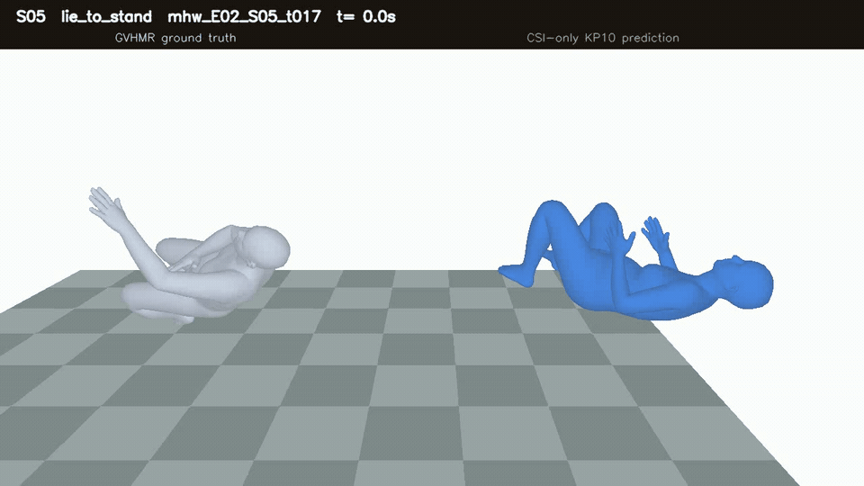

# NotiFi

**Camera-free Wi-Fi CSI sensing for human behavior, fall risk, and 3D motion reconstruction**

NotiFi는 카메라나 웨어러블 없이 Wi-Fi CSI(Channel State Information)를 이용해
사람의 행동과 위험도를 탐지하고, 관찰된 신호와 양립 가능한 3D 인체 동작을
복원하는 연구 프로젝트입니다. 학습 단계에서는 영상과 GVHMR pose를 정답으로
사용하지만, 실제 추론 단계의 입력은 3개 Tx-Rx 링크에서 수집한 CSI뿐입니다.

[](assets/notifi_lie_to_stand_demo.mp4)

> CSI-only 3D 복원 예시입니다. 왼쪽은 GVHMR ground truth, 오른쪽은 CSI-only
> prediction입니다. 이미지를 누르면 MP4 원본을 열 수 있습니다. 영상은 복원 경로의
> 시각적 예시이며, 현재 모델의 정량 성능은 아래 검증 표를 기준으로 합니다.

## Project Goal

NotiFi가 해결하려는 문제는 다음 세 가지입니다.

1. **행동 탐지:** CSI만으로 17개 행동 상태를 구분합니다.
2. **위험 판단:** 행동 확률을 safe, warning, danger로 통합하고 낙상 탐지율과 오경보를 함께 관리합니다.
3. **3D 동작 복원:** 절대 위치보다 자세와 움직임에 집중해 pelvis-relative SMPL body-22 궤적을 출력합니다.

Wi-Fi CSI에는 행동뿐 아니라 방 구조, 가구, 보드 높이와 거리, 사람의 체형과
설치 편차가 함께 반영됩니다. 따라서 NotiFi는 학습 모델을 그대로 적용하는 대신,
신규 설치 시 사용자의 짧은 support CSI를 수집해 환경과 사용자 특성을 보정한 뒤
본 추론을 수행합니다.

## Current AI Architecture

현재 연구 채택본은 [`NotiFi_AI_v2`](NotiFi_AI_v2/README.md)입니다. 두 CSI encoder,
source 행동 prototype, GVHMR motion bank, full-support calibration 설정을
`artifacts/notifi_ai_v2.pt` 하나에 포함합니다.


구조는 크게 네 단계로 동작합니다.

1. **Support calibration:** 빈 공간, 기본 행동, warning, 통제된 danger CSI로 환경 기준선과 사용자 행동 좌표계를 만듭니다.
2. **Dual CSI encoding:** domain-invariant encoder와 complementary encoder가 전역 행동 특징과 시간별 motion descriptor를 추출합니다.
3. **Action and risk:** identity-regularized affine ridge가 source의 17개 행동 prototype을 사용자 공간으로 정렬하고, 보정된 행동 확률을 3개 위험도로 합산합니다.
4. **3D reconstruction:** CSI motion descriptor를 support 기반으로 정렬한 뒤 GVHMR motion bank에서 후보를 검색하고, 가중 합성과 뼈 길이 보정을 거쳐 `[304, 22, 3]` pose를 출력합니다.

중요하게도 현재 3D 경로는 관절을 처음부터 생성하는 연속 motion generator가
아니라 **calibrated motion retrieval**입니다. 따라서 bank에 없는 낙상 형태는 가장
비슷한 source 동작으로 근사됩니다.

## System Pipeline

```text
3 Tx + 1 Rx ESP32-C6 CSI collection
        |
        v
Timestamp alignment: CSI <-> raw video <-> GVHMR GT
        |
        v
Source training and motion-bank construction
        |
        +-------------------------------+
        | deployment                    |
        v                               v
New-user support CSI              Query CSI only
        |                               |
        +---- environment/person calibration
                                        |
                                        v
                           17 actions + 3 risks + 3D pose
```

### Inference privacy boundary

| Data | Training/evaluation | Deployment inference |
|---|:---:|:---:|
| Wi-Fi CSI | O | O |
| Calibration action ID | O | support에만 사용 |
| Raw video | GT 생성 및 검수 | X |
| GVHMR pose | GT 및 motion bank | X |
| Query action/risk label | metric 계산 후 사용 | X |
| Query pose GT | metric 계산 후 사용 | X |

## Hardware and Installation Contract

현재 수집 구조는 ESP32-C6 기반 보드 4개를 사용합니다.

| Device | Position | Role |
|---|---|---|
| RX | North | 세 Tx 링크의 CSI 수신 및 PC 전송 |
| TX1 | South | Link 1 송신 |
| TX2 | West | Link 2 송신 |
| TX3 | East | Link 3 송신 |

방향은 고정하지만 높이와 거리는 실제 공간에 따라 달라질 수 있습니다. 입력은
30 Hz 기준으로 정렬한 3개 링크와 114개 유효 subcarrier를 사용하며, 기본 tensor
계약은 CSI `[B, 304, 3, 114, 2]`, link mask `[B, 304, 3]`입니다. 마지막 차원의
두 값은 amplitude와 phase 계열 입력입니다.

## Dataset

수집 데이터는 trial 단위로 CSI, 원본 영상, GVHMR GT, timestamp를 동일 ID로
매칭합니다. 전체 수집 계획은 4명(`ajh`, `mhw`, `lmh`, `yja`)과 각 3개 환경을
기준으로 설계했습니다.

현재 AI 검증에서 사용하는 품질 확인 subset은 다음과 같습니다.

| Purpose | Subjects / environments |
|---|---|
| Source training and nested LOSO | `ajh/E01-E03`, `mhw/E01-E03`, `lmh/E01` |
| Excluded from current training | `lmh/E02-E03`, `yja/E01`, `yja/E03` |
| Final sealed unseen audit | `yja/E02` |

제외 환경은 영상 방향, GT 또는 CSI 품질 이슈 때문에 현재 모델 검증에서 사용하지
않습니다. `yja/E02`는 모델 선택과 설정 튜닝에 사용하지 않고, artifact와 설정을
고정한 뒤 최종 평가에만 사용했습니다.

데이터 수집 도구와 라벨 계약은 [`NotiFi-Data`](NotiFi-Data/README.md)에 있습니다.

## Labels

네트워크 출력은 17-way입니다. 실제 query 평가는 absence를 제외한 16개 행동을
사용합니다.

| Risk | Action IDs and labels |
|---|---|
| Safe | `0 walking`, `1 standing_still`, `2 sitting_still`, `3 lying_still`, `4 lie_to_stand`, `5 stand_to_lie_normal`, `7 sit_to_stand`, `8 stand_to_sit` |
| Warning | `9 unstable_walking`, `10 stumble_recover`, `11 bed_exit_failed` |
| Danger | `12 fall_from_standing`, `13 fall_while_walking`, `14 bed_exit_fall`, `15 bed_fall`, `16 chair_exit_fall` |
| Calibration only | `6 absence` |

## Calibration Protocol

신규 공간과 사용자에 모델을 적용하기 전 다음 support CSI를 수집합니다.

| Support | Collection |
|---|---:|
| Empty room | 12 trials |
| 8 basic actions | 2 trials each, 16 total |
| 3 warning actions | 1 trial each, 3 total |
| 5 danger actions | 1 trial each, 5 total |
| **Total** | **36 trials** |

Danger support는 연구 데이터의 통제된 낙상 trial입니다. 실제 사용자가 맨바닥에서
수행해서는 안 되며, 제품 단계에서는 안전요원과 매트가 있는 절차, 사전 등록 데이터,
또는 안전한 대체 calibration 동작으로 바꿔야 합니다.

Calibration support는 평가 query에서 제거합니다. Query의 정답 행동, 위험도 또는
GVHMR pose는 calibration과 추론에 사용하지 않습니다.

## Current Results

### Source nested subject-LOSO

아래 값은 한 사람 전체를 outer test로 숨기는 source nested subject-LOSO와 서로
다른 support seed 5개의 평균입니다. 모델 설정은 outer test subject를 사용하지
않고 고정했습니다.

| Metric | Previous | NotiFi AI v2 |
|---|---:|---:|
| 17-action accuracy | 46.70% | **54.51%** |
| 17-action macro-F1 | 42.17% | **48.45%** |
| 3-risk accuracy | 52.29% | **68.21%** |
| 3-risk macro-F1 | 43.20% | **61.44%** |
| Danger recall | 53.12% | **59.65%** |
| Safe to danger false alarm | 18.68% | **8.21%** |

| Pose metric | Previous retrieval | NotiFi AI v2 |
|---|---:|---:|
| Pose MPJPE | 29.37 cm | **28.97 cm** |
| Distal MPJPE | 43.41 cm | **42.88 cm** |
| Danger pose MPJPE | 38.35 cm | **37.23 cm** |
| Danger distal MPJPE | 56.99 cm | **55.47 cm** |
| PA-MPJPE | **10.45 cm** | 10.61 cm |

현재 모델은 행동과 위험 경계를 크게 개선했지만 danger 세부동작 accuracy는
`39.77%`, danger distal MPJPE는 `55.47 cm`입니다. 낙상 형태와 접촉 부위를
정밀하게 복원하는 문제는 아직 해결되지 않았습니다.

### Final sealed `yja/E02`

최종 artifact는 전체 275개 중 36개를 calibration에 사용하고, 겹치지 않는 239개
query를 평가했습니다.

| Metric | Result |
|---|---:|
| 17-action accuracy / macro-F1 | **65.69% / 55.64%** |
| 3-risk accuracy / macro-F1 | **95.82% / 95.87%** |
| Danger recall | **43 / 45 = 95.56%** |
| Danger subtype accuracy | 42.22% |
| Safe to danger false alarm | **0 / 122** |
| Pose / danger MPJPE | 29.72 / 35.77 cm |

이 결과는 source-LOSO 평균과 같은 시험이 아닙니다. LOSO는 fold마다 나머지 두
사람만 학습하고 여러 source 환경을 평균하지만, 최종 artifact는 source 세 사람을
모두 학습한 뒤 `yja/E02` 한 사람·한 환경에 적용했습니다. 따라서 봉인 결과를
“모든 unseen 환경에서 95%”로 해석할 수 없습니다.

## Quick Start

```powershell
cd NotiFi_AI_v2
python -m pip install -e .
python -m compileall -q notifi_ai_v2 notifi_pose scripts tests
python -m unittest discover -s tests -p "test_*.py" -v
python scripts/verify_artifact.py --artifact artifacts/notifi_ai_v2.pt --device cpu
```

핵심 Python API는 calibration state를 먼저 만든 뒤 query를 예측합니다.

```python
from notifi_pose.deployment import CAL44Deployment

runtime = CAL44Deployment.load("artifacts/notifi_ai_v2.pt")
calibration = runtime.calibrate(
    support_csi,
    support_mask,
    support_labels,
    absence_csi,
    absence_mask,
    danger_support_csi,
    danger_support_mask,
    danger_support_labels,
    warning_support_csi,
    warning_support_mask,
    warning_support_labels,
)
prediction = runtime.predict(query_csi, query_mask, calibration)

action_probability = prediction["action_probability"]  # [B, 17]
risk_probability = prediction["risk_probability"]      # [B, 3]
pose_relative = prediction["pose_rel"]                  # [B, 304, 22, 3]
```

Link coverage가 부족하거나 calibration geometry가 source 범위를 벗어나면
`abstain` 또는 `calibration_domain_warning`을 반환합니다.

## Repository Map

| Path | Purpose |
|---|---|
| [`Firmware`](Firmware/README.md) | 3 Tx + 1 Rx ESP32-C6 firmware와 설치 도구 |
| [`NotiFi-Data`](NotiFi-Data/README.md) | CSI·video·timestamp 수집, 라벨 및 데이터 검증 |
| [`CSI-to-Pose`](CSI-to-Pose/README.md) | 초기 seen 모델과 CSI-to-pose 실험 기록 |
| [`CSI-to-Pose-v2`](CSI-to-Pose-v2/README.md) | unseen calibration 계열의 이전 연구 이력 |
| [`NotiFi_AI_v1`](NotiFi_AI_v1/README.md) | 첫 통합 배포 모델 |
| [`NotiFi_AI_v2`](NotiFi_AI_v2/README.md) | 현재 calibration·분류·복원 모델과 단일 artifact |
| [`docs`](docs) / [`logs`](logs) | 수집 매뉴얼과 초기 장비 검증 기록 |
| [`tools`](tools) | CSI serial 저장 및 기본 CSV 점검 도구 |

## Current Limitations

- Source 학습 사람은 3명이고 최종 unseen 감사도 1명·1환경뿐입니다.
- 위험 그룹 탐지는 세부 행동 및 3D 자세 복원보다 훨씬 쉽습니다.
- 현재 pose 출력은 retrieval 기반이라 motion bank 밖의 움직임을 자유롭게 생성하지 못합니다.
- 절대 공간 위치보다 pelvis-relative 자세와 움직임을 목표로 합니다.
- Danger support를 요구하는 현재 calibration 절차는 제품 배포 전에 안전하게 재설계해야 합니다.
- 현재 성능은 연구용 결과이며 의료 진단이나 단독 긴급 대응 판단에 사용할 수준이 아닙니다.

## Next Milestones

1. 추가 subject와 신규 공간에서 동일한 calibration 개선을 재현합니다.
2. Query label을 사용하지 않는 독립 배포 평가를 확대합니다.
3. Retrieval 결과를 초기 motion으로 사용하고 CSI 기반 residual decoder가 관절 궤적을 수정하도록 확장합니다.
4. Danger pose와 distal error를 낮춰 낙상 방향과 바닥 접근 신체 부위를 더 안정적으로 추정합니다.
5. 사용자에게 위험한 낙상을 요구하지 않는 calibration protocol을 확립합니다.

NotiFi는 현재 **CSI-only 행동·위험도 탐지와 3D 동작 근사 복원을 하나의 배포
파이프라인으로 통합한 연구 단계**입니다. 높은 위험도 분류 결과와 정밀 pose 복원
성능을 구분해서 평가하며, 새 사용자·새 환경에서도 같은 성능이 재현되는지를 다음
핵심 검증 과제로 둡니다.
