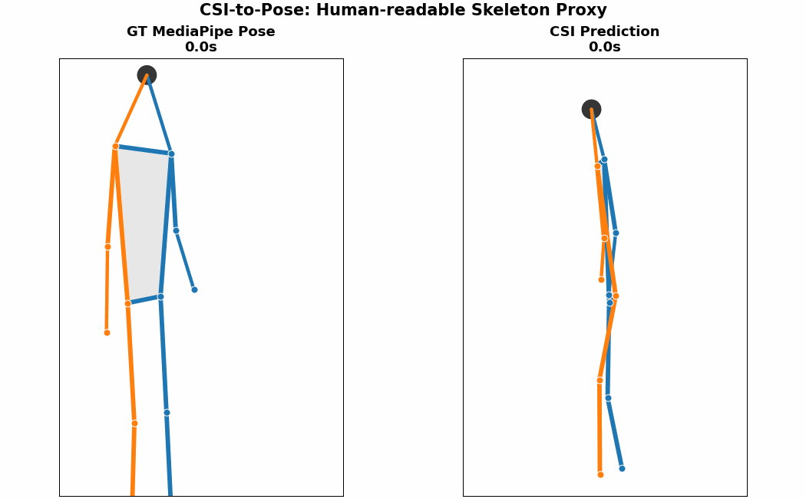

# NotiFi



NotiFi is a privacy-preserving WiFi CSI sensing project for detecting possible fall events, inactivity, and breathing anomalies without cameras or wearable devices.

NotiFi는 카메라나 웨어러블 없이 WiFi CSI(Channel State Information)를 활용해 노인의 낙상, 무활동, 호흡 이상 가능성을 감지하는 프로젝트입니다.

---

## Current Focus

현재 단계의 목표는 모델 학습이나 낙상 분류가 아닙니다. 먼저 ESP32-C6 보드에서 CSI 데이터가 실제로 들어오고, 행동에 따라 값이 달라지는지 확인하는 것이 목표입니다.

현재 확인할 항목:

- ESP32-C6 보드가 PC에 인식되는지 확인
- ESP-CSI `csi_send` / `csi_recv` 예제 빌드 및 플래시
- receiver 보드에서 `CSI_DATA` 로그가 연속 출력되는지 확인
- `CSI_DATA` 로그를 CSV로 저장
- Stage 1 라벨에서 CSI 값 차이가 있는지 확인

---

## Hardware / Firmware

```text
Board: Seeed Studio XIAO ESP32-C6 based modified board
Framework: ESP-IDF
Target: esp32c6
ESP-CSI examples:
  - examples/get-started/csi_send
  - examples/get-started/csi_recv
Baud rate: 921600
```

보드 2개를 사용합니다.

| Board | Firmware | Role |
|---|---|---|
| Sender | `csi_send` | ESP-NOW 패킷 송신 |
| Receiver | `csi_recv` | CSI 수신 및 `CSI_DATA` 출력 |

CSV 저장은 receiver 보드의 시리얼 로그에서 진행합니다.

---

## Verified Status

2026.06.16 기준 확인된 내용:

- ESP-IDF v5.5.4 환경 확인
- ESP32-C6 target 설정 확인
- `csi_send` 빌드 및 플래시 완료
- `csi_recv` 빌드 및 플래시 완료
- receiver 보드에서 `CSI_DATA` 연속 출력 확인
- CSI 배열 길이 `256` 확인
- RSSI는 대략 `-85 ~ -92 dBm` 범위에서 확인
- ESP-CSI visualization script 실행 확인

자세한 작업 로그는 [logs/2026.06.16.md](logs/2026.06.16.md)를 참고합니다.

---

## Latest Data Collection Status

2026.06.25 기준 Team 3 / `yja` 데이터 수집과 정리가 완료되었습니다.

관련 저장소:

- 데이터 코드/로그: [NotiFi2026/NotiFi-Data](https://github.com/NotiFi2026/NotiFi-Data)
- subject 폴더: [`NotiFi-Data/yja`](https://github.com/NotiFi2026/NotiFi-Data/tree/main/yja)
- 원본 CSV/시각화 업로드 대상: [Google Drive](https://drive.google.com/drive/folders/1idY-wNY24yFioixPITnredHj11CaWbwA)

`yja` 번들 구성:

| item | count |
|---|---:|
| raw CSI CSV | 921 |
| visualization PNG | 921 |
| collection/synthesis logs | 6 |

품질 점검 결과:

- 예상 CSV `921/921`
- 빈 CSV `0`
- 누락 trial `0`
- 라벨/메타데이터 불일치 `0`
- CSI 길이 불일치 `0`

자세한 작업 로그는 [logs/2026.06.25.md](logs/2026.06.25.md)를 참고합니다.

---

## CSI-to-Pose Experiment

2026.06.26 기준, NotiFi의 다음 실험 방향으로 CSI-to-Pose 실험을 정리했습니다.

목표는 CSI 신호만으로 사람 영상을 직접 복원하는 것이 아니라, 학습 단계에서 영상 기반 pose teacher가 생성한 skeleton representation을 CSI-only student model이 예측할 수 있는지 확인하는 것입니다.

핵심 흐름:

```text
Training:
CSI + Video → Pose Teacher → Skeleton GT → CSI Student

Inference:
CSI only → 3D Skeleton Proxy → Behavior / Event Interpretation
```

실험 문서:

- [CSI-to-Pose/README.md](CSI-to-Pose/README.md)

우선 `warning/gait/unstable_walking` 라벨을 pilot으로 수집하여 MediaPipe 기반 derived feature 추출과 CSI-to-skeleton proxy 복원 가능성을 확인합니다.

---

## Data Collection Plan

WiFi CSI는 보드 위치, 안테나 방향, 보드 간 거리, 방 구조, 주변 물체에 영향을 많이 받습니다. 따라서 데이터 수집 시 참가자 3명은 같은 구조와 같은 행동 가이드로 수집해야 합니다.

수집 매뉴얼:

- [docs/data-collection-manual.md](docs/data-collection-manual.md)

통일해야 하는 핵심 조건:

- 보드 모델
- 펌웨어
- sender / receiver 역할과 위치
- 보드 간 거리
- 보드 높이
- 안테나 방향
- 사람 위치
- 라벨별 행동 방식
- 수집 시간
- 파일명
- 실험 메모

---

## Label Stages

```text
Stage 1 = Experimental validation labels (실험 검증용 라벨)
Stage 2 = Service state labels (서비스 상태 판단용 라벨)
Stage 3 = Event labels (순간 이벤트 라벨)
Stage 4 = Breathing abnormality labels (호흡 이상 라벨)
```

현재는 Stage 1을 먼저 수집합니다. Stage 1은 학습용 데이터셋을 완성하는 단계가 아니라, 우리 장비와 환경에서 CSI 데이터가 유의미하게 달라지는지 빠르게 검증하기 위한 단계입니다.

### Stage 1: Basic Signal Check

```text
empty (사람 없음)
sitting_still (앉아서 가만히 있음)
standing_still (서서 가만히 있음)
lying_still (누워서 가만히 있음)
hand_move (손 움직임)
walk (걷기)
```

권장 수집 시간:

```text
duration_per_label: 60 seconds
trial_count_first_round: trial01
```

---

## Tools

### Save CSI_DATA to CSV

```bash
python tools/serial_to_csv.py --port COM_PORT --baud 921600 --duration 60 --label empty --outdir data/raw
```

`COM_PORT`는 실제 receiver 보드의 포트로 바꿉니다.

예시:

```text
Windows: COM3, COM4, ...
macOS: /dev/cu.usbmodem101, /dev/cu.usbserial-...
```

### Check Saved CSI CSV

```bash
python tools/check_csi_csv.py data/raw/FILE.csv --assume-duration 60
```

idle / move 파일 비교 예시:

```bash
python tools/check_csi_csv.py --idle data/raw/idle.csv --move data/raw/walk.csv --assume-duration 60
```

---

## Repository Structure

```text
.
├── CSI-to-Pose/
│   ├── README.md
│   └── assets/
│       └── csi-to-pose-overview.png
├── README.md
├── docs/
│   └── data-collection-manual.md
├── logs/
│   ├── 2026.06.16.md
│   ├── 2026.06.25.md
│   └── 2026.06.26.md
└── tools/
    ├── serial_to_csv.py
    └── check_csi_csv.py
```

---

## Notes on Public Datasets

Public WiFi CSI datasets can be useful for practicing preprocessing and model structure. However, CSI values depend heavily on hardware, antenna, room structure, board placement, and WiFi channel. Therefore, the final NotiFi validation should be based on data collected with our ESP32-C6 setup.

공개 데이터셋은 참고/연습용으로 사용하고, NotiFi 최종 검증 데이터는 우리 장비와 통일된 수집 조건으로 직접 만드는 방향으로 진행합니다.

---

## Next Steps

- Stage 1 라벨을 참가자 3명이 같은 구조로 수집
- 각 라벨당 60초 CSV 저장
- `check_csi_csv.py`로 RSSI, CSI length, CSI mean absolute value 확인
- 행동별 통계 차이가 있는지 확인
- 차이가 확인되면 Stage 2 상태 라벨로 확장

현재 성공 기준은 낙상 감지나 호흡 추정이 아니라, **CSI 데이터가 실제로 저장되고 라벨별로 비교 가능한 상태인지 확인하는 것**입니다.
